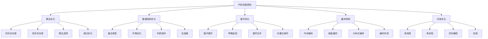

# 代码性能调优

## 🎯 学习目标
- 掌握Python代码性能优化的基本方法
- 学会使用性能分析工具进行代码调试
- 理解算法优化和数据结构选择的重要性

## 📊 性能调优基础

### 性能优化原则
代码性能调优的目标是在保证功能正确的前提下，提高代码执行效率，减少资源消耗。

### 性能优化层次


## 🔍 性能分析工具

### 性能分析器
```python
# models/performance_profiler.py
from odoo import models, fields, api
import cProfile
import pstats
import time
import memory_profiler
from functools import wraps
from odoo.exceptions import UserError

class PerformanceProfiler(models.Model):
    _name = 'performance.profiler'
    _description = '性能分析器'
    
    name = fields.Char('分析任务名称', required=True)
    function_name = fields.Char('函数名称', required=True)
    
    # 性能指标
    execution_time = fields.Float('执行时间(秒)')
    memory_usage = fields.Float('内存使用(MB)')
    cpu_percent = fields.Float('CPU使用率(%)')
    
    # 分析结果
    profile_data = fields.Text('性能数据')
    memory_data = fields.Text('内存数据')
    call_counts = fields.Text('调用次数统计')
    
    create_date = fields.Datetime('创建时间', default=fields.Datetime.now)
    
    @staticmethod
    def profile_method(profiler_name="默认分析"):
        """性能分析方法装饰器"""
        def decorator(func):
            @wraps(func)
            def wrapper(self, *args, **kwargs):
                # 创建性能分析记录
                profiler_record = self.env['performance.profiler'].create({
                    'name': f"{profiler_name}_{func.__name__}",
                    'function_name': func.__name__,
                })
                
                # 开始时间
                start_time = time.time()
                
                # 内存分析
                mem_start = memory_profiler.memory_usage()[0]
                
                # CPU分析
                profiler = cProfile.Profile()
                profiler.enable()
                
                try:
                    # 执行函数
                    result = func(self, *args, **kwargs)
                    
                    # 结束分析
                    profiler.disable()
                    
                    # 记录指标
                    end_time = time.time()
                    execution_time = end_time - start_time
                    
                    mem_end = memory_profiler.memory_usage()[0]
                    memory_usage = mem_end - mem_start
                    
                    # 获取性能统计
                    stats = pstats.Stats(profiler)
                    stats.sort_stats('cumulative')
                    
                    # 保存分析数据
                    import StringIO
                    output = StringIO.StringIO()
                    stats.print_stats(10, stream=output)
                    profile_data = output.getvalue()
                    
                    profiler_record.write({
                        'execution_time': execution_time,
                        'memory_usage': memory_usage,
                        'profile_data': profile_data,
                        'call_counts': str(stats.total_calls),
                    })
                    
                    return result
                    
                except Exception as e:
                    profiler.disable()
                    profiler_record.write({
                        'profile_data': f'执行出错: {str(e)}',
                        'execution_time': time.time() - start_time,
                    })
                    raise
                    
            return wrapper
        return decorator
    
    @api.model
    def analyze_performance_bottlenecks(self):
        """分析性能瓶颈"""
        try:
            # 获取慢执行记录
            slow_executions = self.search([
                ('execution_time', '>', 1.0)
            ], order='execution_time desc', limit=20)
            
            analysis_report = []
            
            for execution in slow_executions:
                report_item = {
                    'function_name': execution.function_name,
                    'execution_time': execution.execution_time,
                    'memory_usage': execution.memory_usage,
                    'call_counts': execution.call_counts,
                    'recommendations': self._generate_recommendations(execution),
                }
                analysis_report.append(report_item)
            
            return {
                'success': True,
                'analysis_report': analysis_report,
                'total_slow_executions': len(slow_executions),
            }
            
        except Exception as e:
            return {
                'success': False,
                'error': str(e)
            }
    
    def _generate_recommendations(self, execution_record):
        """生成优化建议"""
        recommendations = []
        
        try:
            # 基于执行时间建议
            if execution_record.execution_time > 5.0:
                recommendations.append({
                    'type': 'critical',
                    'priority': 'high',
                    'title': '执行时间过长',
                    'description': f'方法 {execution_record.function_name} 执行时间为 {execution_record.execution_time:.2f} 秒',
                    'suggestions': [
                        '检查是否存在N+1查询问题',
                        '考虑添加缓存机制',
                        '优化数据库查询',
                        '考虑异步处理',
                    ]
                })
            
            # 基于内存使用建议
            if execution_record.memory_usage > 100:
                recommendations.append({
                    'type': 'warning',
                    'priority': 'medium',
                    'title': '内存使用过高',
                    'description': f'方法 {execution_record.function_name} 内存使用为 {execution_record.memory_usage:.2f} MB',
                    'suggestions': [
                        '使用生成器替代列表',
                        '及时释放大对象',
                        '使用流式处理',
                        '考虑分页处理',
                    ]
                })
            
            # 基于调用次数建议
            call_counts = int(execution_record.call_counts or 0)
            if call_counts > 100000:
                recommendations.append({
                    'type': 'info',
                    'priority': 'medium',
                    'title': '调用次数过多',
                    'description': f'方法 {execution_record.function_name} 被调用了 {call_counts} 次',
                    'suggestions': [
                        '检查是否存在重复计算',
                        '使用缓存避免重复执行',
                        '优化上层调用逻辑',
                        '考虑批处理',
                    ]
                })
            
            return recommendations
            
        except Exception as e:
            self._log_error(f'生成优化建议失败: {str(e)}')
            return []
    
    def _log_error(self, message):
        """记录错误日志"""
        self.env['ir.logging'].create({
            'name': 'Performance Profiler',
            'type': 'server',
            'dbname': self.env.cr.dbname,
            'level': 'ERROR',
            'message': message,
            'path': 'performance_profiler',
            'line': 0,
            'func': 'analysis',
        })

# 使用示例
class ProductOptimization(models.Model):
    _inherit = '_name = 'product.product'
    
    @PerformanceProfiler.profile_method("产品查询优化")
    @api.model
    def optimized_search_products(self, domain, limit=100):
        """优化的产品搜索"""
        try:
            # 检查是否需要预加载关联数据
            if self._needs_prefetch(domain):
                return self.with_context(prefetch_fields=[('category_id', 'supplier_ids')]).search(domain, limit=limit)
            
            return self.search(domain, limit=limit)
            
        except Exception:
            return self.search(domain, limit=limit)
    
    def _needs_prefetch(self, domain):
        """判断是否需要预加载"""
        domain_str = str(domain)
        return 'category_id' in domain_str or 'supplier_id' in domain_str
```

## ⚡ 算法优化技巧

### 查询优化算法
```python
# models/algorithm_optimization.py
from odoo import models, fields, api
from collections import defaultdict
import bisect

class AlgorithmOptimization(models.Model):
    _name = 'algorithm.optimization'
    _description = '算法优化'
    
    @api.model
    def optimized_bulk_search(self, model_name, ids_list, domain):
        """优化的批量搜索"""
        try:
            # 使用集合进行快速查找
            ids_set = set(ids_list)
            
            # 先过滤出可能匹配的记录
            if domain:
                candidates = self.env[model_name].search(domain)
            else:
                candidates = self.env[model_name].search([])
            
            # 使用集合交集快速筛选
            candidate_ids = set(candidates.ids)
            result_ids = list(ids_set.intersection(candidate_ids))
            
            # 保持原始顺序
            id_to_pos = {id_val: i for i, id_val in enumerate(ids_list)}
            result_ids.sort(key=lambda x: id_to_pos.get(x, len(ids_list)))
            
            return self.env[model_name].browse(result_ids)
            
        except Exception:
            # 备选方案
            if domain:
                return self.env[model_name].search([('id', 'in', ids_list)] + domain)
            else:
                return self.env[model_name].browse(ids_list)
    
    @api.model
    def efficient_group_by_date(self, model_name, field_name, domain=None):
        """高效的按日期分组"""
        try:
            # 使用SQL优化分组查询
            sql = f"""
                SELECT 
                    DATE({field_name}) as date_group,
                    COUNT(*) as count
                FROM {model_name.replace('.', '_')}
            """
            
            if domain:
                where_clause = self._domain_to_sql(domain)
                sql += f" WHERE {where_clause}"
            
            sql += f" GROUP BY DATE({field_name}) ORDER BY date_group"
            
            self.env.cr.execute(sql)
            return self.env.cr.fetchall()
            
        except Exception:
            # 备选方案：使用ORM
            records = self.env[model_name].search(domain or [])
            groups = defaultdict(int)
            
            for record in records:
                date_value = getattr(record, field_name)
                if date_value:
                    groups[date_value.date()] += 1
            
            return [(str(date), count) for date, count in groups.items()]
    
    @api.model
    def optimized_merge_sort(self, items, merge_key_func):
        """优化的归并排序"""
        try:
            # 使用二分插入的归并排序
            sorted_items = []
            
            for item in items:
                item_key = merge_key_func(item)
                
                # 使用二分查找插入位置
                insert_pos = bisect.bisect_left([merge_key_func(x) for x in sorted_items], item_key)
                sorted_items.insert(insert_pos, item)
            
            return sorted_items
            
        except Exception:
            # 备选方案：标准排序
            return sorted(items, key=merge_key_func)
    
    @api.model
    def efficient_lookup_table(self, key_value_pairs):
        """高效的查找表"""
        try:
            # 创建双向查找表
            forward_table = {}
            reverse_table = {}
            
            for key, value in key_value_pairs:
                forward_table[key] = value
                reverse_table[value] = key
            
            return {
                'forward': forward_table,
                'reverse': reverse_table,
                'items': key_value_pairs
            }
            
        except Exception:
            return {'forward': {}, 'reverse': {}, 'items': []}
    
    def _domain_to_sql(self, domain):
        """将domain转换为SQL条件"""
        conditions = []
        
        try:
            for condition in domain:
                if isinstance(condition, tuple) and len(condition) == 3:
                    field, operator, value = condition
                    
                    if operator == '=':
                        conditions.append(f"{field} = {self._format_sql_value(value)}")
                    elif operator == 'in':
                        values = ', '.join([self._format_sql_value(v) for v in value])
                        conditions.append(f"{field} IN ({values})")
                    elif operator == 'ilike':
                        conditions.append(f"{field} ILIKE '%{value}%'")
            
            return ' AND '.join(conditions) if conditions else '1=1'
            
        except Exception:
            return '1=1'
    
    def _format_sql_value(self, value):
        """格式化SQL值"""
        if isinstance(value, str):
            return f"'{value}'"
        else:
            return str(value)
```

### 缓存优化算法
```python
# models/cache_optimization.py
from odoo import models, fields, api
from functools import lru_cache
import time

class CacheOptimization(models.Model):
    _name = 'cache.optimization'
    _description = '缓存优化'
    
    @api.model
    def create_memoization_cache(self):
        """创建记忆化缓存"""
        cache_dict = {}
        
        def cached_function(key_func):
            def decorator(func):
                @wraps(func)
                def wrapper(*args, **kwargs):
                    # 生成缓存键
                    cache_key = key_func(*args, **kwargs)
                    
                    # 检查缓存
                    if cache_key in cache_dict:
                        return cache_dict[cache_key]
                    
                    # 执行函数并缓存结果
                    result = func(*args, **kwargs)
                    cache_dict[cache_key] = result
                    
                    # 限制缓存大小
                    if len(cache_dict) > 1000:
                        # 移除最旧的缓存项
                        oldest_key = next(iter(cache_dict))
                        del cache_dict[oldest_key]
                    
                    return result
                
                return wrapper
            return decorator
        
        return cached_function
    
    @api.model
    def create_ttl_cache(self, ttl_seconds=300):
        """创建TTL缓存"""
        cache_data = {}
        
        def cache_with_ttl(key_func):
            def decorator(func):
                @wraps(func)
                def wrapper(*args, **kwargs):
                    cache_key = key_func(*args, **kwargs)
                    current_time = time.time()
                    
                    # 检查缓存是否有效
                    if cache_key in cache_data:
                        result, timestamp = cache_data[cache_key]
                        if current_time - timestamp < ttl_seconds:
                            return result
                        else:
                            # 缓存已过期，删除
                            del cache_data[cache_key]
                    
                    # 执行函数并缓存
                    result = func(*args, **kwargs)
                    cache_data[cache_key] = (result, current_time)
                    
                    # 清理过期缓存
                    self._cleanup_expired_cache(cache_data, ttl_seconds)
                    
                    return result
                
                return wrapper
            return decorator
        
        return cache_with_ttl
    
    def _cleanup_expired_cache(self, cache_data, ttl_seconds):
        """清理过期缓存"""
        current_time = time.time()
        expired_keys = [k for k, (v, t) in cache_data.items() 
                       if current_time - t >= ttl_seconds]
        
        for key in expired_keys:
            del cache_data[key]
    
    @api.model
    def create_size_limited_cache(self, max_size=100):
        """创建大小限制缓存"""
        cache_data = {}
        
        def limited_cache(key_func):
            def decorator(func):
                @wraps(func)
                def wrapper(*args, **kwargs):
                    cache_key = key_func(*args, **kwargs)
                    
                    if cache_key in cache_data:
                        # LRU缓存策略：将访问的元素移到末尾
                        result = cache_data.pop(cache_key)
                        cache_data[cache_key] = result
                        return result
                    
                    result = func(*args, **kwargs)
                    cache_data[cache_key] = result
                    
                    # 限制缓存大小
                    if len(cache_data) > max_size:
                        # 移除最久未使用的项目
                        oldest_key = next(iter(cache_data))
                        del cache_data[oldest_key]
                    
                    return result
                
                return wrapper
            return decorator
        
        return limited_cache
```

## 🔄 循环和迭代优化

### 批量处理优化
```python
# models/batch_optimization.py
from odoo import models, fields, api
from itertools import islice, chain

class BatchOptimization(models.Model):
    _name = 'batch.optimization'
    _description = '批量处理优化'
    
    @api.model
    def process_in_chunks(self, items, chunk_size=100, process_func=None):
        """分块处理大量数据"""
        try:
            results = []
            
            # 使用迭代器避免一次性加载所有数据到内存
            iterator = iter(items)
            
            while True:
                chunk = list(islice(iterator, chunk_size))
                if not chunk:
                    break
                
                # 处理当前块
                if process_func:
                    chunk_result = process_func(chunk)
                else:
                    chunk_result = self._default_chunk_process(chunk)
                
                results.append(chunk_result)
                
                # 定期提交以避免长时间锁表
                if len(results) % 10 == 0:
                    self.env.cr.commit()
            
            return results
            
        except Exception as e:
            self._log_error(f'分块处理失败: {str(e)}')
            return []
    
    def _default_chunk_process(self, chunk):
        """默认块处理函数"""
        # 这里可以实现具体的批量处理逻辑
        return len(chunk)
    
    @api.model
    def optimized_bulk_update(self, record_ids, update_values, batch_size=100):
        """优化的批量更新"""
        try:
            # 将更新操作分组
            batches = [record_ids[i:i + batch_size] 
                      for i in range(0, len(record_ids), batch_size)]
            
            for batch in batches:
                # 构建批量更新SQL
                sql_template = self._build_batch_update_sql(update_values)
                
                # 执行批量更新
                self.env.cr.execute(sql_template, batch)
                
                # 每处理一定数量的批次后提交
                if batches.index(batch) % 5 == 0:
                    self.env.cr.commit()
            
            self.env.cr.commit()
            
        except Exception as e:
            self.env.cr.rollback()
            self._log_error(f'批量更新失败: {str(e)}')
    
    def _build_batch_update_sql(self, update_values):
        """构建批量更新SQL"""
        # 简化的批量更新SQL构建
        updates = [f"{field} = %s" for field in update_values.keys()]
        values = list(update_values.values())
        
        # 这里需要根据实际情况调整SQL结构
        sql_pattern = f"""
            UPDATE target_table 
            SET {', '.join(updates)}
            WHERE id = ANY(%s)
        """
        
        return sql_pattern, values
    
    @api.model
    def vectorized_operations(self, data_list):
        """向量化操作"""
        try:
            # 使用列表推导式进行向量化操作
            # 比传统的for循环更快
            results = [
                self._transform_item(item) 
                for item in data_list
                if self._filter_item(item)
            ]
            
            return results
            
        except Exception as e:
            self._log_error(f'向量化操作失败: {str(e)}')
            return []
    
    def _transform_item(self, item):
        """转换单个项目"""
        # 实现具体的数据转换逻辑
        return item
    
    def _filter_item(self, item):
        """过滤单个项目"""
        # 实现具体的数据过滤逻辑
        return True
    
    @api.model
    def early_return_optimization(self, items, check_func, process_func):
        """早期返回优化"""
        try:
            # 使用生成器表达式进行惰性求值
            filtered_items = (item for item in items if check_func(item))
            
            # 使用any()进行早期退出
            if any(process_func(item) for item in filtered_items):
                return True
            
            return False
            
        except Exception as e:
            self._log_error(f'早期返回优化失败: {str(e)}')
            return False
    
    def _log_error(self, message):
        """记录错误日志"""
        self.env['ir.logging']..create({
            'name': 'Batch Optimization',
            'type': 'server',
            'dbname': self.env.cr.dbname,
            'level': 'ERROR',
            'message': message,
            'path': 'batch_optimization',
            'line': 0,
            'func': 'optimization',
        })
```

### 字典和列表优化
```python
# models/data_structure_optimization.py
from odoo import models, fields, api
from collections import defaultdict, Counter
import bisect

class DataStructureOptimization(models.Model):
    _name = 'data.structure.optimization'
    _description = '数据结构优化'
    
    @api.model
    def optimized_dict_operations(self, data_items):
        """优化的字典操作"""
        try:
            # 使用defaultdict减少条件检查
            grouped_data = defaultdict(list)
            
            for item in data_items:
                # 自动创建不存在的键
                grouped_data[item.get('category', 'default')].append(item)
            
            return dict(grouped_data)
            
        except Exception as e:
            return {}
    
    @api.model
    def efficient_list_operations(self, items, operation='sort'):
        """高效的列表操作"""
        try:
            if operation == 'sort':
                # 使用内置sort()，比sorted()更高效
                items.sort()
                return items
            
            elif operation == 'unique':
                # 使用set去重，保持顺序
                seen = set()
                unique_items = []
                for item in items:
                    if item not in seen:
                        seen.add(item)
                        unique_items.append(item)
                return unique_items
            
            elif operation == 'group_by_count':
                # 使用Counter进行计数
                return dict(Counter(items))
            
            else:
                return items
                
        except Exception as e:
            return items
    
    @api.model
    def optimized_search_operations(self, sorted_list, search_items):
        """优化的搜索操作"""
        try:
            results = []
            
            for item in search_items:
                # 使用二分搜索
                index = bisect.bisect_left(sorted_list, item)
                
                if index != len(sorted_list) and sorted_list[index] == item:
                    results.append((item, index))
                else:
                    # 处理插入位置的情况
                    insert_pos = bisect.bisect_left(sorted_list, item)
                    results.append((item, insert_pos))
            
            return results
            
        except Exception as e:
            return []
    
    @api.model
    def memory_efficient_generator(self, data_source):
        """内存高效的生成器"""
        try:
            def data_generator():
                """生成器函数，避免一次性加载所有数据"""
                for item in data_source:
                    yield self._process_item(item)
            
            return data_generator()
            
        except Exception as e:
            return iter([])
    
    def _process_item(self, item):
        """处理单个项目"""
        # 实现具体的处理逻辑
        return item
```

## 🔗 相关链接

### 下一步学习
- [[缓存机制与优化]] - 学习缓存机制与优化
- [[raw/Odoo/04-精通创新层/02-性能优化/数据库优化]] - 了解数据库优化
- [[并发性能优化]] - 掌握并发性能优化

### 实践建议
- 多练习算法优化技巧
- 熟悉性能分析工具使用方法
- 掌握批量处理技术

## 📝 思考题

### 基础理解
1. 代码性能优化的主要方法有哪些？
2. 性能分析工具的作用是什么？
3. 算法复杂度的影响因素有哪些？

### 深入思考
1. 如何选择合适的优化策略？
2. 复杂系统的性能瓶颈如何定位？
3. 如何平衡性能优化和代码可维护性？

---

**学习进度**: ✅ 已完成  
**下一步**: [[缓存机制与优化]]
