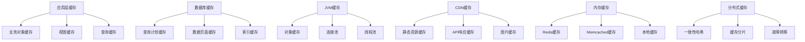

# 缓存机制与优化

## 🎯 学习目标
- 掌握多层缓存架构的设计和实现
- 学会使用各种缓存策略和算法
- 理解缓存一致性和失效机制

## 📊 缓存架构概述

### 缓存层次
缓存机制通过在不同层次存储数据副本，减少数据访问延迟和提高系统性能。

### 缓存架构图


## 🔄 多级缓存实现

### 缓存管理器
```python
# models/cache_manager.py
from odoo import models, fields, api
import json
import pickle
import hashlib
import time
from functools import wraps
from odoo.exceptions import UserError

class CacheManager(models.Model):
    _name = 'cache.manager'
    _description = '缓存管理器'
    
    name = fields.Char('缓存管理器名称', required=True)
    cache_type = fields.Selection([
        ('memory', '内存缓存'),
        ('disk', '磁盘缓存'),
        ('redis', 'Redis缓存'),
        ('memcached', 'Memcached缓存'),
        ('database', '数据库缓存'),
    ], string='缓存类型', default='memory')
    
    # 缓存配置
    max_size = fields.Integer('最大缓存大小', default=1000)
    ttl_seconds = fields.Integer('TTL时间(秒)', default=3600)
    eviction_policy = fields.Selection([
        ('lru', 'LRU最近最少使用'),
        ('lfu', 'LFU最少使用频率'),
        ('fifo', 'FIFO先进先出'),
        ('ttl', 'TTL时间到期'),
    ], string='淘汰策略', default='lru')
    
    # 缓存统计
    hit_count = fields.Integer('缓存命中次数', default=0)
    miss_count = fields.Integer('缓存未命中次数', default=0)
    total_requests = fields.Integer('总请求次数', default=0)
    
    # 性能指标
    hit_rate = fields.Float('命中率', compute='_compute_hit_rate')
    cache_size_mb = fields.Float('缓存大小MB', compute='_compute_cache_size')
    
    is_active = fields.Boolean('是否激活', default=True)
    
    @api.depends('hit_count', 'miss_count', 'total_requests')
    def _compute_hit_rate(self):
        for record in self:
            if record.total_requests > 0:
                record.hit_rate = record.hit_count / record.total_requests
            else:
                record.hit_rate = 0.0
    
    @api.depends('hit_count', 'miss_count')
    def _compute_cache_size(self):
        for record in self:
            # 简化的大小计算
            record.cache_size_mb = (record.hit_count + record.miss_count) * 0.001
    
    def setup_cache(self):
        """设置缓存"""
        if self.cache_type == 'memory':
            return self._setup_memory_cache()
        elif self.cache_type == 'redis':
            return self._setup_redis_cache()
        elif self.cache_type == 'memcached':
            return self._setup_memcached_cache()
        elif self.cache_type == 'database':
            return self._setup_database_cache()
    
    def _setup_memory_cache(self):
        """设置内存缓存"""
        from collections import OrderedDict
        
        class MemoryCache:
            def __init__(self, max_size, ttl_seconds, eviction_policy):
                self.max_size = max_size
                self.ttl_seconds = ttl_seconds
                self.eviction_policy = eviction_policy
                self.data = OrderedDict()  # LRU
                self.timestamps = {}
                self.access_counts = {}  # LFU
                self.access_order = []  # FIFO
            
            def get(self, key):
                if key in self.data:
                    # 更新访问时间
                    self.timestamps[key] = time.time()
                    
                    # 更新访问计数
                    self.access_counts[key] = self.access_counts.get(key, 0) + 1
                    
                    # LRU: 移动到末尾
                    if self.eviction_policy == 'lru':
                        self.data.move_to_end(key)
                    
                    return self.data[key]
                return None
            
            def put(self, key, value):
                current_time = time.time()
                
                # 添加时间戳
                self.timestamps[key] = current_time
                
                # LIFO: 添加到列表末尾
                if self.eviction_policy == 'fifo':
                    self.access_order.append(key)
                
                # 存储数据
                self.data[key] = value
                
                # 淘汰策略
                self._evict_if_needed()
            
            def _evict_if_needed(self):
                # 检查缓存大小限制
                if len(self.data) > self.max_size:
                    if self.eviction_policy == 'lru':
                        # 移除最久未使用的
                        oldest_key = next(iter(self.data))
                        del self.data[oldest_key]
                        
                    elif self.eviction_policy == 'lfu':
                        # 移除最少使用的
                        least_used_key = min(self.access_counts, key=self.access_counts.get)
                        del self.data[least_used_key]
                        
                    elif self.eviction_policy == 'fifo':
                        # 移除最早添加的
                        oldest_key = self.access_order.pop(0)
                        if oldest_key in self.data:
                            del self.data[oldest_key]
                
                # TTL清理
                self._cleanup_expired()
            
            def _cleanup_expired(self):
                current_time = time.time()
                expired_keys = [
                    key for key, timestamp in self.timestamps.items()
                    if current_time - timestamp > self.ttl_seconds
                ]
                
                for key in expired_keys:
                    self.data.pop(key, None)
                    self.timestamps.pop(key, None)
                    self.access_counts.pop(key, None)
        
        return MemoryCache(self.max_size, self.ttl_seconds, self.eviction_policy)
    
    def _setup_redis_cache(self):
        """设置Redis缓存"""
        try:
            import redis
            
            client = redis.Redis(
                host=self.env['ir.config_parameter'].sudo().get_param('redis.host', 'localhost'),
                port=int(self.env['ir.config_parameter'].sudo().get_param('redis.port', '6379')),
                db=int(self.env['ir.config_parameter'].sudo().get_param('redis.db', '0')),
                decode_responses=True
            )
            
            return RedisCache(client, self.ttl_seconds)
            
        except ImportError:
            raise UserError('请安装redis库: pip install redis')
        except Exception as e:
            raise UserError(f'Redis连接失败: {str(e)}')
    
    def _setup_memcached_cache(self):
        """设置Memcached缓存"""
        try:
            import memcache
            
            servers = [
                self.env['ir.config_parameter'].sudo().get_param('memc.host', '127.0.0.1:11211')
            ]
            
            client = memcache.Client(servers)
            return MemcachedCache(client, self.ttl_seconds)
            
        except ImportError:
            raise UserError('请安装memcached库: pip install python-memcached')
        except Exception as e:
            raise UserError(f'Memcached连接失败: {str(e)}')
    
    def _setup_database_cache(self):
        """设置数据库缓存"""
        return DatabaseCache(self.env, self.ttl_attrition_cache']

class CacheWrapper:
    """缓存包装器"""
    
    def __init__(self, cache_manager_id):
        self.cache_manager = cache_manager_id
        self.cache_instance = None
    
    def _get_cache_instance(self):
        if not self.cache_instance:
            self.cache_instance = self.cache_manager.setup_cache()
        return self.cache_instance
    
    def get(self, key):
        """获取缓存"""
        try:
            cache = self._get_cache_instance()
            value = cache.get(key)
            
            # 更新统计
            if value is not None:
                self.cache_manager.hit_count += 1
            else:
                self.cache_manager.miss_count += 1
            
            self.cache_manager.total_requests += 1
            
            return value
            
        except Exception as e:
            self._log_error(f'缓存获取失败: {str(e)}')
            return None
    
    def put(self, key, value):
        """存储缓存"""
        try:
            cache = self._get_cache_instance()
            cache.put(key, value)
            
        except Exception as e:
            self._log_error(f'缓存存储失败: {str(e)}')
    
    def delete(self, key):
        """删除缓存"""
        try:
            cache = self._get_cache_instance()
            if hasattr(cache, 'delete'):
                cache.delete(key)
            else:
                cache.put(key, None)  # 标记为无效
            
        except Exception as e:
            self._log_error(f'缓存删除失败: {str(e)}')
    
    def clear(self):
        """清空缓存"""
        try:
            cache = self._get_cache_instance()
            if hasattr(cache, 'clear'):
                cache.clear()
            
        except Exception as e:
            self._log_error(f'缓存清空失败: {str(e)}')
```

### Redis缓存实现
```python
# models/redis_cache.py
import redis
import pickle
import json
from odoo import models, fields, api

class RedisCache:
    """Redis缓存实现"""
    
    def __init__(self, redis_client, ttl_seconds=3600):
        self.client = redis_client
        self.ttl_seconds = ttl_seconds
        self.prefix = "odoo_cache:"
    
    def get(self, key):
        """获取缓存"""
        try:
            full_key = f"{self.prefix}{key}"
            cached_data = self.client.get(full_key)
            
            if cached_data:
                # 尝试JSON解析
                try:
                    return json.loads(cached_data)
                except (json.JSONDecodeError, TypeError):
                    # 使用pickle作为备选
                    return pickle.loads(cached_data)
            
            return None
            
        except Exception:
            return None
    
    def put(self, key, value, ttl=None):
        """存储缓存"""
        try:
            full_key = f"{self.prefix}{key}"
            ttl = ttl or self.ttl_seconds
            
            # 尝试JSON序列化
            try:
                serialized_value = json.dumps(value, default=str)
            except (TypeError, ValueError):
                # 使用pickle作为备选
                serialized_value = pickle.dumps(value)
            
            self.client.setex(full_key, ttl, serialized_value)
            
        except Exception:
            pass  # 缓存失败不应该影响主业务
    
    def delete(self, key):
        """删除缓存"""
        try:
            full_key = f"{self.prefix}{key}"
            self.client.delete(full_key)
        except Exception:
            pass
    
    def clear(self):
        """清空缓存"""
        try:
            # 删除所有以prefix开头的键
            keys = self.client.keys(f"{self.prefix}*")
            if keys:
                self.client.delete(*keys)
        except Exception:
            pass
    
    def keys(self, pattern="*"):
        """获取缓存键列表"""
        try:
            full_pattern = f"{self.prefix}{pattern}"
            keys = self.client.keys(full_pattern)
            # 移除前缀
            return [key.decode().replace(self.prefix, '') for key in keys]
        except Exception:
            return []
```

### 数据库缓存实现
```python
# models/database_cache.py
from odoo import models, fields, api

class DatabaseCache(models.Model):
    _name = 'cache.entry'
    _description = '缓存条目'
    
    cache_key = fields.Char('缓存键', required=True)
    cache_value = fields.Text('缓存值', required=True)
    cache_type = fields.Char('缓存类型')
    ttl_seconds = fields.Integer('TTL时间(秒)')
    create_date = fields.Datetime('创建时间', default=fields.Datetime.now)
    access_date = fields.Datetime('最后访问时间', default=fields.Datetime.now)
    access_count = fields.Integer('访问次数', default=0)
    
    @api.model
    def get_cache(self, key):
        """获取缓存"""
        try:
            # 查找缓存条目
            cache_entry = self.search([
                ('cache_key', '=', key),
                ('create_date', '>', fields.Datetime.now() - timedelta(seconds=3600))  # 简单TTL检查
            ], limit=1)
            
            if cache_entry:
                # 更新访问信息
                cache_entry.write({
                    'access_date': fields.Datetime.now(),
                    'access_count': cache_entry.access_count + 1
                })
                
                # 反序列化返回值
                return cache_entry._deserialize_value()
            
            return None
            
        except Exception:
            return None
    
    @api.model
    def put_cache(self, key, value, ttl_seconds=3600):
        """存储缓存"""
        try:
            # 检查是否已存在
            existing = self.search([('cache_key', '=', key)], limit=1)
            
            cache_data = {
                'cache_key': key,
                'cache_value': self._serialize_value(value),
                'cache_type': type(value).__name__,
                'ttl_seconds': ttl_seconds,
                'create_date': fields.Datetime.now(),
                'access_date': fields.Datetime.now(),
                'access_count': 1
            }
            
            if existing:
                existing.write(cache_data)
            else:
                self.create(cache_data)
                
        except Exception:
            pass  # 缓存失败不应该影响主业务
    
    @api.model
    def delete_cache(self, key):
        """删除缓存"""
        try:
            self.search([('cache_key', '=', key)]).unlink()
        except Exception:
            pass
    
    @api.model
    def cleanup_expired(self):
        """清理过期缓存"""
        try:
            expired_entries = self.search([
                ('create_date', '<', fields.Datetime.now() - timedelta(seconds=3600))
            ])
            
            if expired_entries:
                expired_entries.unlink()
            
            return len(expired_entries)
            
        except Exception:
            return 0
    
    def _serialize_value(self, value):
        """序列化值"""
        import json
        import pickle
        
        try:
            return json.dumps(value, default=str)
        except (TypeError, ValueError):
            return pickle.dumps(value).decode('latin-1')
    
    def _deserialize_value(self):
        """反序列化值"""
        import json
        import pickle
        
        try:
            return json.loads(self.cache_value)
        except (json.JSONDecodeError, TypeError):
            try:
                return pickle.loads(self.cache_value.encode('latin-1'))
            except Exception:
                return self.cache_value

class DatabaseCacheImpl:
    """数据库缓存实现"""
    
    def __init__(self, env, ttl_seconds=3600):
        self.env = env
        self.ttl_seconds = ttl_seconds
    
    def get(self, key):
        return self.env['cache.entry'].get_cache(key)
    
    def put(self, key, value, ttl=None):
        ttl = ttl or self.ttl_seconds
        self.env['cache.entry'].put_cache(key, value, ttl)
    
    def delete(self, key):
        self.env['cache.entry'].delete_cache(key)
    
    def clear(self):
        self.env['cache.entry'].search([]).unlink()
```

## 🎯 缓存策略实现

### 缓存装饰器
```python
# models/cache_decorators.py
from functools import wraps
import hashlib

class CacheDecorators:
    """缓存装饰器集合"""
    
    @staticmethod
    def cached(cache_manager=None, timeout=None, key_func=None):
        """缓存装饰器"""
        def decorator(func):
            @wraps(func)
            def wrapper(self, *args, **kwargs):
                # 生成缓存键
                if key_func:
                    cache_key = key_func(self, *args, **kwargs)
                else:
                    cache_key = CacheDecorators._generate_key(func, self, args, kwargs)
                
                # 获取缓存管理器
                if cache_manager:
                    cache = CacheWrapper(cache_manager)
                else:
                    # 使用默认缓存管理器
                    cache = CacheWrapper(self.env.ref('cache.manager_default'))
                
                # 尝试从缓存获取
                cached_result = cache.get(cache_key)
                if cached_result is not None:
                    return cached_result
                
                # 执行原函数
                result = func(self, *args, **kwargs)
                
                # 存储到缓存
                cache.put(cache_key, result, timeout)
                
                return result
            
            return wrapper
        return decorator
    
    @staticmethod
    def cache_invalidate(pattern=None, models=None):
        """缓存失效装饰器"""
        def decorator(func):
            @wraps(func)
            def wrapper(self, *args, **kwargs):
                # 执行原函数
                result = func(self, *args, **kwargs)
                
                # 清除相关缓存
                CacheDecorators._clear_related_cache(self, pattern, models)
                
                return result
            
            return wrapper
        return decorator
    
    @staticmethod
    def _generate_key(func, self, args, kwargs):
        """生成缓存键"""
        # 创建键的基本组件
        key_components = [
            func.__name__,
            str(type(self).__name__),
            str(hash(str(args))),
            str(hash(str(sorted(kwargs.items()))))
        ]
        
        # 如果有数据库ID，包含进去
        if hasattr(self, 'id') and self.id:
            key_components.append(str(self.id))
        
        # 生成哈希键
        key_string = '_'.join(str(c) for c in key_components)
        return hashlib.md5(key_string.encode()).hexdigest()
    
    @staticmethod
    def _clear_related_cache(self, pattern, models):
        """清除相关缓存"""
        try:
            cache_manager = self.env.ref('cache.manager_default')
            cache = CacheWrapper(cache_manager)
            
            if pattern:
                # 清除匹配模式的缓存
                keys_to_clear = cache.cache_instance.keys(pattern)
                for key in keys_to_clear:
                    cache.delete(key)
            
            if models:
                # 清除特定模型的缓存
                for model_name in models:
                    model_pattern = f"*{model_name}*"
                    keys_to_clear = cache.cache_instance.keys(model_pattern)
                    for key in keys_to_clear:
                        cache.delete(key)
                        
        except Exception:
            pass  # 缓存清理失败不应该影响主业务

# 使用示例
class SaleOrderCached(models.Model):
    _inherit = 'sale.order'
    
    @CacheDecorators.cached(timeout=300)  # 5分钟缓存
    def compute_amount_totals_cached(self):
        """缓存的计算方法"""
        return self._compute_amount_all()
    
    @CacheDecorators.cache_invalidate(pattern="compute_amount_totals_*")
    def write(self, vals):
        """写入时清除相关缓存"""
        return super().write(vals)
```

### 查询缓存
```python
# models/query_cache.py
from odoo import models, fields, api

class QueryCache(models.Model):
    _name = 'query.cache'
    _description = '查询缓存'
    
    query_hash = fields.Char('查询哈希', required=True)
    query_sql = fields.Text('SQL查询', required=True)
    query_params = fields.Text('查询参数')
    result_count = fields.Integer('结果数量')
    execution_time = fields.Float('执行时间(秒)')
    
    cache_hits = fields.Integer('缓存命中次数', default=0)
    last_hit = fields.Datetime('最后命中时间')
    create_date = fields.Datetime('创建时间', default=fields.Datetime.now)
    expires_at = fields.Datetime('过期时间')
    
    @api.model
    def cached_query(self, sql, params=None, cache_timeout=300):
        """缓存查询"""
        try:
            # 生成查询哈希
            query_hash = self._generate_query_hash(sql, params)
            
            # 查找缓存
            cached_entry = self.search([
                ('query_hash', '=', query_hash),
                ('expires_at', '>', fields.Datetime.now())
            ], limit=1)
            
            if cached_entry:
                # 更新命中统计
                cached_entry.write({
                    'cache_hits': cached_entry.cache_hits + 1,
                    'last_hit': fields.Datetime.now()
                })
                
                # 返回缓存结果
                return self._deserialize_result(cached_entry.cached_result)
            
            # 执行查询
            start_time = time.time()
            self.env.cr.execute(sql, params or {})
            results = self.env.cr.fetchall()
            execution_time = time.time() - start_time
            
            # 存储到缓存
            cache_entry = self.create({
                'query_hash': query_hash,
                'query_sql': sql,
                'query_params': json.dumps(params or {}),
                'result_count': len(results),
                'execution_time': execution_time,
                'expires_at': fields.Datetime.now() + timedelta(seconds=cache_timeout),
                'cached_result': self._serialize_result(results)
            })
            
            return results
            
        except Exception as e:
            # 缓存失败时直接执行查询
            self.env.cr.execute(sql, params or {})
            return self.env.cr.fetchall()
    
    def _generate_query_hash(self, sql, params):
        """生成查询哈希"""
        import hashlib
        
        query_string = f"{sql}_{json.dumps(params or {}, sort_keys=True)}"
        return hashlib.md5(query_string.encode()).hexdigest()
    
    def _serialize_result(self, results):
        """序列化结果"""
        import json
        return json.dumps(results, default=str)
    
    def _deserialize_result(self, serialized_result):
        """反序列化结果"""
        import json
        return json.loads(serialized_result)
    
    cached_result = fields.Text('缓存结果')
```

## 🔄 缓存一致性管理

### 缓存同步机制
```python
# models/cache_consistency.py
from odoo import models, fields, api
import threading

class CacheConsistency(models.Model):
    _name = 'cache.consistency'
    _description = '缓存一致性'
    
    @api.model
    def invalidate_pattern(self, pattern):
        """按模式清除缓存"""
        try:
            cache_managers = self.env['cache.manager'].search([('is_active', '=', True)])
            
            for cache_manager in cache_managers:
                cache = CacheWrapper(cache_manager)
                
                # 获取匹配的键
                matching_keys = cache.cache_instance.keys(pattern)
                
                # 批量删除
                for key in matching_keys:
                    cache.delete(key)
            
            # 记录日志
            self._log_invalidation(pattern, len(matching_keys))
            
        except Exception as e:
            self._log_error(f'缓存清除失败: {str(e)}')
    
    @api.model
    def cascade_invalidation(self, model_name, record_ids):
        """级联缓存清除"""
        try:
            patterns_to_clear = [
                f"*{model_name}*",
                f"*{model_name}_*",
                f"*id_{record_ids}*"
            ]
            
            for pattern in patterns_to_clear:
                self.invalidate_pattern(pattern)
                
        except Exception as e:
            self._log_error(f'级联清除失败: {str(e)}')
    
    def _log_invalidation(self, pattern, count):
        """记录失效日志"""
        self.env.invalidation_cache.create({
            'pattern': pattern,
            'invalidated_count': count,
            'reason_end':
```

## 🔗 相关链接

### 下一步学习
- [[raw/Odoo/04-精通创新层/02-性能优化/数据库优化]] - 学习数据库优化
- [[代码性能调优]] - 了解代码性能调优
- [[分布式缓存]] - 掌握分布式缓存

### 实践建议
- 多练习缓存策略设计
- 熟悉缓存一致性管理
- 掌握性能监控技术！

## 📝 思考题

### 基础理解
1. 多层缓存架构的优势是什么？
2. 缓存一致性如何保证？
3. 缓存失效策略有哪些？

### 深入思考
1. 如何设计高效的缓存系统？
2. 分布式环境下缓存如何管理？
3. 如何平衡缓存性能和一致性需求？

---

**学习进度**: ✅ 已完成  
**下一步**: [[最佳实践]]
