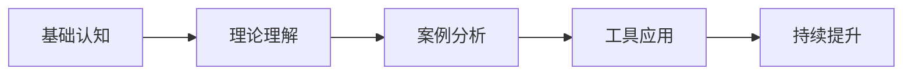
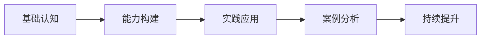
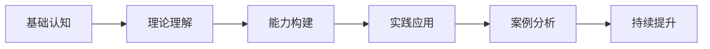

# 学习路径指南

## 🎯 学习目标与路径

### 总体学习目标
通过系统学习企业领导力知识体系，构建完整的领导力认知框架，掌握核心领导技能，提升实际领导能力。

## 📋 学习路径设计

### 路径一：理论导向型（适合学术研究）

**特点**：注重理论深度，适合深入研究
**时间**：8-10周
**适用**：研究人员、咨询顾问

### 路径二：实践导向型（适合管理者）

**特点**：注重实际应用，适合在职管理者
**时间**：6-8周
**适用**：中高层管理者、创业者

### 路径三：混合导向型（适合综合发展）

**特点**：理论与实践并重，适合全面发展
**时间**：10-12周
**适用**：有学习时间的管理者

## 📚 分阶段学习计划

### 第一阶段：基础认知（1-2周）

#### 学习内容
- [[01-基础认知层/01-领导力概述|领导力概述]]
- [[01-基础认知层/02-管理者vs领导者|管理者vs领导者]]
- [[01-基础认知层/03-领导力发展历程|发展历程]]
- [[01-基础认知层/04-现代领导力挑战|现代挑战]]
- [[01-基础认知层/05-领导力伦理与价值观|伦理价值观]]

#### 学习目标
- 理解领导力的基本概念和定义
- 区分管理者与领导者的差异
- 了解领导力发展的历史脉络
- 认识现代领导力面临的挑战

#### 学习方法
1. **阅读理解**：仔细阅读每个文件内容
2. **概念梳理**：制作概念思维导图
3. **对比分析**：对比不同概念间的差异
4. **实践观察**：观察身边的管理者行为

#### 评估标准
- [ ] 能准确解释领导力定义
- [ ] 能区分管理者与领导者特征
- [ ] 能描述领导力发展历程
- [ ] 能识别现代领导力挑战

### 第二阶段：理论理解（2-3周）

#### 学习内容
- [[02-理论理解层/经典领导理论/01-特质理论|特质理论]]
- [[02-理论理解层/经典领导理论/02-行为理论|行为理论]]
- [[02-理论理解层/经典领导理论/03-情境理论|情境理论]]
- [[02-理论理解层/现代领导理论/01-变革型领导|变革型领导]]
- [[02-理论理解层/现代领导理论/02-服务型领导|服务型领导]]
- [[02-理论理解层/现代领导理论/03-分布式领导|分布式领导]]
- [[02-理论理解层/04-理论对比分析|理论对比]]
- [[02-理论理解层/05-领导力模型对比表|模型对比]]

#### 学习目标
- 掌握经典领导理论的核心观点
- 理解现代领导理论的发展趋势
- 能够对比分析不同理论的优缺点
- 建立理论框架思维

#### 学习方法
1. **理论研读**：深入理解每个理论
2. **对比分析**：制作理论对比表
3. **案例应用**：用理论分析实际案例
4. **讨论交流**：与他人讨论理论观点

#### 评估标准
- [ ] 能解释各理论核心观点
- [ ] 能对比不同理论差异
- [ ] 能应用理论分析案例
- [ ] 能建立理论框架

### 第三阶段：能力构建（3-4周）

#### 学习内容
- [[03-能力构建层/核心领导能力/01-战略思维|战略思维]]
- [[03-能力构建层/核心领导能力/02-决策能力|决策能力]]
- [[03-能力构建层/核心领导能力/03-沟通协调|沟通协调]]
- [[03-能力构建层/核心领导能力/04-团队建设|团队建设]]
- [[03-能力构建层/核心领导能力/05-变革管理|变革管理]]
- [[03-能力构建层/核心领导能力/06-情商与自我管理|情商管理]]
- [[03-能力构建层/07-能力发展路径|能力发展路径]]
- [[03-能力构建层/08-领导力测量与评估|测量评估]]

#### 学习目标
- 掌握核心领导能力的具体内容
- 了解能力发展的路径和方法
- 能够评估自身领导能力水平
- 制定个人能力发展计划

#### 学习方法
1. **能力评估**：使用评估工具测试能力
2. **技能练习**：针对薄弱环节练习
3. **案例分析**：分析成功领导者的能力
4. **实践应用**：在工作中应用所学技能

#### 评估标准
- [ ] 能描述各核心能力内容
- [ ] 能评估自身能力水平
- [ ] 能制定能力发展计划
- [ ] 能在实践中应用技能

### 第四阶段：实践应用（4-6周）

#### 学习内容
- [[04-实践应用层/管理实践/01-团队管理|团队管理]]
- [[04-实践应用层/管理实践/02-组织文化建设|组织文化]]
- [[04-实践应用层/管理实践/03-绩效管理|绩效管理]]
- [[04-实践应用层/管理实践/04-危机领导|危机领导]]
- [[04-实践应用层/特殊情境/01-跨文化领导|跨文化领导]]
- [[04-实践应用层/特殊情境/02-数字化转型领导|数字化转型]]
- [[04-实践应用层/特殊情境/03-不同组织形态的领导力应用|组织形态]]
- [[04-实践应用层/05-实践工具箱|实践工具]]

#### 学习目标
- 掌握各种管理实践的方法
- 了解特殊情境下的领导策略
- 能够运用实践工具解决问题
- 提升实际领导效果

#### 学习方法
1. **案例分析**：深入分析实践案例
2. **工具应用**：使用实践工具解决问题
3. **角色扮演**：模拟不同领导情境
4. **反思总结**：总结实践经验教训

#### 评估标准
- [ ] 能运用管理实践方法
- [ ] 能处理特殊领导情境
- [ ] 能使用实践工具
- [ ] 能提升领导效果

### 第五阶段：持续提升（持续进行）

#### 学习内容
- [[05-发展提升层/自我发展/01-自我认知与评估|自我认知]]
- [[05-发展提升层/自我发展/02-学习与发展路径|学习路径]]
- [[05-发展提升层/自我发展/03-导师与教练|导师教练]]
- [[05-发展提升层/持续改进/01-实践反思|实践反思]]
- [[05-发展提升层/持续改进/02-持续改进|持续改进]]
- [[05-发展提升层/03-个人领导力发展计划|发展计划]]

#### 学习目标
- 建立持续学习机制
- 提升自我认知能力
- 制定长期发展计划
- 实现持续改进

#### 学习方法
1. **定期反思**：定期反思学习效果
2. **持续学习**：保持学习习惯
3. **寻求反馈**：主动寻求他人反馈
4. **调整计划**：根据反馈调整计划

#### 评估标准
- [ ] 能建立持续学习机制
- [ ] 能提升自我认知
- [ ] 能制定发展计划
- [ ] 能实现持续改进

## 🎓 学习方法建议

### 费曼学习法应用
1. **选择概念**：选择要学习的领导力概念
2. **教授他人**：用简单语言向他人解释
3. **识别盲点**：发现理解不足的地方
4. **重新学习**：回到资料重新学习
5. **简化表达**：用更简洁的方式表达

### 刻意练习要点
1. **明确目标**：设定具体的学习目标
2. **专注练习**：集中注意力在关键技能上
3. **即时反馈**：及时获得练习结果反馈
4. **走出舒适区**：挑战更高难度的任务
5. **持续改进**：基于反馈不断调整

### 学习技巧
1. **主动学习**：主动思考和分析
2. **联系实际**：将理论与实际结合
3. **多维学习**：从多个角度理解概念
4. **定期复习**：定期回顾已学内容
5. **实践应用**：在实践中验证理论

## 📊 学习进度追踪

### 进度追踪表
| 阶段 | 内容 | 预计时间 | 实际时间 | 完成状态 | 备注 |
|------|------|----------|----------|----------|------|
| 基础认知 | 5个文件 | 1-2周 | | | |
| 理论理解 | 8个文件 | 2-3周 | | | |
| 能力构建 | 8个文件 | 3-4周 | | | |
| 实践应用 | 8个文件 | 4-6周 | | | |
| 持续提升 | 6个文件 | 持续 | | | |

### 学习成果评估
- [ ] 完成所有理论学习
- [ ] 掌握核心领导技能
- [ ] 能够应用理论知识
- [ ] 建立持续学习机制
- [ ] 制定个人发展计划

---

**下一步**：[[03-快速参考索引|快速参考索引]] | [[01-企业领导力知识地图|知识地图]]

