# 概念关系图

## 🕸️ 核心概念关系网络

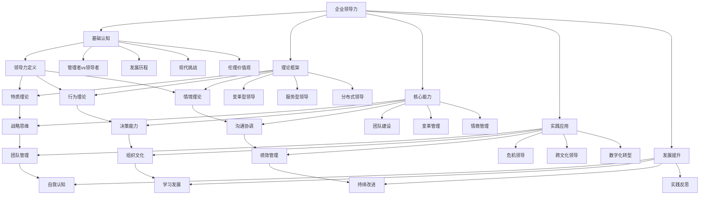

## 🔗 概念间关联关系

### 基础认知 → 理论框架
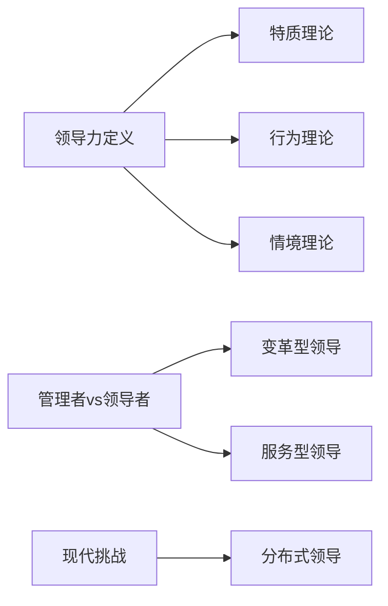

### 理论框架 → 核心能力
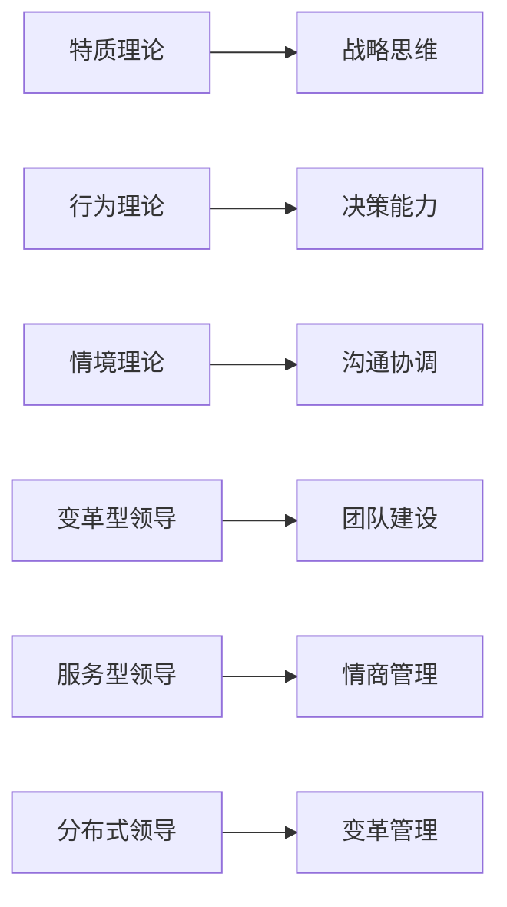

### 核心能力 → 实践应用
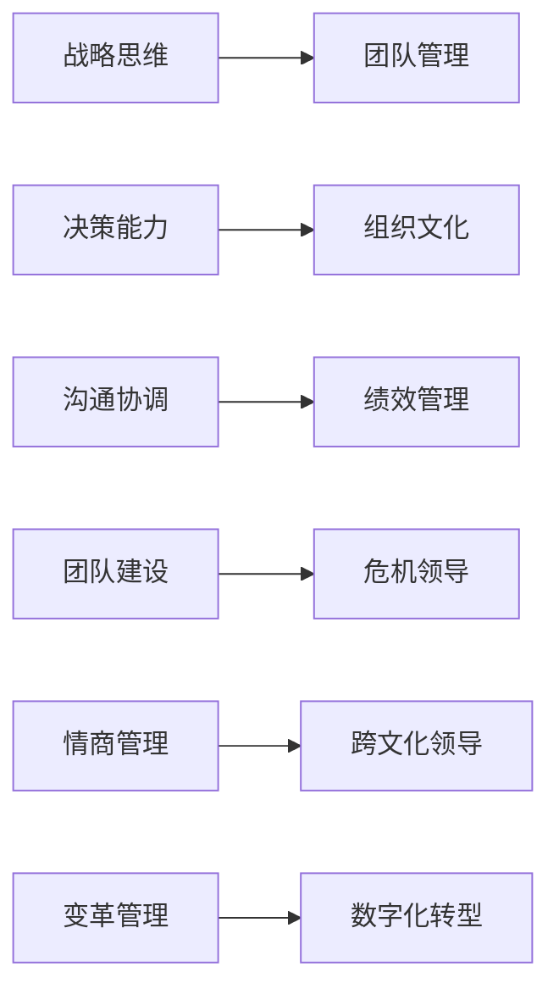

### 实践应用 → 发展提升
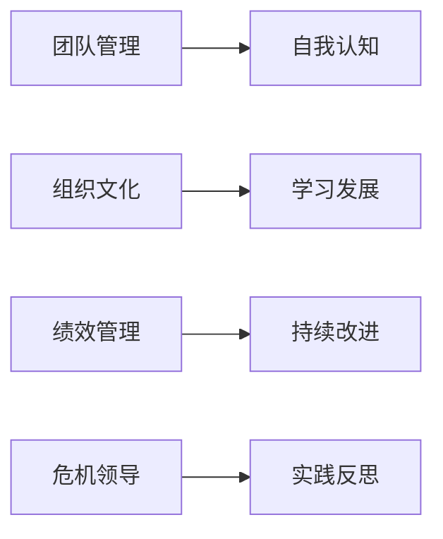

## 📊 概念层次结构

### 第一层：基础概念
- **领导力**：核心概念，统领全局
- **管理者**：基础角色概念
- **领导者**：基础角色概念

### 第二层：理论概念
- **特质理论**：个人特质维度
- **行为理论**：行为模式维度
- **情境理论**：环境适应维度
- **变革型领导**：现代理论概念
- **服务型领导**：现代理论概念
- **分布式领导**：现代理论概念

### 第三层：能力概念
- **战略思维**：思维层面能力
- **决策能力**：决策层面能力
- **沟通协调**：人际层面能力
- **团队建设**：团队层面能力
- **变革管理**：变革层面能力
- **情商管理**：情感层面能力

### 第四层：实践概念
- **团队管理**：管理实践
- **组织文化**：文化实践
- **绩效管理**：绩效实践
- **危机领导**：危机实践
- **跨文化领导**：文化实践
- **数字化转型**：技术实践

### 第五层：发展概念
- **自我认知**：认知发展
- **学习发展**：学习发展
- **持续改进**：改进发展
- **实践反思**：反思发展

## 🎯 概念关系矩阵

| 概念A | 概念B | 关系类型 | 强度 | 说明 |
|-------|-------|----------|------|------|
| 领导力 | 管理者 | 对比关系 | 高 | 核心对比概念 |
| 领导力 | 领导者 | 包含关系 | 高 | 核心包含概念 |
| 特质理论 | 行为理论 | 并列关系 | 中 | 理论维度并列 |
| 战略思维 | 决策能力 | 支持关系 | 高 | 思维支持决策 |
| 沟通协调 | 团队建设 | 支持关系 | 高 | 沟通支持团队 |
| 团队管理 | 组织文化 | 包含关系 | 中 | 管理包含文化 |
| 自我认知 | 学习发展 | 支持关系 | 高 | 认知支持学习 |

## 🔄 概念循环关系

### 学习循环
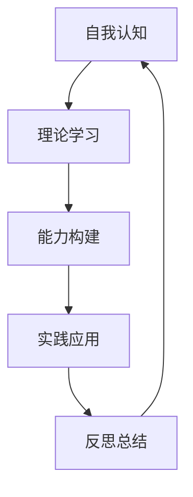

### 发展循环
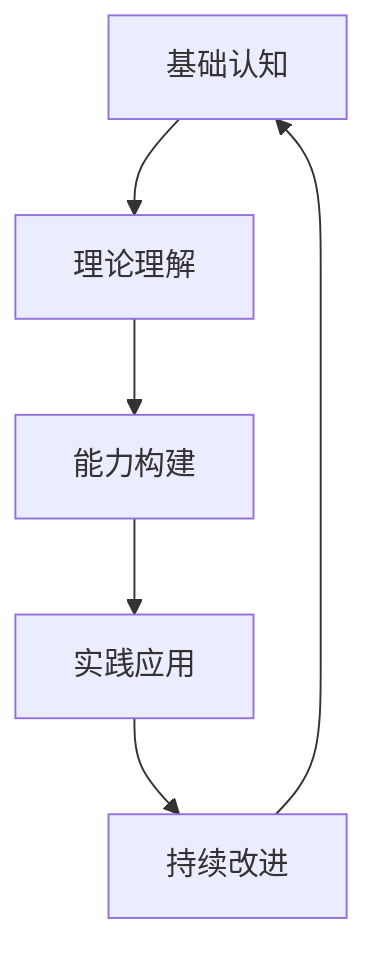

### 领导循环
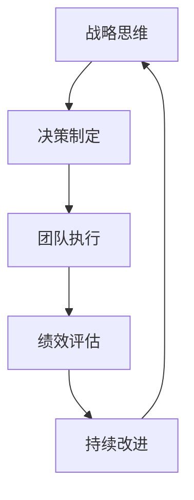

## 🌐 概念网络密度分析

### 高密度概念（连接度高）
- **领导力**：连接所有概念
- **战略思维**：连接多个能力概念
- **团队建设**：连接多个实践概念
- **自我认知**：连接多个发展概念

### 中密度概念（连接度中等）
- **沟通协调**：连接人际相关概念
- **变革管理**：连接变革相关概念
- **绩效管理**：连接管理相关概念

### 低密度概念（连接度低）
- **特质理论**：主要连接基础概念
- **危机领导**：主要连接危机概念
- **数字化转型**：主要连接技术概念

## 📈 概念演化路径

### 历史演化路径
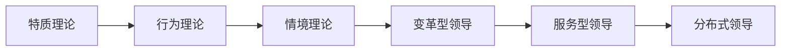

### 能力发展路径
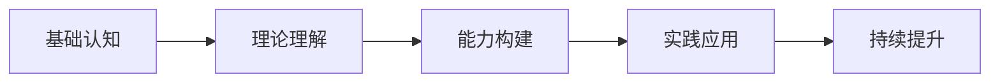

### 实践应用路径
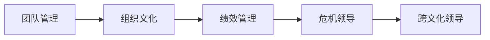

## 🎓 概念学习建议

### 概念学习方法
1. **概念定义**：明确概念内涵和外延
2. **概念关系**：理解概念间的关系
3. **概念应用**：掌握概念的实际应用
4. **概念反思**：反思概念的理解深度

### 概念记忆技巧
1. **概念地图**：制作概念关系图
2. **概念对比**：对比相似概念差异
3. **概念举例**：用具体例子理解概念
4. **概念练习**：通过练习巩固概念

### 概念应用策略
1. **情境识别**：识别概念适用情境
2. **方法选择**：选择合适的概念方法
3. **效果评估**：评估概念应用效果
4. **持续改进**：基于效果改进应用

---

**相关链接**：[[01-企业领导力知识地图|知识地图]] | [[03-快速参考索引|快速参考]]

