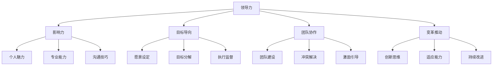
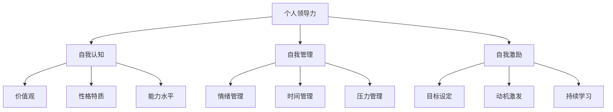
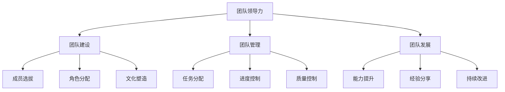
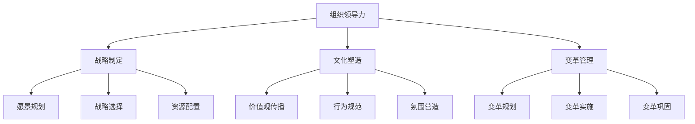

# 领导力概述

## 🎯 核心定义

### 领导力的基本定义
**领导力**是指影响他人实现共同目标的能力和过程，包括激发、引导、协调和激励团队成员朝着既定方向努力的综合能力。

### 领导力的本质特征

## 📚 领导力的核心要素

### 1. 影响力（Influence）
- **定义**：改变他人思想、态度和行为的能力
- **特征**：非强制性、自愿性、持续性
- **来源**：职位权力、个人魅力、专业能力

### 2. 目标导向（Goal Orientation）
- **定义**：明确目标并引导团队实现目标
- **特征**：愿景清晰、目标具体、路径明确
- **作用**：提供方向、凝聚力量、衡量成效

### 3. 团队协作（Team Collaboration）
- **定义**：促进团队成员间的有效合作
- **特征**：沟通顺畅、协调一致、相互支持
- **价值**：提升效率、增强凝聚力、实现共赢

### 4. 变革推动（Change Facilitation）
- **定义**：推动组织变革和创新发展
- **特征**：前瞻性、适应性、创新性
- **意义**：应对挑战、抓住机遇、持续发展

## 🔍 领导力的层次结构

### 个人层面

### 团队层面

### 组织层面

## 📊 领导力的类型分类

### 按权力来源分类
| 类型 | 权力来源 | 特征 | 适用情境 |
|------|----------|------|----------|
| **法定型** | 职位权力 | 正式权威 | 正式组织 |
| **专家型** | 专业能力 | 知识权威 | 专业领域 |
| **魅力型** | 个人魅力 | 情感吸引 | 变革时期 |
| **奖励型** | 奖励权力 | 利益激励 | 绩效导向 |
| **强制型** | 惩罚权力 | 威胁约束 | 危机处理 |

### 按行为风格分类
| 类型 | 行为特征 | 优势 | 劣势 |
|------|----------|------|------|
| **民主型** | 参与决策 | 激发创意 | 效率较低 |
| **专制型** | 独断决策 | 效率较高 | 缺乏参与 |
| **放任型** | 自由发挥 | 激发自主 | 缺乏控制 |
| **情境型** | 灵活适应 | 适应性强 | 要求较高 |

### 按关注重点分类
| 类型 | 关注重点 | 目标 | 方法 |
|------|----------|------|------|
| **任务导向** | 任务完成 | 高效执行 | 流程优化 |
| **关系导向** | 人际关系 | 团队和谐 | 沟通协调 |
| **平衡导向** | 任务与关系 | 综合效果 | 灵活调整 |

## 🎓 领导力的发展历程

### 古代领导力思想
- **儒家思想**：仁政、德治、礼治
- **法家思想**：法治、权术、势
- **道家思想**：无为而治、顺势而为

### 现代领导力理论
- **特质理论**：关注领导者个人特质
- **行为理论**：关注领导者行为模式
- **情境理论**：关注环境因素影响

### 当代领导力发展
- **变革型领导**：关注变革和创新
- **服务型领导**：关注服务他人
- **分布式领导**：关注领导力分布

## 🌟 领导力的价值意义

### 对个人的价值
- **自我实现**：发挥个人潜能
- **影响力**：影响他人和世界
- **成就感**：实现个人价值
- **成长**：持续学习和成长

### 对团队的价值
- **凝聚力**：增强团队凝聚力
- **效率**：提升团队效率
- **创新**：激发团队创新
- **发展**：促进团队发展

### 对组织的价值
- **战略实现**：实现组织战略
- **文化塑造**：塑造组织文化
- **变革推动**：推动组织变革
- **持续发展**：实现持续发展

## 🔗 相关概念链接

### 核心概念
- [[02-管理者vs领导者|管理者vs领导者]]
- [[03-领导力发展历程|发展历程]]
- [[04-现代领导力挑战|现代挑战]]

### 理论概念
- [[02-理论理解层/经典领导理论/01-特质理论|特质理论]]
- [[02-理论理解层/现代领导理论/01-变革型领导|变革型领导]]

### 能力概念
- [[03-能力构建层/核心领导能力/01-战略思维|战略思维]]
- [[03-能力构建层/核心领导能力/03-沟通协调|沟通协调]]

## 💡 学习要点总结

### 关键理解
1. **领导力是影响力**：通过非强制方式影响他人
2. **领导力是过程**：包含目标设定、团队协作、变革推动
3. **领导力是能力**：可以通过学习和实践提升
4. **领导力是情境性**：需要根据情境调整风格

### 实践应用
1. **自我评估**：评估自身领导力水平
2. **目标设定**：设定领导力发展目标
3. **实践练习**：在工作中实践领导技能
4. **持续改进**：基于反馈持续改进

### 思考问题
1. 你认为领导力的核心是什么？
2. 如何区分领导力和管理力？
3. 领导力可以通过学习获得吗？
4. 在不同情境下如何调整领导风格？

---

**下一步**：[[02-管理者vs领导者|管理者vs领导者]] | [[03-领导力发展历程|发展历程]]

