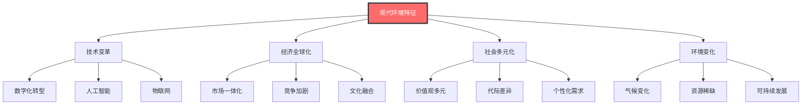
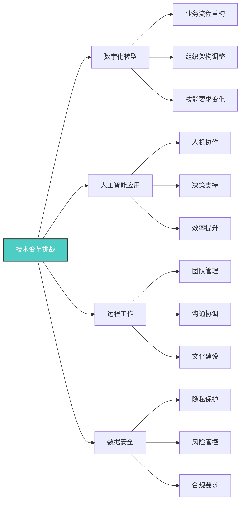
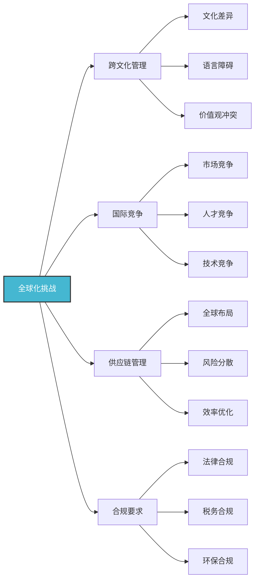
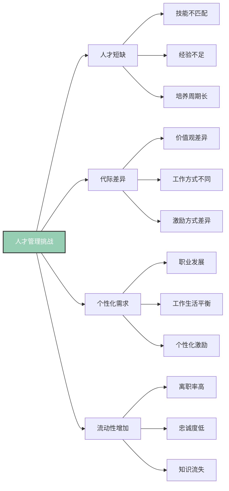
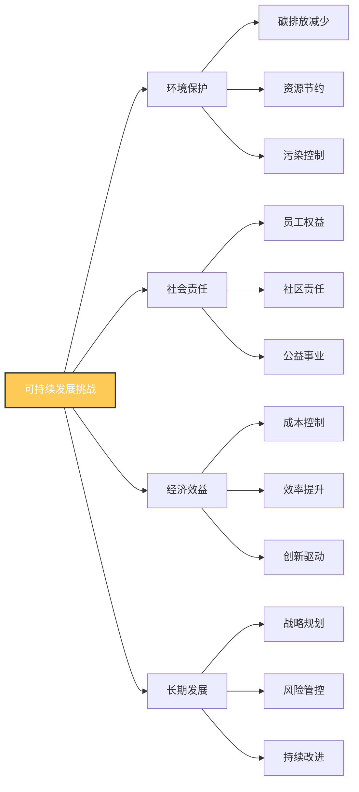
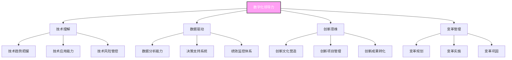
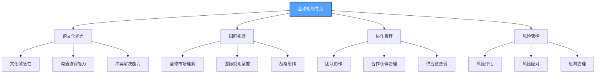
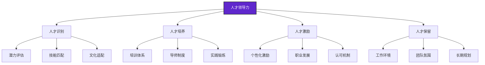
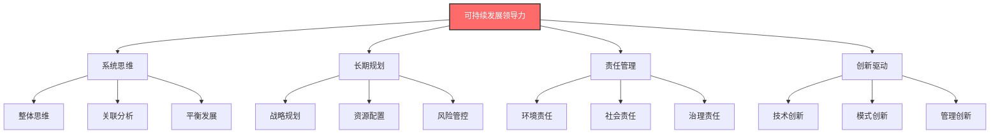

# 现代领导力挑战

## 🎯 时代背景分析

### 现代环境特征

## 📊 核心挑战分析

### 1. 技术变革挑战

#### 具体表现
| 挑战类型 | 具体表现 | 影响程度 | 应对策略 |
|----------|----------|----------|----------|
| **技能更新** | 需要学习新技术 | 高 | 持续学习、培训 |
| **组织变革** | 需要调整组织结构 | 高 | 渐进式变革、员工参与 |
| **管理方式** | 需要改变管理方式 | 中 | 数字化管理、数据驱动 |
| **文化适应** | 需要适应新文化 | 中 | 文化变革、价值观重塑 |

### 2. 全球化挑战

#### 具体表现
| 挑战类型 | 具体表现 | 影响程度 | 应对策略 |
|----------|----------|----------|----------|
| **文化冲突** | 不同文化背景冲突 | 高 | 文化培训、包容管理 |
| **沟通障碍** | 语言和文化障碍 | 中 | 多语言支持、文化理解 |
| **管理复杂性** | 管理复杂度增加 | 高 | 标准化管理、本地化适应 |
| **合规风险** | 不同国家法规要求 | 中 | 合规管理、风险评估 |

### 3. 人才管理挑战

#### 具体表现
| 挑战类型 | 具体表现 | 影响程度 | 应对策略 |
|----------|----------|----------|----------|
| **技能缺口** | 技能需求与供给不匹配 | 高 | 内部培养、外部引进 |
| **代际管理** | 不同代际员工管理 | 中 | 差异化管理、沟通协调 |
| **员工保留** | 员工离职率高 | 高 | 激励机制、职业发展 |
| **知识管理** | 知识流失风险 | 中 | 知识管理、经验传承 |

### 4. 可持续发展挑战

#### 具体表现
| 挑战类型 | 具体表现 | 影响程度 | 应对策略 |
|----------|----------|----------|----------|
| **环保要求** | 环保法规日益严格 | 中 | 绿色管理、技术升级 |
| **社会责任** | 社会期望值提高 | 中 | 责任管理、透明沟通 |
| **成本压力** | 可持续发展成本 | 中 | 长期投资、效率提升 |
| **平衡发展** | 三重底线平衡 | 高 | 综合管理、系统思维 |

## 🎯 领导力应对策略

### 1. 数字化领导力

### 2. 全球化领导力

### 3. 人才领导力

### 4. 可持续发展领导力

## 🎓 费曼学习法应用

### 第一步：选择概念
选择"现代领导力挑战"这一核心概念

### 第二步：教授他人
用简单语言向他人解释：
- 现代领导者面临的挑战就像在复杂环境中驾驶，需要同时应对技术、文化、人才、环境等多重挑战

### 第三步：识别盲点
发现理解不足的地方：
- 如何平衡不同挑战之间的关系？
- 如何制定综合应对策略？

### 第四步：重新学习
回到资料重新学习盲点：
- 系统思维方法
- 综合管理策略

### 第五步：简化表达
用更简洁的方式表达概念：
- 现代领导力挑战 = 技术变革 + 全球化 + 人才管理 + 可持续发展

## 💡 刻意练习要点

### 练习目标
1. **明确目标**：识别具体挑战类型
2. **专注练习**：重点练习薄弱环节
3. **即时反馈**：获得应对效果反馈
4. **走出舒适区**：挑战复杂情境应对
5. **持续改进**：基于反馈不断优化

### 练习方法
| 练习类型 | 具体方法 | 实施步骤 | 评估标准 |
|----------|----------|----------|----------|
| **情境分析** | 分析具体挑战情境 | 1.识别挑战 2.分析原因 3.制定策略 4.评估效果 | 分析深度 |
| **策略制定** | 制定应对策略 | 1.目标设定 2.策略选择 3.实施计划 4.效果评估 | 策略可行性 |
| **案例研究** | 研究成功案例 | 1.选择案例 2.分析做法 3.总结规律 4.应用实践 | 学习效果 |
| **模拟练习** | 模拟挑战情境 | 1.设定情境 2.角色扮演 3.应对练习 4.反思总结 | 应对能力 |

## 🔗 相关概念链接

### 基础概念
- [[01-领导力概述|领导力概述]] - 理解领导力本质
- [[02-管理者vs领导者|管理者vs领导者]] - 角色区分
- [[03-领导力发展历程|发展历程]] - 历史脉络

### 理论概念
- [[02-理论理解层/现代领导理论/01-变革型领导|变革型领导]] - 变革理论
- [[02-理论理解层/现代领导理论/02-服务型领导|服务型领导]] - 服务理论
- [[02-理论理解层/现代领导理论/03-分布式领导|分布式领导]] - 分布理论

### 能力概念
- [[03-能力构建层/核心领导能力/01-战略思维|战略思维]] - 战略能力
- [[03-能力构建层/核心领导能力/05-变革管理|变革管理]] - 变革能力
- [[03-能力构建层/核心领导能力/06-情商与自我管理|情商管理]] - 情商能力

### 实践概念
- [[04-实践应用层/特殊情境/01-跨文化领导|跨文化领导]] - 跨文化实践
- [[04-实践应用层/特殊情境/02-数字化转型领导|数字化转型]] - 数字化实践
- [[04-实践应用层/特殊情境/03-不同组织形态的领导力应用|组织形态]] - 组织实践

## 💡 学习要点总结

### 关键理解
1. **挑战复杂性**：现代挑战具有多维度、高复杂性特征
2. **系统思维**：需要运用系统思维应对复杂挑战
3. **动态适应**：需要具备动态适应能力
4. **综合管理**：需要综合运用多种管理方法

### 实践应用
1. **挑战识别**：准确识别面临的挑战类型
2. **策略制定**：制定综合应对策略
3. **能力发展**：发展应对挑战的能力
4. **持续改进**：基于实践不断改进

### 思考问题
1. 你面临哪些现代领导力挑战？
2. 如何制定综合应对策略？
3. 如何发展应对挑战的能力？
4. 如何平衡不同挑战之间的关系？

---

**下一步**：[[05-领导力伦理与价值观|伦理价值观]] | [[02-理论理解层/经典领导理论/01-特质理论|特质理论]]
