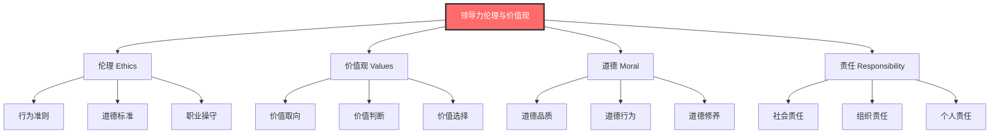
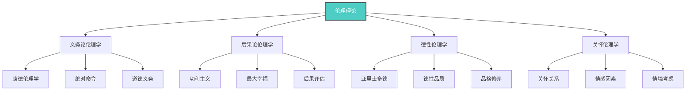
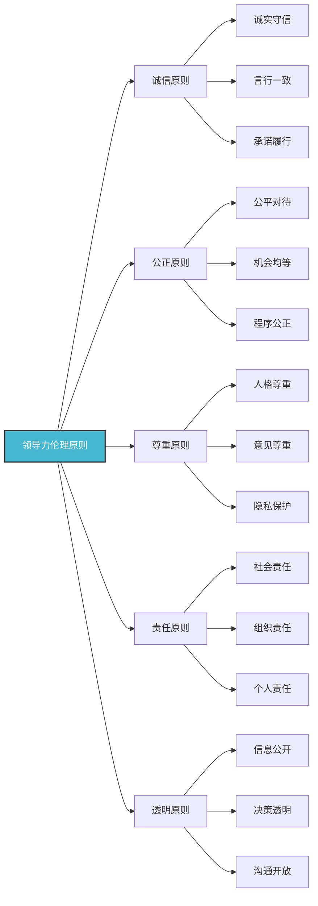
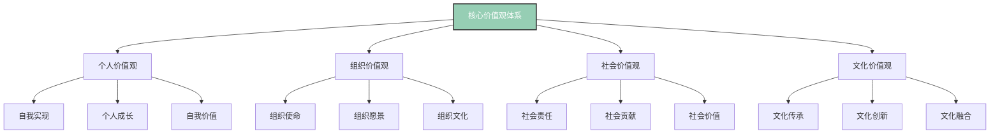
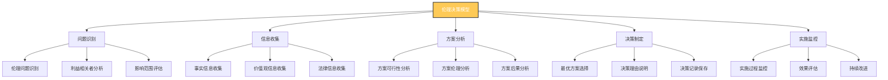
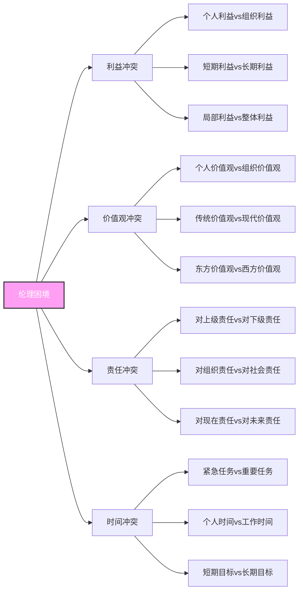

# 领导力伦理与价值观

## 🎯 核心概念理解

### 伦理与价值观的定义

### 核心要素分析
| 要素类型 | 定义 | 特征 | 重要性 |
|----------|------|------|--------|
| **伦理** | 行为准则和道德标准 | 规范性、约束性 | 高 |
| **价值观** | 价值取向和价值判断 | 导向性、选择性 | 高 |
| **道德** | 道德品质和道德行为 | 内在性、自觉性 | 中 |
| **责任** | 应承担的义务和职责 | 强制性、义务性 | 高 |

## 📚 伦理理论基础

### 主要伦理理论

### 理论对比分析
| 理论类型 | 核心观点 | 优势 | 局限 | 应用场景 |
|----------|----------|------|------|----------|
| **义务论** | 行为本身的对错 | 原则性强、一致性 | 忽视后果、僵化 | 原则性决策 |
| **后果论** | 行为后果的好坏 | 实用性强、灵活 | 后果难测、功利化 | 效果性决策 |
| **德性论** | 行为者的品格 | 内在修养、完整性 | 标准模糊、主观 | 品格培养 |
| **关怀论** | 关怀关系的建立 | 情感因素、关系性 | 范围有限、偏重 | 关系管理 |

## 🎯 领导力伦理原则

### 核心伦理原则

### 原则详细分析
| 原则 | 具体内容 | 行为表现 | 违反后果 | 实践方法 |
|------|----------|----------|----------|----------|
| **诚信** | 诚实守信、言行一致 | 说真话、守承诺 | 信任丧失、声誉受损 | 建立诚信机制 |
| **公正** | 公平对待、机会均等 | 公平决策、平等机会 | 员工不满、组织分裂 | 建立公正制度 |
| **尊重** | 人格尊重、意见尊重 | 倾听意见、保护隐私 | 关系恶化、合作困难 | 营造尊重氛围 |
| **责任** | 承担责任、履行义务 | 主动承担、积极履行 | 责任推诿、信任危机 | 明确责任分工 |
| **透明** | 信息公开、决策透明 | 公开信息、透明决策 | 信息不对称、决策质疑 | 建立透明机制 |

## 🌟 价值观体系构建

### 核心价值观类型

### 价值观层次结构
| 层次 | 价值观类型 | 具体内容 | 影响范围 | 重要性 |
|------|------------|----------|----------|--------|
| **个人层** | 个人价值观 | 自我实现、个人成长 | 个人行为 | 高 |
| **团队层** | 团队价值观 | 团队合作、共同目标 | 团队行为 | 中 |
| **组织层** | 组织价值观 | 组织使命、组织文化 | 组织行为 | 高 |
| **社会层** | 社会价值观 | 社会责任、社会贡献 | 社会行为 | 中 |

## 🎯 伦理决策框架

### 伦理决策模型

### 决策步骤详解
| 步骤 | 具体内容 | 关键问题 | 工具方法 | 注意事项 |
|------|----------|----------|----------|----------|
| **问题识别** | 识别伦理问题 | 这是伦理问题吗？ | 问题清单、利益相关者分析 | 避免问题泛化 |
| **信息收集** | 收集相关信息 | 需要什么信息？ | 信息收集表、专家咨询 | 确保信息完整性 |
| **方案分析** | 分析各种方案 | 有哪些选择？ | 方案对比表、伦理分析 | 考虑所有可能方案 |
| **决策制定** | 制定最终决策 | 最佳选择是什么？ | 决策矩阵、伦理原则 | 确保决策合理性 |
| **实施监控** | 监控实施过程 | 实施效果如何？ | 监控指标、反馈机制 | 及时调整改进 |

## 🎯 伦理困境处理

### 常见伦理困境

### 困境处理策略
| 困境类型 | 处理策略 | 具体方法 | 适用条件 | 注意事项 |
|----------|----------|----------|----------|----------|
| **利益冲突** | 利益平衡 | 寻找共同利益点 | 利益可调和 | 避免利益交换 |
| **价值观冲突** | 价值观对话 | 开放沟通、理解差异 | 价值观可协商 | 尊重价值观差异 |
| **责任冲突** | 责任排序 | 确定责任优先级 | 责任可排序 | 明确责任边界 |
| **时间冲突** | 时间管理 | 合理分配时间资源 | 时间可管理 | 避免时间浪费 |

## 🎓 费曼学习法应用

### 第一步：选择概念
选择"领导力伦理与价值观"这一核心概念

### 第二步：教授他人
用简单语言向他人解释：
- 领导力伦理就像道德指南针，告诉领导者什么是对的，什么是错的

### 第三步：识别盲点
发现理解不足的地方：
- 如何在实际工作中应用伦理原则？
- 如何处理伦理困境？

### 第四步：重新学习
回到资料重新学习盲点：
- 伦理决策框架
- 困境处理方法

### 第五步：简化表达
用更简洁的方式表达概念：
- 领导力伦理 = 诚信 + 公正 + 尊重 + 责任 + 透明

## 💡 刻意练习要点

### 练习目标
1. **明确目标**：理解伦理原则和价值观
2. **专注练习**：重点练习伦理决策
3. **即时反馈**：获得决策效果反馈
4. **走出舒适区**：挑战复杂伦理困境
5. **持续改进**：基于反馈不断优化

### 练习方法
| 练习类型 | 具体方法 | 实施步骤 | 评估标准 |
|----------|----------|----------|----------|
| **案例分析** | 分析伦理案例 | 1.阅读案例 2.识别问题 3.分析伦理 4.制定决策 | 分析深度 |
| **角色扮演** | 模拟伦理情境 | 1.设定情境 2.角色扮演 3.伦理决策 4.反思总结 | 决策质量 |
| **伦理讨论** | 讨论伦理问题 | 1.提出问题 2.分组讨论 3.观点交流 4.总结共识 | 讨论质量 |
| **决策练习** | 练习伦理决策 | 1.设定问题 2.收集信息 3.分析方案 4.制定决策 | 决策合理性 |

## 🔗 相关概念链接

### 基础概念
- [[01-领导力概述|领导力概述]] - 理解领导力本质
- [[02-管理者vs领导者|管理者vs领导者]] - 角色区分
- [[03-领导力发展历程|发展历程]] - 历史脉络

### 理论概念
- [[02-理论理解层/现代领导理论/02-服务型领导|服务型领导]] - 服务理论
- [[02-理论理解层/04-理论对比分析|理论对比]] - 综合分析

### 能力概念
- [[03-能力构建层/核心领导能力/06-情商与自我管理|情商管理]] - 情商能力
- [[03-能力构建层/核心领导能力/02-决策能力|决策能力]] - 决策能力

### 实践概念
- [[04-实践应用层/管理实践/02-组织文化建设|组织文化]] - 文化建设
- [[05-发展提升层/自我发展/01-自我认知与评估|自我认知]] - 自我评估

## 💡 学习要点总结

### 关键理解
1. **伦理重要性**：伦理是领导力的道德基础
2. **价值观导向**：价值观指导领导行为
3. **决策框架**：需要系统化的伦理决策框架
4. **困境处理**：需要有效处理伦理困境的方法

### 实践应用
1. **伦理原则**：在工作中坚持伦理原则
2. **价值观构建**：构建个人和组织价值观体系
3. **伦理决策**：运用伦理决策框架
4. **困境处理**：有效处理伦理困境

### 思考问题
1. 你的核心价值观是什么？
2. 如何在工作中坚持伦理原则？
3. 如何处理伦理困境？
4. 如何构建组织价值观体系？

---

**下一步**：[[02-理论理解层/经典领导理论/01-特质理论|特质理论]] | [[02-理论理解层/经典领导理论/02-行为理论|行为理论]]
