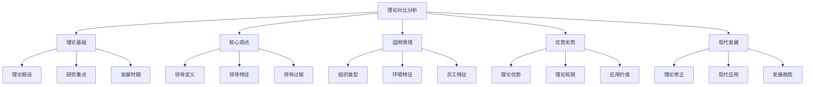
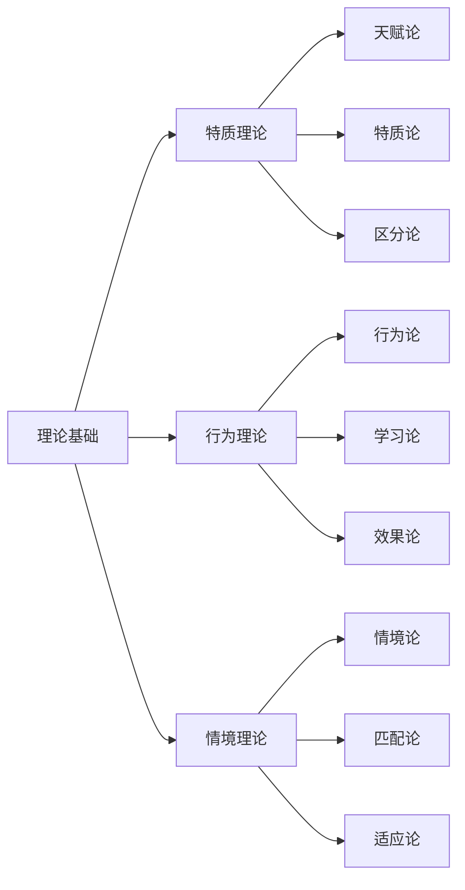
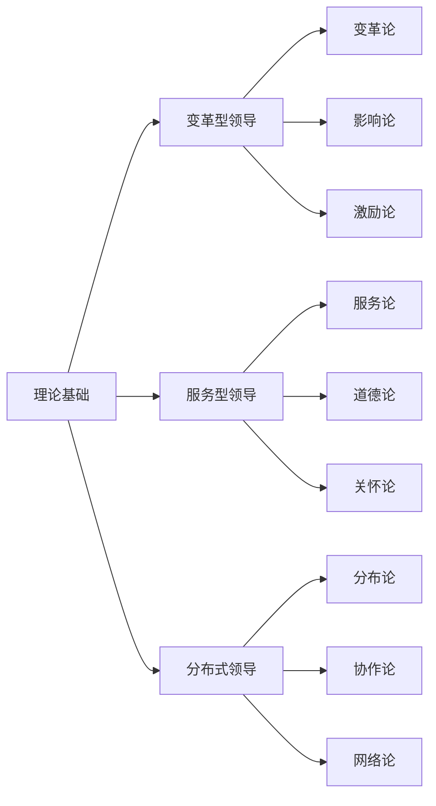
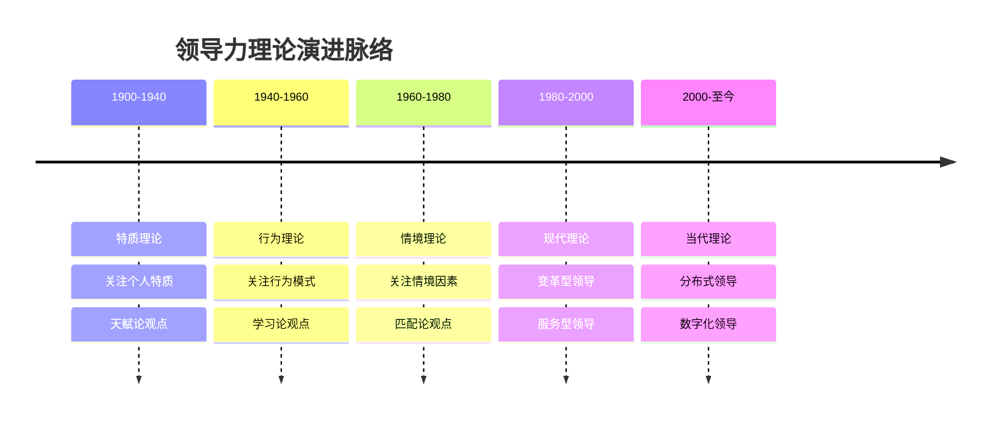
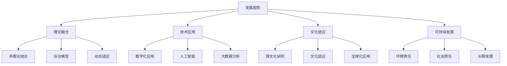

# 理论对比分析

## 🎯 对比分析框架

### 分析维度

## 📊 经典理论对比

### 特质理论 vs 行为理论 vs 情境理论
| 对比维度 | 特质理论 | 行为理论 | 情境理论 |
|----------|----------|----------|----------|
| **理论基础** | 天赋论 | 学习论 | 匹配论 |
| **核心观点** | 领导者具有共同特质 | 领导行为决定效果 | 领导效果取决于情境 |
| **研究重点** | 个人特质 | 行为模式 | 情境因素 |
| **发展时期** | 1900-1940 | 1940-1960 | 1960-1980 |
| **代表人物** | 卡莱尔、斯托格迪尔 | 俄亥俄州立大学 | 费德勒、豪斯 |
| **主要贡献** | 识别领导特质 | 行为分类框架 | 情境匹配理论 |
| **理论优势** | 理论基础扎实 | 可操作性强 | 情境意识强 |
| **理论局限** | 忽视环境因素 | 忽视情境因素 | 情境分析复杂 |
| **现代价值** | 人才选拔指导 | 领导培训基础 | 风格选择指导 |

### 详细对比分析
#### 理论基础对比

#### 核心观点对比
| 理论 | 领导定义 | 领导特征 | 领导过程 |
|------|----------|----------|----------|
| **特质理论** | 具有特定特质的个人 | 个人特质特征 | 特质发挥作用 |
| **行为理论** | 特定行为模式的个人 | 行为模式特征 | 行为产生效果 |
| **情境理论** | 适应情境的个人 | 情境适应特征 | 情境匹配过程 |

#### 适用情境对比
| 理论 | 组织类型 | 环境特征 | 员工特征 |
|------|----------|----------|----------|
| **特质理论** | 传统组织 | 稳定环境 | 被动员工 |
| **行为理论** | 现代组织 | 变化环境 | 主动员工 |
| **情境理论** | 复杂组织 | 复杂环境 | 多样员工 |

## 📈 现代理论对比

### 变革型领导 vs 服务型领导 vs 分布式领导
| 对比维度 | 变革型领导 | 服务型领导 | 分布式领导 |
|----------|------------|------------|------------|
| **理论基础** | 变革论 | 服务论 | 分布论 |
| **核心观点** | 通过变革影响他人 | 通过服务影响他人 | 通过分布实现领导 |
| **研究重点** | 变革过程 | 服务行为 | 分布模式 |
| **发展时期** | 1980-2000 | 1970-2000 | 1990-至今 |
| **代表人物** | 伯恩斯、巴斯 | 格林里夫、斯皮尔斯 | 斯皮兰、哈里斯 |
| **主要贡献** | 变革型领导理论 | 服务型领导理论 | 分布式领导理论 |
| **理论优势** | 变革能力强 | 道德导向强 | 适应性强 |
| **理论局限** | 实施难度大 | 效率较低 | 管理复杂 |
| **现代价值** | 变革管理指导 | 文化建设指导 | 组织设计指导 |

### 详细对比分析
#### 理论基础对比

#### 核心观点对比
| 理论 | 领导定义 | 领导特征 | 领导过程 |
|------|----------|----------|----------|
| **变革型领导** | 推动变革的个人 | 变革导向特征 | 变革影响过程 |
| **服务型领导** | 服务他人的个人 | 服务导向特征 | 服务影响过程 |
| **分布式领导** | 分布领导的系统 | 分布导向特征 | 分布协作过程 |

#### 适用情境对比
| 理论 | 组织类型 | 环境特征 | 员工特征 |
|------|----------|----------|----------|
| **变革型领导** | 变革组织 | 变革环境 | 变革员工 |
| **服务型领导** | 服务组织 | 稳定环境 | 服务员工 |
| **分布式领导** | 网络组织 | 复杂环境 | 协作员工 |

## 🔄 理论演进关系

### 历史演进脉络

### 理论关系分析
#### 继承关系
- **特质理论** → **行为理论**：从特质关注转向行为关注
- **行为理论** → **情境理论**：从行为关注转向情境关注
- **情境理论** → **现代理论**：从情境关注转向综合关注

#### 发展关系
- **经典理论** → **现代理论**：从单一维度转向多维度
- **现代理论** → **当代理论**：从个人领导转向系统领导
- **当代理论** → **未来理论**：从实体领导转向虚拟领导

## 🎯 理论选择指南

### 选择标准
| 选择标准 | 权重 | 评估内容 | 评分标准 |
|----------|------|----------|----------|
| **理论完整性** | 30% | 理论框架完整性 | 1-5分 |
| **实践适用性** | 25% | 实践应用价值 | 1-5分 |
| **实证支持度** | 20% | 实证研究支持 | 1-5分 |
| **现代适应性** | 15% | 现代环境适应 | 1-5分 |
| **文化适应性** | 10% | 跨文化适应 | 1-5分 |

### 选择矩阵
| 理论 | 理论完整性 | 实践适用性 | 实证支持度 | 现代适应性 | 文化适应性 | 总分 | 排名 |
|------|------------|------------|------------|------------|------------|------|------|
| **特质理论** | 3 | 2 | 3 | 2 | 3 | 2.6 | 6 |
| **行为理论** | 4 | 4 | 4 | 3 | 3 | 3.6 | 4 |
| **情境理论** | 4 | 4 | 4 | 4 | 3 | 3.8 | 3 |
| **变革型领导** | 5 | 4 | 5 | 5 | 3 | 4.4 | 1 |
| **服务型领导** | 4 | 3 | 4 | 4 | 4 | 3.8 | 2 |
| **分布式领导** | 3 | 5 | 3 | 5 | 3 | 3.6 | 5 |

### 应用建议
#### 根据组织类型选择
| 组织类型 | 推荐理论 | 选择理由 | 实施要点 |
|----------|----------|----------|----------|
| **传统组织** | 行为理论 | 可操作性强 | 行为培训 |
| **现代组织** | 变革型领导 | 变革能力强 | 变革管理 |
| **服务组织** | 服务型领导 | 服务导向强 | 文化建设 |
| **网络组织** | 分布式领导 | 适应性强 | 组织设计 |

#### 根据环境特征选择
| 环境特征 | 推荐理论 | 选择理由 | 实施要点 |
|----------|----------|----------|----------|
| **稳定环境** | 行为理论 | 效率导向 | 标准化管理 |
| **变化环境** | 变革型领导 | 适应性强 | 变革管理 |
| **复杂环境** | 分布式领导 | 协作性强 | 网络建设 |
| **竞争环境** | 情境理论 | 灵活性强 | 情境适应 |

## 📊 理论发展趋势

### 发展趋势分析

### 未来发展方向
#### 理论发展方向
1. **理论融合**：多理论结合发展
2. **技术融合**：与技术深度融合
3. **文化融合**：跨文化理论发展
4. **可持续发展**：关注可持续发展

#### 实践发展方向
1. **数字化领导**：数字化时代领导
2. **虚拟领导**：虚拟团队领导
3. **网络领导**：网络组织领导
4. **智能领导**：人工智能辅助领导

## 🔗 相关概念链接

### 基础概念
- [[01-基础认知层/01-领导力概述|领导力概述]]
- [[01-基础认知层/03-领导力发展历程|发展历程]]
- [[01-基础认知层/04-现代领导力挑战|现代挑战]]

### 理论概念
- [[01-特质理论|特质理论]]
- [[02-行为理论|行为理论]]
- [[03-情境理论|情境理论]]
- [[01-变革型领导|变革型领导]]
- [[02-服务型领导|服务型领导]]
- [[03-分布式领导|分布式领导]]

### 能力概念
- [[03-能力构建层/核心领导能力/01-战略思维|战略思维]]
- [[03-能力构建层/核心领导能力/05-变革管理|变革管理]]

### 实践概念
- [[04-实践应用层/管理实践/01-团队管理|团队管理]]
- [[04-实践应用层/特殊情境/02-数字化转型领导|数字化转型]]

## 💡 学习要点总结

### 关键理解
1. **理论演进**：从特质到行为到情境到现代理论
2. **理论对比**：不同理论各有优势和局限
3. **理论选择**：根据情境选择合适的理论
4. **理论发展**：理论不断发展和完善

### 实践应用
1. **理论选择**：根据组织特点选择理论
2. **理论应用**：在实践中应用理论
3. **理论融合**：结合多个理论的优势
4. **理论发展**：关注理论发展趋势

### 思考问题
1. 你认为哪个理论最有价值？
2. 如何根据情境选择理论？
3. 理论融合的可能性？
4. 未来领导力理论会如何发展？

---

**下一步**：[[05-领导力模型对比表|模型对比]] | [[03-能力构建层/核心领导能力/01-战略思维|战略思维]]

