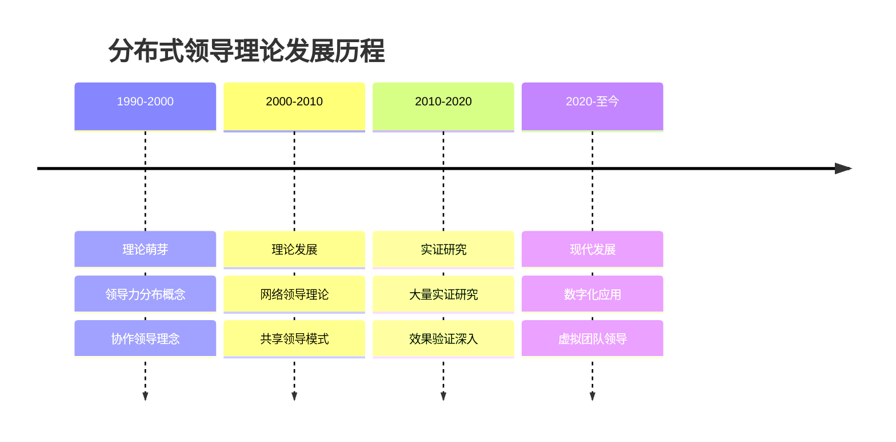
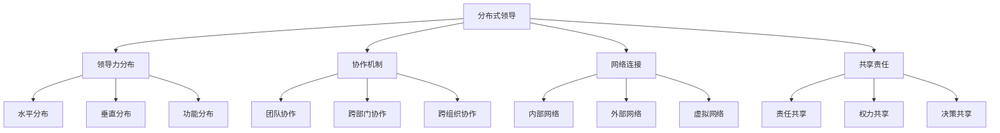
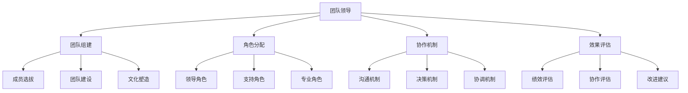
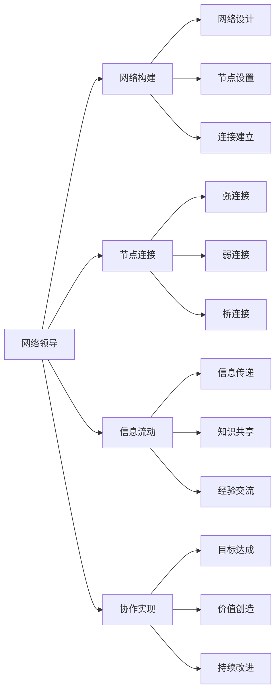
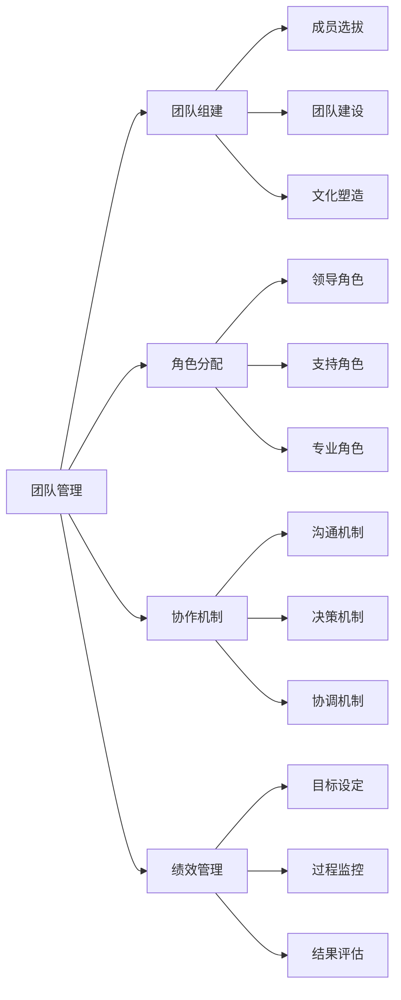
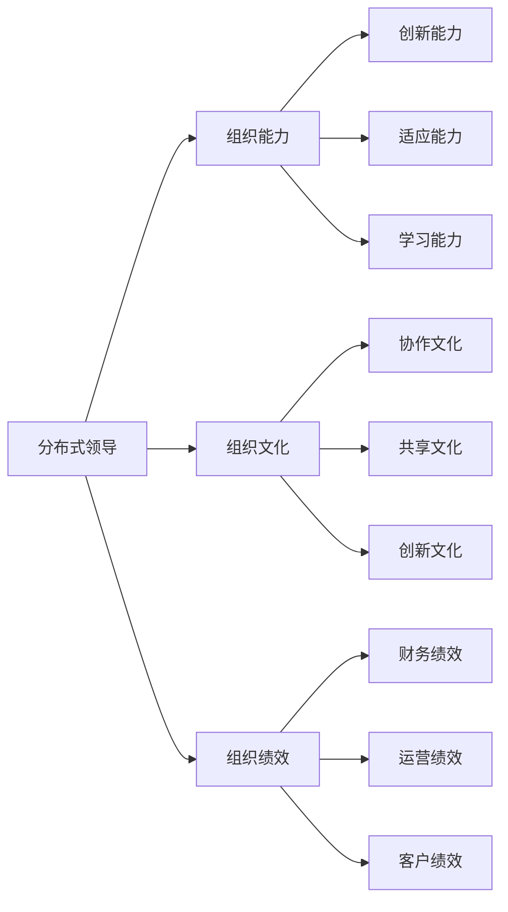

# 分布式领导

## 🎯 理论概述

### 基本定义
**分布式领导**（Distributed Leadership）是一种现代领导理念，认为领导力不是集中在个人身上，而是在组织中分布，通过多人协作、网络连接和共享责任来实现组织目标。

### 核心特征
- **分布性**：领导力在组织中分布
- **协作性**：多人协作共同领导
- **网络性**：基于网络的领导模式
- **共享性**：共享领导责任和权力

## 📚 理论发展历程

### 历史发展脉络

### 主要代表人物
| 学者 | 时期 | 主要贡献 | 核心观点 |
|------|------|----------|----------|
| **詹姆斯·斯皮兰** | 1990s | 分布式领导概念 | 领导力分布理念 |
| **阿尔玛·哈里斯** | 2000s | 理论框架 | 建立理论框架 |
| **肯·利思伍德** | 2010s | 实证研究 | 验证理论效果 |
| **迈克尔·富兰** | 2020s | 现代应用 | 数字化时代应用 |

## 🔍 核心理论框架

### 理论模型

### 领导力分布维度
#### 水平分布（Horizontal Distribution）
- **定义**：在同一层级内的领导力分布
- **表现**：团队成员共同承担领导责任
- **特点**：平等性、协作性、共享性

#### 垂直分布（Vertical Distribution）
- **定义**：在不同层级间的领导力分布
- **表现**：上下级共同参与领导
- **特点**：层级性、互补性、协调性

#### 功能分布（Functional Distribution）
- **定义**：在不同功能领域的领导力分布
- **表现**：各职能部门承担领导责任
- **特点**：专业性、分工性、整合性

### 协作机制
#### 团队协作
| 协作类型 | 具体表现 | 实施方法 | 预期效果 |
|----------|----------|----------|----------|
| **项目协作** | 项目团队共同领导 | 项目管理制度 | 项目成功率提升 |
| **任务协作** | 任务团队协作完成 | 任务分配机制 | 任务效率提升 |
| **创新协作** | 创新团队协作创新 | 创新激励机制 | 创新能力提升 |

#### 跨部门协作
| 协作类型 | 具体表现 | 实施方法 | 预期效果 |
|----------|----------|----------|----------|
| **流程协作** | 跨部门流程协作 | 流程优化机制 | 流程效率提升 |
| **资源协作** | 跨部门资源协作 | 资源共享机制 | 资源利用率提升 |
| **信息协作** | 跨部门信息协作 | 信息共享机制 | 信息透明度提升 |

## 📊 分布式领导模式

### 模式分类
#### 按分布程度分类
| 模式类型 | 分布程度 | 特征 | 适用情境 |
|----------|----------|------|----------|
| **集中式** | 低 | 领导力集中 | 传统组织 |
| **部分分布式** | 中 | 部分领导力分布 | 转型组织 |
| **完全分布式** | 高 | 领导力完全分布 | 现代组织 |

#### 按协作方式分类
| 模式类型 | 协作方式 | 特征 | 适用情境 |
|----------|----------|------|----------|
| **团队协作式** | 团队内部协作 | 团队导向 | 项目团队 |
| **网络协作式** | 网络连接协作 | 网络导向 | 虚拟团队 |
| **社区协作式** | 社区参与协作 | 社区导向 | 开放组织 |

### 实施模式
#### 团队领导模式

#### 网络领导模式

## 🎯 分布式领导应用

### 组织设计
#### 组织结构
| 结构类型 | 特征 | 优势 | 劣势 |
|----------|------|------|------|
| **扁平化结构** | 层级少、跨度大 | 决策快速、沟通顺畅 | 控制难度大 |
| **网络化结构** | 节点连接、灵活性强 | 适应性强、创新度高 | 管理复杂 |
| **矩阵式结构** | 双重领导、项目导向 | 资源整合、专业性强 | 冲突较多 |

#### 组织文化
| 文化要素 | 具体内容 | 实施方法 | 预期效果 |
|----------|----------|----------|----------|
| **协作文化** | 强调协作、团队精神 | 团队建设、协作培训 | 协作能力提升 |
| **共享文化** | 资源共享、知识共享 | 共享机制、平台建设 | 资源利用率提升 |
| **创新文化** | 鼓励创新、容忍失败 | 创新激励、风险承担 | 创新能力提升 |

### 团队建设
#### 团队类型
| 团队类型 | 特征 | 适用情境 | 管理要点 |
|----------|------|----------|----------|
| **项目团队** | 临时性、目标导向 | 项目执行 | 目标管理、时间控制 |
| **功能团队** | 长期性、专业导向 | 专业工作 | 专业发展、知识管理 |
| **虚拟团队** | 远程性、技术导向 | 远程工作 | 技术支撑、沟通管理 |

#### 团队管理

## 📈 分布式领导效果

### 对组织的影响
#### 积极影响
| 影响维度 | 具体表现 | 测量指标 | 影响程度 |
|----------|----------|----------|----------|
| **创新能力** | 创新能力提升 | 创新指标 | 高 |
| **适应能力** | 适应能力增强 | 适应指标 | 高 |
| **协作效率** | 协作效率提升 | 协作指标 | 中 |
| **组织绩效** | 组织绩效改善 | 绩效指标 | 中 |

#### 影响机制

### 对员工的影响
#### 积极影响
| 影响维度 | 具体表现 | 测量指标 | 影响程度 |
|----------|----------|----------|----------|
| **参与度** | 参与度提升 | 参与指标 | 高 |
| **满意度** | 工作满意度提升 | 满意度调查 | 中 |
| **能力发展** | 能力发展机会增加 | 能力评估 | 高 |
| **创新行为** | 创新行为增加 | 创新指标 | 中 |

## ⚖️ 理论评价

### 理论优势
| 优势 | 具体表现 | 价值意义 |
|------|----------|----------|
| **适应性强** | 适应复杂环境 | 提升组织适应性 |
| **创新促进** | 促进创新发展 | 提升创新能力 |
| **资源整合** | 整合多方资源 | 提升资源利用率 |
| **员工发展** | 促进员工发展 | 提升员工能力 |

### 理论局限
| 局限 | 具体表现 | 影响 |
|------|----------|------|
| **管理复杂** | 管理复杂度高 | 实施困难 |
| **协调困难** | 协调难度大 | 效率较低 |
| **责任模糊** | 责任界定不清 | 问责困难 |
| **文化依赖** | 依赖文化背景 | 跨文化适用性差 |

### 现代发展
#### 理论修正
- **技术支撑**：利用技术支撑实施
- **文化适应**：适应不同文化背景
- **数字化应用**：结合数字化技术
- **可持续发展**：关注可持续发展

#### 现代应用
- **数字化转型**：推动数字化转型
- **虚拟团队**：管理虚拟团队
- **网络组织**：建设网络组织
- **创新管理**：管理创新过程

## 🔗 相关概念链接

### 基础概念
- [[01-基础认知层/01-领导力概述|领导力概述]]
- [[01-基础认知层/04-现代领导力挑战|现代挑战]]
- [[01-基础认知层/03-领导力发展历程|发展历程]]

### 理论概念
- [[01-变革型领导|变革型领导]]
- [[02-服务型领导|服务型领导]]
- [[04-理论对比分析|理论对比]]

### 能力概念
- [[03-能力构建层/核心领导能力/04-团队建设|团队建设]]
- [[03-能力构建层/核心领导能力/05-变革管理|变革管理]]

### 实践概念
- [[04-实践应用层/管理实践/01-团队管理|团队管理]]
- [[04-实践应用层/特殊情境/02-数字化转型领导|数字化转型]]

## 💡 学习要点总结

### 关键理解
1. **分布是核心**：领导力在组织中分布
2. **协作是关键**：通过协作实现领导
3. **网络是基础**：基于网络连接
4. **共享是特征**：共享责任和权力

### 实践应用
1. **组织设计**：设计分布式组织结构
2. **团队建设**：建设协作团队
3. **文化建设**：建设协作文化
4. **技术应用**：应用技术支撑

### 思考问题
1. 分布式领导与传统领导有什么区别？
2. 如何设计分布式组织结构？
3. 分布式领导在数字化转型中的作用？
4. 如何平衡分布式领导的优势与劣势？

---

**下一步**：[[04-理论对比分析|理论对比]] | [[05-领导力模型对比表|模型对比]]

