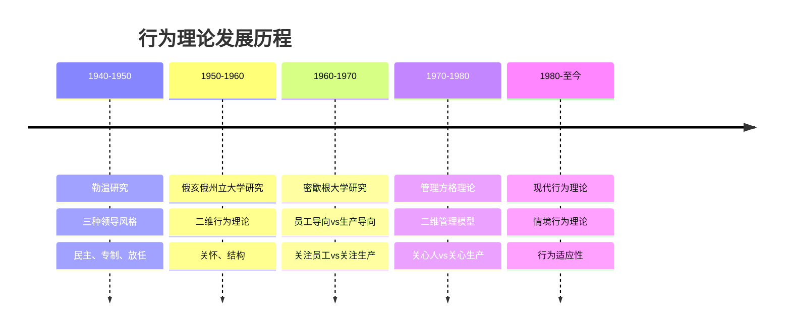
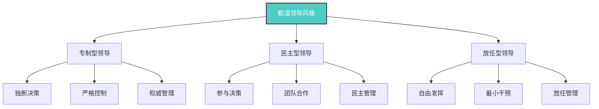
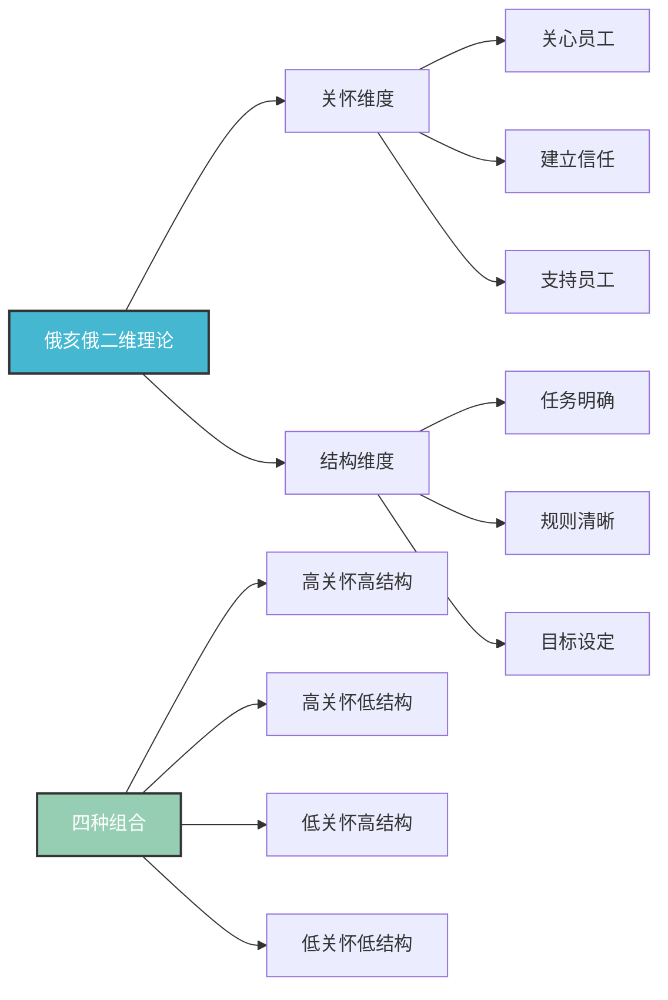
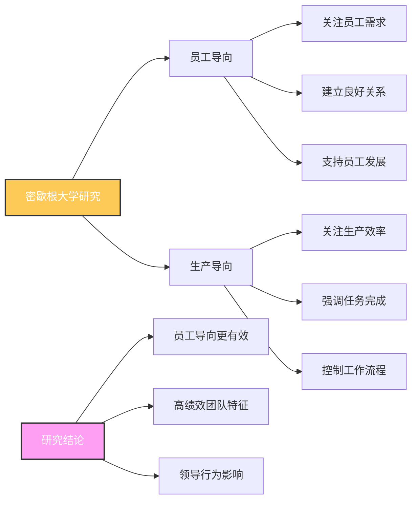
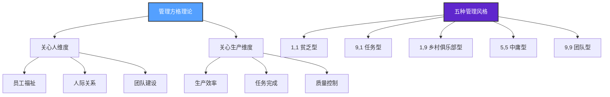
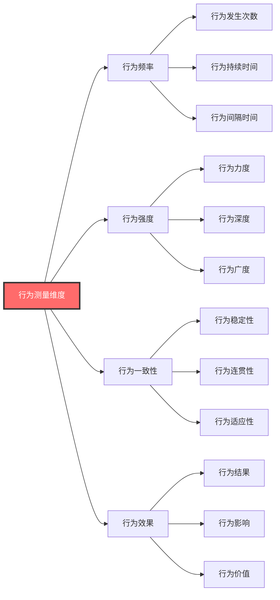
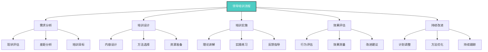

# 行为理论

## 🎯 理论概述

### 基本定义
**行为理论**（Behavioral Theory）是领导力研究的重要理论，认为领导效果取决于领导者的行为模式，而非个人特质。该理论强调领导行为可以通过学习和培训获得。

### 核心假设
- **行为论**：领导效果取决于行为模式
- **可学习论**：领导行为可以通过学习获得
- **效果导向**：关注行为与效果的关系
- **标准化论**：存在标准的有效领导行为

## 📚 理论发展历程

### 历史发展脉络

### 代表人物及贡献
| 学者 | 时期 | 主要贡献 | 核心观点 |
|------|------|----------|----------|
| **库尔特·勒温** | 1940s | 三种领导风格 | 民主、专制、放任三种风格 |
| **俄亥俄州立大学** | 1950s | 二维行为理论 | 关怀和结构两个维度 |
| **密歇根大学** | 1960s | 员工导向理论 | 员工导向vs生产导向 |
| **罗伯特·布莱克** | 1960s | 管理方格理论 | 关心人vs关心生产 |

## 🔍 核心理论分析

### 1. 勒温的领导风格理论

#### 三种风格对比
| 风格类型 | 决策方式 | 控制程度 | 员工参与 | 适用情境 |
|----------|----------|----------|----------|----------|
| **专制型** | 独断决策 | 严格控制 | 最低 | 紧急情况、危机处理 |
| **民主型** | 参与决策 | 适度控制 | 最高 | 常规工作、团队建设 |
| **放任型** | 自由决策 | 最小控制 | 中等 | 创意工作、专家团队 |

### 2. 俄亥俄州立大学二维理论

#### 二维行为分析
| 维度 | 定义 | 具体行为 | 重要性 | 发展方法 |
|------|------|----------|--------|----------|
| **关怀维度** | 关心员工福祉 | 倾听、支持、信任 | 高 | 情商培训、沟通技巧 |
| **结构维度** | 明确任务结构 | 计划、组织、控制 | 高 | 管理技能培训 |

### 3. 密歇根大学研究

#### 研究结论
| 结论类型 | 具体内容 | 支持证据 | 实践意义 |
|----------|----------|----------|----------|
| **员工导向优势** | 员工导向领导更有效 | 高绩效团队研究 | 重视员工关系 |
| **团队特征** | 高绩效团队特征 | 团队行为观察 | 团队建设指导 |
| **行为影响** | 领导行为影响团队 | 行为效果分析 | 行为改进方向 |

### 4. 管理方格理论

#### 五种管理风格
| 风格类型 | 坐标 | 特征 | 优势 | 劣势 | 适用情境 |
|----------|------|------|------|------|----------|
| **贫乏型** | (1,1) | 最小努力 | 压力小 | 效果差 | 临时性工作 |
| **任务型** | (9,1) | 重任务轻人 | 效率高 | 员工不满 | 紧急任务 |
| **乡村俱乐部型** | (1,9) | 重人轻任务 | 员工满意 | 效率低 | 创意工作 |
| **中庸型** | (5,5) | 平衡发展 | 稳定 | 缺乏突破 | 常规工作 |
| **团队型** | (9,9) | 高关心高生产 | 效果最佳 | 要求高 | 理想状态 |

## 📊 行为测量方法

### 测量工具
| 工具类型 | 具体工具 | 测量内容 | 适用对象 | 优缺点 |
|----------|----------|----------|----------|--------|
| **行为观察** | 行为观察量表 | 具体行为 | 所有层级 | 客观但耗时 |
| **问卷调查** | 领导行为问卷 | 行为频率 | 中高层 | 快速但主观 |
| **360度反馈** | 多源反馈 | 综合行为 | 所有层级 | 全面但复杂 |
| **访谈评估** | 结构化访谈 | 行为描述 | 高层 | 深入但成本高 |

### 测量维度

## 🎯 理论应用

### 领导培训
#### 培训内容
| 培训模块 | 具体内容 | 培训方法 | 培训时间 | 评估方式 |
|----------|----------|----------|----------|----------|
| **行为识别** | 识别有效行为 | 案例分析、行为观察 | 2天 | 行为测试 |
| **行为练习** | 练习有效行为 | 角色扮演、情景模拟 | 3天 | 行为评估 |
| **行为应用** | 应用有效行为 | 实践项目、导师指导 | 1个月 | 效果评估 |
| **行为改进** | 改进行为效果 | 反馈讨论、持续改进 | 持续 | 360度反馈 |

#### 培训流程

### 行为改进
#### 改进策略
| 改进类型 | 具体策略 | 实施方法 | 预期效果 | 注意事项 |
|----------|----------|----------|----------|----------|
| **行为强化** | 强化有效行为 | 正向激励、认可奖励 | 行为频率增加 | 避免过度依赖 |
| **行为替代** | 替代无效行为 | 行为训练、习惯养成 | 行为质量提升 | 需要时间适应 |
| **行为消除** | 消除不良行为 | 负向反馈、行为矫正 | 行为问题减少 | 注意方式方法 |
| **行为创新** | 创新行为模式 | 实验尝试、效果验证 | 行为效果优化 | 控制风险 |

## ⚖️ 理论评价

### 理论优势
| 优势 | 具体表现 | 价值意义 | 应用价值 |
|------|----------|----------|----------|
| **可操作性** | 行为具体可观察 | 便于培训应用 | 高 |
| **可测量性** | 行为可以量化 | 便于效果评估 | 高 |
| **可学习性** | 行为可以学习 | 便于能力发展 | 高 |
| **实用性** | 贴近实际工作 | 便于实践应用 | 高 |

### 理论局限
| 局限 | 具体表现 | 影响 | 改进方向 |
|------|----------|------|----------|
| **忽视情境** | 忽视环境因素 | 理论不完整 | 结合情境理论 |
| **行为标准化** | 忽视个体差异 | 适应性不足 | 个性化应用 |
| **因果关系** | 行为与效果关系不清 | 应用困难 | 加强实证研究 |
| **文化差异** | 忽视文化背景 | 跨文化适用性差 | 本土化研究 |

### 现代发展
#### 理论修正
- **情境因素**：考虑环境因素影响
- **个体差异**：关注个人特点
- **文化背景**：考虑文化差异
- **动态发展**：关注行为变化

#### 现代应用
- **领导培训**：用于领导能力培训
- **行为评估**：用于行为效果评估
- **团队建设**：用于团队行为优化
- **组织发展**：用于组织行为改进

## 🎓 费曼学习法应用

### 第一步：选择概念
选择"行为理论"这一核心概念

### 第二步：教授他人
用简单语言向他人解释：
- 行为理论就像学习驾驶，关注的是具体的驾驶行为，而不是驾驶员的个人特质

### 第三步：识别盲点
发现理解不足的地方：
- 如何识别有效的行为模式？
- 如何在不同情境下调整行为？

### 第四步：重新学习
回到资料重新学习盲点：
- 行为识别方法
- 情境适应性理论

### 第五步：简化表达
用更简洁的方式表达概念：
- 行为理论 = 有效行为 + 行为学习 + 行为应用

## 💡 刻意练习要点

### 练习目标
1. **明确目标**：识别有效领导行为
2. **专注练习**：重点练习薄弱行为
3. **即时反馈**：获得行为效果反馈
4. **走出舒适区**：挑战新的行为模式
5. **持续改进**：基于反馈不断优化

### 练习方法
| 练习类型 | 具体方法 | 实施步骤 | 评估标准 |
|----------|----------|----------|----------|
| **行为观察** | 观察有效行为 | 1.选择对象 2.记录行为 3.分析特点 4.总结规律 | 观察准确性 |
| **行为模仿** | 模仿有效行为 | 1.选择行为 2.观察细节 3.模仿练习 4.效果评估 | 模仿相似度 |
| **行为练习** | 练习特定行为 | 1.设定目标 2.制定计划 3.反复练习 4.效果评估 | 练习效果 |
| **行为应用** | 应用有效行为 | 1.选择情境 2.应用行为 3.观察效果 4.调整改进 | 应用效果 |

## 🔗 相关概念链接

### 基础概念
- [[01-基础认知层/01-领导力概述|领导力概述]] - 理解领导力本质
- [[01-基础认知层/02-管理者vs领导者|管理者vs领导者]] - 角色区分
- [[01-基础认知层/03-领导力发展历程|发展历程]] - 历史脉络

### 理论概念
- [[01-特质理论|特质理论]] - 早期理论
- [[03-情境理论|情境理论]] - 后续理论
- [[04-理论对比分析|理论对比]] - 综合分析

### 能力概念
- [[03-能力构建层/核心领导能力/03-沟通协调|沟通协调]] - 沟通能力
- [[03-能力构建层/核心领导能力/04-团队建设|团队建设]] - 团队能力

### 实践概念
- [[04-实践应用层/管理实践/01-团队管理|团队管理]] - 管理实践
- [[07-工具资源层/评估工具/02-360度反馈工具|360度反馈]] - 评估工具

## 💡 学习要点总结

### 关键理解
1. **行为重要性**：行为是领导效果的关键因素
2. **可学习性**：领导行为可以通过学习获得
3. **标准化**：存在标准的有效领导行为
4. **情境适应**：需要根据情境调整行为

### 实践应用
1. **行为识别**：识别有效的领导行为
2. **行为学习**：学习有效的领导行为
3. **行为应用**：在工作中应用有效行为
4. **行为改进**：持续改进领导行为

### 思考问题
1. 你认为哪些领导行为最有效？
2. 如何学习和发展领导行为？
3. 如何在不同情境下调整行为？
4. 如何评估和改进领导行为？

---

**下一步**：[[03-情境理论|情境理论]] | [[04-理论对比分析|理论对比]]
