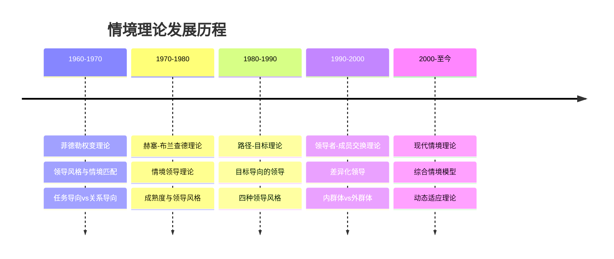
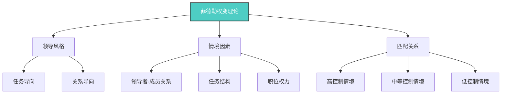
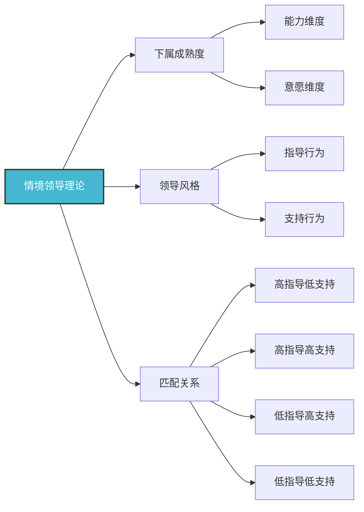
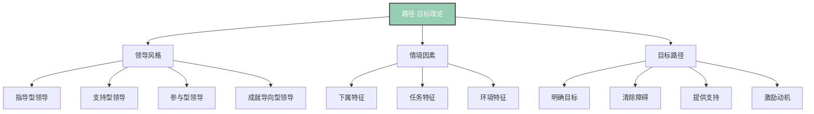
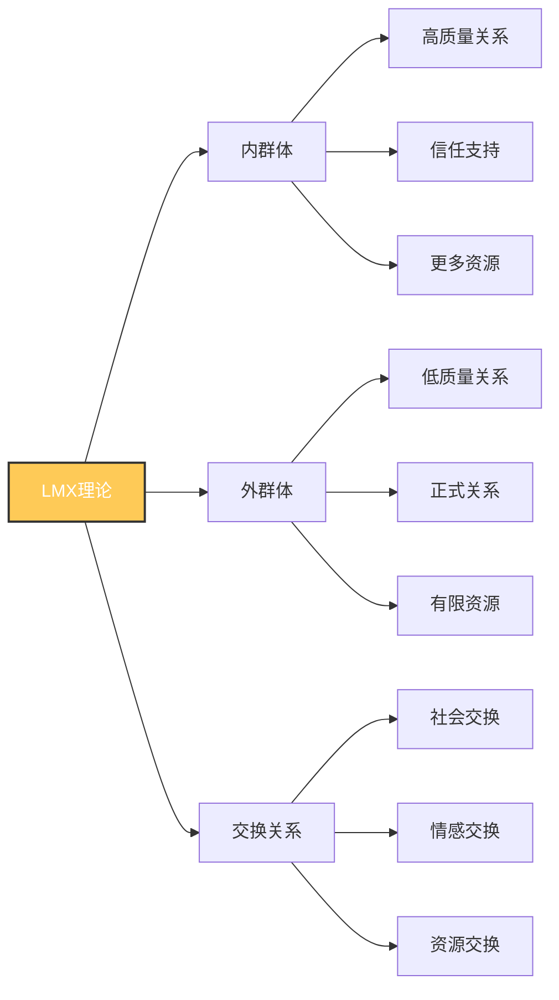
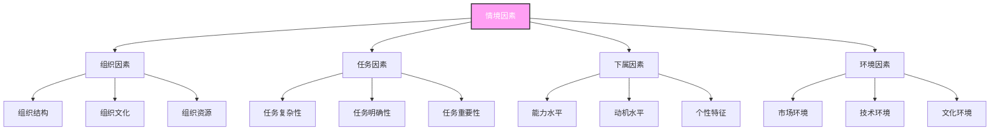
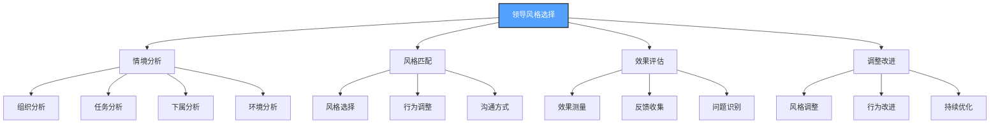

# 情境理论

## 🎯 理论概述

### 基本定义
**情境理论**（Situational Theory）是领导力研究的重要理论，认为领导效果取决于领导者、追随者和情境三者的相互作用。该理论强调领导风格需要根据具体情境进行调整。

### 核心假设
- **情境论**：领导效果取决于情境因素
- **适应性论**：领导风格需要适应情境
- **动态论**：领导行为需要动态调整
- **综合论**：考虑多种因素的综合影响

## 📚 理论发展历程

### 历史发展脉络

### 代表人物及贡献
| 学者 | 时期 | 主要贡献 | 核心观点 |
|------|------|----------|----------|
| **弗雷德·菲德勒** | 1960s | 权变理论 | 领导风格与情境匹配 |
| **保罗·赫塞** | 1970s | 情境领导理论 | 成熟度与领导风格 |
| **肯·布兰查德** | 1970s | 情境领导理论 | 四种领导风格 |
| **罗伯特·豪斯** | 1970s | 路径-目标理论 | 目标导向的领导 |

## 🔍 核心理论分析

### 1. 菲德勒权变理论

#### 情境控制分析
| 情境类型 | 控制程度 | 特征 | 适用领导风格 | 领导行为 |
|----------|----------|------|-------------|----------|
| **高控制** | 高 | 关系好、任务明确、权力大 | 任务导向 | 直接指导、明确指令 |
| **中等控制** | 中 | 关系一般、任务一般、权力一般 | 关系导向 | 参与决策、团队合作 |
| **低控制** | 低 | 关系差、任务模糊、权力小 | 任务导向 | 结构化指导、明确目标 |

### 2. 赫塞-布兰查德情境领导理论

#### 四种领导风格
| 风格类型 | 指导行为 | 支持行为 | 适用成熟度 | 领导行为 |
|----------|----------|----------|------------|----------|
| **指导型** | 高 | 低 | 低成熟度 | 明确指令、密切监督 |
| **教练型** | 高 | 高 | 中低成熟度 | 解释决策、提供支持 |
| **支持型** | 低 | 高 | 中高成熟度 | 参与决策、鼓励创新 |
| **授权型** | 低 | 低 | 高成熟度 | 授权决策、自主管理 |

### 3. 路径-目标理论

#### 四种领导风格
| 风格类型 | 特征 | 适用情境 | 领导行为 |
|----------|------|----------|----------|
| **指导型** | 明确目标路径 | 任务模糊、下属经验不足 | 明确指令、设定目标 |
| **支持型** | 关心下属福祉 | 任务单调、下属压力大 | 提供支持、关心需求 |
| **参与型** | 参与决策过程 | 任务复杂、下属能力强 | 征求意见、共同决策 |
| **成就导向型** | 设定挑战目标 | 任务挑战、下属有潜力 | 设定高标准、激励挑战 |

### 4. 领导者-成员交换理论

#### 交换关系分析
| 关系类型 | 特征 | 交换内容 | 影响效果 |
|----------|------|----------|----------|
| **内群体** | 高质量关系 | 信任、支持、资源 | 高绩效、高满意度 |
| **外群体** | 低质量关系 | 正式、有限、规则 | 低绩效、低满意度 |

## 📊 情境因素分析

### 主要情境因素

### 情境评估方法
| 评估维度 | 评估内容 | 评估方法 | 评估工具 |
|----------|----------|----------|----------|
| **组织成熟度** | 组织发展阶段 | 组织分析 | 成熟度模型 |
| **任务特征** | 任务复杂程度 | 任务分析 | 任务特征量表 |
| **下属成熟度** | 下属能力意愿 | 能力评估 | 成熟度评估表 |
| **环境稳定性** | 环境变化程度 | 环境分析 | 环境评估框架 |

## 🎯 理论应用

### 领导风格选择
#### 选择框架

### 情境适应策略
| 情境类型 | 适应策略 | 具体方法 | 实施要点 |
|----------|----------|----------|----------|
| **高控制情境** | 任务导向 | 明确指令、密切监督 | 提高效率、确保质量 |
| **中等控制情境** | 关系导向 | 参与决策、团队合作 | 激发创意、增强凝聚力 |
| **低控制情境** | 任务导向 | 结构化指导、明确目标 | 提供方向、建立信心 |
| **变化情境** | 灵活适应 | 动态调整、快速响应 | 保持敏感、及时调整 |

## ⚖️ 理论评价

### 理论优势
| 优势 | 具体表现 | 价值意义 | 应用价值 |
|------|----------|----------|----------|
| **情境适应性** | 考虑环境因素 | 提高领导效果 | 高 |
| **动态调整** | 支持灵活调整 | 适应变化需求 | 高 |
| **综合视角** | 考虑多种因素 | 理论更完整 | 中 |
| **实用性强** | 贴近实际工作 | 便于实践应用 | 高 |

### 理论局限
| 局限 | 具体表现 | 影响 | 改进方向 |
|------|----------|------|----------|
| **复杂性高** | 情境识别困难 | 应用复杂 | 简化模型 |
| **测量困难** | 情境难以量化 | 评估困难 | 开发测量工具 |
| **成本较高** | 需要持续调整 | 应用成本高 | 提高效率 |
| **文化差异** | 忽视文化背景 | 跨文化适用性差 | 本土化研究 |

### 现代发展
#### 理论修正
- **简化模型**：简化情境分析
- **测量工具**：开发情境测量工具
- **文化适应**：考虑文化差异
- **技术融合**：结合现代技术

#### 现代应用
- **领导培训**：用于领导能力培训
- **团队管理**：用于团队情境管理
- **组织发展**：用于组织情境适应
- **变革管理**：用于变革情境领导

## 🎓 费曼学习法应用

### 第一步：选择概念
选择"情境理论"这一核心概念

### 第二步：教授他人
用简单语言向他人解释：
- 情境理论就像选择合适的衣服，需要根据天气、场合、活动来选择不同的服装

### 第三步：识别盲点
发现理解不足的地方：
- 如何准确识别情境？
- 如何快速调整领导风格？

### 第四步：重新学习
回到资料重新学习盲点：
- 情境识别方法
- 风格调整技巧

### 第五步：简化表达
用更简洁的方式表达概念：
- 情境理论 = 情境分析 + 风格选择 + 动态调整

## 💡 刻意练习要点

### 练习目标
1. **明确目标**：掌握情境识别技能
2. **专注练习**：重点练习风格调整
3. **即时反馈**：获得调整效果反馈
4. **走出舒适区**：挑战复杂情境应对
5. **持续改进**：基于反馈不断优化

### 练习方法
| 练习类型 | 具体方法 | 实施步骤 | 评估标准 |
|----------|----------|----------|----------|
| **情境分析** | 分析不同情境 | 1.识别情境 2.分析特征 3.选择风格 4.评估效果 | 分析准确性 |
| **风格切换** | 练习风格调整 | 1.设定情境 2.选择风格 3.实施行为 4.效果评估 | 切换灵活性 |
| **情境模拟** | 模拟复杂情境 | 1.设定情境 2.角色扮演 3.风格调整 4.反思总结 | 应对能力 |
| **案例分析** | 分析实际案例 | 1.选择案例 2.分析情境 3.评估风格 4.总结规律 | 分析深度 |

## 🔗 相关概念链接

### 基础概念
- [[01-基础认知层/01-领导力概述|领导力概述]] - 理解领导力本质
- [[01-基础认知层/02-管理者vs领导者|管理者vs领导者]] - 角色区分
- [[01-基础认知层/04-现代领导力挑战|现代挑战]] - 现代背景

### 理论概念
- [[01-特质理论|特质理论]] - 早期理论
- [[02-行为理论|行为理论]] - 行为理论
- [[04-理论对比分析|理论对比]] - 综合分析

### 能力概念
- [[03-能力构建层/核心领导能力/01-战略思维|战略思维]] - 战略能力
- [[03-能力构建层/核心领导能力/02-决策能力|决策能力]] - 决策能力
- [[03-能力构建层/核心领导能力/06-情商与自我管理|情商管理]] - 情商能力

### 实践概念
- [[04-实践应用层/管理实践/01-团队管理|团队管理]] - 管理实践
- [[04-实践应用层/特殊情境/01-跨文化领导|跨文化领导]] - 特殊情境

## 💡 学习要点总结

### 关键理解
1. **情境重要性**：情境是领导效果的关键因素
2. **适应性要求**：领导风格需要适应情境
3. **动态调整**：需要根据情境变化调整风格
4. **综合考虑**：需要综合考虑多种因素

### 实践应用
1. **情境识别**：准确识别当前情境
2. **风格选择**：选择合适的领导风格
3. **动态调整**：根据情境变化调整风格
4. **效果评估**：评估调整效果并改进

### 思考问题
1. 如何准确识别不同的领导情境？
2. 如何快速调整领导风格？
3. 如何平衡不同情境的需求？
4. 如何提高情境适应能力？

---

**下一步**：[[04-理论对比分析|理论对比]] | [[02-理论理解层/现代领导理论/01-变革型领导|变革型领导]]
