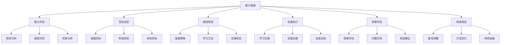
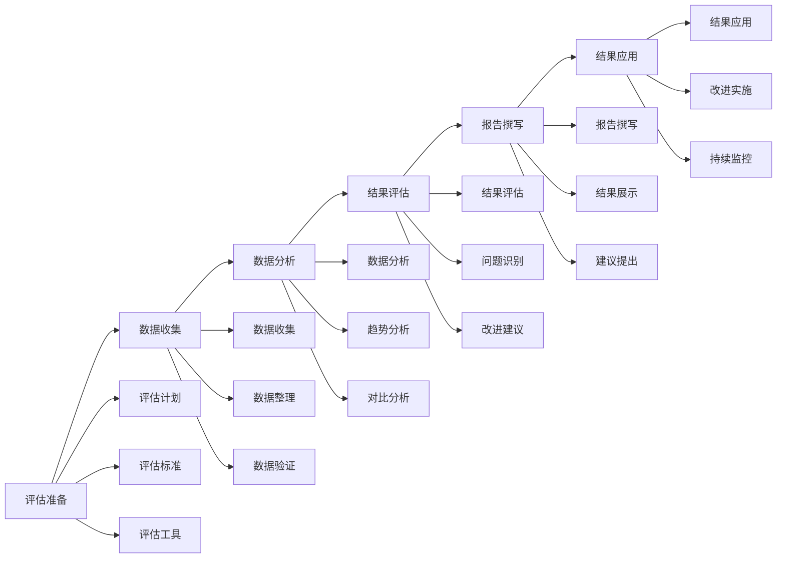
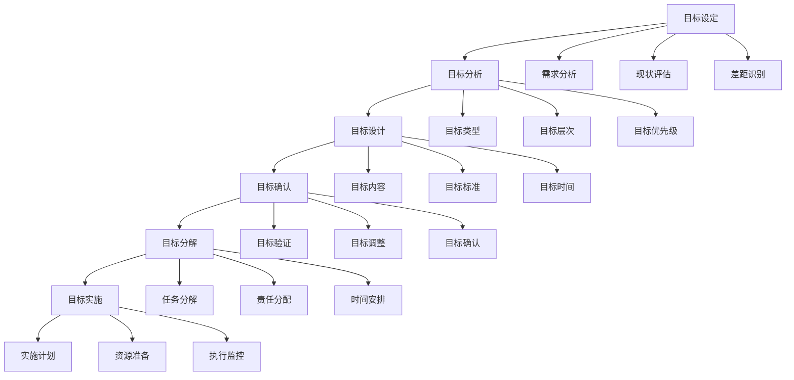
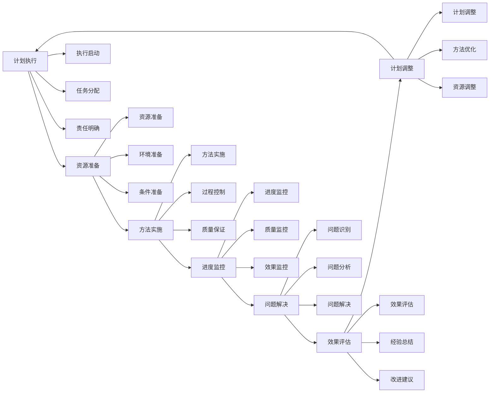
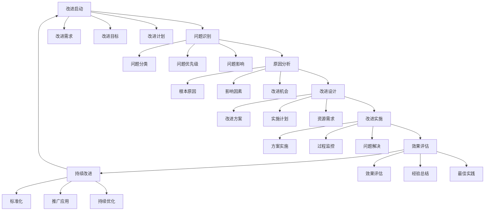

# 能力发展路径

## 🎯 核心概念

### 能力发展路径定义
**能力发展路径**是指领导者根据自身现状、发展目标和组织需求，制定系统性的能力提升计划，通过阶段性学习和实践，实现领导能力持续发展的过程。

### 核心特征
- **系统性**：系统规划能力发展
- **阶段性**：分阶段实施发展
- **个性化**：根据个人特点定制
- **持续性**：持续学习和提升

## 📚 能力发展理论框架

### 能力发展模型

### 能力发展层次
| 发展层次 | 特征 | 发展重点 | 评估标准 |
|----------|------|----------|----------|
| **基础层** | 基本技能掌握 | 技能学习 | 技能熟练度 |
| **应用层** | 技能应用能力 | 实践应用 | 应用效果 |
| **整合层** | 技能整合能力 | 综合应用 | 整合效果 |
| **创新层** | 技能创新能力 | 创新发展 | 创新成果 |

## 🔍 能力评估

### 评估维度
#### 核心领导能力
| 能力维度 | 具体内容 | 评估方法 | 权重 |
|----------|----------|----------|------|
| **战略思维** | 系统思维、前瞻思维 | 案例分析 | 20% |
| **决策能力** | 决策质量、决策效率 | 决策测试 | 20% |
| **沟通协调** | 沟通效果、协调能力 | 360度评估 | 20% |
| **团队建设** | 团队管理、团队发展 | 团队评估 | 20% |
| **变革管理** | 变革推动、变革控制 | 变革评估 | 20% |

#### 个人发展能力
| 能力维度 | 具体内容 | 评估方法 | 权重 |
|----------|----------|----------|------|
| **学习能力** | 学习意愿、学习效果 | 学习评估 | 25% |
| **适应能力** | 环境适应、变化适应 | 适应测试 | 25% |
| **创新能力** | 创新思维、创新实践 | 创新评估 | 25% |
| **领导能力** | 领导效果、影响力 | 领导评估 | 25% |

### 评估工具
#### 综合评估工具
| 工具类型 | 具体工具 | 使用场景 | 评估标准 |
|----------|----------|----------|----------|
| **自评工具** | 自我评估表、能力问卷 | 自我了解 | 准确性 |
| **他评工具** | 360度评估、同事评估 | 客观评估 | 客观性 |
| **测试工具** | 能力测试、情境测试 | 专业评估 | 专业性 |
| **观察工具** | 行为观察、绩效观察 | 行为评估 | 客观性 |

#### 评估流程

## 🎯 目标设定

### 目标类型
#### 按时间分类
| 目标类型 | 时间框架 | 具体内容 | 设定要点 |
|----------|----------|----------|----------|
| **短期目标** | 3-6个月 | 具体技能、 immediate improvement | 可达成性 |
| **中期目标** | 6-18个月 | 能力提升、 career development | 挑战性 |
| **长期目标** | 18个月以上 | 职业发展、 leadership growth | 激励性 |

#### 按内容分类
| 目标类型 | 具体内容 | 设定方法 | 评估标准 |
|----------|----------|----------|----------|
| **技能目标** | 专业技能、领导技能 | 技能分析 | 技能水平 |
| **知识目标** | 专业知识、管理知识 | 知识分析 | 知识水平 |
| **经验目标** | 实践经验、领导经验 | 经验分析 | 经验丰富度 |
| **关系目标** | 人际关系、网络关系 | 关系分析 | 关系质量 |

### 目标设定原则
#### SMART原则
| 原则 | 具体内容 | 实施方法 | 评估标准 |
|------|----------|----------|----------|
| **S-Specific** | 具体明确 | 目标细化 | 明确度 |
| **M-Measurable** | 可测量 | 量化指标 | 可测量性 |
| **A-Achievable** | 可达成 | 现实评估 | 可达成性 |
| **R-Relevant** | 相关性 | 目标关联 | 相关性 |
| **T-Time-bound** | 时限性 | 时间设定 | 时限性 |

#### 目标设定流程

## 📊 路径规划

### 发展策略
#### 策略类型
| 策略类型 | 具体内容 | 适用场景 | 实施要点 |
|----------|----------|----------|----------|
| **渐进式策略** | 逐步提升、稳步发展 | 基础薄弱 | 循序渐进 |
| **突破式策略** | 重点突破、快速提升 | 关键能力 | 集中资源 |
| **平衡式策略** | 全面发展、平衡提升 | 综合发展 | 平衡发展 |
| **个性化策略** | 个性定制、特色发展 | 特殊需求 | 个性发展 |

#### 策略选择
| 选择因素 | 具体内容 | 权重 | 选择标准 |
|----------|----------|------|----------|
| **个人特点** | 性格、兴趣、能力 | 30% | 匹配度 |
| **发展目标** | 职业目标、发展目标 | 25% | 目标一致性 |
| **组织需求** | 组织要求、岗位需求 | 25% | 需求匹配度 |
| **资源条件** | 时间、资金、机会 | 20% | 可行性 |

### 学习方法
#### 学习类型
| 学习类型 | 具体内容 | 适用场景 | 学习效果 |
|----------|----------|----------|----------|
| **理论学习** | 知识学习、理论掌握 | 基础建设 | 知识水平 |
| **实践学习** | 技能实践、经验积累 | 能力提升 | 实践能力 |
| **反思学习** | 经验反思、总结提升 | 深度发展 | 反思能力 |
| **协作学习** | 团队学习、相互学习 | 团队发展 | 协作能力 |

#### 学习方法
| 方法类型 | 具体方法 | 实施要点 | 效果评估 |
|----------|----------|----------|----------|
| **自主学习** | 自我学习、自我管理 | 主动性 | 学习效果 |
| **指导学习** | 导师指导、专家指导 | 专业性 | 指导质量 |
| **团队学习** | 团队协作、集体学习 | 协作性 | 团队效果 |
| **项目学习** | 项目实践、任务学习 | 实践性 | 项目成果 |

### 实践机会
#### 机会类型
| 机会类型 | 具体内容 | 获取方法 | 利用要点 |
|----------|----------|----------|----------|
| **工作实践** | 日常工作、岗位实践 | 工作安排 | 主动承担 |
| **项目实践** | 项目参与、项目管理 | 项目申请 | 积极参与 |
| **团队实践** | 团队管理、团队建设 | 团队机会 | 主动参与 |
| **跨部门实践** | 跨部门合作、协调 | 合作机会 | 主动协调 |

#### 机会创造
| 创造方法 | 具体内容 | 实施要点 | 效果评估 |
|----------|----------|----------|----------|
| **主动争取** | 主动申请、积极争取 | 主动性 | 争取成功率 |
| **能力展示** | 展示能力、获得认可 | 能力展示 | 认可程度 |
| **关系建设** | 建立关系、获得支持 | 关系建设 | 支持程度 |
| **创新实践** | 创新想法、实践机会 | 创新性 | 创新成果 |

## 📈 实施执行

### 执行计划
#### 计划要素
| 计划要素 | 具体内容 | 制定方法 | 执行要点 |
|----------|----------|----------|----------|
| **时间安排** | 学习时间、实践时间 | 时间规划 | 时间管理 |
| **资源准备** | 学习资源、实践资源 | 资源规划 | 资源利用 |
| **方法选择** | 学习方法、实践方法 | 方法选择 | 方法效果 |
| **进度控制** | 进度监控、进度调整 | 进度管理 | 进度达成 |

#### 执行流程

### 执行监控
#### 监控维度
| 监控维度 | 具体内容 | 监控方法 | 监控标准 |
|----------|----------|----------|----------|
| **进度监控** | 学习进度、实践进度 | 进度跟踪 | 时间标准 |
| **质量监控** | 学习质量、实践质量 | 质量评估 | 质量标准 |
| **效果监控** | 学习效果、实践效果 | 效果评估 | 效果标准 |
| **资源监控** | 资源利用、资源效率 | 资源分析 | 效率标准 |

#### 监控工具
| 工具类型 | 具体工具 | 使用场景 | 使用要点 |
|----------|----------|----------|----------|
| **进度工具** | 进度表、甘特图 | 进度管理 | 及时更新 |
| **质量工具** | 质量检查表、评估表 | 质量管理 | 定期检查 |
| **效果工具** | 效果评估表、反馈表 | 效果管理 | 客观评估 |
| **资源工具** | 资源使用表、效率表 | 资源管理 | 合理利用 |

## 📊 效果评估

### 评估维度
| 评估维度 | 具体内容 | 评估方法 | 权重 |
|----------|----------|----------|------|
| **目标达成** | 目标完成度、效果达成 | 目标评估 | 30% |
| **能力提升** | 能力水平、技能提升 | 能力评估 | 30% |
| **学习效果** | 学习成果、知识掌握 | 学习评估 | 20% |
| **实践效果** | 实践成果、经验积累 | 实践评估 | 20% |

### 评估方法
#### 评估工具
| 工具类型 | 具体工具 | 使用场景 | 评估标准 |
|----------|----------|----------|----------|
| **定量评估** | 数据指标、统计分析 | 客观评估 | 准确性 |
| **定性评估** | 访谈、观察、分析 | 主观评估 | 全面性 |
| **综合评估** | 定量定性结合 | 全面评估 | 综合性 |
| **对比评估** | 前后对比、横向对比 | 比较评估 | 可比性 |

#### 评估流程

## 🔄 持续改进

### 改进策略
#### 策略类型
| 策略类型 | 具体内容 | 实施方法 | 预期效果 |
|----------|----------|----------|----------|
| **路径调整** | 调整发展路径 | 路径优化 | 路径优化 |
| **方法改进** | 改进学习方法 | 方法优化 | 方法效果 |
| **资源优化** | 优化资源配置 | 资源调整 | 资源效率 |
| **目标调整** | 调整发展目标 | 目标修正 | 目标达成 |

#### 改进流程

## 🔗 相关概念链接

### 基础概念
- [[01-基础认知层/01-领导力概述|领导力概述]]
- [[01-基础认知层/04-现代领导力挑战|现代挑战]]
- [[02-理论理解层/现代领导理论/01-变革型领导|变革型领导]]

### 理论概念
- [[02-理论理解层/现代领导理论/02-服务型领导|服务型领导]]
- [[02-理论理解层/现代领导理论/03-分布式领导|分布式领导]]

### 能力概念
- [[01-战略思维|战略思维]]
- [[02-决策能力|决策能力]]
- [[03-沟通协调|沟通协调]]

### 实践概念
- [[05-发展提升层/自我发展/01-自我认知与评估|自我认知]]
- [[05-发展提升层/自我发展/02-学习与发展路径|学习路径]]

## 💡 学习要点总结

### 关键理解
1. **系统规划**：系统规划能力发展路径
2. **目标导向**：以目标为导向制定发展计划
3. **方法多样**：运用多种学习方法
4. **持续改进**：持续评估和改进

### 实践应用
1. **能力评估**：全面评估自身能力
2. **目标设定**：设定明确的发展目标
3. **路径规划**：制定个性化发展路径
4. **持续改进**：持续评估和改进

### 思考问题
1. 如何制定个性化的能力发展路径？
2. 如何平衡不同能力的发展？
3. 如何评估能力发展效果？
4. 如何持续改进发展路径？

---

**下一步**：[[08-领导力测量与评估|测量评估]] | [[04-实践应用层/管理实践/01-团队管理|团队管理]]

