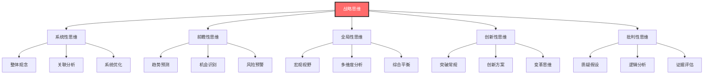
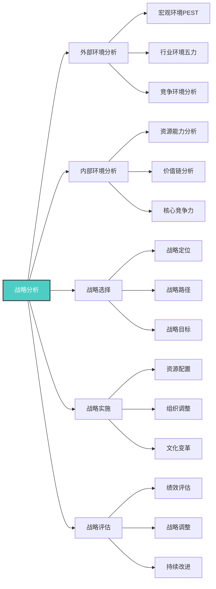
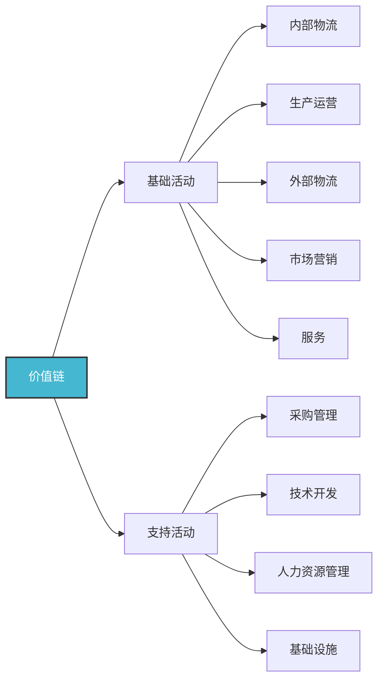
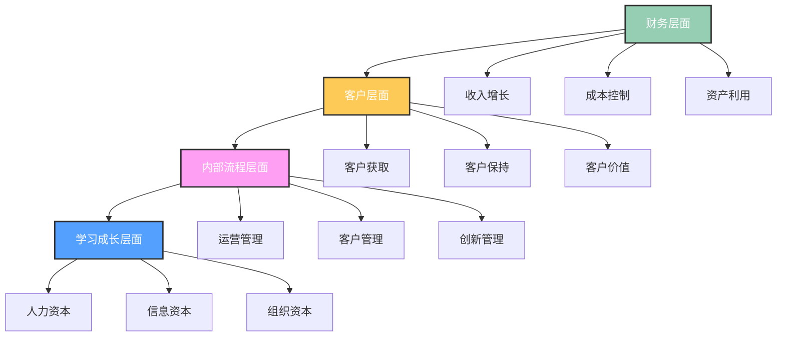
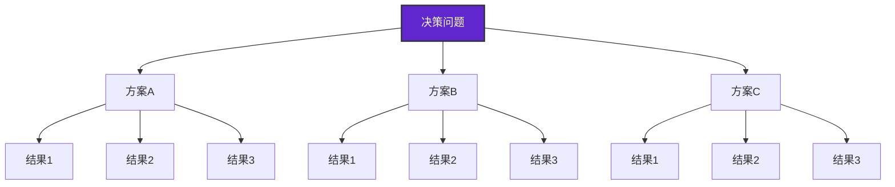
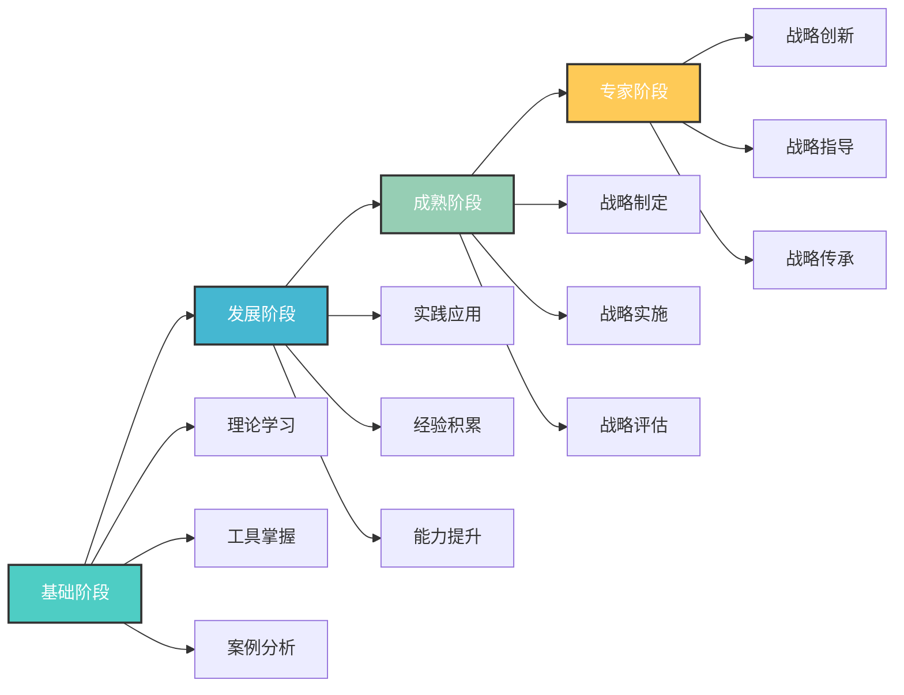
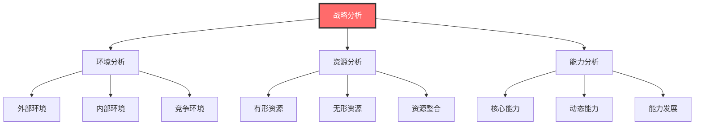
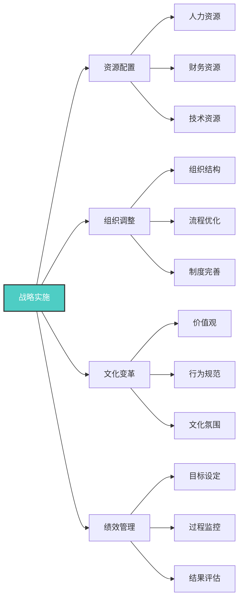

# 战略思维

## 🎯 核心概念理解

### 基本定义
**战略思维**（Strategic Thinking）是领导者运用系统性、前瞻性、全局性的思维方式，分析复杂环境，制定长远目标，并统筹资源配置以实现组织愿景的综合思维能力。

### 核心特征

## 📚 战略思维框架

### 战略分析框架

### 外部环境分析（PEST分析）
| 分析维度 | 具体内容 | 关键要素 | 分析方法 |
|----------|----------|----------|----------|
| **政治环境** | 政策法规、政治稳定性 | 政策变化、法规影响 | 政策分析、法规研究 |
| **经济环境** | 经济周期、市场状况 | 经济增长、通胀水平 | 经济指标、市场分析 |
| **社会环境** | 人口结构、文化变迁 | 人口变化、价值观念 | 社会调查、文化分析 |
| **技术环境** | 技术发展、创新趋势 | 技术进步、创新机会 | 技术跟踪、趋势分析 |

### 内部环境分析
#### 资源能力分析
| 资源类型 | 具体内容 | 评估标准 | 分析方法 |
|----------|----------|----------|----------|
| **人力资源** | 人才结构、能力水平 | 数量、质量、结构 | 人才盘点、能力评估 |
| **财务资源** | 资金状况、盈利能力 | 流动性、盈利性 | 财务分析、比率分析 |
| **技术资源** | 技术水平、创新能力 | 先进性、适用性 | 技术评估、创新分析 |
| **品牌资源** | 品牌价值、市场地位 | 知名度、美誉度 | 品牌评估、市场调研 |

#### 价值链分析

## 🎯 战略思维工具

### 战略规划工具
#### SWOT分析
| 分析维度 | 定义 | 关键问题 | 分析要点 |
|----------|------|----------|----------|
| **优势(S)** | 内部优势 | 我们有什么优势？ | 核心竞争力、独特资源 |
| **劣势(W)** | 内部劣势 | 我们有什么不足？ | 资源不足、能力欠缺 |
| **机会(O)** | 外部机会 | 市场有什么机会？ | 市场趋势、政策支持 |
| **威胁(T)** | 外部威胁 | 面临什么威胁？ | 竞争加剧、环境变化 |

#### 战略地图

### 决策分析工具
#### 决策树分析

#### 情景分析
| 情景类型 | 特征 | 概率 | 应对策略 |
|----------|------|------|----------|
| **乐观情景** | 环境有利、机会多 | 30% | 积极扩张、抢占市场 |
| **基准情景** | 环境正常、稳定发展 | 50% | 稳步发展、持续改进 |
| **悲观情景** | 环境不利、挑战多 | 20% | 保守策略、风险控制 |

## 📊 战略思维能力

### 核心能力维度
#### 1. 环境感知能力
| 能力要素 | 具体表现 | 发展方法 | 评估标准 |
|----------|----------|----------|----------|
| **趋势识别** | 识别市场趋势 | 趋势分析培训 | 趋势预测准确性 |
| **机会把握** | 把握市场机会 | 机会识别练习 | 机会识别数量 |
| **风险预警** | 预警潜在风险 | 风险分析培训 | 风险预警及时性 |

#### 2. 系统分析能力
| 能力要素 | 具体表现 | 发展方法 | 评估标准 |
|----------|----------|----------|----------|
| **整体思维** | 从整体角度思考 | 系统思维培训 | 分析全面性 |
| **关联分析** | 分析要素关联 | 关联分析练习 | 关联识别准确性 |
| **系统优化** | 优化系统结构 | 系统优化培训 | 优化效果 |

#### 3. 创新思维能力
| 能力要素 | 具体表现 | 发展方法 | 评估标准 |
|----------|----------|----------|----------|
| **突破思维** | 突破常规思维 | 创新思维培训 | 创新方案数量 |
| **方案设计** | 设计创新方案 | 方案设计练习 | 方案可行性 |
| **变革推动** | 推动组织变革 | 变革管理培训 | 变革成功率 |

### 能力发展路径

## 🎯 战略思维应用

### 战略制定流程
#### 1. 战略分析阶段

#### 2. 战略选择阶段
| 选择维度 | 具体内容 | 选择标准 | 实施要点 |
|----------|----------|----------|----------|
| **战略定位** | 市场定位、价值定位 | 差异化、可持续性 | 明确目标、清晰定位 |
| **战略路径** | 发展路径、实现方式 | 可行性、风险性 | 路径清晰、风险可控 |
| **战略目标** | 长期目标、短期目标 | 挑战性、可实现性 | 目标明确、指标清晰 |

#### 3. 战略实施阶段

### 战略评估体系
#### 评估维度
| 评估维度 | 具体指标 | 权重 | 评估方法 |
|----------|----------|------|----------|
| **财务绩效** | 收入增长、利润率 | 40% | 财务分析 |
| **市场地位** | 市场份额、品牌价值 | 30% | 市场调研 |
| **创新能力** | 创新投入、创新产出 | 20% | 创新评估 |
| **组织能力** | 员工满意度、组织效率 | 10% | 组织评估 |

## 🎓 费曼学习法应用

### 第一步：选择概念
选择"战略思维"这一核心概念

### 第二步：教授他人
用简单语言向他人解释：
- 战略思维就像下棋，需要看全局、想长远、算多步，而不是只看眼前的一步

### 第三步：识别盲点
发现理解不足的地方：
- 如何平衡短期利益与长期发展？
- 如何在不同情境下调整战略？

### 第四步：重新学习
回到资料重新学习盲点：
- 战略平衡方法
- 情境适应性理论

### 第五步：简化表达
用更简洁的方式表达概念：
- 战略思维 = 系统分析 + 前瞻思考 + 全局统筹 + 创新突破

## 💡 刻意练习要点

### 练习目标
1. **明确目标**：掌握战略思维核心要素
2. **专注练习**：重点练习薄弱环节
3. **即时反馈**：获得分析效果反馈
4. **走出舒适区**：挑战复杂战略问题
5. **持续改进**：基于反馈不断优化

### 练习方法
| 练习类型 | 具体方法 | 实施步骤 | 评估标准 |
|----------|----------|----------|----------|
| **案例分析** | 分析战略案例 | 1.选择案例 2.环境分析 3.战略制定 4.效果评估 | 分析深度 |
| **情景模拟** | 模拟战略决策 | 1.设定情景 2.信息收集 3.方案制定 4.决策选择 | 决策质量 |
| **工具应用** | 应用战略工具 | 1.选择工具 2.数据收集 3.工具应用 4.结果分析 | 工具熟练度 |
| **战略制定** | 制定战略方案 | 1.环境分析 2.战略选择 3.实施计划 4.评估体系 | 方案可行性 |

## 🔗 相关概念链接

### 基础概念
- [[01-基础认知层/01-领导力概述|领导力概述]] - 理解领导力本质
- [[01-基础认知层/04-现代领导力挑战|现代挑战]] - 现代背景
- [[01-基础认知层/05-领导力伦理与价值观|伦理价值观]] - 价值基础

### 理论概念
- [[02-理论理解层/现代领导理论/01-变革型领导|变革型领导]] - 变革理论
- [[02-理论理解层/现代领导理论/03-分布式领导|分布式领导]] - 分布理论

### 能力概念
- [[02-决策能力|决策能力]] - 决策能力
- [[05-变革管理|变革管理]] - 变革能力
- [[03-沟通协调|沟通协调]] - 沟通能力

### 实践概念
- [[04-实践应用层/管理实践/02-组织文化建设|组织文化]] - 文化建设
- [[04-实践应用层/特殊情境/02-数字化转型领导|数字化转型]] - 数字化实践

## 💡 学习要点总结

### 关键理解
1. **系统思维**：从整体角度分析问题
2. **前瞻思维**：预测未来趋势和变化
3. **全局思维**：统筹考虑各种因素
4. **创新思维**：突破常规寻找新方案

### 实践应用
1. **环境分析**：运用工具分析内外部环境
2. **战略制定**：制定清晰可行的战略
3. **战略实施**：有效实施战略计划
4. **战略评估**：持续评估和调整战略

### 思考问题
1. 如何培养战略思维能力？
2. 战略思维在组织发展中的作用？
3. 如何平衡战略与执行的关系？
4. 战略思维如何适应快速变化的环境？

---

**下一步**：[[02-决策能力|决策能力]] | [[03-沟通协调|沟通协调]]
