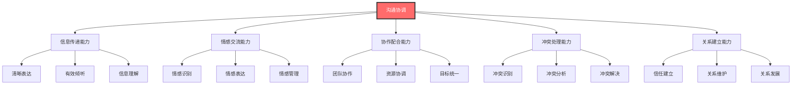
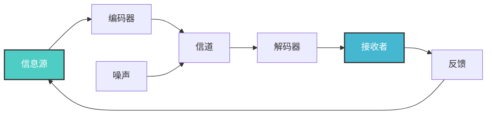
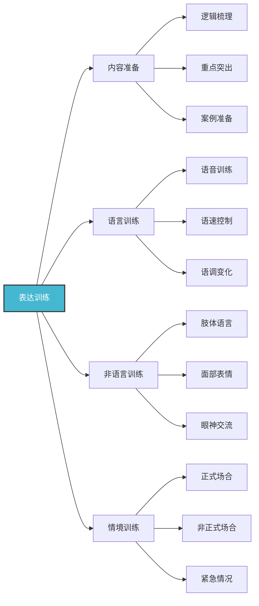
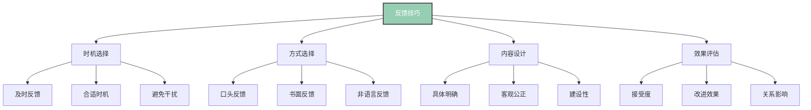
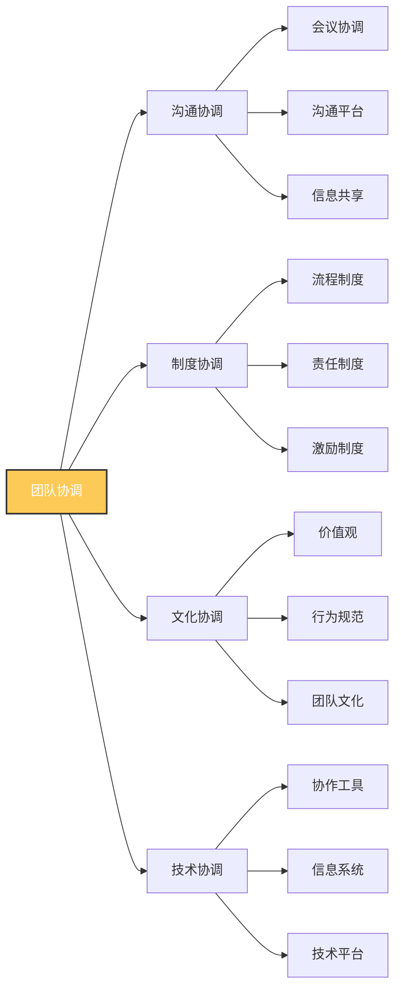
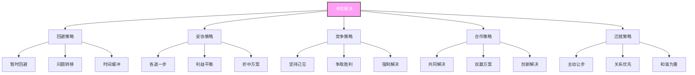
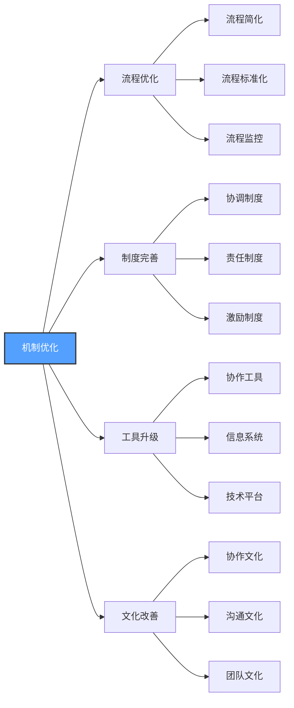

# 沟通协调

## 🎯 核心概念理解

### 基本定义
**沟通协调**（Communication and Coordination）是领导者通过有效的信息传递、情感交流和协作配合，建立良好的人际关系，促进团队合作，实现组织目标的核心能力。

### 核心特征

## 📚 沟通理论框架

### 沟通模型
#### 香农-韦弗模型

#### 沟通要素分析
| 沟通要素 | 定义 | 重要性 | 影响因素 |
|----------|------|--------|----------|
| **信息源** | 信息的发送者 | 高 | 可信度、权威性 |
| **信息** | 传递的内容 | 高 | 清晰度、相关性 |
| **编码** | 信息转换过程 | 中 | 语言能力、表达能力 |
| **信道** | 信息传递媒介 | 中 | 技术条件、环境因素 |
| **解码** | 信息理解过程 | 高 | 理解能力、背景知识 |
| **接收者** | 信息的接收者 | 高 | 注意力、理解力 |
| **反馈** | 信息回应 | 高 | 及时性、准确性 |

### 沟通类型分类
#### 按沟通方向分类
| 沟通类型 | 特征 | 优势 | 劣势 | 适用情境 |
|----------|------|------|------|----------|
| **下行沟通** | 上级向下级 | 权威性强 | 信息失真 | 指令传达 |
| **上行沟通** | 下级向上级 | 信息真实 | 信息过滤 | 情况汇报 |
| **平行沟通** | 同级之间 | 效率高 | 协调困难 | 协作配合 |
| **斜向沟通** | 跨部门沟通 | 灵活性高 | 管理复杂 | 跨部门合作 |

#### 按沟通方式分类
| 沟通方式 | 特征 | 优势 | 劣势 | 适用情境 |
|----------|------|------|------|----------|
| **口头沟通** | 面对面交流 | 即时反馈 | 信息易失 | 重要决策 |
| **书面沟通** | 文字记录 | 信息准确 | 反馈延迟 | 正式通知 |
| **非语言沟通** | 肢体语言 | 情感表达 | 理解困难 | 情感交流 |
| **电子沟通** | 技术媒介 | 效率高 | 缺乏情感 | 日常沟通 |

## 🔍 沟通技能详解

### 1. 表达技能
#### 清晰表达技巧
| 表达技巧 | 具体方法 | 实施要点 | 预期效果 |
|----------|----------|----------|----------|
| **结构化表达** | 逻辑清晰、层次分明 | 总分总结构 | 理解度提升 |
| **简洁表达** | 言简意赅、重点突出 | 避免冗余 | 效率提升 |
| **生动表达** | 形象生动、引人入胜 | 使用比喻 | 吸引力增强 |
| **适应表达** | 因人而异、因时而异 | 调整风格 | 接受度提升 |

#### 表达技能训练

### 2. 倾听技能
#### 有效倾听技巧
| 倾听技巧 | 具体方法 | 实施要点 | 预期效果 |
|----------|----------|----------|----------|
| **专注倾听** | 全神贯注、排除干扰 | 环境准备 | 理解度提升 |
| **积极倾听** | 主动参与、及时反馈 | 提问确认 | 参与度提升 |
| **同理倾听** | 换位思考、情感共鸣 | 情感理解 | 信任度提升 |
| **批判倾听** | 理性分析、独立思考 | 逻辑分析 | 判断力提升 |

#### 倾听技能训练
| 训练内容 | 训练方法 | 训练时间 | 评估标准 |
|----------|----------|----------|----------|
| **注意力训练** | 专注力练习 | 1个月 | 注意力持续时间 |
| **理解力训练** | 理解练习 | 2个月 | 理解准确率 |
| **反馈训练** | 反馈练习 | 1个月 | 反馈及时性 |
| **同理心训练** | 角色扮演 | 2个月 | 情感理解度 |

### 3. 反馈技能
#### 反馈类型
| 反馈类型 | 特征 | 适用情境 | 实施要点 |
|----------|------|----------|----------|
| **正面反馈** | 肯定成绩、鼓励行为 | 表现优秀 | 具体明确 |
| **建设性反馈** | 指出问题、提供建议 | 需要改进 | 温和友善 |
| **负面反馈** | 批评错误、纠正行为 | 严重问题 | 客观公正 |
| **360度反馈** | 多角度、全方位 | 综合评估 | 全面客观 |

#### 反馈技巧

## 🎯 协调技能详解

### 1. 团队协调
#### 团队协调要素
| 协调要素 | 具体内容 | 协调方法 | 预期效果 |
|----------|----------|----------|----------|
| **目标协调** | 统一目标、明确方向 | 目标沟通 | 目标一致性 |
| **资源协调** | 合理配置、优化利用 | 资源分配 | 资源效率 |
| **时间协调** | 时间安排、进度控制 | 时间管理 | 时间效率 |
| **关系协调** | 人际关系、团队氛围 | 关系管理 | 团队和谐 |

#### 团队协调方法

### 2. 跨部门协调
#### 协调挑战
| 挑战类型 | 具体表现 | 影响程度 | 应对策略 |
|----------|----------|----------|----------|
| **目标冲突** | 部门目标不一致 | 高 | 目标统一 |
| **资源竞争** | 资源分配冲突 | 中 | 资源协调 |
| **流程冲突** | 工作流程不匹配 | 中 | 流程优化 |
| **文化差异** | 部门文化不同 | 低 | 文化融合 |

#### 协调策略
| 策略类型 | 具体方法 | 实施要点 | 预期效果 |
|----------|----------|----------|----------|
| **正式协调** | 制度规范、流程标准 | 制度完善 | 协调效率 |
| **非正式协调** | 人际关系、私下沟通 | 关系建立 | 协调质量 |
| **技术协调** | 信息系统、协作平台 | 技术支撑 | 协调便利 |
| **文化协调** | 共同价值观、团队文化 | 文化统一 | 协调深度 |

### 3. 冲突协调
#### 冲突类型
| 冲突类型 | 特征 | 原因 | 解决方法 |
|----------|------|------|----------|
| **任务冲突** | 工作内容冲突 | 目标不一致 | 目标协调 |
| **关系冲突** | 人际关系冲突 | 个性差异 | 关系改善 |
| **过程冲突** | 工作方式冲突 | 方法不同 | 方法统一 |
| **价值观冲突** | 价值观念冲突 | 文化差异 | 文化融合 |

#### 冲突解决策略

## 📊 沟通协调效果

### 效果评估指标
#### 沟通效果指标
| 评估维度 | 具体指标 | 测量方法 | 目标值 |
|----------|----------|----------|--------|
| **信息准确性** | 信息传递准确率 | 信息核对 | >95% |
| **沟通效率** | 沟通时间效率 | 时间统计 | <30分钟 |
| **理解度** | 信息理解程度 | 理解测试 | >90% |
| **满意度** | 沟通满意度 | 满意度调查 | >4.0分 |

#### 协调效果指标
| 评估维度 | 具体指标 | 测量方法 | 目标值 |
|----------|----------|----------|--------|
| **协调效率** | 协调完成时间 | 时间统计 | <1天 |
| **协调质量** | 协调结果质量 | 质量评估 | >4.0分 |
| **团队和谐** | 团队和谐度 | 氛围调查 | >4.0分 |
| **目标达成** | 协调目标达成率 | 目标对比 | >90% |

### 效果提升策略
#### 1. 沟通技能提升
| 提升策略 | 具体方法 | 实施时间 | 预期效果 |
|----------|----------|----------|----------|
| **技能培训** | 沟通技巧培训 | 3个月 | 技能水平提升 |
| **实践练习** | 实际沟通练习 | 持续 | 实践能力提升 |
| **反馈改进** | 定期反馈改进 | 持续 | 持续改进 |
| **经验积累** | 经验总结分享 | 持续 | 经验丰富 |

#### 2. 协调机制优化

## 🎯 沟通协调应用

### 应用场景
#### 1. 团队管理
| 应用场景 | 沟通协调内容 | 实施方法 | 预期效果 |
|----------|-------------|----------|----------|
| **团队建设** | 目标统一、关系建立 | 团队活动、沟通会议 | 团队凝聚力 |
| **任务分配** | 任务明确、责任清晰 | 任务沟通、责任确认 | 任务执行效率 |
| **绩效管理** | 绩效反馈、改进指导 | 绩效面谈、改进计划 | 绩效提升 |
| **冲突处理** | 冲突识别、冲突解决 | 冲突调解、关系修复 | 团队和谐 |

#### 2. 组织协调
| 应用场景 | 沟通协调内容 | 实施方法 | 预期效果 |
|----------|-------------|----------|----------|
| **跨部门合作** | 目标协调、资源协调 | 协调会议、资源共享 | 合作效率 |
| **项目协调** | 进度协调、质量协调 | 项目会议、进度监控 | 项目成功率 |
| **变革管理** | 变革沟通、阻力协调 | 变革沟通、阻力化解 | 变革成功率 |
| **危机处理** | 信息沟通、资源协调 | 危机沟通、资源调配 | 危机处理效果 |

### 应用技巧
#### 1. 情境适应
| 情境类型 | 沟通协调特点 | 适应策略 | 注意事项 |
|----------|-------------|----------|----------|
| **正式场合** | 正式、规范 | 正式沟通、规范流程 | 保持专业 |
| **非正式场合** | 轻松、自然 | 轻松沟通、自然协调 | 保持亲和 |
| **紧急情况** | 快速、准确 | 快速沟通、紧急协调 | 保持冷静 |
| **复杂情况** | 全面、细致 | 全面沟通、细致协调 | 保持耐心 |

#### 2. 文化适应
| 文化类型 | 沟通协调特点 | 适应策略 | 注意事项 |
|----------|-------------|----------|----------|
| **高语境文化** | 间接、含蓄 | 间接沟通、含蓄协调 | 理解暗示 |
| **低语境文化** | 直接、明确 | 直接沟通、明确协调 | 表达清晰 |
| **集体主义文化** | 群体、和谐 | 群体沟通、和谐协调 | 维护和谐 |
| **个人主义文化** | 个人、竞争 | 个人沟通、竞争协调 | 尊重个性 |

## 🎓 费曼学习法应用

### 第一步：选择概念
选择"沟通协调"这一核心概念

### 第二步：教授他人
用简单语言向他人解释：
- 沟通协调就像乐队指挥，需要让每个成员都理解自己的角色，协调配合演奏出美妙的音乐

### 第三步：识别盲点
发现理解不足的地方：
- 如何在不同文化背景下进行有效沟通？
- 如何平衡沟通效率与沟通质量？

### 第四步：重新学习
回到资料重新学习盲点：
- 跨文化沟通理论
- 沟通平衡方法

### 第五步：简化表达
用更简洁的方式表达概念：
- 沟通协调 = 信息传递 + 情感交流 + 协作配合 + 冲突处理 + 关系建立

## 💡 刻意练习要点

### 练习目标
1. **明确目标**：掌握沟通协调核心技能
2. **专注练习**：重点练习薄弱环节
3. **即时反馈**：获得沟通效果反馈
4. **走出舒适区**：挑战复杂沟通情境
5. **持续改进**：基于反馈不断优化

### 练习方法
| 练习类型 | 具体方法 | 实施步骤 | 评估标准 |
|----------|----------|----------|----------|
| **角色扮演** | 模拟沟通情境 | 1.设定情境 2.角色扮演 3.沟通练习 4.效果评估 | 沟通质量 |
| **案例分析** | 分析沟通案例 | 1.选择案例 2.问题分析 3.方法总结 4.应用实践 | 分析深度 |
| **实践练习** | 实际沟通练习 | 1.识别机会 2.主动沟通 3.效果观察 4.改进总结 | 实践效果 |
| **技能训练** | 专项技能训练 | 1.选择技能 2.制定计划 3.反复练习 4.效果评估 | 技能提升 |

## 🔗 相关概念链接

### 基础概念
- [[01-基础认知层/01-领导力概述|领导力概述]] - 理解领导力本质
- [[01-基础认知层/02-管理者vs领导者|管理者vs领导者]] - 角色区分
- [[01-基础认知层/04-现代领导力挑战|现代挑战]] - 现代背景

### 理论概念
- [[02-理论理解层/经典领导理论/02-行为理论|行为理论]] - 行为理论
- [[02-理论理解层/现代领导理论/01-变革型领导|变革型领导]] - 变革理论

### 能力概念
- [[01-战略思维|战略思维]] - 战略能力
- [[02-决策能力|决策能力]] - 决策能力
- [[04-团队建设|团队建设]] - 团队能力

### 实践概念
- [[04-实践应用层/管理实践/01-团队管理|团队管理]] - 管理实践
- [[04-实践应用层/特殊情境/01-跨文化领导|跨文化领导]] - 跨文化实践

## 💡 学习要点总结

### 关键理解
1. **双向沟通**：沟通是双向的信息交流过程
2. **情感交流**：沟通不仅是信息传递，更是情感交流
3. **协调配合**：协调是促进团队合作的关键
4. **冲突处理**：有效处理冲突是协调的重要方面

### 实践应用
1. **技能发展**：发展沟通协调核心技能
2. **情境适应**：适应不同沟通协调情境
3. **效果提升**：持续提升沟通协调效果
4. **关系建立**：建立良好的人际关系

### 思考问题
1. 如何提高沟通的效率和效果？
2. 沟通协调在团队建设中的作用？
3. 如何在不同文化背景下进行有效沟通？
4. 如何平衡沟通效率与沟通质量？

---

**下一步**：[[04-团队建设|团队建设]] | [[05-变革管理|变革管理]]
