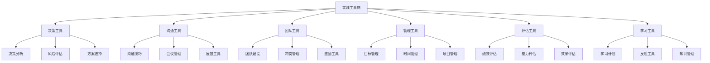
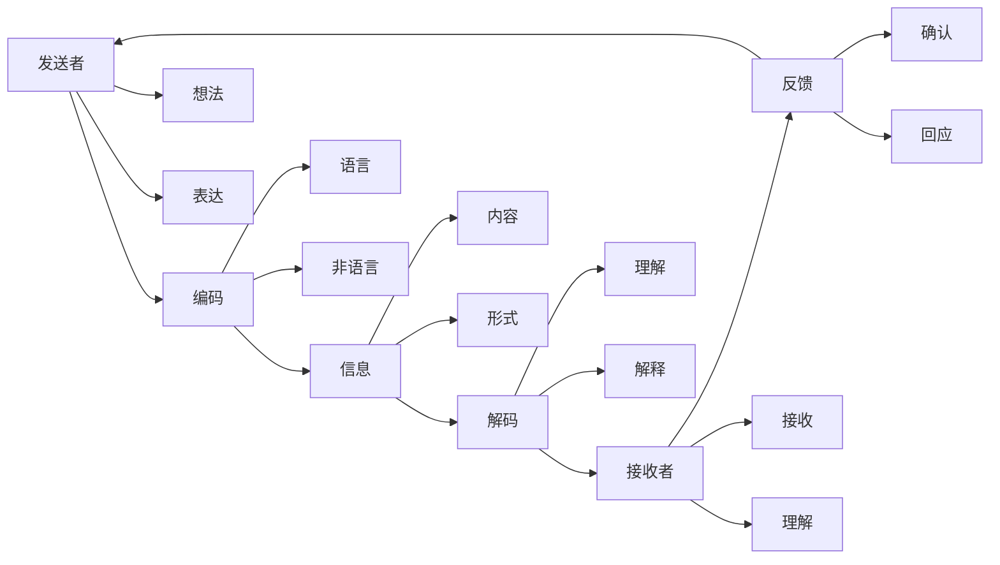
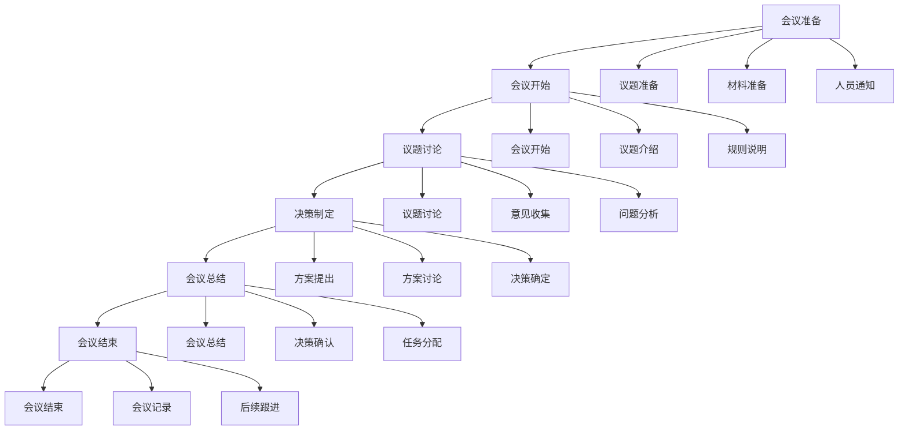
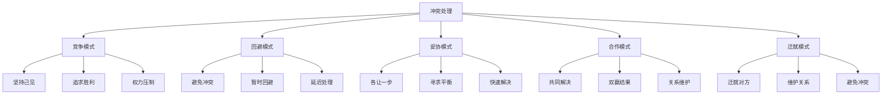
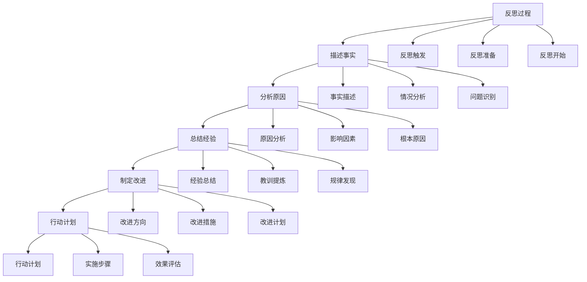

# 实践工具箱

## 🎯 核心概念

### 实践工具箱定义
**实践工具箱**是指领导者在实际工作中使用的各种工具、方法、技巧和模板的集合，用于提升领导效能和管理效率。

### 核心特征
- **实用性**：工具实用有效
- **系统性**：工具系统完整
- **操作性**：工具易于操作
- **适应性**：工具适应性强

## 📚 工具箱分类

### 工具分类模型

### 工具层次
| 工具层次 | 具体内容 | 使用频率 | 适用场景 |
|----------|----------|----------|----------|
| **基础工具** | 基本管理工具 | 日常 | 日常工作 |
| **进阶工具** | 专业管理工具 | 定期 | 专业工作 |
| **高级工具** | 战略管理工具 | 偶尔 | 战略工作 |
| **创新工具** | 创新管理工具 | 特殊 | 创新工作 |

## 🔍 决策工具

### 决策分析工具
#### SWOT分析
| 分析维度 | 具体内容 | 分析要点 | 应用场景 |
|----------|----------|----------|----------|
| **优势(S)** | 内部优势、竞争优势 | 优势识别 | 战略规划 |
| **劣势(W)** | 内部劣势、竞争劣势 | 劣势分析 | 问题诊断 |
| **机会(O)** | 外部机会、市场机会 | 机会把握 | 机会利用 |
| **威胁(T)** | 外部威胁、市场威胁 | 威胁应对 | 风险防范 |

#### 决策矩阵
| 决策要素 | 具体内容 | 权重设定 | 评分标准 |
|----------|----------|----------|----------|
| **方案A** | 方案内容、实施要点 | 权重分配 | 1-10分 |
| **方案B** | 方案内容、实施要点 | 权重分配 | 1-10分 |
| **方案C** | 方案内容、实施要点 | 权重分配 | 1-10分 |
| **综合评分** | 加权评分、最终选择 | 评分计算 | 最高分 |

### 风险评估工具
#### 风险矩阵
| 风险等级 | 概率 | 影响程度 | 风险值 | 应对策略 |
|----------|------|----------|--------|----------|
| **高风险** | 高 | 高 | 9 | 立即应对 |
| **中高风险** | 高 | 中 | 6 | 重点应对 |
| **中风险** | 中 | 中 | 4 | 一般应对 |
| **低风险** | 低 | 低 | 1 | 监控应对 |

#### 风险登记册
| 风险项目 | 风险描述 | 概率 | 影响 | 风险值 | 应对措施 |
|----------|----------|------|------|--------|----------|
| **风险1** | 具体描述 | 高/中/低 | 高/中/低 | 数值 | 具体措施 |
| **风险2** | 具体描述 | 高/中/低 | 高/中/低 | 数值 | 具体措施 |
| **风险3** | 具体描述 | 高/中/低 | 高/中/低 | 数值 | 具体措施 |

## 📊 沟通工具

### 沟通技巧工具
#### 沟通模型

#### 倾听技巧
| 倾听层次 | 具体内容 | 技巧要点 | 应用效果 |
|----------|----------|----------|----------|
| **表面倾听** | 听到声音 | 注意力集中 | 基础理解 |
| **内容倾听** | 理解内容 | 内容分析 | 内容理解 |
| **情感倾听** | 感受情感 | 情感共鸣 | 情感理解 |
| **同理倾听** | 换位思考 | 同理心 | 深度理解 |

### 会议管理工具
#### 会议类型
| 会议类型 | 具体内容 | 会议特点 | 管理要点 |
|----------|----------|----------|----------|
| **决策会议** | 重要决策、方案选择 | 决策导向 | 决策效率 |
| **信息会议** | 信息传递、情况通报 | 信息导向 | 信息准确 |
| **讨论会议** | 问题讨论、方案讨论 | 讨论导向 | 讨论深度 |
| **协调会议** | 工作协调、资源协调 | 协调导向 | 协调效果 |

#### 会议流程

## 🎯 团队工具

### 团队建设工具
#### 团队发展阶段
| 发展阶段 | 特征 | 管理重点 | 管理方法 |
|----------|------|----------|----------|
| **形成期** | 团队组建、相互了解 | 团队建立 | 团队介绍 |
| **冲突期** | 意见分歧、角色冲突 | 冲突管理 | 冲突解决 |
| **规范期** | 规则建立、行为规范 | 规范管理 | 规则制定 |
| **执行期** | 高效执行、目标达成 | 执行管理 | 执行监控 |
| **解散期** | 任务完成、团队解散 | 总结管理 | 经验总结 |

#### 团队角色分析
| 角色类型 | 主要特征 | 优势 | 劣势 | 管理要点 |
|----------|----------|------|------|----------|
| **协调者** | 组织协调、目标导向 | 组织能力强 | 创新能力弱 | 发挥组织优势 |
| **创新者** | 创新思维、问题解决 | 创新能力强 | 执行能力弱 | 发挥创新优势 |
| **执行者** | 执行能力强、目标导向 | 执行效率高 | 灵活性弱 | 发挥执行优势 |
| **支持者** | 团队支持、关系维护 | 支持能力强 | 决策能力弱 | 发挥支持优势 |

### 冲突管理工具
#### 冲突处理模式

#### 冲突解决步骤
| 解决步骤 | 具体内容 | 实施要点 | 解决效果 |
|----------|----------|----------|----------|
| **问题识别** | 识别冲突问题 | 问题明确 | 问题清晰 |
| **原因分析** | 分析冲突原因 | 原因深入 | 原因明确 |
| **方案制定** | 制定解决方案 | 方案可行 | 方案有效 |
| **方案实施** | 实施解决方案 | 实施到位 | 实施有效 |
| **效果评估** | 评估解决效果 | 评估客观 | 效果明显 |

## 📈 管理工具

### 目标管理工具
#### SMART原则
| 原则要素 | 具体内容 | 设定要求 | 评估标准 |
|----------|----------|----------|----------|
| **S-Specific** | 具体明确 | 目标具体 | 明确性 |
| **M-Measurable** | 可衡量 | 目标可测 | 可测性 |
| **A-Achievable** | 可实现 | 目标可达 | 可达性 |
| **R-Relevant** | 相关性 | 目标相关 | 相关性 |
| **T-Time-bound** | 时限性 | 目标有时限 | 时限性 |

#### 目标分解工具
| 分解维度 | 具体内容 | 分解方法 | 分解效果 |
|----------|----------|----------|----------|
| **时间分解** | 年度、季度、月度 | 时间分解 | 时间清晰 |
| **层级分解** | 组织、部门、个人 | 层级分解 | 层级明确 |
| **职能分解** | 不同职能领域 | 职能分解 | 职能清晰 |
| **项目分解** | 不同项目任务 | 项目分解 | 项目明确 |

### 时间管理工具
#### 时间矩阵
| 紧急程度 | 重要程度 | 时间分配 | 管理策略 |
|----------|----------|----------|----------|
| **紧急重要** | 高 | 20% | 立即处理 |
| **不紧急重要** | 高 | 70% | 重点规划 |
| **紧急不重要** | 低 | 10% | 委托他人 |
| **不紧急不重要** | 低 | 0% | 减少处理 |

#### 时间管理技巧
| 技巧类型 | 具体内容 | 实施方法 | 管理效果 |
|----------|----------|----------|----------|
| **优先级管理** | 任务优先级排序 | 优先级设定 | 效率提升 |
| **时间块管理** | 时间块分配 | 时间规划 | 时间利用 |
| **干扰管理** | 干扰因素控制 | 干扰减少 | 专注度提升 |
| **效率管理** | 工作效率提升 | 效率优化 | 产出增加 |

## 📊 评估工具

### 绩效评估工具
#### 360度评估
| 评估对象 | 评估内容 | 评估权重 | 评估标准 |
|----------|----------|----------|----------|
| **上级评估** | 工作表现、能力水平 | 30% | 1-5分 |
| **同级评估** | 协作能力、沟通能力 | 25% | 1-5分 |
| **下级评估** | 领导能力、管理能力 | 25% | 1-5分 |
| **自我评估** | 自我认知、自我评价 | 20% | 1-5分 |

#### 关键绩效指标
| 指标类型 | 具体内容 | 计算方法 | 目标值 |
|----------|----------|----------|--------|
| **财务指标** | 收入、利润、成本 | 财务计算 | 具体数值 |
| **客户指标** | 满意度、忠诚度 | 客户调查 | 百分比 |
| **内部指标** | 效率、质量 | 内部统计 | 具体数值 |
| **学习指标** | 能力提升、知识增长 | 能力评估 | 等级 |

### 能力评估工具
#### 能力模型
| 能力维度 | 具体内容 | 评估方法 | 权重 |
|----------|----------|----------|------|
| **专业能力** | 专业技能、知识水平 | 专业测试 | 30% |
| **管理能力** | 管理技能、领导能力 | 管理评估 | 25% |
| **沟通能力** | 沟通技巧、表达能力 | 沟通评估 | 20% |
| **学习能力** | 学习意愿、学习效果 | 学习评估 | 25% |

#### 能力发展计划
| 发展要素 | 具体内容 | 制定方法 | 实施要点 |
|----------|----------|----------|----------|
| **现状分析** | 当前能力水平 | 能力评估 | 客观分析 |
| **目标设定** | 发展目标设定 | 目标设定 | 目标明确 |
| **发展计划** | 发展计划制定 | 计划制定 | 计划可行 |
| **实施监控** | 实施过程监控 | 过程监控 | 监控有效 |

## 📚 学习工具

### 学习计划工具
#### 学习目标设定
| 目标类型 | 具体内容 | 设定方法 | 评估标准 |
|----------|----------|----------|----------|
| **知识目标** | 知识学习、理论掌握 | 知识分析 | 知识水平 |
| **技能目标** | 技能学习、能力提升 | 技能分析 | 技能水平 |
| **经验目标** | 经验积累、实践锻炼 | 经验分析 | 经验丰富度 |
| **应用目标** | 知识应用、技能应用 | 应用分析 | 应用效果 |

#### 学习方法选择
| 学习方法 | 具体内容 | 适用场景 | 学习效果 |
|----------|----------|----------|----------|
| **理论学习** | 阅读、听课、学习 | 知识学习 | 知识水平 |
| **实践学习** | 实践、练习、应用 | 技能学习 | 技能水平 |
| **反思学习** | 反思、总结、分析 | 经验学习 | 反思能力 |
| **协作学习** | 讨论、交流、分享 | 团队学习 | 协作能力 |

### 反思工具
#### 反思模型

#### 反思日记
| 反思要素 | 具体内容 | 记录要点 | 反思效果 |
|----------|----------|----------|----------|
| **事件描述** | 具体事件、情况描述 | 客观描述 | 事实清晰 |
| **感受分析** | 个人感受、情绪分析 | 主观分析 | 感受明确 |
| **原因分析** | 事件原因、影响因素 | 深入分析 | 原因明确 |
| **经验总结** | 成功经验、失败教训 | 经验提炼 | 经验积累 |
| **改进计划** | 改进方向、具体措施 | 计划制定 | 改进明确 |

## 🔗 相关概念链接

### 基础概念
- [[01-基础认知层/01-领导力概述|领导力概述]]
- [[01-基础认知层/02-管理者vs领导者|管理者vs领导者]]
- [[02-理论理解层/经典领导理论/02-行为理论|行为理论]]

### 理论概念
- [[02-理论理解层/现代领导理论/01-变革型领导|变革型领导]]
- [[02-理论理解层/现代领导理论/02-服务型领导|服务型领导]]

### 能力概念
- [[03-能力构建层/核心领导能力/01-战略思维|战略思维]]
- [[03-能力构建层/核心领导能力/02-决策能力|决策能力]]
- [[03-能力构建层/核心领导能力/03-沟通协调|沟通协调]]

### 实践概念
- [[01-团队管理|团队管理]]
- [[02-组织文化建设|组织文化建设]]
- [[03-绩效管理|绩效管理]]

## 💡 学习要点总结

### 关键理解
1. **工具分类**：决策工具、沟通工具、团队工具、管理工具
2. **工具层次**：基础工具、进阶工具、高级工具、创新工具
3. **工具应用**：选择合适工具、正确使用工具、评估工具效果
4. **工具发展**：持续学习工具、创新工具应用、工具优化

### 实践应用
1. **工具选择**：根据情况选择合适的工具
2. **工具使用**：正确使用工具，发挥工具效果
3. **工具评估**：评估工具使用效果
4. **工具改进**：持续改进工具使用

### 思考问题
1. 如何选择合适的领导工具？
2. 如何正确使用各种管理工具？
3. 如何评估工具的使用效果？
4. 如何持续改进工具应用？

---

**下一步**：[[特殊情境/01-跨文化领导|跨文化领导]] | [[特殊情境/02-数字化转型领导|数字化转型领导]]
