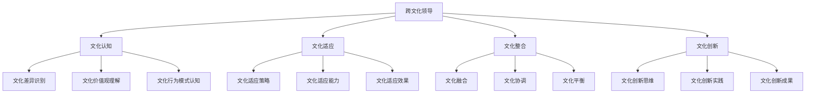
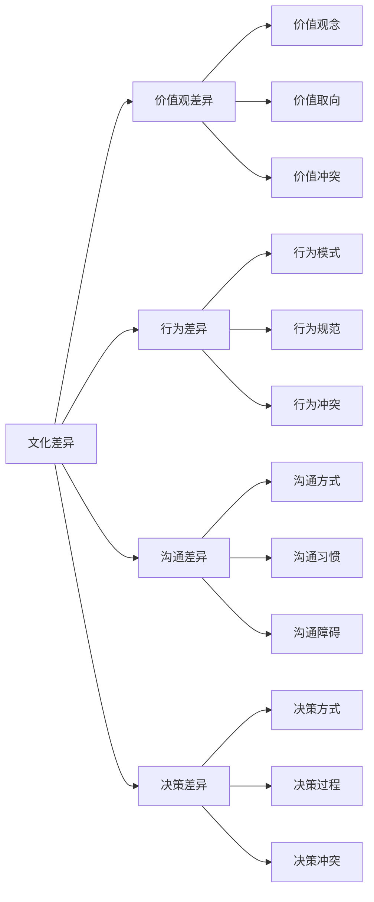
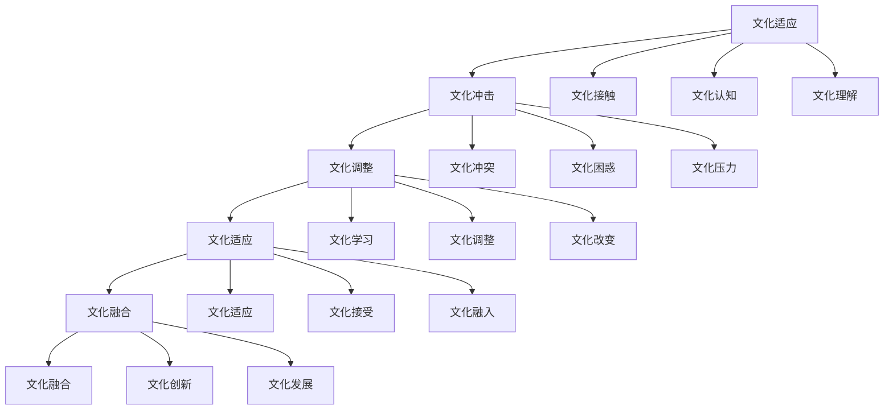
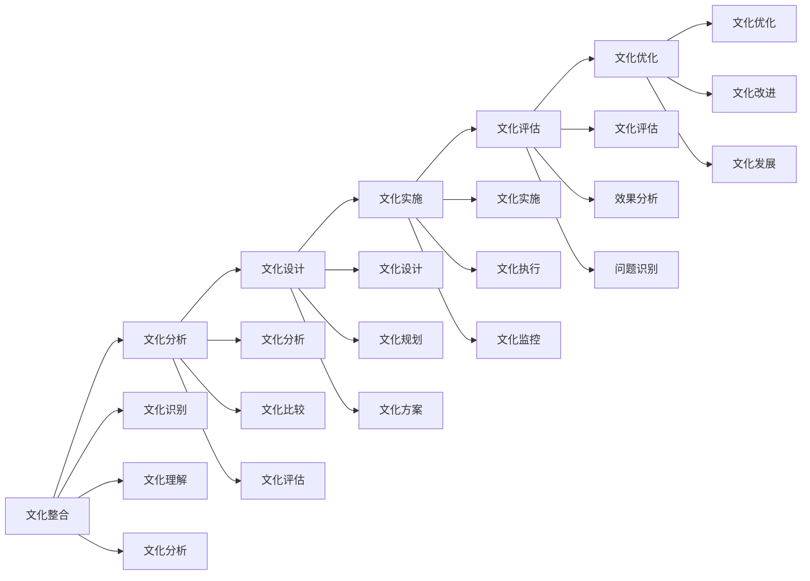
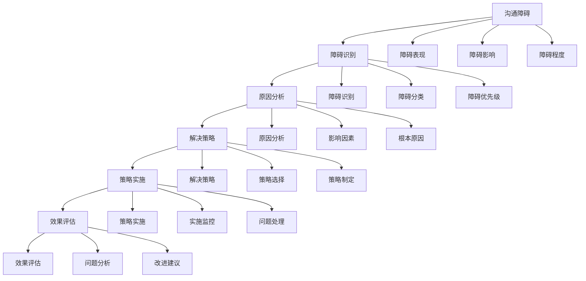

# 跨文化领导

## 🎯 核心概念

### 跨文化领导定义
**跨文化领导**是指在多元文化环境中，领导者运用跨文化领导技能，有效管理来自不同文化背景的团队成员，实现组织目标的领导过程。

### 核心特征
- **文化敏感性**：对不同文化的敏感认知
- **适应性**：适应不同文化环境
- **包容性**：包容文化差异
- **沟通性**：跨文化沟通能力

## 📚 跨文化领导理论框架

### 跨文化领导模型

### 文化维度理论
| 文化维度 | 具体内容 | 领导影响 | 管理策略 |
|----------|----------|----------|----------|
| **权力距离** | 对权力不平等的接受程度 | 领导权威性 | 权威管理 |
| **个人主义** | 个人与集体关系 | 团队协作 | 团队建设 |
| **不确定性规避** | 对不确定性的容忍度 | 风险决策 | 风险控制 |
| **男性化倾向** | 竞争与合作的平衡 | 竞争策略 | 竞争管理 |
| **长期导向** | 短期与长期目标平衡 | 战略规划 | 战略管理 |

## 🔍 文化认知

### 文化差异识别
#### 文化差异类型
| 差异类型 | 具体表现 | 影响程度 | 应对策略 |
|----------|----------|----------|----------|
| **价值观差异** | 价值观念不同 | 高 | 价值融合 |
| **行为差异** | 行为模式不同 | 中 | 行为适应 |
| **沟通差异** | 沟通方式不同 | 中 | 沟通调整 |
| **决策差异** | 决策方式不同 | 高 | 决策协调 |
| **时间观念差异** | 时间观念不同 | 中 | 时间管理 |

#### 文化差异分析

### 文化价值观理解
#### 核心价值观
| 价值维度 | 具体内容 | 文化表现 | 领导影响 |
|----------|----------|----------|----------|
| **集体主义** | 集体利益优先 | 团队协作 | 团队管理 |
| **个人主义** | 个人利益优先 | 个人发展 | 个人管理 |
| **等级观念** | 等级制度接受 | 权威管理 | 权威领导 |
| **平等观念** | 平等关系追求 | 民主管理 | 民主领导 |
| **时间观念** | 时间价值认知 | 时间管理 | 时间领导 |

#### 价值观冲突处理
| 冲突类型 | 具体表现 | 处理策略 | 处理效果 |
|----------|----------|----------|----------|
| **价值冲突** | 价值观不一致 | 价值融合 | 价值统一 |
| **利益冲突** | 利益分配不均 | 利益平衡 | 利益协调 |
| **目标冲突** | 目标不一致 | 目标协调 | 目标统一 |
| **方法冲突** | 方法不一致 | 方法整合 | 方法统一 |

## 🎯 文化适应

### 适应策略
#### 适应模式
| 适应模式 | 具体内容 | 适用场景 | 适应效果 |
|----------|----------|----------|----------|
| **同化模式** | 完全适应目标文化 | 文化差异小 | 适应快速 |
| **分离模式** | 保持原有文化 | 文化差异大 | 文化保持 |
| **整合模式** | 融合两种文化 | 文化差异中 | 文化创新 |
| **边缘化模式** | 脱离两种文化 | 文化冲突 | 文化孤立 |

#### 适应过程

### 适应能力
#### 能力维度
| 能力维度 | 具体内容 | 发展方法 | 评估标准 |
|----------|----------|----------|----------|
| **文化敏感度** | 文化差异敏感 | 文化学习 | 敏感度 |
| **文化理解力** | 文化理解能力 | 文化体验 | 理解力 |
| **文化适应力** | 文化适应能力 | 文化实践 | 适应力 |
| **文化创新力** | 文化创新能力 | 文化创新 | 创新力 |

#### 能力发展
| 发展阶段 | 特征 | 发展重点 | 发展方法 |
|----------|------|----------|----------|
| **基础阶段** | 文化认知 | 文化学习 | 理论学习 |
| **进阶阶段** | 文化理解 | 文化体验 | 实践体验 |
| **高级阶段** | 文化适应 | 文化实践 | 实践锻炼 |
| **专家阶段** | 文化创新 | 文化创新 | 创新实践 |

## 📊 文化整合

### 整合策略
#### 整合模式
| 整合模式 | 具体内容 | 适用场景 | 整合效果 |
|----------|----------|----------|----------|
| **文化融合** | 两种文化融合 | 文化互补 | 文化创新 |
| **文化协调** | 文化差异协调 | 文化冲突 | 文化平衡 |
| **文化平衡** | 文化力量平衡 | 文化竞争 | 文化稳定 |
| **文化创新** | 文化创新发展 | 文化发展 | 文化进步 |

#### 整合过程

### 整合工具
#### 文化整合工具
| 工具类型 | 具体工具 | 使用场景 | 使用效果 |
|----------|----------|----------|----------|
| **文化地图** | 文化差异地图 | 文化分析 | 分析清晰 |
| **文化矩阵** | 文化对比矩阵 | 文化比较 | 比较明确 |
| **文化评估** | 文化评估工具 | 文化评估 | 评估客观 |
| **文化规划** | 文化整合规划 | 文化规划 | 规划合理 |

## 🚀 跨文化沟通

### 沟通策略
#### 沟通原则
| 沟通原则 | 具体内容 | 实施要点 | 沟通效果 |
|----------|----------|----------|----------|
| **尊重原则** | 尊重文化差异 | 文化尊重 | 信任建立 |
| **理解原则** | 理解文化背景 | 文化理解 | 理解准确 |
| **适应原则** | 适应沟通方式 | 方式适应 | 沟通有效 |
| **包容原则** | 包容文化差异 | 文化包容 | 关系和谐 |

#### 沟通技巧
| 技巧类型 | 具体技巧 | 使用场景 | 使用效果 |
|----------|----------|----------|----------|
| **语言技巧** | 语言表达、语言理解 | 语言沟通 | 沟通清晰 |
| **非语言技巧** | 肢体语言、表情语言 | 非语言沟通 | 沟通丰富 |
| **倾听技巧** | 主动倾听、理解倾听 | 倾听沟通 | 理解准确 |
| **反馈技巧** | 及时反馈、建设性反馈 | 反馈沟通 | 反馈有效 |

### 沟通障碍
#### 障碍类型
| 障碍类型 | 具体表现 | 产生原因 | 解决策略 |
|----------|----------|----------|----------|
| **语言障碍** | 语言不通、理解困难 | 语言差异 | 语言学习 |
| **文化障碍** | 文化误解、文化冲突 | 文化差异 | 文化理解 |
| **心理障碍** | 心理抗拒、心理压力 | 心理因素 | 心理调适 |
| **环境障碍** | 环境不适、环境压力 | 环境因素 | 环境适应 |

#### 障碍解决

## 📈 跨文化团队管理

### 团队建设
#### 团队特征
| 团队特征 | 具体内容 | 管理重点 | 管理策略 |
|----------|----------|----------|----------|
| **文化多样性** | 文化背景多样 | 文化融合 | 文化整合 |
| **语言多样性** | 语言能力多样 | 语言沟通 | 语言支持 |
| **技能多样性** | 专业技能多样 | 技能整合 | 技能发展 |
| **经验多样性** | 工作经验多样 | 经验分享 | 经验整合 |

#### 团队建设策略
| 建设策略 | 具体内容 | 实施方法 | 建设效果 |
|----------|----------|----------|----------|
| **文化融合** | 文化差异融合 | 文化活动 | 文化和谐 |
| **技能整合** | 技能差异整合 | 技能培训 | 技能提升 |
| **经验分享** | 经验差异分享 | 经验交流 | 经验丰富 |
| **目标统一** | 目标差异统一 | 目标沟通 | 目标一致 |

### 团队协调
#### 协调机制
| 协调机制 | 具体内容 | 协调方法 | 协调效果 |
|----------|----------|----------|----------|
| **沟通机制** | 跨文化沟通 | 沟通平台 | 沟通有效 |
| **决策机制** | 跨文化决策 | 决策流程 | 决策科学 |
| **冲突机制** | 跨文化冲突 | 冲突解决 | 冲突化解 |
| **激励机制** | 跨文化激励 | 激励策略 | 激励有效 |

#### 协调工具
| 工具类型 | 具体工具 | 使用场景 | 使用效果 |
|----------|----------|----------|----------|
| **沟通工具** | 跨文化沟通工具 | 沟通协调 | 沟通顺畅 |
| **决策工具** | 跨文化决策工具 | 决策协调 | 决策科学 |
| **冲突工具** | 跨文化冲突工具 | 冲突协调 | 冲突解决 |
| **激励工具** | 跨文化激励工具 | 激励协调 | 激励有效 |

## 🎯 跨文化领导能力发展

### 发展路径
#### 发展阶段
| 发展阶段 | 特征 | 发展重点 | 发展方法 |
|----------|------|----------|----------|
| **基础阶段** | 文化认知 | 文化学习 | 理论学习 |
| **进阶阶段** | 文化理解 | 文化体验 | 实践体验 |
| **高级阶段** | 文化适应 | 文化实践 | 实践锻炼 |
| **专家阶段** | 文化创新 | 文化创新 | 创新实践 |

#### 发展方法
| 发展方法 | 具体内容 | 实施要点 | 发展效果 |
|----------|----------|----------|----------|
| **理论学习** | 跨文化理论 | 理论掌握 | 理论水平 |
| **实践体验** | 跨文化实践 | 实践体验 | 实践能力 |
| **反思总结** | 经验反思 | 反思深度 | 反思能力 |
| **持续学习** | 持续学习 | 学习持续 | 学习能力 |

### 能力评估
#### 评估维度
| 评估维度 | 具体内容 | 评估方法 | 权重 |
|----------|----------|----------|------|
| **文化认知** | 文化差异认知 | 文化测试 | 25% |
| **文化适应** | 文化适应能力 | 适应评估 | 30% |
| **跨文化沟通** | 跨文化沟通能力 | 沟通评估 | 25% |
| **团队管理** | 跨文化团队管理 | 管理评估 | 20% |

#### 评估工具
| 工具类型 | 具体工具 | 使用场景 | 评估效果 |
|----------|----------|----------|----------|
| **文化测试** | 文化差异测试 | 文化认知 | 认知准确 |
| **适应评估** | 文化适应评估 | 适应能力 | 适应有效 |
| **沟通评估** | 跨文化沟通评估 | 沟通能力 | 沟通有效 |
| **管理评估** | 跨文化管理评估 | 管理能力 | 管理有效 |

## 🔗 相关概念链接

### 基础概念
- [[01-基础认知层/01-领导力概述|领导力概述]]
- [[01-基础认知层/04-现代领导力挑战|现代挑战]]
- [[02-理论理解层/现代领导理论/02-服务型领导|服务型领导]]

### 理论概念
- [[02-理论理解层/现代领导理论/01-变革型领导|变革型领导]]
- [[02-理论理解层/现代领导理论/03-分布式领导|分布式领导]]

### 能力概念
- [[03-能力构建层/核心领导能力/03-沟通协调|沟通协调]]
- [[03-能力构建层/核心领导能力/04-团队建设|团队建设]]

### 实践概念
- [[01-团队管理|团队管理]]
- [[02-组织文化建设|组织文化建设]]

## 💡 学习要点总结

### 关键理解
1. **文化差异**：价值观、行为、沟通、决策差异
2. **文化适应**：同化、分离、整合、边缘化模式
3. **文化整合**：融合、协调、平衡、创新策略
4. **跨文化沟通**：尊重、理解、适应、包容原则

### 实践应用
1. **文化认知**：识别文化差异、理解文化价值观
2. **文化适应**：选择适应模式、提升适应能力
3. **文化整合**：制定整合策略、实施整合过程
4. **跨文化沟通**：运用沟通技巧、解决沟通障碍

### 思考问题
1. 如何识别和理解文化差异？
2. 如何选择合适的文化适应模式？
3. 如何制定有效的文化整合策略？
4. 如何提升跨文化沟通能力？

---

**下一步**：[[02-数字化转型领导|数字化转型领导]] | [[03-不同组织形态的领导力应用|组织形态领导]]
