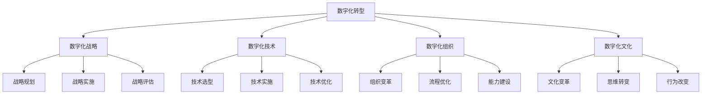
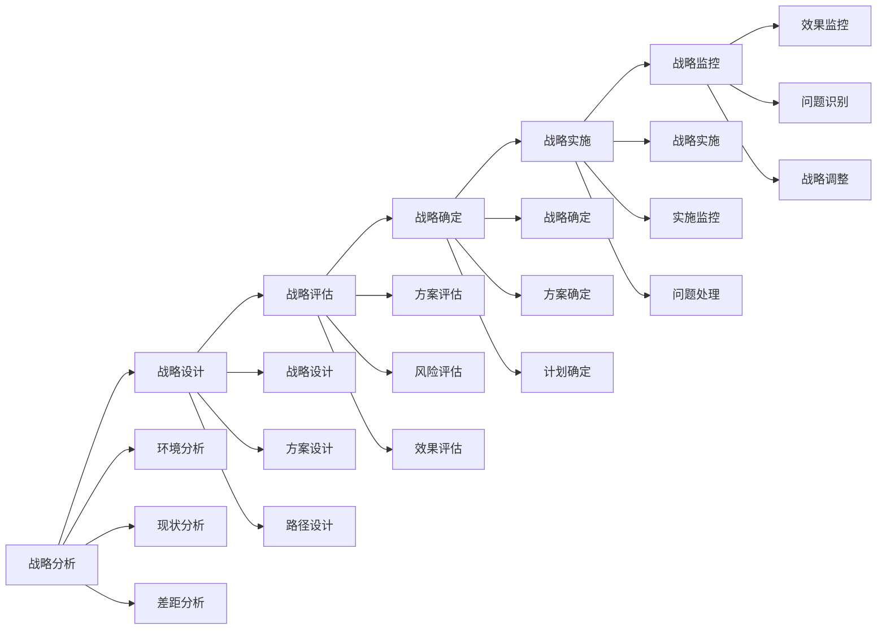
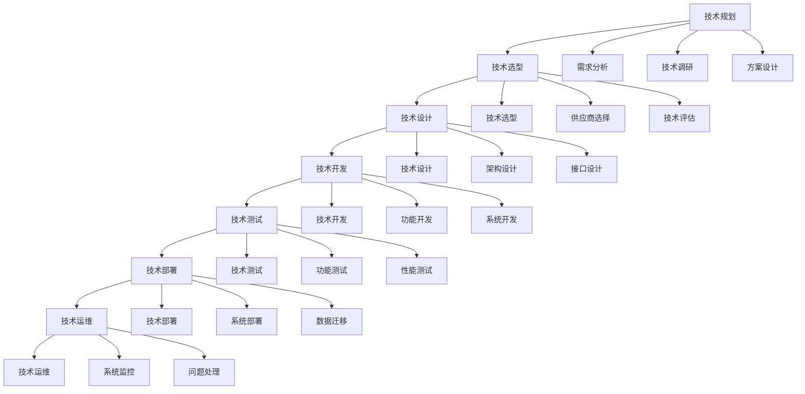
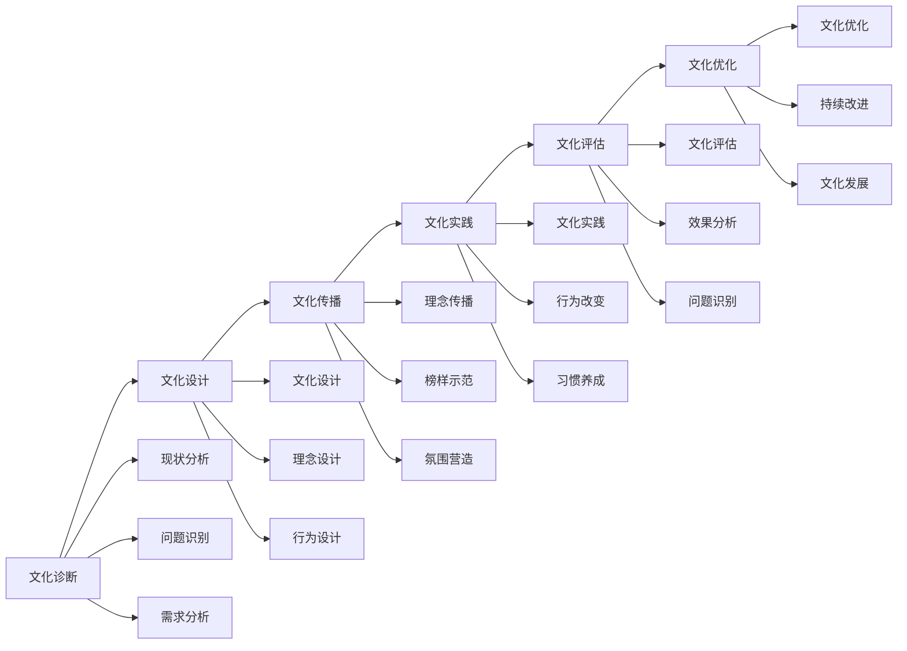
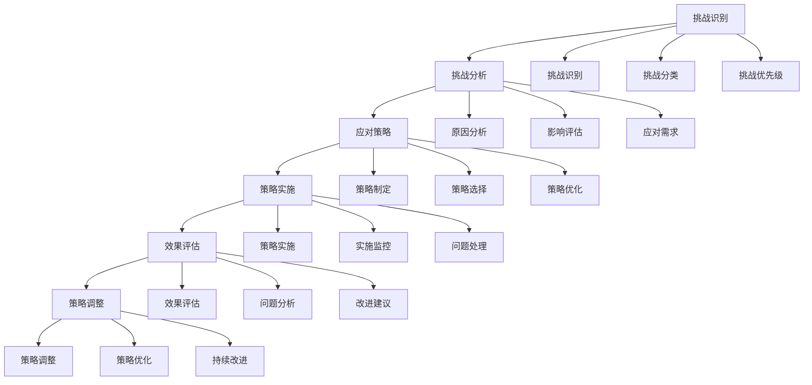

# 数字化转型领导

## 🎯 核心概念

### 数字化转型领导定义
**数字化转型领导**是指在数字化时代，领导者运用数字化思维和技术手段，推动组织数字化转型，实现数字化战略目标的领导过程。

### 核心特征
- **数字化思维**：具备数字化思维方式
- **技术敏感性**：对技术发展敏感
- **变革推动**：推动数字化转型
- **创新驱动**：以创新驱动发展

## 📚 数字化转型理论框架

### 数字化转型模型

### 数字化转型层次
| 转型层次 | 具体内容 | 转型重点 | 转型效果 |
|----------|----------|----------|----------|
| **技术层次** | 技术应用、系统建设 | 技术升级 | 效率提升 |
| **业务层次** | 业务流程、业务模式 | 业务创新 | 业务发展 |
| **组织层次** | 组织结构、组织能力 | 组织变革 | 组织优化 |
| **文化层次** | 文化理念、思维方式 | 文化变革 | 文化创新 |

## 🔍 数字化战略

### 战略规划
#### 战略要素
| 战略要素 | 具体内容 | 规划要点 | 实施重点 |
|----------|----------|----------|----------|
| **愿景目标** | 数字化愿景、转型目标 | 目标明确 | 目标达成 |
| **战略路径** | 转型路径、实施步骤 | 路径清晰 | 路径执行 |
| **资源配置** | 资源投入、资源配置 | 资源充足 | 资源有效 |
| **风险控制** | 风险识别、风险应对 | 风险可控 | 风险控制 |

#### 战略制定流程

### 战略实施
#### 实施策略
| 策略类型 | 具体内容 | 实施方法 | 实施效果 |
|----------|----------|----------|----------|
| **渐进式策略** | 逐步推进、稳步实施 | 分阶段实施 | 风险可控 |
| **激进式策略** | 快速推进、全面实施 | 全面实施 | 效果显著 |
| **试点式策略** | 先试点后推广 | 试点验证 | 风险降低 |
| **混合式策略** | 结合多种策略 | 灵活实施 | 效果最佳 |

#### 实施阶段
| 实施阶段 | 具体内容 | 阶段重点 | 时间周期 |
|----------|----------|----------|----------|
| **准备阶段** | 战略准备、资源准备 | 准备工作 | 1-3个月 |
| **启动阶段** | 战略启动、项目启动 | 启动工作 | 1-2个月 |
| **实施阶段** | 战略实施、项目实施 | 实施工作 | 6-18个月 |
| **优化阶段** | 战略优化、效果优化 | 优化工作 | 持续进行 |

## 🚀 数字化技术

### 技术选型
#### 技术类型
| 技术类型 | 具体内容 | 应用场景 | 技术价值 |
|----------|----------|----------|----------|
| **云计算** | 云服务、云平台 | 基础设施 | 成本降低 |
| **大数据** | 数据分析、数据挖掘 | 数据分析 | 决策支持 |
| **人工智能** | 机器学习、智能算法 | 智能应用 | 效率提升 |
| **物联网** | 设备连接、数据采集 | 设备管理 | 管理优化 |
| **区块链** | 分布式账本、智能合约 | 信任机制 | 信任建立 |

#### 技术选型原则
| 选型原则 | 具体内容 | 实施要点 | 选型效果 |
|----------|----------|----------|----------|
| **业务匹配** | 技术与业务匹配 | 需求分析 | 匹配度高 |
| **技术成熟** | 技术成熟度 | 技术评估 | 风险可控 |
| **成本效益** | 成本效益分析 | 成本分析 | 效益最佳 |
| **可扩展性** | 技术可扩展性 | 扩展评估 | 扩展性强 |

### 技术实施
#### 实施方法
| 实施方法 | 具体内容 | 实施要点 | 实施效果 |
|----------|----------|----------|----------|
| **系统集成** | 系统整合、数据整合 | 集成规划 | 系统统一 |
| **平台建设** | 平台搭建、功能开发 | 平台设计 | 平台稳定 |
| **数据治理** | 数据管理、数据质量 | 数据规范 | 数据质量 |
| **安全防护** | 安全防护、风险控制 | 安全设计 | 安全可靠 |

#### 实施流程

## 📊 数字化组织

### 组织变革
#### 变革要素
| 变革要素 | 具体内容 | 变革重点 | 变革效果 |
|----------|----------|----------|----------|
| **组织结构** | 组织架构、组织设计 | 结构优化 | 效率提升 |
| **组织流程** | 业务流程、管理流程 | 流程优化 | 流程高效 |
| **组织能力** | 组织能力、个人能力 | 能力建设 | 能力提升 |
| **组织文化** | 组织文化、价值观念 | 文化变革 | 文化创新 |

#### 变革策略
| 策略类型 | 具体内容 | 实施方法 | 实施效果 |
|----------|----------|----------|----------|
| **结构变革** | 组织结构调整 | 结构重组 | 结构优化 |
| **流程变革** | 业务流程优化 | 流程再造 | 流程高效 |
| **能力变革** | 组织能力提升 | 能力建设 | 能力提升 |
| **文化变革** | 组织文化创新 | 文化重塑 | 文化创新 |

### 能力建设
#### 能力维度
| 能力维度 | 具体内容 | 建设方法 | 建设效果 |
|----------|----------|----------|----------|
| **数字化能力** | 数字化技能、数字化思维 | 技能培训 | 技能提升 |
| **创新能力** | 创新思维、创新实践 | 创新训练 | 创新能力 |
| **学习能力** | 学习意愿、学习效果 | 学习机制 | 学习能力 |
| **适应能力** | 环境适应、变化适应 | 适应训练 | 适应能力 |

#### 能力发展
| 发展阶段 | 特征 | 发展重点 | 发展方法 |
|----------|------|----------|----------|
| **基础阶段** | 基本技能掌握 | 技能学习 | 技能培训 |
| **进阶阶段** | 技能应用能力 | 实践应用 | 实践锻炼 |
| **高级阶段** | 技能创新能力 | 创新发展 | 创新实践 |
| **专家阶段** | 技能领导能力 | 领导发展 | 领导锻炼 |

## 🎯 数字化文化

### 文化变革
#### 变革要素
| 变革要素 | 具体内容 | 变革重点 | 变革效果 |
|----------|----------|----------|----------|
| **思维模式** | 数字化思维、创新思维 | 思维转变 | 思维创新 |
| **价值观念** | 价值观念、价值取向 | 价值更新 | 价值创新 |
| **行为模式** | 行为方式、工作方式 | 行为改变 | 行为创新 |
| **沟通方式** | 沟通方式、协作方式 | 沟通创新 | 沟通高效 |

#### 变革策略
| 策略类型 | 具体内容 | 实施方法 | 实施效果 |
|----------|----------|----------|----------|
| **思维变革** | 思维方式转变 | 思维训练 | 思维创新 |
| **价值变革** | 价值观念更新 | 价值引导 | 价值创新 |
| **行为变革** | 行为方式改变 | 行为引导 | 行为创新 |
| **沟通变革** | 沟通方式创新 | 沟通训练 | 沟通高效 |

### 文化培育
#### 培育方法
| 培育方法 | 具体内容 | 实施要点 | 培育效果 |
|----------|----------|----------|----------|
| **理念传播** | 数字化理念传播 | 理念宣传 | 理念认同 |
| **榜样示范** | 数字化榜样示范 | 榜样引领 | 行为改变 |
| **实践体验** | 数字化实践体验 | 实践参与 | 体验深刻 |
| **持续强化** | 文化持续强化 | 持续推动 | 文化固化 |

#### 培育流程

## 📈 数字化转型领导能力

### 核心能力
#### 能力维度
| 能力维度 | 具体内容 | 能力要求 | 发展方法 |
|----------|----------|----------|----------|
| **数字化思维** | 数字化思维方式 | 思维转变 | 思维训练 |
| **技术敏感性** | 技术发展敏感 | 技术认知 | 技术学习 |
| **变革推动** | 变革推动能力 | 变革管理 | 变革实践 |
| **创新驱动** | 创新驱动能力 | 创新能力 | 创新实践 |

#### 能力发展
| 发展阶段 | 特征 | 发展重点 | 发展方法 |
|----------|------|----------|----------|
| **基础阶段** | 数字化认知 | 认知学习 | 理论学习 |
| **进阶阶段** | 数字化理解 | 理解深化 | 实践体验 |
| **高级阶段** | 数字化应用 | 应用实践 | 实践锻炼 |
| **专家阶段** | 数字化创新 | 创新发展 | 创新实践 |

### 能力评估
#### 评估维度
| 评估维度 | 具体内容 | 评估方法 | 权重 |
|----------|----------|----------|------|
| **数字化思维** | 数字化思维方式 | 思维测试 | 30% |
| **技术敏感性** | 技术发展敏感 | 技术评估 | 25% |
| **变革推动** | 变革推动能力 | 变革评估 | 25% |
| **创新驱动** | 创新驱动能力 | 创新评估 | 20% |

#### 评估工具
| 工具类型 | 具体工具 | 使用场景 | 评估效果 |
|----------|----------|----------|----------|
| **思维测试** | 数字化思维测试 | 思维评估 | 思维水平 |
| **技术评估** | 技术敏感性评估 | 技术评估 | 技术水平 |
| **变革评估** | 变革推动评估 | 变革评估 | 变革能力 |
| **创新评估** | 创新驱动评估 | 创新评估 | 创新能力 |

## 🎯 数字化转型挑战

### 挑战类型
#### 挑战分析
| 挑战类型 | 具体表现 | 影响程度 | 应对策略 |
|----------|----------|----------|----------|
| **技术挑战** | 技术复杂、技术风险 | 高 | 技术管理 |
| **组织挑战** | 组织变革、文化冲突 | 高 | 变革管理 |
| **人才挑战** | 人才缺乏、技能不足 | 中 | 人才培养 |
| **资金挑战** | 资金投入、成本控制 | 中 | 资金管理 |
| **安全挑战** | 数据安全、系统安全 | 高 | 安全管理 |

#### 挑战应对

### 成功要素
#### 成功要素
| 成功要素 | 具体内容 | 重要性 | 实施要点 |
|----------|----------|--------|----------|
| **领导支持** | 高层领导支持 | 高 | 领导承诺 |
| **战略清晰** | 转型战略清晰 | 高 | 战略明确 |
| **资源充足** | 资源投入充足 | 中 | 资源保障 |
| **人才支持** | 人才能力支持 | 中 | 人才培养 |
| **文化支持** | 组织文化支持 | 中 | 文化变革 |

## 🔗 相关概念链接

### 基础概念
- [[01-基础认知层/01-领导力概述|领导力概述]]
- [[01-基础认知层/04-现代领导力挑战|现代挑战]]
- [[02-理论理解层/现代领导理论/01-变革型领导|变革型领导]]

### 理论概念
- [[02-理论理解层/现代领导理论/02-服务型领导|服务型领导]]
- [[02-理论理解层/现代领导理论/03-分布式领导|分布式领导]]

### 能力概念
- [[03-能力构建层/核心领导能力/01-战略思维|战略思维]]
- [[03-能力构建层/核心领导能力/05-变革管理|变革管理]]

### 实践概念
- [[01-团队管理|团队管理]]
- [[02-组织文化建设|组织文化建设]]

## 💡 学习要点总结

### 关键理解
1. **数字化转型**：战略、技术、组织、文化四个层次
2. **数字化战略**：愿景目标、战略路径、资源配置、风险控制
3. **数字化技术**：云计算、大数据、人工智能、物联网
4. **数字化组织**：组织变革、能力建设、文化培育

### 实践应用
1. **战略制定**：制定清晰的数字化转型战略
2. **技术选型**：选择合适的技术方案
3. **组织变革**：推动组织变革和能力建设
4. **文化培育**：培育数字化文化

### 思考问题
1. 如何制定数字化转型战略？
2. 如何选择合适的技术方案？
3. 如何推动组织变革？
4. 如何培育数字化文化？

---

**下一步**：[[03-不同组织形态的领导力应用|组织形态领导]] | [[05-发展提升层/自我发展/01-自我认知与评估|自我认知]]
