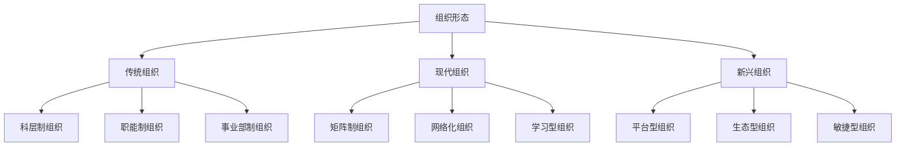
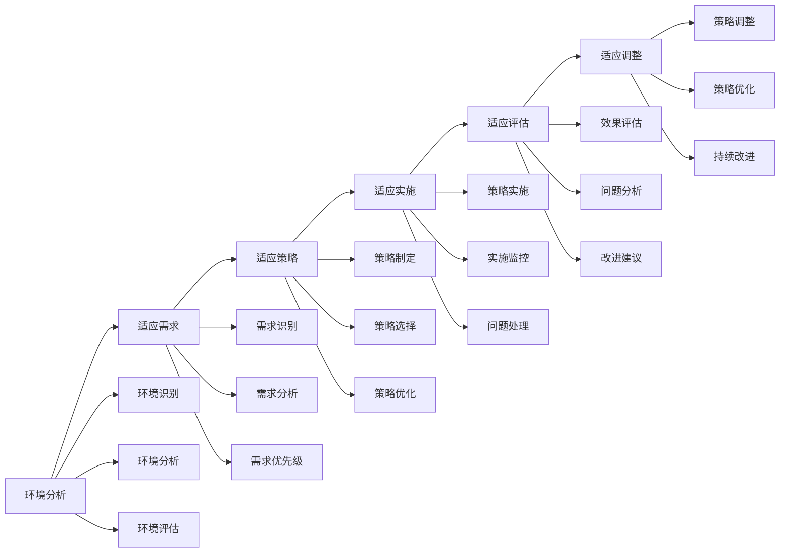

# 不同组织形态的领导力应用

## 🎯 核心概念

### 组织形态定义
**组织形态**是指组织在结构、文化、运营模式等方面的具体表现形式，不同组织形态对领导力有不同的要求和应用方式。

### 核心特征
- **多样性**：组织形态多样
- **适应性**：适应不同环境
- **动态性**：组织形态动态变化
- **复杂性**：组织形态复杂

## 📚 组织形态理论框架

### 组织形态分类模型

### 组织形态特征
| 组织形态 | 结构特征 | 文化特征 | 领导特征 |
|----------|----------|----------|----------|
| **科层制** | 层级分明、权力集中 | 权威文化 | 权威领导 |
| **职能制** | 专业分工、职能明确 | 专业文化 | 专业领导 |
| **事业部制** | 独立经营、责任明确 | 责任文化 | 责任领导 |
| **矩阵制** | 双重领导、项目导向 | 协作文化 | 协作领导 |
| **网络化** | 扁平化、网络连接 | 开放文化 | 开放领导 |
| **学习型** | 持续学习、知识共享 | 学习文化 | 学习领导 |
| **平台型** | 平台生态、价值共创 | 生态文化 | 生态领导 |
| **敏捷型** | 快速响应、灵活适应 | 敏捷文化 | 敏捷领导 |

## 🔍 传统组织形态

### 科层制组织
#### 组织特征
| 特征维度 | 具体内容 | 优势 | 劣势 |
|----------|----------|------|------|
| **结构特征** | 层级分明、权力集中 | 控制有效 | 反应缓慢 |
| **文化特征** | 权威文化、等级观念 | 秩序稳定 | 创新不足 |
| **管理特征** | 标准化管理、程序化 | 效率稳定 | 灵活性差 |
| **沟通特征** | 垂直沟通、正式沟通 | 信息准确 | 沟通缓慢 |

#### 领导力要求
| 领导维度 | 具体要求 | 领导重点 | 领导方法 |
|----------|----------|----------|----------|
| **权威领导** | 建立权威、维护秩序 | 权威建立 | 权威管理 |
| **控制领导** | 有效控制、规范管理 | 控制有效 | 控制管理 |
| **协调领导** | 协调关系、平衡利益 | 关系协调 | 协调管理 |
| **激励领导** | 激励员工、提升绩效 | 绩效提升 | 激励管理 |

#### 领导策略
| 策略类型 | 具体内容 | 实施要点 | 实施效果 |
|----------|----------|----------|----------|
| **权威策略** | 建立权威、维护权威 | 权威建立 | 权威有效 |
| **控制策略** | 有效控制、规范控制 | 控制实施 | 控制有效 |
| **协调策略** | 关系协调、利益协调 | 协调实施 | 协调有效 |
| **激励策略** | 激励员工、绩效激励 | 激励实施 | 激励有效 |

### 职能制组织
#### 组织特征
| 特征维度 | 具体内容 | 优势 | 劣势 |
|----------|----------|------|------|
| **结构特征** | 专业分工、职能明确 | 专业高效 | 协调困难 |
| **文化特征** | 专业文化、技能导向 | 专业水平 | 整体意识 |
| **管理特征** | 专业管理、技能管理 | 管理专业 | 管理复杂 |
| **沟通特征** | 专业沟通、技术沟通 | 沟通专业 | 沟通障碍 |

#### 领导力要求
| 领导维度 | 具体要求 | 领导重点 | 领导方法 |
|----------|----------|----------|----------|
| **专业领导** | 专业能力、技术领导 | 专业水平 | 专业管理 |
| **协调领导** | 跨部门协调、职能协调 | 协调有效 | 协调管理 |
| **整合领导** | 资源整合、能力整合 | 整合有效 | 整合管理 |
| **发展领导** | 专业发展、能力发展 | 发展有效 | 发展管理 |

### 事业部制组织
#### 组织特征
| 特征维度 | 具体内容 | 优势 | 劣势 |
|----------|----------|------|------|
| **结构特征** | 独立经营、责任明确 | 责任清晰 | 资源分散 |
| **文化特征** | 责任文化、绩效导向 | 绩效意识 | 合作意识 |
| **管理特征** | 独立管理、绩效管理 | 管理独立 | 管理复杂 |
| **沟通特征** | 内部沟通、外部沟通 | 沟通灵活 | 沟通复杂 |

#### 领导力要求
| 领导维度 | 具体要求 | 领导重点 | 领导方法 |
|----------|----------|----------|----------|
| **责任领导** | 责任明确、绩效导向 | 责任落实 | 责任管理 |
| **独立领导** | 独立决策、自主管理 | 决策独立 | 独立管理 |
| **协调领导** | 事业部协调、资源协调 | 协调有效 | 协调管理 |
| **发展领导** | 业务发展、能力发展 | 发展有效 | 发展管理 |

## 🚀 现代组织形态

### 矩阵制组织
#### 组织特征
| 特征维度 | 具体内容 | 优势 | 劣势 |
|----------|----------|------|------|
| **结构特征** | 双重领导、项目导向 | 灵活高效 | 管理复杂 |
| **文化特征** | 协作文化、项目文化 | 协作意识 | 文化冲突 |
| **管理特征** | 矩阵管理、项目管理 | 管理灵活 | 管理复杂 |
| **沟通特征** | 多维沟通、项目沟通 | 沟通灵活 | 沟通复杂 |

#### 领导力要求
| 领导维度 | 具体要求 | 领导重点 | 领导方法 |
|----------|----------|----------|----------|
| **协作领导** | 跨部门协作、项目协作 | 协作有效 | 协作管理 |
| **平衡领导** | 权力平衡、利益平衡 | 平衡有效 | 平衡管理 |
| **项目领导** | 项目管理、团队管理 | 项目成功 | 项目管理 |
| **创新领导** | 创新思维、创新实践 | 创新有效 | 创新管理 |

#### 领导挑战
| 挑战类型 | 具体表现 | 影响程度 | 应对策略 |
|----------|----------|----------|----------|
| **双重领导** | 双重指挥、权力冲突 | 高 | 权力协调 |
| **资源竞争** | 资源争夺、利益冲突 | 中 | 资源协调 |
| **文化冲突** | 文化差异、价值冲突 | 中 | 文化融合 |
| **沟通复杂** | 沟通复杂、信息混乱 | 中 | 沟通优化 |

### 网络化组织
#### 组织特征
| 特征维度 | 具体内容 | 优势 | 劣势 |
|----------|----------|------|------|
| **结构特征** | 扁平化、网络连接 | 反应快速 | 控制困难 |
| **文化特征** | 开放文化、共享文化 | 开放共享 | 文化松散 |
| **管理特征** | 网络管理、共享管理 | 管理灵活 | 管理复杂 |
| **沟通特征** | 网络沟通、即时沟通 | 沟通快速 | 沟通复杂 |

#### 领导力要求
| 领导维度 | 具体要求 | 领导重点 | 领导方法 |
|----------|----------|----------|----------|
| **网络领导** | 网络管理、关系管理 | 网络有效 | 网络管理 |
| **共享领导** | 知识共享、资源共享 | 共享有效 | 共享管理 |
| **开放领导** | 开放思维、开放管理 | 开放有效 | 开放管理 |
| **创新领导** | 创新思维、创新实践 | 创新有效 | 创新管理 |

### 学习型组织
#### 组织特征
| 特征维度 | 具体内容 | 优势 | 劣势 |
|----------|----------|------|------|
| **结构特征** | 学习导向、知识共享 | 学习高效 | 结构松散 |
| **文化特征** | 学习文化、创新文化 | 学习创新 | 文化复杂 |
| **管理特征** | 学习管理、知识管理 | 管理灵活 | 管理复杂 |
| **沟通特征** | 学习沟通、知识沟通 | 沟通深入 | 沟通复杂 |

#### 领导力要求
| 领导维度 | 具体要求 | 领导重点 | 领导方法 |
|----------|----------|----------|----------|
| **学习领导** | 学习促进、知识管理 | 学习有效 | 学习管理 |
| **创新领导** | 创新思维、创新实践 | 创新有效 | 创新管理 |
| **共享领导** | 知识共享、经验共享 | 共享有效 | 共享管理 |
| **发展领导** | 个人发展、组织发展 | 发展有效 | 发展管理 |

## 📊 新兴组织形态

### 平台型组织
#### 组织特征
| 特征维度 | 具体内容 | 优势 | 劣势 |
|----------|----------|------|------|
| **结构特征** | 平台生态、价值共创 | 价值创造 | 管理复杂 |
| **文化特征** | 生态文化、共创文化 | 共创意识 | 文化复杂 |
| **管理特征** | 平台管理、生态管理 | 管理灵活 | 管理复杂 |
| **沟通特征** | 生态沟通、共创沟通 | 沟通开放 | 沟通复杂 |

#### 领导力要求
| 领导维度 | 具体要求 | 领导重点 | 领导方法 |
|----------|----------|----------|----------|
| **生态领导** | 生态管理、价值管理 | 生态有效 | 生态管理 |
| **共创领导** | 价值共创、利益共享 | 共创有效 | 共创管理 |
| **平台领导** | 平台管理、生态管理 | 平台有效 | 平台管理 |
| **创新领导** | 创新思维、创新实践 | 创新有效 | 创新管理 |

### 敏捷型组织
#### 组织特征
| 特征维度 | 具体内容 | 优势 | 劣势 |
|----------|----------|------|------|
| **结构特征** | 快速响应、灵活适应 | 响应快速 | 结构松散 |
| **文化特征** | 敏捷文化、适应文化 | 适应意识 | 文化复杂 |
| **管理特征** | 敏捷管理、适应管理 | 管理灵活 | 管理复杂 |
| **沟通特征** | 敏捷沟通、即时沟通 | 沟通快速 | 沟通复杂 |

#### 领导力要求
| 领导维度 | 具体要求 | 领导重点 | 领导方法 |
|----------|----------|----------|----------|
| **敏捷领导** | 快速响应、灵活适应 | 敏捷有效 | 敏捷管理 |
| **适应领导** | 环境适应、变化适应 | 适应有效 | 适应管理 |
| **创新领导** | 创新思维、创新实践 | 创新有效 | 创新管理 |
| **团队领导** | 团队管理、协作管理 | 团队有效 | 团队管理 |

## 🎯 领导力适应性

### 适应性模型
#### 适应维度
| 适应维度 | 具体内容 | 适应要求 | 适应方法 |
|----------|----------|----------|----------|
| **结构适应** | 组织结构适应 | 结构理解 | 结构学习 |
| **文化适应** | 组织文化适应 | 文化理解 | 文化学习 |
| **管理适应** | 管理模式适应 | 管理理解 | 管理学习 |
| **沟通适应** | 沟通方式适应 | 沟通理解 | 沟通学习 |

#### 适应过程

### 适应性能力
#### 能力维度
| 能力维度 | 具体内容 | 能力要求 | 发展方法 |
|----------|----------|----------|----------|
| **环境敏感** | 环境变化敏感 | 敏感度高 | 环境观察 |
| **学习能力** | 快速学习能力 | 学习快速 | 学习训练 |
| **适应能力** | 环境适应能力 | 适应快速 | 适应训练 |
| **创新能力** | 创新适应能力 | 创新有效 | 创新训练 |

#### 能力发展
| 发展阶段 | 特征 | 发展重点 | 发展方法 |
|----------|------|----------|----------|
| **基础阶段** | 环境认知 | 环境学习 | 理论学习 |
| **进阶阶段** | 环境理解 | 环境体验 | 实践体验 |
| **高级阶段** | 环境适应 | 环境实践 | 实践锻炼 |
| **专家阶段** | 环境创新 | 环境创新 | 创新实践 |

## 📈 领导力效果评估

### 评估维度
| 评估维度 | 具体内容 | 评估方法 | 权重 |
|----------|----------|----------|------|
| **适应性** | 环境适应能力 | 适应评估 | 30% |
| **有效性** | 领导效果 | 效果评估 | 30% |
| **创新性** | 创新能力 | 创新评估 | 20% |
| **发展性** | 发展能力 | 发展评估 | 20% |

### 评估工具
#### 领导力评估表
| 评估项目 | 评估内容 | 评分标准 | 权重 |
|----------|----------|----------|------|
| **环境适应** | 环境适应能力 | 1-5分 | 30% |
| **领导效果** | 领导效果水平 | 1-5分 | 30% |
| **创新能力** | 创新能力水平 | 1-5分 | 20% |
| **发展能力** | 发展能力水平 | 1-5分 | 20% |

## 🔗 相关概念链接

### 基础概念
- [[01-基础认知层/01-领导力概述|领导力概述]]
- [[01-基础认知层/04-现代领导力挑战|现代挑战]]
- [[02-理论理解层/经典领导理论/03-情境理论|情境理论]]

### 理论概念
- [[02-理论理解层/现代领导理论/01-变革型领导|变革型领导]]
- [[02-理论理解层/现代领导理论/02-服务型领导|服务型领导]]

### 能力概念
- [[03-能力构建层/核心领导能力/01-战略思维|战略思维]]
- [[03-能力构建层/核心领导能力/05-变革管理|变革管理]]

### 实践概念
- [[01-团队管理|团队管理]]
- [[02-组织文化建设|组织文化建设]]

## 💡 学习要点总结

### 关键理解
1. **组织形态**：传统、现代、新兴组织形态
2. **领导要求**：不同组织形态对领导力的不同要求
3. **适应性**：领导力对环境变化的适应性
4. **创新性**：领导力在组织创新中的作用

### 实践应用
1. **环境分析**：分析组织形态特征
2. **领导适应**：适应不同组织形态
3. **领导创新**：在组织创新中发挥领导作用
4. **效果评估**：评估领导力效果

### 思考问题
1. 如何分析不同组织形态的特征？
2. 如何适应不同组织形态的领导要求？
3. 如何在组织创新中发挥领导作用？
4. 如何评估领导力在不同组织形态中的效果？

---

**下一步**：[[05-发展提升层/自我发展/01-自我认知与评估|自我认知]] | [[05-发展提升层/自我发展/02-学习与发展路径|学习路径]]
