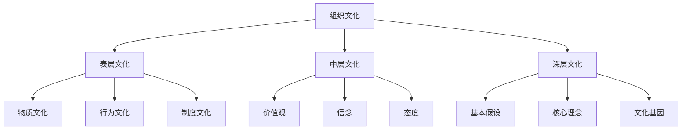
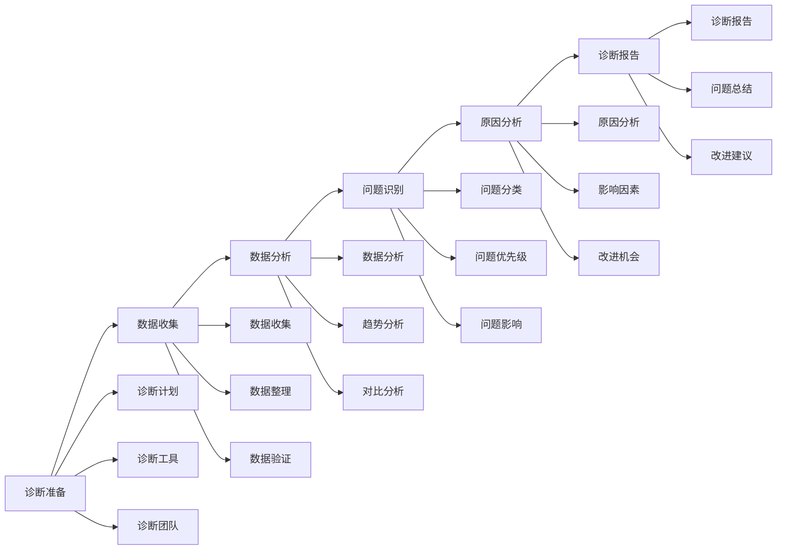
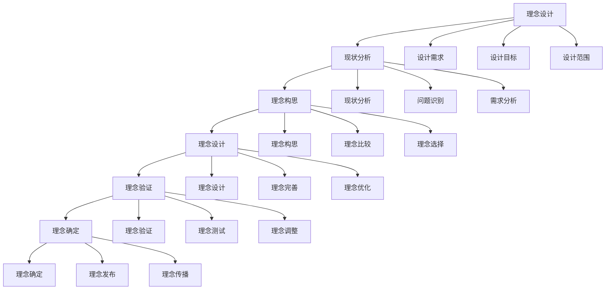
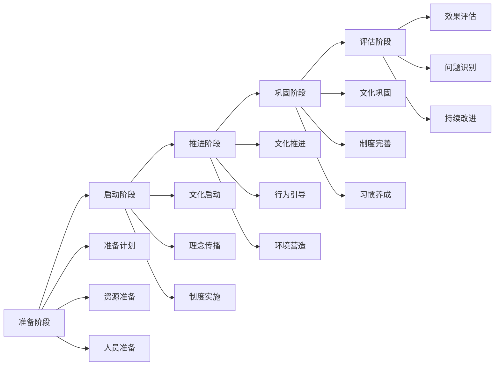

# 组织文化建设

## 🎯 核心概念

### 组织文化定义
**组织文化**是指组织在长期发展过程中形成的，为组织成员所共同遵循的价值观念、行为准则、思维方式和行为模式的总和。

### 核心特征
- **共享性**：为组织成员共同认同
- **稳定性**：具有相对稳定性
- **独特性**：具有组织独特性
- **导向性**：引导组织行为

## 📚 组织文化理论框架

### 文化层次模型

### 文化要素
| 文化层次 | 具体内容 | 表现形式 | 管理重点 |
|----------|----------|----------|----------|
| **表层文化** | 物质环境、行为表现 | 可见可感 | 环境营造 |
| **中层文化** | 价值观、信念、态度 | 观念层面 | 价值引导 |
| **深层文化** | 基本假设、核心理念 | 潜意识层 | 理念塑造 |

## 🔍 文化诊断

### 诊断维度
#### 文化现状分析
| 分析维度 | 具体内容 | 分析方法 | 分析要点 |
|----------|----------|----------|----------|
| **价值观分析** | 核心价值观、价值取向 | 价值观调查 | 价值一致性 |
| **行为分析** | 行为模式、行为规范 | 行为观察 | 行为一致性 |
| **制度分析** | 制度体系、制度执行 | 制度审查 | 制度有效性 |
| **环境分析** | 物质环境、文化氛围 | 环境评估 | 环境适宜性 |

#### 文化问题识别
| 问题类型 | 具体表现 | 产生原因 | 影响程度 |
|----------|----------|----------|----------|
| **价值观冲突** | 价值观不一致 | 文化差异 | 高 |
| **行为偏差** | 行为与价值观不符 | 执行不力 | 中 |
| **制度缺陷** | 制度不完善 | 制度设计 | 中 |
| **环境问题** | 环境不适宜 | 环境建设 | 低 |

### 诊断工具
#### 文化评估工具
| 工具类型 | 具体工具 | 使用场景 | 评估标准 |
|----------|----------|----------|----------|
| **问卷调查** | 文化问卷、价值观问卷 | 大规模调查 | 代表性 |
| **深度访谈** | 结构化访谈、焦点小组 | 深度了解 | 深度性 |
| **行为观察** | 行为观察、情境分析 | 行为评估 | 客观性 |
| **文档分析** | 制度文档、文化材料 | 文档分析 | 完整性 |

#### 诊断流程

## 🎯 文化设计

### 文化理念设计
#### 核心理念
| 理念类型 | 具体内容 | 设计原则 | 设计方法 |
|----------|----------|----------|----------|
| **使命** | 组织使命、存在价值 | 意义性、激励性 | 使命陈述 |
| **愿景** | 组织愿景、未来目标 | 前瞻性、挑战性 | 愿景描绘 |
| **价值观** | 核心价值观、价值取向 | 指导性、一致性 | 价值提炼 |
| **精神** | 组织精神、文化精神 | 独特性、激励性 | 精神概括 |

#### 设计流程

### 文化制度设计
#### 制度体系
| 制度类型 | 具体内容 | 设计原则 | 设计方法 |
|----------|----------|----------|----------|
| **行为制度** | 行为规范、行为准则 | 明确性、可操作性 | 行为规范 |
| **激励制度** | 激励机制、奖励制度 | 激励性、公平性 | 激励设计 |
| **约束制度** | 约束机制、惩罚制度 | 约束性、公正性 | 约束设计 |
| **发展制度** | 发展机制、培训制度 | 发展性、持续性 | 发展设计 |

#### 制度设计原则
| 设计原则 | 具体内容 | 实施方法 | 评估标准 |
|----------|----------|----------|----------|
| **一致性** | 与文化理念一致 | 理念指导 | 一致性 |
| **完整性** | 制度体系完整 | 系统设计 | 完整性 |
| **可操作性** | 制度可操作 | 实用设计 | 可操作性 |
| **适应性** | 制度适应环境 | 灵活设计 | 适应性 |

## 📊 文化实施

### 实施策略
#### 策略类型
| 策略类型 | 具体内容 | 适用场景 | 实施要点 |
|----------|----------|----------|----------|
| **渐进式策略** | 逐步推进、稳步实施 | 文化变革 | 循序渐进 |
| **激进式策略** | 快速推进、全面实施 | 文化重建 | 快速响应 |
| **混合式策略** | 结合渐进和激进 | 复杂文化 | 灵活调整 |
| **试点式策略** | 先试点后推广 | 新文化 | 试点验证 |

#### 实施阶段

### 实施方法
#### 文化传播
| 传播方法 | 具体内容 | 实施要点 | 传播效果 |
|----------|----------|----------|----------|
| **理念传播** | 使命愿景价值观 | 反复强调 | 理念认同 |
| **制度传播** | 制度规范流程 | 制度培训 | 制度执行 |
| **行为传播** | 行为示范引导 | 榜样示范 | 行为改变 |
| **环境传播** | 环境营造氛围 | 环境建设 | 氛围营造 |

#### 文化培训
| 培训类型 | 具体内容 | 培训方法 | 培训效果 |
|----------|----------|----------|----------|
| **理念培训** | 文化理念、价值观 | 理论培训 | 理念理解 |
| **制度培训** | 制度规范、流程 | 制度培训 | 制度执行 |
| **行为培训** | 行为规范、技能 | 行为培训 | 行为改变 |
| **文化培训** | 文化知识、历史 | 文化培训 | 文化认同 |

## 📈 文化管理

### 文化维护
#### 维护机制
| 维护机制 | 具体内容 | 维护方法 | 维护效果 |
|----------|----------|----------|----------|
| **制度维护** | 制度执行、制度完善 | 制度管理 | 制度有效性 |
| **行为维护** | 行为规范、行为引导 | 行为管理 | 行为一致性 |
| **环境维护** | 环境营造、氛围维护 | 环境管理 | 环境适宜性 |
| **理念维护** | 理念传播、理念强化 | 理念管理 | 理念认同度 |

#### 维护策略
| 策略类型 | 具体内容 | 实施方法 | 预期效果 |
|----------|----------|----------|----------|
| **持续传播** | 持续传播文化理念 | 传播计划 | 理念强化 |
| **制度完善** | 完善文化制度体系 | 制度改进 | 制度有效性 |
| **行为引导** | 引导文化行为 | 行为管理 | 行为一致性 |
| **环境营造** | 营造文化环境 | 环境建设 | 环境适宜性 |

### 文化创新
#### 创新要素
| 创新要素 | 具体内容 | 创新方法 | 创新效果 |
|----------|----------|----------|----------|
| **理念创新** | 理念更新、理念发展 | 理念创新 | 理念先进性 |
| **制度创新** | 制度创新、制度优化 | 制度创新 | 制度有效性 |
| **行为创新** | 行为创新、行为优化 | 行为创新 | 行为适应性 |
| **环境创新** | 环境创新、环境优化 | 环境创新 | 环境适宜性 |

#### 创新策略
| 策略类型 | 具体内容 | 实施方法 | 预期效果 |
|----------|----------|----------|----------|
| **理念创新** | 更新文化理念 | 理念创新 | 理念先进性 |
| **制度创新** | 创新文化制度 | 制度创新 | 制度有效性 |
| **行为创新** | 创新文化行为 | 行为创新 | 行为适应性 |
| **环境创新** | 创新文化环境 | 环境创新 | 环境适宜性 |

## 📊 文化效果评估

### 评估维度
| 评估维度 | 具体内容 | 评估方法 | 权重 |
|----------|----------|----------|------|
| **文化认同** | 理念认同、价值认同 | 认同度调查 | 30% |
| **文化行为** | 行为一致性、行为规范性 | 行为观察 | 25% |
| **文化环境** | 环境适宜性、氛围质量 | 环境评估 | 20% |
| **文化效果** | 文化影响、文化价值 | 效果评估 | 25% |

### 评估工具
#### 文化评估量表
| 评估项目 | 评估内容 | 评分标准 | 权重 |
|----------|----------|----------|------|
| **理念认同** | 使命愿景价值观认同 | 1-5分 | 30% |
| **制度执行** | 制度执行、制度有效性 | 1-5分 | 25% |
| **行为规范** | 行为一致性、行为规范性 | 1-5分 | 25% |
| **环境营造** | 环境适宜性、氛围质量 | 1-5分 | 20% |

## 🎯 文化建设能力发展

### 发展路径
#### 基础阶段
- **目标**：掌握基本文化建设技能
- **内容**：学习文化理论、掌握基本方法
- **方法**：理论学习、案例分析
- **评估**：方法应用能力

#### 进阶阶段
- **目标**：提升文化建设效果
- **内容**：学习高级方法、提升建设能力
- **方法**：实践锻炼、经验积累
- **评估**：建设效果水平

#### 高级阶段
- **目标**：发展战略文化建设能力
- **内容**：学习战略文化、发展领导能力
- **方法**：战略实践、领导锻炼
- **评估**：战略建设能力

### 发展方法
#### 理论学习
| 学习内容 | 学习方法 | 学习资源 | 评估标准 |
|----------|----------|----------|----------|
| **文化理论** | 阅读经典著作 | 文化管理书籍 | 理论理解度 |
| **建设方法** | 学习建设工具 | 建设工具培训 | 工具应用能力 |
| **案例研究** | 分析建设案例 | 企业案例库 | 案例分析能力 |

#### 实践锻炼
| 实践内容 | 实践方法 | 实践机会 | 评估标准 |
|----------|----------|----------|----------|
| **文化建设** | 参与文化建设 | 文化项目 | 建设效果 |
| **文化管理** | 管理文化工作 | 管理岗位 | 管理效果 |
| **文化发展** | 推动文化发展 | 发展项目 | 发展效果 |

## 🔗 相关概念链接

### 基础概念
- [[01-基础认知层/01-领导力概述|领导力概述]]
- [[01-基础认知层/05-领导力伦理与价值观|伦理价值观]]
- [[02-理论理解层/现代领导理论/02-服务型领导|服务型领导]]

### 理论概念
- [[02-理论理解层/现代领导理论/01-变革型领导|变革型领导]]
- [[02-理论理解层/现代领导理论/03-分布式领导|分布式领导]]

### 能力概念
- [[03-能力构建层/核心领导能力/01-战略思维|战略思维]]
- [[03-能力构建层/核心领导能力/05-变革管理|变革管理]]

### 实践概念
- [[01-团队管理|团队管理]]
- [[05-发展提升层/自我发展/01-自我认知与评估|自我认知]]

## 💡 学习要点总结

### 关键理解
1. **文化层次**：表层、中层、深层文化
2. **文化要素**：理念、制度、行为、环境
3. **文化建设**：诊断、设计、实施、管理
4. **文化评估**：认同度、行为一致性、环境适宜性

### 实践应用
1. **文化诊断**：全面诊断组织文化
2. **文化设计**：设计组织文化体系
3. **文化实施**：实施文化建设
4. **文化管理**：管理文化发展

### 思考问题
1. 如何诊断组织文化？
2. 如何设计组织文化？
3. 如何实施文化建设？
4. 如何评估文化效果？

---

**下一步**：[[03-绩效管理|绩效管理]] | [[04-危机领导|危机领导]]

