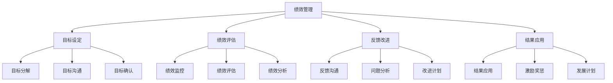
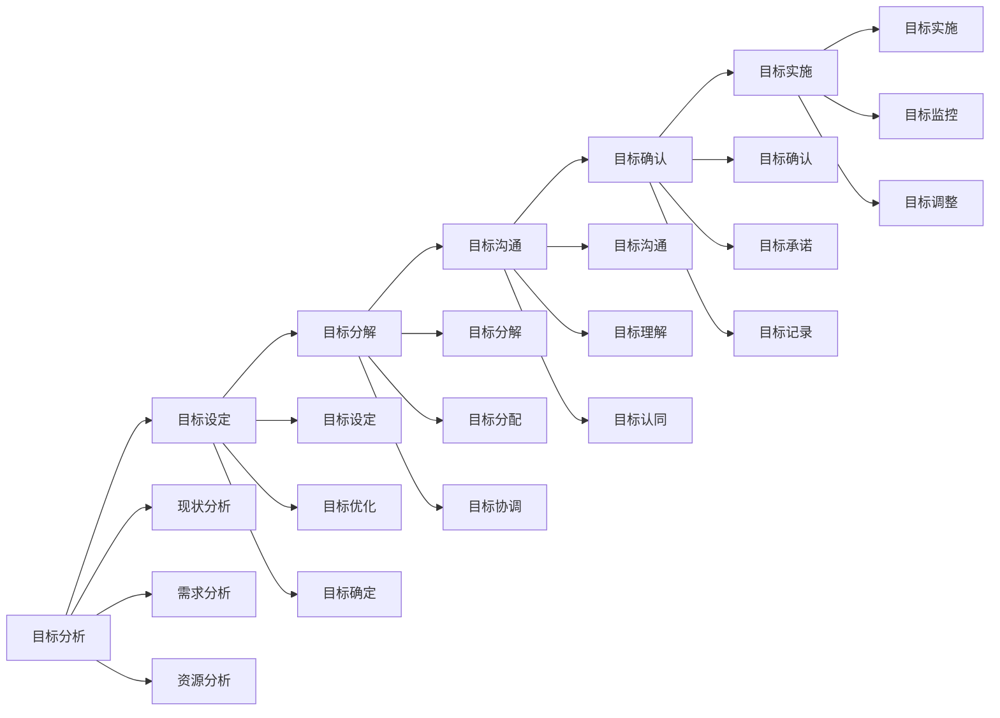
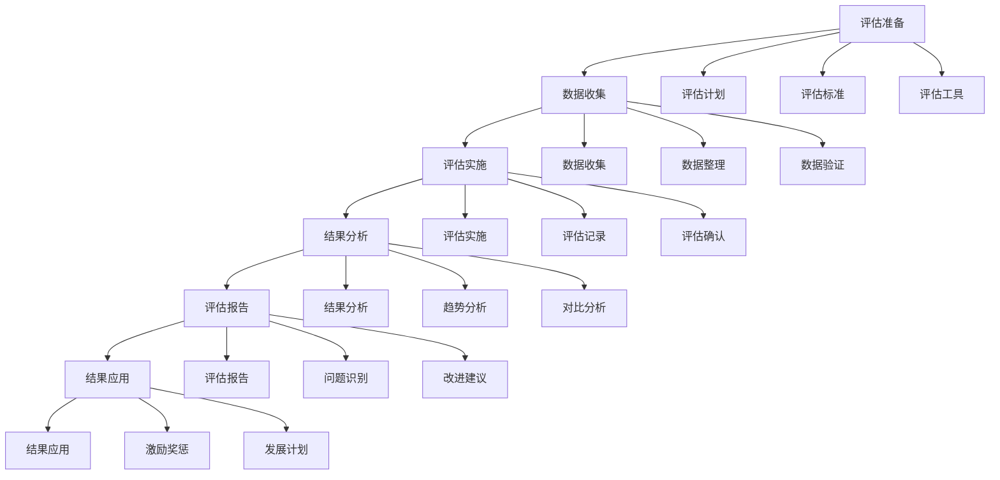
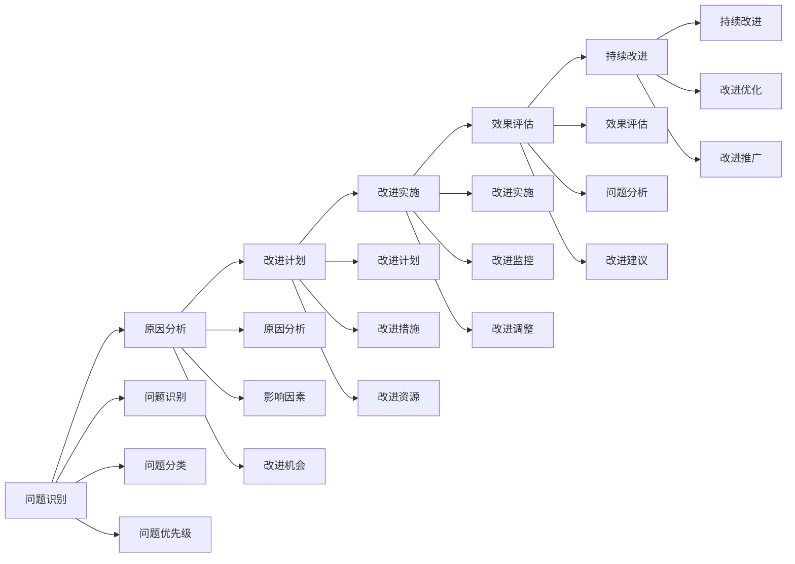
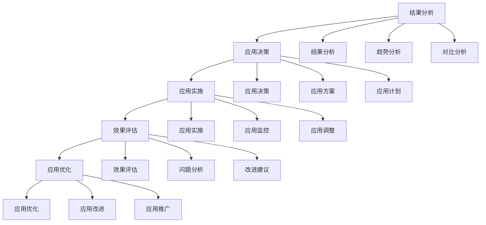
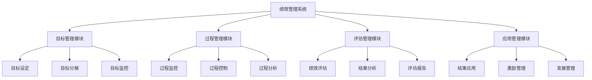

# 绩效管理

## 🎯 核心概念

### 绩效管理定义
**绩效管理**是指管理者与员工之间就目标设定、绩效评估、反馈改进等环节进行持续沟通和协作的管理过程。

### 核心特征
- **目标导向**：以目标实现为核心
- **过程管理**：注重过程控制
- **持续改进**：持续优化提升
- **双向沟通**：管理者与员工双向沟通

## 📚 绩效管理理论框架

### 绩效管理模型

### 绩效管理要素
| 管理要素 | 具体内容 | 管理重点 | 管理方法 |
|----------|----------|----------|----------|
| **目标管理** | 目标设定、目标分解 | 目标明确性 | 目标管理 |
| **过程管理** | 过程监控、过程控制 | 过程有效性 | 过程管理 |
| **结果管理** | 结果评估、结果应用 | 结果有效性 | 结果管理 |
| **改进管理** | 改进计划、改进实施 | 改进持续性 | 改进管理 |

## 🔍 目标设定

### 目标设定原则
#### SMART原则
| 原则要素 | 具体内容 | 设定要求 | 评估标准 |
|----------|----------|----------|----------|
| **S-Specific** | 具体明确 | 目标具体 | 明确性 |
| **M-Measurable** | 可衡量 | 目标可测 | 可测性 |
| **A-Achievable** | 可实现 | 目标可达 | 可达性 |
| **R-Relevant** | 相关性 | 目标相关 | 相关性 |
| **T-Time-bound** | 时限性 | 目标有时限 | 时限性 |

#### 目标设定流程

### 目标分解方法
#### 分解维度
| 分解维度 | 具体内容 | 分解方法 | 分解原则 |
|----------|----------|----------|----------|
| **时间维度** | 年度、季度、月度 | 时间分解 | 时间合理性 |
| **层级维度** | 组织、部门、个人 | 层级分解 | 层级一致性 |
| **职能维度** | 不同职能领域 | 职能分解 | 职能相关性 |
| **项目维度** | 不同项目任务 | 项目分解 | 项目完整性 |

#### 分解工具
| 工具类型 | 具体工具 | 使用场景 | 使用效果 |
|----------|----------|----------|----------|
| **目标树** | 目标分解树 | 目标分解 | 分解清晰 |
| **平衡计分卡** | 平衡计分卡 | 战略分解 | 战略一致性 |
| **OKR** | 目标与关键结果 | 目标管理 | 目标聚焦 |
| **KPI** | 关键绩效指标 | 绩效管理 | 绩效导向 |

## 📊 绩效评估

### 评估体系
#### 评估维度
| 评估维度 | 具体内容 | 评估权重 | 评估方法 |
|----------|----------|----------|----------|
| **工作成果** | 工作产出、工作质量 | 40% | 结果评估 |
| **工作过程** | 工作态度、工作方法 | 30% | 过程评估 |
| **能力发展** | 能力提升、学习成长 | 20% | 能力评估 |
| **团队协作** | 团队合作、沟通协调 | 10% | 协作评估 |

#### 评估方法
| 评估方法 | 具体内容 | 适用场景 | 评估效果 |
|----------|----------|----------|----------|
| **360度评估** | 全方位评估 | 全面评估 | 评估全面性 |
| **目标管理法** | 目标达成评估 | 目标导向 | 目标导向性 |
| **关键事件法** | 关键事件评估 | 行为评估 | 行为客观性 |
| **行为锚定法** | 行为标准评估 | 行为评估 | 行为标准化 |

### 评估流程
#### 评估步骤

#### 评估工具
| 工具类型 | 具体工具 | 使用场景 | 使用效果 |
|----------|----------|----------|----------|
| **评估量表** | 绩效评估量表 | 量化评估 | 评估客观性 |
| **评估问卷** | 绩效评估问卷 | 定性评估 | 评估全面性 |
| **评估系统** | 绩效管理系统 | 系统评估 | 评估效率 |
| **评估模板** | 评估报告模板 | 标准化评估 | 评估一致性 |

## 🔄 反馈改进

### 反馈机制
#### 反馈类型
| 反馈类型 | 具体内容 | 反馈频率 | 反馈效果 |
|----------|----------|----------|----------|
| **正式反馈** | 定期绩效反馈 | 季度/年度 | 反馈正式性 |
| **非正式反馈** | 日常工作反馈 | 日常 | 反馈及时性 |
| **正向反馈** | 表扬鼓励反馈 | 及时 | 激励效果 |
| **改进反馈** | 问题改进反馈 | 及时 | 改进效果 |

#### 反馈技巧
| 反馈技巧 | 具体内容 | 使用场景 | 使用效果 |
|----------|----------|----------|----------|
| **具体化** | 具体问题具体分析 | 问题反馈 | 问题明确性 |
| **建设性** | 建设性改进建议 | 改进反馈 | 改进有效性 |
| **及时性** | 及时反馈问题 | 问题反馈 | 反馈及时性 |
| **双向性** | 双向沟通反馈 | 沟通反馈 | 沟通有效性 |

### 改进管理
#### 改进流程

#### 改进方法
| 改进方法 | 具体内容 | 适用场景 | 改进效果 |
|----------|----------|----------|----------|
| **PDCA循环** | 计划-执行-检查-行动 | 持续改进 | 改进持续性 |
| **5W1H分析** | 问题分析方法 | 问题分析 | 分析全面性 |
| **鱼骨图分析** | 原因分析工具 | 原因分析 | 分析系统性 |
| **头脑风暴** | 创意改进方法 | 创意改进 | 改进创新性 |

## 📈 结果应用

### 应用领域
#### 应用类型
| 应用类型 | 具体内容 | 应用效果 | 应用原则 |
|----------|----------|----------|----------|
| **薪酬管理** | 薪酬调整、奖金分配 | 激励效果 | 公平性 |
| **晋升管理** | 职位晋升、职业发展 | 发展效果 | 公正性 |
| **培训管理** | 培训需求、培训计划 | 发展效果 | 针对性 |
| **人才管理** | 人才识别、人才发展 | 管理效果 | 战略性 |

#### 应用流程

### 激励机制
#### 激励类型
| 激励类型 | 具体内容 | 激励效果 | 激励原则 |
|----------|----------|----------|----------|
| **物质激励** | 薪酬、奖金、福利 | 短期激励 | 公平性 |
| **精神激励** | 表扬、认可、荣誉 | 长期激励 | 及时性 |
| **发展激励** | 培训、晋升、发展 | 持续激励 | 针对性 |
| **参与激励** | 参与决策、参与管理 | 内在激励 | 参与性 |

#### 激励策略
| 策略类型 | 具体内容 | 实施方法 | 预期效果 |
|----------|----------|----------|----------|
| **差异化激励** | 个性化激励方案 | 个性化设计 | 激励针对性 |
| **组合激励** | 多种激励方式组合 | 组合设计 | 激励全面性 |
| **动态激励** | 动态调整激励 | 动态管理 | 激励适应性 |
| **长期激励** | 长期激励计划 | 长期规划 | 激励持续性 |

## 📊 绩效管理系统

### 系统架构
#### 系统组成
| 系统模块 | 具体功能 | 技术实现 | 管理效果 |
|----------|----------|----------|----------|
| **目标管理** | 目标设定、目标分解 | 目标系统 | 目标管理 |
| **过程管理** | 过程监控、过程控制 | 过程系统 | 过程管理 |
| **评估管理** | 绩效评估、结果分析 | 评估系统 | 评估管理 |
| **应用管理** | 结果应用、激励管理 | 应用系统 | 应用管理 |

#### 系统功能

### 系统实施
#### 实施步骤
| 实施阶段 | 具体内容 | 实施方法 | 实施效果 |
|----------|----------|----------|----------|
| **需求分析** | 系统需求分析 | 需求调研 | 需求明确性 |
| **系统设计** | 系统架构设计 | 系统设计 | 设计合理性 |
| **系统开发** | 系统功能开发 | 系统开发 | 功能完整性 |
| **系统实施** | 系统部署实施 | 系统实施 | 实施有效性 |
| **系统维护** | 系统运行维护 | 系统维护 | 运行稳定性 |

#### 实施要点
| 实施要点 | 具体内容 | 实施方法 | 实施效果 |
|----------|----------|----------|----------|
| **用户培训** | 系统使用培训 | 培训计划 | 使用熟练度 |
| **数据迁移** | 历史数据迁移 | 数据迁移 | 数据完整性 |
| **系统集成** | 系统集成整合 | 系统集成 | 集成有效性 |
| **持续优化** | 系统持续优化 | 持续改进 | 系统优化性 |

## 🎯 绩效管理能力发展

### 发展路径
#### 基础阶段
- **目标**：掌握基本绩效管理技能
- **内容**：学习绩效理论、掌握基本方法
- **方法**：理论学习、案例分析
- **评估**：方法应用能力

#### 进阶阶段
- **目标**：提升绩效管理效果
- **内容**：学习高级方法、提升管理能力
- **方法**：实践锻炼、经验积累
- **评估**：管理效果水平

#### 高级阶段
- **目标**：发展战略绩效管理能力
- **内容**：学习战略绩效、发展领导能力
- **方法**：战略实践、领导锻炼
- **评估**：战略管理能力

### 发展方法
#### 理论学习
| 学习内容 | 学习方法 | 学习资源 | 评估标准 |
|----------|----------|----------|----------|
| **绩效理论** | 阅读经典著作 | 绩效管理书籍 | 理论理解度 |
| **管理方法** | 学习管理工具 | 管理工具培训 | 工具应用能力 |
| **案例研究** | 分析管理案例 | 企业案例库 | 案例分析能力 |

#### 实践锻炼
| 实践内容 | 实践方法 | 实践机会 | 评估标准 |
|----------|----------|----------|----------|
| **绩效管理** | 参与绩效管理 | 管理项目 | 管理效果 |
| **系统实施** | 实施绩效系统 | 系统项目 | 实施效果 |
| **管理优化** | 优化绩效管理 | 优化项目 | 优化效果 |

## 🔗 相关概念链接

### 基础概念
- [[01-基础认知层/01-领导力概述|领导力概述]]
- [[01-基础认知层/02-管理者vs领导者|管理者vs领导者]]
- [[02-理论理解层/经典领导理论/02-行为理论|行为理论]]

### 理论概念
- [[02-理论理解层/现代领导理论/01-变革型领导|变革型领导]]
- [[02-理论理解层/现代领导理论/02-服务型领导|服务型领导]]

### 能力概念
- [[03-能力构建层/核心领导能力/02-决策能力|决策能力]]
- [[03-能力构建层/核心领导能力/03-沟通协调|沟通协调]]

### 实践概念
- [[01-团队管理|团队管理]]
- [[02-组织文化建设|组织文化建设]]

## 💡 学习要点总结

### 关键理解
1. **绩效管理**：目标设定、绩效评估、反馈改进、结果应用
2. **目标设定**：SMART原则、目标分解、目标沟通
3. **绩效评估**：评估体系、评估方法、评估流程
4. **反馈改进**：反馈机制、改进管理、持续改进

### 实践应用
1. **目标设定**：设定明确目标
2. **绩效评估**：进行全面评估
3. **反馈改进**：提供有效反馈
4. **结果应用**：合理应用结果

### 思考问题
1. 如何设定有效的绩效目标？
2. 如何进行科学的绩效评估？
3. 如何提供有效的反馈改进？
4. 如何合理应用绩效结果？

---

**下一步**：[[04-危机领导|危机领导]] | [[05-冲突管理|冲突管理]]

