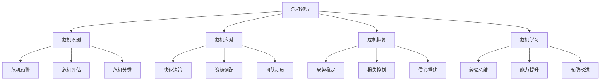
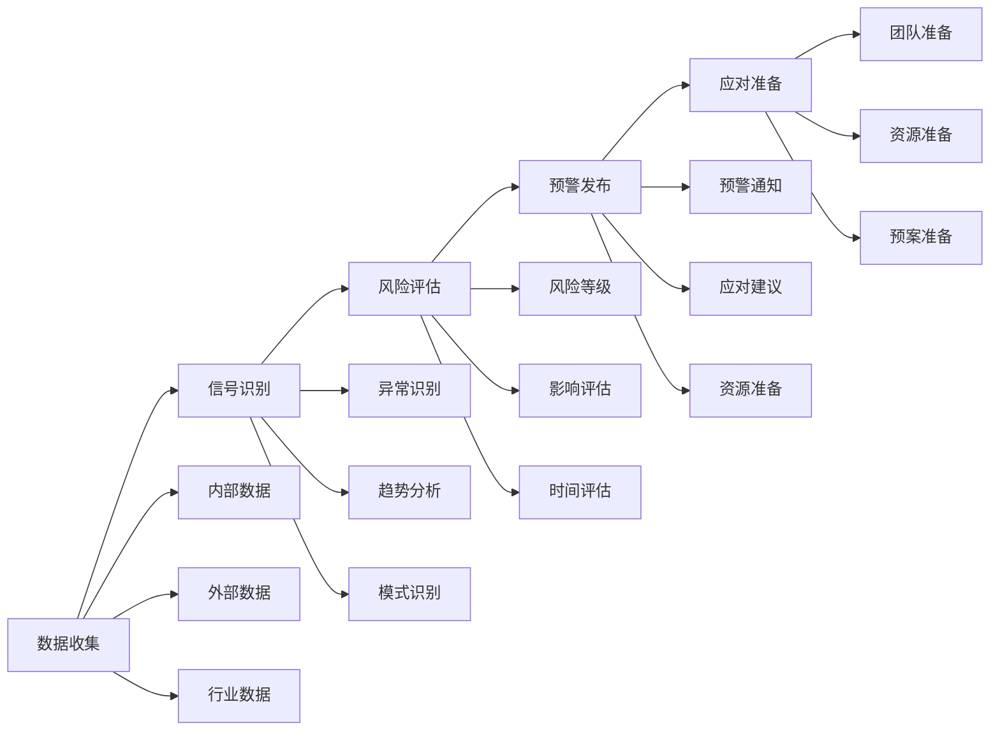
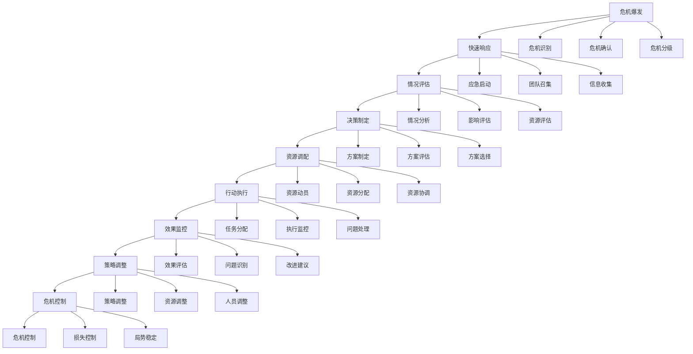
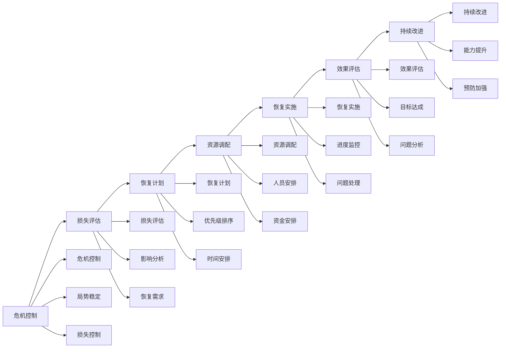

# 危机领导

## 🎯 核心概念

### 危机领导定义
**危机领导**是指在危机情况下，领导者运用特殊的领导技能和策略，迅速应对危机，稳定局势，带领组织度过难关的领导过程。

### 核心特征
- **紧迫性**：时间紧迫，需要快速响应
- **不确定性**：情况复杂，充满不确定性
- **高风险性**：决策风险高，影响重大
- **领导力考验**：对领导能力的严峻考验

## 📚 危机领导理论框架

### 危机领导模型

### 危机类型
| 危机类型 | 具体表现 | 影响程度 | 应对策略 |
|----------|----------|----------|----------|
| **自然灾害** | 地震、洪水、疫情 | 高 | 应急响应 |
| **安全事故** | 生产事故、交通事故 | 中高 | 快速处置 |
| **财务危机** | 资金链断裂、债务危机 | 高 | 财务重组 |
| **声誉危机** | 品牌受损、信任危机 | 中 | 形象修复 |
| **技术危机** | 系统故障、数据泄露 | 中 | 技术修复 |
| **人事危机** | 核心人员离职、罢工 | 中 | 人员稳定 |

## 🔍 危机识别

### 预警机制
#### 预警信号
| 预警类型 | 具体信号 | 识别方法 | 预警级别 |
|----------|----------|----------|----------|
| **财务预警** | 现金流紧张、债务增加 | 财务分析 | 高 |
| **市场预警** | 销售下降、客户流失 | 市场分析 | 中 |
| **运营预警** | 质量下降、效率降低 | 运营分析 | 中 |
| **人员预警** | 离职增加、士气低落 | 人员分析 | 中 |
| **技术预警** | 系统故障、技术落后 | 技术分析 | 中 |

#### 预警系统

### 危机评估
#### 评估维度
| 评估维度 | 具体内容 | 评估方法 | 权重 |
|----------|----------|----------|------|
| **影响程度** | 危机影响范围、深度 | 影响分析 | 30% |
| **紧急程度** | 危机紧迫性、时间性 | 时间分析 | 25% |
| **可控程度** | 危机可控性、可管理性 | 控制分析 | 25% |
| **资源需求** | 应对资源、成本投入 | 资源分析 | 20% |

#### 评估工具
| 工具类型 | 具体工具 | 使用场景 | 评估效果 |
|----------|----------|----------|----------|
| **危机矩阵** | 影响-概率矩阵 | 危机分类 | 分类清晰 |
| **风险评估表** | 风险评估表 | 风险量化 | 量化准确 |
| **影响分析图** | 影响分析图 | 影响分析 | 分析全面 |
| **时间轴分析** | 时间轴分析 | 时间规划 | 规划合理 |

## 🚨 危机应对

### 应对原则
#### 基本原则
| 原则类型 | 具体内容 | 实施要点 | 实施效果 |
|----------|----------|----------|----------|
| **快速响应** | 快速识别、快速决策 | 时间管理 | 响应及时 |
| **统一指挥** | 统一领导、统一行动 | 指挥体系 | 行动一致 |
| **信息公开** | 透明沟通、及时通报 | 沟通策略 | 信任建立 |
| **资源集中** | 集中资源、重点突破 | 资源配置 | 效率提升 |
| **持续监控** | 持续监控、动态调整 | 监控机制 | 应对有效 |

#### 应对流程

### 决策制定
#### 决策特点
| 决策特点 | 具体内容 | 应对策略 | 实施要点 |
|----------|----------|----------|----------|
| **时间紧迫** | 决策时间短 | 快速决策 | 时间管理 |
| **信息不全** | 信息不完整 | 信息收集 | 信息管理 |
| **风险较高** | 决策风险大 | 风险评估 | 风险控制 |
| **影响重大** | 决策影响大 | 影响分析 | 影响控制 |

#### 决策方法
| 决策方法 | 具体内容 | 适用场景 | 决策效果 |
|----------|----------|----------|----------|
| **直觉决策** | 依靠经验直觉 | 时间紧迫 | 决策快速 |
| **简化决策** | 简化决策过程 | 信息不全 | 决策简化 |
| **团队决策** | 团队集体决策 | 复杂问题 | 决策全面 |
| **专家决策** | 专家意见决策 | 专业问题 | 决策专业 |

### 沟通管理
#### 沟通策略
| 策略类型 | 具体内容 | 实施方法 | 沟通效果 |
|----------|----------|----------|----------|
| **透明沟通** | 公开透明沟通 | 信息发布 | 信任建立 |
| **及时沟通** | 及时信息沟通 | 快速响应 | 信息及时 |
| **准确沟通** | 准确信息沟通 | 信息核实 | 信息准确 |
| **一致沟通** | 一致信息沟通 | 统一口径 | 信息一致 |

#### 沟通对象
| 沟通对象 | 沟通内容 | 沟通方式 | 沟通频率 |
|----------|----------|----------|----------|
| **内部员工** | 危机情况、应对措施 | 内部会议 | 及时 |
| **外部客户** | 服务影响、应对方案 | 客户通知 | 及时 |
| **媒体公众** | 危机说明、应对进展 | 新闻发布会 | 定期 |
| **政府监管** | 危机报告、应对措施 | 正式报告 | 及时 |
| **合作伙伴** | 合作影响、应对协调 | 合作沟通 | 及时 |

## 🔄 危机恢复

### 恢复策略
#### 恢复阶段
| 恢复阶段 | 具体内容 | 恢复重点 | 恢复时间 |
|----------|----------|----------|----------|
| **紧急恢复** | 基本功能恢复 | 核心业务 | 1-3天 |
| **短期恢复** | 正常运营恢复 | 全面业务 | 1-4周 |
| **中期恢复** | 能力提升恢复 | 业务优化 | 1-3个月 |
| **长期恢复** | 战略调整恢复 | 战略重构 | 3-12个月 |

#### 恢复流程

### 信心重建
#### 重建策略
| 策略类型 | 具体内容 | 实施方法 | 重建效果 |
|----------|----------|----------|----------|
| **内部信心** | 员工信心重建 | 内部沟通 | 士气提升 |
| **外部信心** | 客户信心重建 | 客户沟通 | 信任恢复 |
| **市场信心** | 市场信心重建 | 市场沟通 | 市场恢复 |
| **社会信心** | 社会信心重建 | 社会责任 | 形象恢复 |

#### 重建方法
| 重建方法 | 具体内容 | 适用场景 | 重建效果 |
|----------|----------|----------|----------|
| **沟通重建** | 通过沟通重建信心 | 信息透明 | 信任建立 |
| **行动重建** | 通过行动重建信心 | 承诺兑现 | 信心恢复 |
| **成果重建** | 通过成果重建信心 | 业绩改善 | 信心提升 |
| **文化重建** | 通过文化重建信心 | 文化重塑 | 文化认同 |

## 📚 危机学习

### 经验总结
#### 总结内容
| 总结要素 | 具体内容 | 总结方法 | 总结价值 |
|----------|----------|----------|----------|
| **危机过程** | 危机发生、发展、结束 | 过程回顾 | 过程理解 |
| **应对措施** | 应对策略、方法、效果 | 措施分析 | 措施优化 |
| **经验教训** | 成功经验、失败教训 | 经验提炼 | 经验积累 |
| **改进建议** | 改进方向、具体建议 | 建议提出 | 改进指导 |

#### 总结方法
| 总结方法 | 具体内容 | 适用场景 | 总结效果 |
|----------|----------|----------|----------|
| **回顾会议** | 危机回顾会议 | 团队总结 | 团队参与 |
| **案例分析** | 危机案例分析 | 深度分析 | 分析深度 |
| **文档总结** | 危机总结文档 | 正式总结 | 总结正式 |
| **知识分享** | 知识分享会 | 知识传播 | 知识传播 |

### 能力提升
#### 提升方向
| 提升方向 | 具体内容 | 提升方法 | 提升效果 |
|----------|----------|----------|----------|
| **预警能力** | 危机预警、风险识别 | 预警训练 | 预警敏感 |
| **决策能力** | 快速决策、风险决策 | 决策训练 | 决策效率 |
| **沟通能力** | 危机沟通、媒体沟通 | 沟通训练 | 沟通效果 |
| **协调能力** | 资源协调、团队协调 | 协调训练 | 协调效率 |

#### 提升方法
| 提升方法 | 具体内容 | 实施要点 | 提升效果 |
|----------|----------|----------|----------|
| **理论学习** | 危机管理理论 | 理论学习 | 理论水平 |
| **案例研究** | 危机案例研究 | 案例分析 | 分析能力 |
| **模拟训练** | 危机模拟训练 | 实战训练 | 实战能力 |
| **经验积累** | 危机经验积累 | 经验总结 | 经验丰富 |

## 📊 危机领导能力评估

### 评估维度
| 评估维度 | 具体内容 | 评估方法 | 权重 |
|----------|----------|----------|------|
| **预警能力** | 危机识别、预警响应 | 预警测试 | 25% |
| **决策能力** | 快速决策、风险决策 | 决策测试 | 30% |
| **沟通能力** | 危机沟通、信息管理 | 沟通评估 | 25% |
| **协调能力** | 资源协调、团队协调 | 协调评估 | 20% |

### 评估工具
#### 危机领导评估表
| 评估项目 | 评估内容 | 评分标准 | 权重 |
|----------|----------|----------|------|
| **危机识别** | 危机预警、风险识别 | 1-5分 | 25% |
| **快速决策** | 决策速度、决策质量 | 1-5分 | 30% |
| **危机沟通** | 信息沟通、媒体应对 | 1-5分 | 25% |
| **资源协调** | 资源调配、团队协调 | 1-5分 | 20% |

## 🎯 危机领导能力发展

### 发展路径
#### 基础阶段
- **目标**：掌握基本危机管理技能
- **内容**：学习危机理论、掌握基本方法
- **方法**：理论学习、案例分析
- **评估**：方法应用能力

#### 进阶阶段
- **目标**：提升危机应对效果
- **内容**：学习高级方法、提升应对能力
- **方法**：实践锻炼、经验积累
- **评估**：应对效果水平

#### 高级阶段
- **目标**：发展战略危机领导能力
- **内容**：学习战略危机、发展领导能力
- **方法**：战略实践、领导锻炼
- **评估**：战略领导能力

### 发展方法
#### 理论学习
| 学习内容 | 学习方法 | 学习资源 | 评估标准 |
|----------|----------|----------|----------|
| **危机理论** | 阅读经典著作 | 危机管理书籍 | 理论理解度 |
| **应对方法** | 学习应对工具 | 应对工具培训 | 工具应用能力 |
| **案例研究** | 分析危机案例 | 企业案例库 | 案例分析能力 |

#### 实践锻炼
| 实践内容 | 实践方法 | 实践机会 | 评估标准 |
|----------|----------|----------|----------|
| **危机应对** | 参与危机应对 | 危机项目 | 应对效果 |
| **危机管理** | 管理危机工作 | 管理岗位 | 管理效果 |
| **危机预防** | 预防危机发生 | 预防项目 | 预防效果 |

## 🔗 相关概念链接

### 基础概念
- [[01-基础认知层/01-领导力概述|领导力概述]]
- [[01-基础认知层/04-现代领导力挑战|现代挑战]]
- [[02-理论理解层/经典领导理论/03-情境理论|情境理论]]

### 理论概念
- [[02-理论理解层/现代领导理论/01-变革型领导|变革型领导]]
- [[02-理论理解层/现代领导理论/02-服务型领导|服务型领导]]

### 能力概念
- [[03-能力构建层/核心领导能力/02-决策能力|决策能力]]
- [[03-能力构建层/核心领导能力/03-沟通协调|沟通协调]]

### 实践概念
- [[01-团队管理|团队管理]]
- [[02-组织文化建设|组织文化建设]]

## 💡 学习要点总结

### 关键理解
1. **危机特征**：紧迫性、不确定性、高风险性
2. **应对原则**：快速响应、统一指挥、信息公开
3. **决策特点**：时间紧迫、信息不全、风险较高
4. **恢复策略**：紧急恢复、短期恢复、中期恢复

### 实践应用
1. **危机识别**：建立预警机制、识别危机信号
2. **危机应对**：快速响应、统一指挥、有效沟通
3. **危机恢复**：制定恢复计划、重建信心
4. **危机学习**：总结经验、提升能力

### 思考问题
1. 如何建立有效的危机预警机制？
2. 如何在危机中快速做出正确决策？
3. 如何进行有效的危机沟通？
4. 如何从危机中学习和提升？

---

**下一步**：[[04-项目管理|项目管理]] | [[05-发展提升层/自我发展/01-自我认知与评估|自我认知]]
