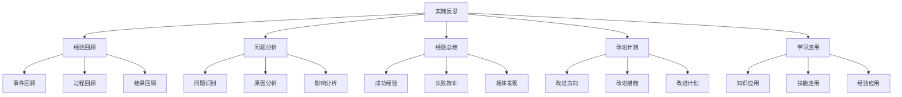
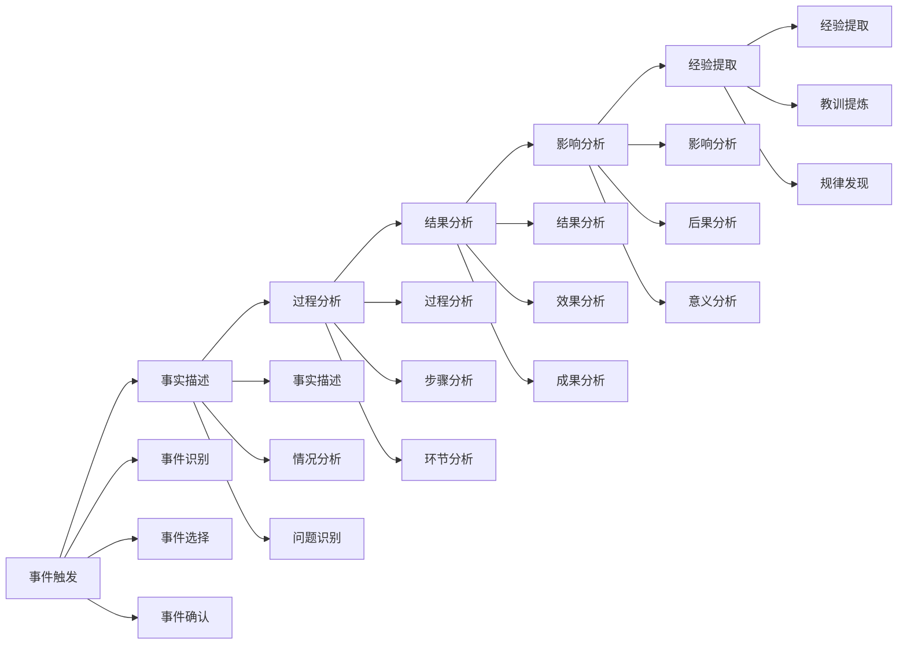
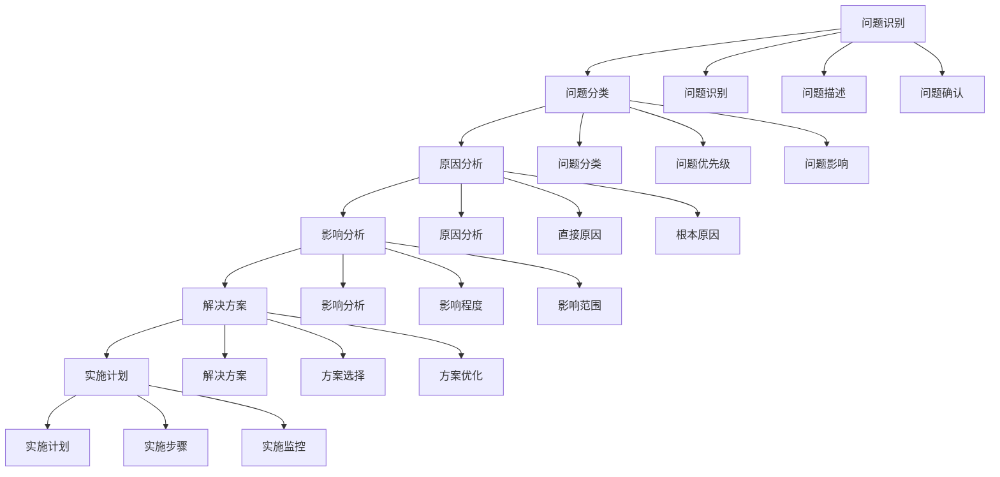
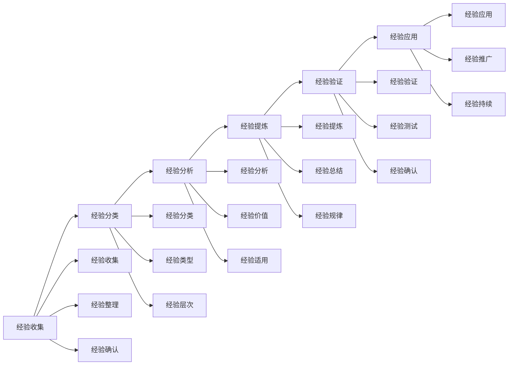
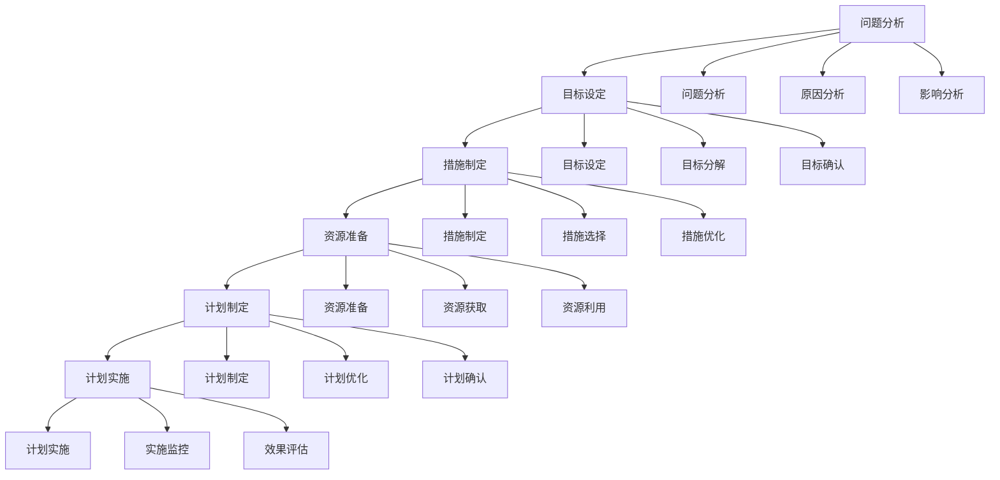
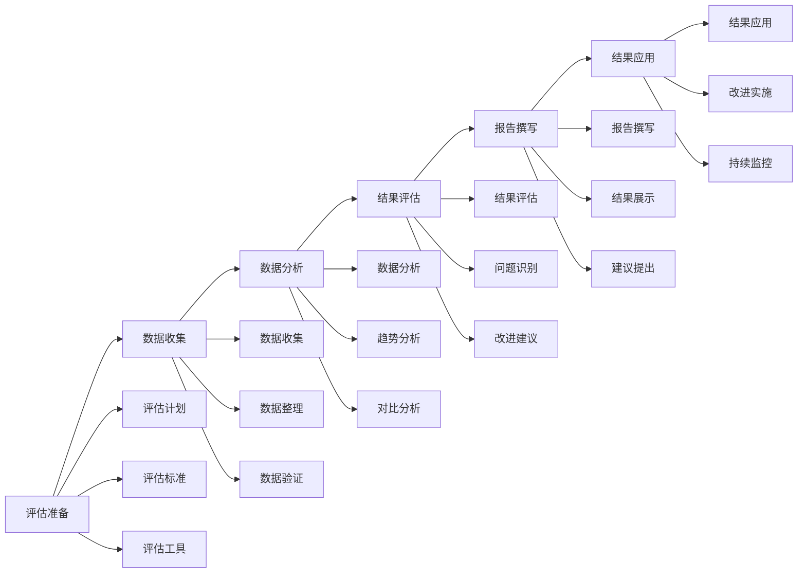

# 实践反思

## 🎯 核心概念

### 实践反思定义
**实践反思**是指领导者在实践过程中，通过回顾、分析、总结和思考，从经验中学习，提升领导能力和效果的过程。

### 核心特征
- **回顾性**：回顾实践过程
- **分析性**：分析实践结果
- **总结性**：总结实践经验
- **学习性**：从经验中学习

## 📚 实践反思理论框架

### 实践反思模型

### 反思层次
| 反思层次 | 具体内容 | 反思重点 | 反思方法 |
|----------|----------|----------|----------|
| **表层反思** | 事件描述、过程描述 | 事实回顾 | 描述反思 |
| **中层反思** | 问题分析、原因分析 | 问题分析 | 分析反思 |
| **深层反思** | 价值思考、意义思考 | 价值探索 | 价值反思 |
| **核心反思** | 自我认知、身份认同 | 自我探索 | 自我反思 |

## 🔍 经验回顾

### 回顾类型
#### 事件回顾
| 回顾类型 | 具体内容 | 回顾重点 | 回顾方法 |
|----------|----------|----------|----------|
| **成功事件** | 成功经历、成功案例 | 成功因素 | 成功分析 |
| **失败事件** | 失败经历、失败案例 | 失败原因 | 失败分析 |
| **关键事件** | 重要事件、转折事件 | 关键影响 | 关键分析 |
| **日常事件** | 日常工作、日常经历 | 日常规律 | 日常分析 |

#### 过程回顾
| 回顾类型 | 具体内容 | 回顾重点 | 回顾方法 |
|----------|----------|----------|----------|
| **决策过程** | 决策过程、决策结果 | 决策质量 | 决策分析 |
| **执行过程** | 执行过程、执行结果 | 执行效果 | 执行分析 |
| **沟通过程** | 沟通过程、沟通结果 | 沟通效果 | 沟通分析 |
| **管理过程** | 管理过程、管理结果 | 管理效果 | 管理分析 |

### 回顾方法
#### 回顾工具
| 工具类型 | 具体工具 | 使用场景 | 回顾效果 |
|----------|----------|----------|----------|
| **反思日记** | 日常反思记录 | 日常反思 | 反思持续 |
| **反思模型** | 结构化反思模型 | 深度反思 | 反思深入 |
| **反思讨论** | 反思交流讨论 | 集体反思 | 反思全面 |
| **反思总结** | 反思总结报告 | 正式反思 | 反思正式 |

#### 回顾流程

## 📊 问题分析

### 分析类型
#### 问题识别
| 问题类型 | 具体内容 | 识别方法 | 识别重点 |
|----------|----------|----------|----------|
| **决策问题** | 决策失误、决策质量 | 决策分析 | 决策改进 |
| **执行问题** | 执行不力、执行效果 | 执行分析 | 执行改进 |
| **沟通问题** | 沟通障碍、沟通效果 | 沟通分析 | 沟通改进 |
| **管理问题** | 管理不当、管理效果 | 管理分析 | 管理改进 |

#### 原因分析
| 原因类型 | 具体内容 | 分析方法 | 分析重点 |
|----------|----------|----------|----------|
| **直接原因** | 直接导致问题的原因 | 直接分析 | 原因明确 |
| **根本原因** | 根本导致问题的原因 | 根本分析 | 原因深入 |
| **系统原因** | 系统性问题原因 | 系统分析 | 原因全面 |
| **个人原因** | 个人因素导致的原因 | 个人分析 | 原因客观 |

### 分析方法
#### 分析工具
| 工具类型 | 具体工具 | 使用场景 | 分析效果 |
|----------|----------|----------|----------|
| **鱼骨图** | 原因分析图 | 原因分析 | 分析系统 |
| **5W1H** | 问题分析方法 | 问题分析 | 分析全面 |
| **SWOT分析** | 优势劣势分析 | 综合分析 | 分析客观 |
| **根因分析** | 根本原因分析 | 深度分析 | 分析深入 |

#### 分析流程

## 🎯 经验总结

### 总结类型
#### 成功经验
| 经验类型 | 具体内容 | 总结方法 | 总结效果 |
|----------|----------|----------|----------|
| **决策经验** | 成功决策、决策技巧 | 经验提炼 | 经验积累 |
| **执行经验** | 成功执行、执行技巧 | 经验提炼 | 经验积累 |
| **沟通经验** | 成功沟通、沟通技巧 | 经验提炼 | 经验积累 |
| **管理经验** | 成功管理、管理技巧 | 经验提炼 | 经验积累 |

#### 失败教训
| 教训类型 | 具体内容 | 总结方法 | 总结效果 |
|----------|----------|----------|----------|
| **决策教训** | 失败决策、决策失误 | 教训总结 | 教训吸取 |
| **执行教训** | 失败执行、执行失误 | 教训总结 | 教训吸取 |
| **沟通教训** | 失败沟通、沟通失误 | 教训总结 | 教训吸取 |
| **管理教训** | 失败管理、管理失误 | 教训总结 | 教训吸取 |

### 总结方法
#### 总结工具
| 工具类型 | 具体工具 | 使用场景 | 总结效果 |
|----------|----------|----------|----------|
| **经验总结表** | 结构化经验总结 | 经验整理 | 总结系统 |
| **教训总结表** | 结构化教训总结 | 教训整理 | 总结系统 |
| **规律总结表** | 规律性总结 | 规律发现 | 总结深入 |
| **最佳实践** | 最佳实践总结 | 实践优化 | 总结实用 |

#### 总结流程

## 📈 改进计划

### 计划类型
#### 改进方向
| 改进方向 | 具体内容 | 改进重点 | 改进方法 |
|----------|----------|----------|----------|
| **能力改进** | 能力提升、技能发展 | 能力发展 | 能力训练 |
| **方法改进** | 方法优化、技巧提升 | 方法优化 | 方法创新 |
| **行为改进** | 行为改变、习惯养成 | 行为改变 | 行为训练 |
| **思维改进** | 思维优化、认知提升 | 思维发展 | 思维训练 |

#### 改进措施
| 措施类型 | 具体内容 | 实施要点 | 实施效果 |
|----------|----------|----------|----------|
| **学习措施** | 学习计划、学习实施 | 学习持续 | 知识提升 |
| **实践措施** | 实践计划、实践实施 | 实践持续 | 能力提升 |
| **训练措施** | 训练计划、训练实施 | 训练持续 | 技能提升 |
| **反思措施** | 反思计划、反思实施 | 反思持续 | 反思能力 |

### 计划制定
#### 制定要素
| 制定要素 | 具体内容 | 制定要点 | 实施重点 |
|----------|----------|----------|----------|
| **改进目标** | 具体目标、明确目标 | 目标明确 | 目标达成 |
| **改进措施** | 具体措施、可行措施 | 措施可行 | 措施实施 |
| **改进资源** | 所需资源、资源准备 | 资源充足 | 资源利用 |
| **改进时间** | 时间安排、进度控制 | 时间合理 | 时间管理 |

#### 制定流程

## 🚀 学习应用

### 应用类型
#### 知识应用
| 应用类型 | 具体内容 | 应用方法 | 应用效果 |
|----------|----------|----------|----------|
| **理论知识** | 理论应用、理论指导 | 理论指导 | 理论价值 |
| **实践经验** | 经验应用、经验指导 | 经验指导 | 经验价值 |
| **最佳实践** | 最佳实践应用 | 实践指导 | 实践价值 |
| **创新方法** | 创新方法应用 | 方法指导 | 方法价值 |

#### 技能应用
| 应用类型 | 具体内容 | 应用方法 | 应用效果 |
|----------|----------|----------|----------|
| **领导技能** | 领导技能应用 | 技能实践 | 技能提升 |
| **管理技能** | 管理技能应用 | 技能实践 | 技能提升 |
| **沟通技能** | 沟通技能应用 | 技能实践 | 技能提升 |
| **决策技能** | 决策技能应用 | 技能实践 | 技能提升 |

### 应用方法
#### 应用策略
| 策略类型 | 具体内容 | 实施要点 | 实施效果 |
|----------|----------|----------|----------|
| **直接应用** | 直接应用、立即应用 | 应用及时 | 效果及时 |
| **渐进应用** | 渐进应用、逐步应用 | 应用渐进 | 效果稳定 |
| **创新应用** | 创新应用、灵活应用 | 应用创新 | 效果创新 |
| **持续应用** | 持续应用、长期应用 | 应用持续 | 效果持续 |

#### 应用流程

## 📊 反思效果评估

### 评估维度
| 评估维度 | 具体内容 | 评估方法 | 权重 |
|----------|----------|----------|------|
| **反思深度** | 反思深度、反思质量 | 深度评估 | 30% |
| **学习效果** | 学习成果、知识掌握 | 学习评估 | 30% |
| **改进效果** | 改进成果、能力提升 | 改进评估 | 25% |
| **应用效果** | 应用成果、实践效果 | 应用评估 | 15% |

### 评估方法
#### 评估工具
| 工具类型 | 具体工具 | 使用场景 | 评估效果 |
|----------|----------|----------|----------|
| **反思评估表** | 反思质量评估表 | 反思评估 | 评估客观 |
| **学习评估表** | 学习效果评估表 | 学习评估 | 评估准确 |
| **改进评估表** | 改进效果评估表 | 改进评估 | 评估全面 |
| **应用评估表** | 应用效果评估表 | 应用评估 | 评估及时 |

#### 评估流程

## 🎯 实践反思工具

### 反思工具
#### 反思日记
| 日记要素 | 具体内容 | 填写要求 | 反思效果 |
|----------|----------|----------|----------|
| **事件描述** | 具体事件、情况描述 | 客观描述 | 事实清晰 |
| **感受分析** | 个人感受、情绪分析 | 主观分析 | 感受明确 |
| **原因分析** | 事件原因、影响因素 | 深入分析 | 原因明确 |
| **经验总结** | 成功经验、失败教训 | 经验提炼 | 经验积累 |
| **改进计划** | 改进方向、具体措施 | 计划制定 | 改进明确 |

#### 反思模型
| 模型类型 | 具体内容 | 使用场景 | 反思效果 |
|----------|----------|----------|----------|
| **Kolb反思模型** | 经验-反思-概念化-应用 | 学习反思 | 反思系统 |
| **Gibbs反思模型** | 描述-感受-评估-分析-结论-行动计划 | 深度反思 | 反思深入 |
| **Johns反思模型** | 描述-反思-影响-替代-学习 | 护理反思 | 反思专业 |
| **Rolfe反思模型** | 什么-所以什么-现在什么 | 简单反思 | 反思简洁 |

## 🔗 相关概念链接

### 基础概念
- [[01-基础认知层/01-领导力概述|领导力概述]]
- [[01-基础认知层/04-现代领导力挑战|现代挑战]]
- [[02-理论理解层/现代领导理论/01-变革型领导|变革型领导]]

### 理论概念
- [[02-理论理解层/现代领导理论/02-服务型领导|服务型领导]]
- [[02-理论理解层/现代领导理论/03-分布式领导|分布式领导]]

### 能力概念
- [[03-能力构建层/核心领导能力/06-情商与自我管理|情商管理]]
- [[03-能力构建层/07-能力发展路径|能力发展路径]]

### 实践概念
- [[自我发展/01-自我认知与评估|自我认知]]
- [[02-持续改进|持续改进]]

## 💡 学习要点总结

### 关键理解
1. **实践反思**：经验回顾、问题分析、经验总结、改进计划
2. **经验回顾**：事件回顾、过程回顾、结果回顾
3. **问题分析**：问题识别、原因分析、影响分析
4. **经验总结**：成功经验、失败教训、规律发现

### 实践应用
1. **经验回顾**：全面回顾实践经验
2. **问题分析**：深入分析实践问题
3. **经验总结**：系统总结实践经验
4. **改进计划**：制定有效改进计划

### 思考问题
1. 如何全面回顾实践经验？
2. 如何深入分析实践问题？
3. 如何系统总结实践经验？
4. 如何制定有效改进计划？

---

**下一步**：[[02-持续改进|持续改进]] | [[06-案例分析层/成功案例/01-成功领导者案例|成功案例]]
