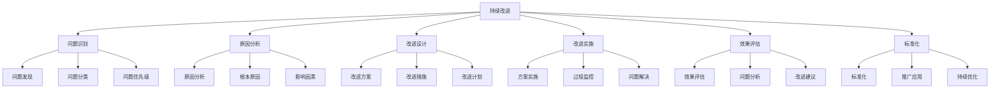
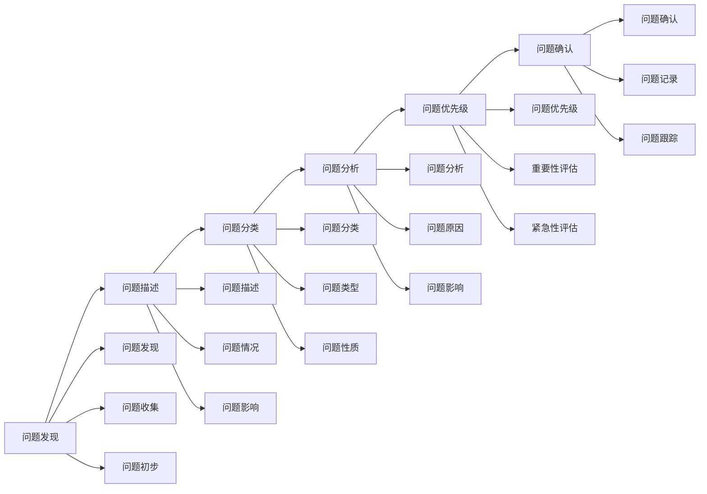
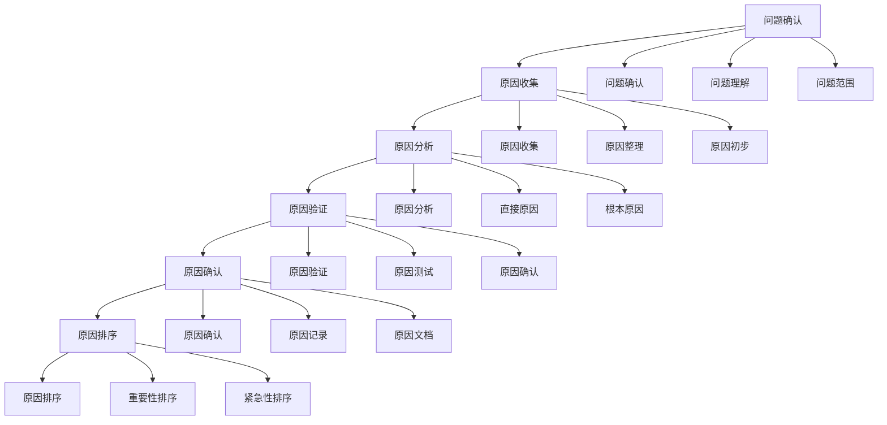
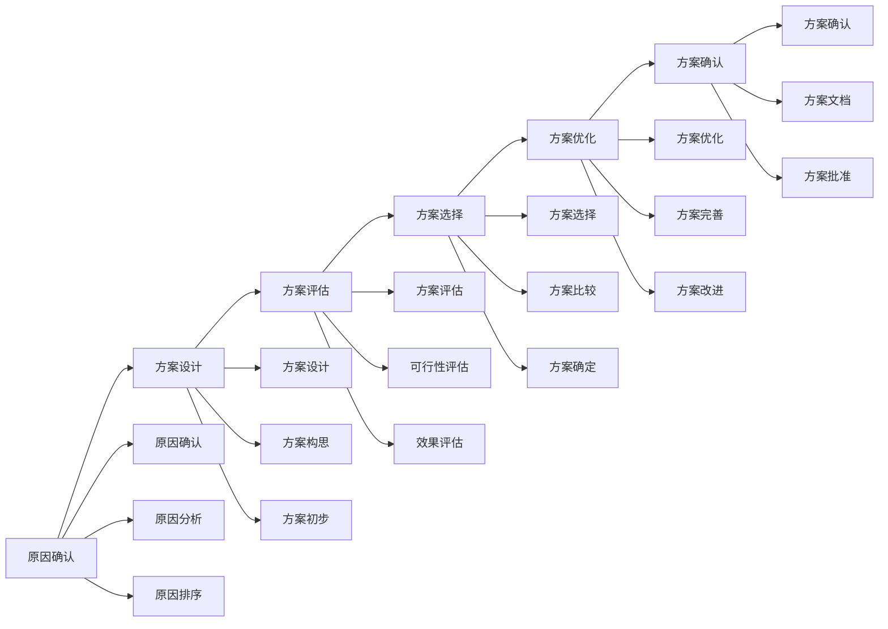
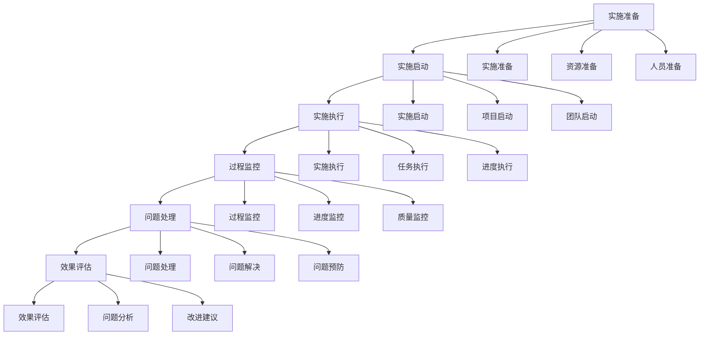
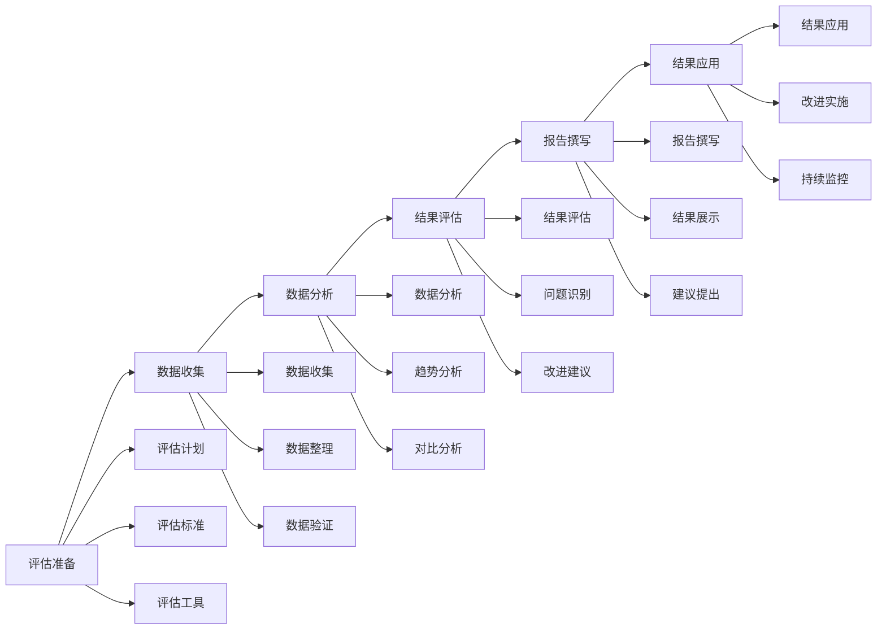
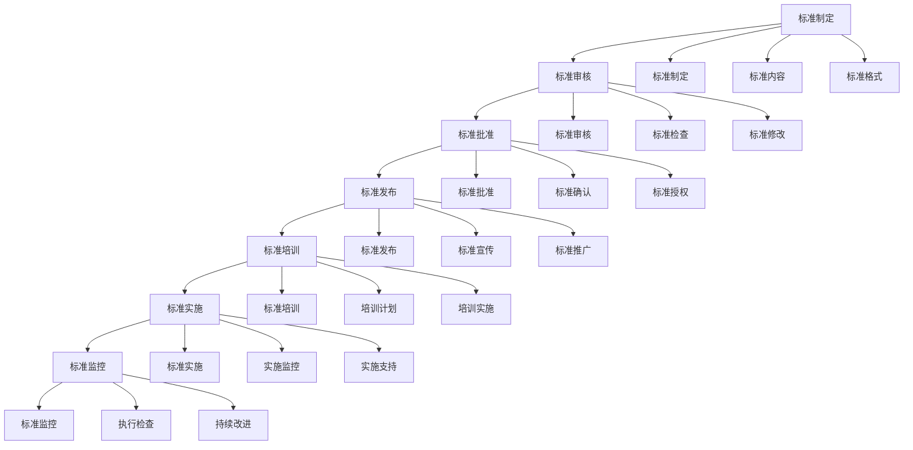

# 持续改进

## 🎯 核心概念

### 持续改进定义
**持续改进**是指领导者在领导实践中，通过系统性的方法，不断识别问题、分析原因、制定改进措施、实施改进并评估效果，实现领导能力和效果的持续提升的过程。

### 核心特征
- **系统性**：系统性的改进方法
- **持续性**：持续不断的改进
- **循环性**：循环往复的改进过程
- **发展性**：促进持续发展

## 📚 持续改进理论框架

### 持续改进模型

### 改进层次
| 改进层次 | 具体内容 | 改进重点 | 改进方法 |
|----------|----------|----------|----------|
| **个人改进** | 个人能力、个人表现 | 个人发展 | 个人提升 |
| **团队改进** | 团队协作、团队绩效 | 团队发展 | 团队提升 |
| **组织改进** | 组织效率、组织效果 | 组织发展 | 组织提升 |
| **系统改进** | 系统优化、系统创新 | 系统发展 | 系统提升 |

## 🔍 问题识别

### 识别类型
#### 问题来源
| 问题来源 | 具体内容 | 识别方法 | 识别重点 |
|----------|----------|----------|----------|
| **内部问题** | 内部流程、内部管理 | 内部分析 | 内部改进 |
| **外部问题** | 外部环境、外部需求 | 外部分析 | 外部适应 |
| **系统问题** | 系统性问题、系统缺陷 | 系统分析 | 系统改进 |
| **个人问题** | 个人能力、个人表现 | 个人分析 | 个人改进 |

#### 问题类型
| 问题类型 | 具体内容 | 识别方法 | 识别重点 |
|----------|----------|----------|----------|
| **效率问题** | 效率低下、效率不足 | 效率分析 | 效率提升 |
| **质量问题** | 质量不高、质量不稳定 | 质量分析 | 质量改善 |
| **成本问题** | 成本过高、成本控制 | 成本分析 | 成本控制 |
| **服务问题** | 服务不佳、服务不满足 | 服务分析 | 服务改善 |

### 识别方法
#### 识别工具
| 工具类型 | 具体工具 | 使用场景 | 识别效果 |
|----------|----------|----------|----------|
| **问题清单** | 问题检查清单 | 问题识别 | 识别全面 |
| **问题矩阵** | 问题优先级矩阵 | 问题分类 | 分类清晰 |
| **问题地图** | 问题关系地图 | 问题分析 | 分析深入 |
| **问题追踪** | 问题追踪系统 | 问题监控 | 监控及时 |

#### 识别流程

## 📊 原因分析

### 分析类型
#### 原因层次
| 原因层次 | 具体内容 | 分析方法 | 分析重点 |
|----------|----------|----------|----------|
| **直接原因** | 直接导致问题的原因 | 直接分析 | 原因明确 |
| **间接原因** | 间接导致问题的原因 | 间接分析 | 原因深入 |
| **根本原因** | 根本导致问题的原因 | 根本分析 | 原因根本 |
| **系统原因** | 系统性问题原因 | 系统分析 | 原因全面 |

#### 原因类型
| 原因类型 | 具体内容 | 分析方法 | 分析重点 |
|----------|----------|----------|----------|
| **人员原因** | 人员因素、人员问题 | 人员分析 | 人员改进 |
| **流程原因** | 流程问题、流程缺陷 | 流程分析 | 流程改进 |
| **系统原因** | 系统问题、系统缺陷 | 系统分析 | 系统改进 |
| **环境原因** | 环境因素、环境问题 | 环境分析 | 环境适应 |

### 分析方法
#### 分析工具
| 工具类型 | 具体工具 | 使用场景 | 分析效果 |
|----------|----------|----------|----------|
| **鱼骨图** | 原因分析图 | 原因分析 | 分析系统 |
| **5W1H** | 问题分析方法 | 问题分析 | 分析全面 |
| **根因分析** | 根本原因分析 | 深度分析 | 分析深入 |
| **帕累托分析** | 80/20原则分析 | 重点分析 | 分析重点 |

#### 分析流程

## 🎯 改进设计

### 设计类型
#### 改进方案
| 方案类型 | 具体内容 | 设计要点 | 设计效果 |
|----------|----------|----------|----------|
| **流程改进** | 流程优化、流程再造 | 流程设计 | 流程高效 |
| **系统改进** | 系统优化、系统升级 | 系统设计 | 系统稳定 |
| **人员改进** | 人员培训、人员发展 | 人员设计 | 人员提升 |
| **管理改进** | 管理优化、管理创新 | 管理设计 | 管理有效 |

#### 改进措施
| 措施类型 | 具体内容 | 实施要点 | 实施效果 |
|----------|----------|----------|----------|
| **技术措施** | 技术改进、技术升级 | 技术实施 | 技术提升 |
| **管理措施** | 管理改进、管理优化 | 管理实施 | 管理提升 |
| **培训措施** | 培训计划、培训实施 | 培训实施 | 能力提升 |
| **激励措施** | 激励机制、激励实施 | 激励实施 | 动力提升 |

### 设计方法
#### 设计原则
| 设计原则 | 具体内容 | 实施要点 | 实施效果 |
|----------|----------|----------|----------|
| **系统性** | 系统设计、系统思考 | 系统实施 | 系统效果 |
| **可行性** | 方案可行、实施可行 | 可行实施 | 实施成功 |
| **经济性** | 成本控制、效益最大化 | 经济实施 | 效益最佳 |
| **持续性** | 持续改进、持续发展 | 持续实施 | 持续效果 |

#### 设计流程

## 🚀 改进实施

### 实施类型
#### 实施策略
| 策略类型 | 具体内容 | 实施要点 | 实施效果 |
|----------|----------|----------|----------|
| **渐进式** | 逐步实施、稳步推进 | 渐进实施 | 风险可控 |
| **激进式** | 快速实施、全面推进 | 激进实施 | 效果显著 |
| **试点式** | 先试点后推广 | 试点实施 | 风险降低 |
| **混合式** | 结合多种策略 | 混合实施 | 效果最佳 |

#### 实施阶段
| 实施阶段 | 具体内容 | 阶段重点 | 时间周期 |
|----------|----------|----------|----------|
| **准备阶段** | 实施准备、资源准备 | 准备工作 | 1-2周 |
| **启动阶段** | 实施启动、项目启动 | 启动工作 | 1周 |
| **实施阶段** | 方案实施、措施实施 | 实施工作 | 4-12周 |
| **巩固阶段** | 效果巩固、成果巩固 | 巩固工作 | 2-4周 |

### 实施方法
#### 实施工具
| 工具类型 | 具体工具 | 使用场景 | 实施效果 |
|----------|----------|----------|----------|
| **项目管理** | 项目管理工具 | 项目管理 | 管理有效 |
| **进度控制** | 进度控制工具 | 进度管理 | 进度可控 |
| **质量控制** | 质量控制工具 | 质量管理 | 质量保证 |
| **风险控制** | 风险控制工具 | 风险管理 | 风险可控 |

#### 实施流程

## 📈 效果评估

### 评估类型
#### 评估维度
| 评估维度 | 具体内容 | 评估方法 | 权重 |
|----------|----------|----------|------|
| **效果评估** | 改进效果、目标达成 | 效果评估 | 40% |
| **效率评估** | 效率提升、时间节约 | 效率评估 | 25% |
| **质量评估** | 质量改善、质量提升 | 质量评估 | 20% |
| **满意度评估** | 用户满意度、员工满意度 | 满意度调查 | 15% |

#### 评估方法
| 方法类型 | 具体方法 | 使用场景 | 评估效果 |
|----------|----------|----------|----------|
| **定量评估** | 数据指标、统计分析 | 客观评估 | 评估准确 |
| **定性评估** | 访谈、观察、分析 | 主观评估 | 评估全面 |
| **对比评估** | 前后对比、横向对比 | 比较评估 | 评估可比 |
| **综合评估** | 定量定性结合 | 全面评估 | 评估综合 |

### 评估方法
#### 评估工具
| 工具类型 | 具体工具 | 使用场景 | 评估效果 |
|----------|----------|----------|----------|
| **效果评估表** | 改进效果评估表 | 效果评估 | 评估客观 |
| **效率评估表** | 效率提升评估表 | 效率评估 | 评估准确 |
| **质量评估表** | 质量改善评估表 | 质量评估 | 评估全面 |
| **满意度调查** | 满意度调查问卷 | 满意度评估 | 评估及时 |

#### 评估流程

## 🔄 标准化

### 标准化类型
#### 标准类型
| 标准类型 | 具体内容 | 制定要点 | 实施效果 |
|----------|----------|----------|----------|
| **流程标准** | 流程规范、流程标准 | 流程标准化 | 流程统一 |
| **操作标准** | 操作规范、操作标准 | 操作标准化 | 操作统一 |
| **质量标准** | 质量标准、质量规范 | 质量标准化 | 质量统一 |
| **管理标准** | 管理规范、管理标准 | 管理标准化 | 管理统一 |

#### 标准制定
| 制定要素 | 具体内容 | 制定要点 | 实施重点 |
|----------|----------|----------|----------|
| **标准内容** | 标准内容、标准要求 | 内容明确 | 内容清晰 |
| **标准流程** | 标准流程、标准步骤 | 流程清晰 | 流程合理 |
| **标准工具** | 标准工具、标准模板 | 工具实用 | 工具有效 |
| **标准培训** | 标准培训、标准教育 | 培训到位 | 培训有效 |

### 标准化方法
#### 标准化工具
| 工具类型 | 具体工具 | 使用场景 | 标准化效果 |
|----------|----------|----------|------------|
| **标准文档** | 标准文档、标准手册 | 标准制定 | 标准明确 |
| **标准模板** | 标准模板、标准格式 | 标准应用 | 标准统一 |
| **标准检查** | 标准检查、标准审核 | 标准执行 | 标准有效 |
| **标准培训** | 标准培训、标准教育 | 标准推广 | 标准普及 |

#### 标准化流程

## 🎯 持续改进工具

### 改进工具
#### PDCA循环
| 循环阶段 | 具体内容 | 实施要点 | 实施效果 |
|----------|----------|----------|----------|
| **Plan计划** | 制定计划、目标设定 | 计划明确 | 计划有效 |
| **Do执行** | 计划执行、措施实施 | 执行到位 | 执行有效 |
| **Check检查** | 效果检查、问题识别 | 检查及时 | 检查有效 |
| **Act行动** | 改进行动、标准化 | 行动及时 | 行动有效 |

#### 改进工具
| 工具类型 | 具体工具 | 使用场景 | 改进效果 |
|----------|----------|----------|----------|
| **问题解决** | 问题解决方法 | 问题解决 | 解决有效 |
| **流程改进** | 流程改进工具 | 流程优化 | 流程高效 |
| **质量改进** | 质量改进工具 | 质量提升 | 质量改善 |
| **创新改进** | 创新改进工具 | 创新发展 | 创新有效 |

## 🔗 相关概念链接

### 基础概念
- [[01-基础认知层/01-领导力概述|领导力概述]]
- [[01-基础认知层/04-现代领导力挑战|现代挑战]]
- [[02-理论理解层/现代领导理论/01-变革型领导|变革型领导]]

### 理论概念
- [[02-理论理解层/现代领导理论/02-服务型领导|服务型领导]]
- [[02-理论理解层/现代领导理论/03-分布式领导|分布式领导]]

### 能力概念
- [[03-能力构建层/核心领导能力/05-变革管理|变革管理]]
- [[03-能力构建层/07-能力发展路径|能力发展路径]]

### 实践概念
- [[01-实践反思|实践反思]]
- [[自我发展/01-自我认知与评估|自我认知]]

## 💡 学习要点总结

### 关键理解
1. **持续改进**：问题识别、原因分析、改进设计、改进实施
2. **问题识别**：问题发现、问题分类、问题优先级
3. **原因分析**：直接原因、根本原因、系统原因
4. **改进设计**：改进方案、改进措施、改进计划

### 实践应用
1. **问题识别**：全面识别改进问题
2. **原因分析**：深入分析问题原因
3. **改进设计**：设计有效改进方案
4. **改进实施**：有效实施改进措施

### 思考问题
1. 如何全面识别改进问题？
2. 如何深入分析问题原因？
3. 如何设计有效改进方案？
4. 如何有效实施改进措施？

---

**下一步**：[[06-案例分析层/成功案例/01-成功领导者案例|成功案例]] | [[06-案例分析层/失败案例/01-失败案例与教训|失败案例]]
