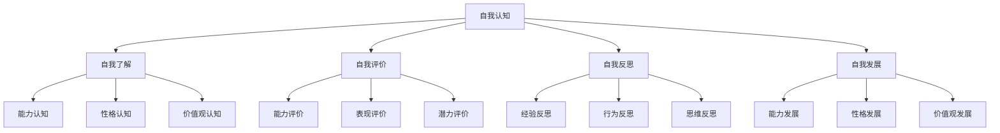
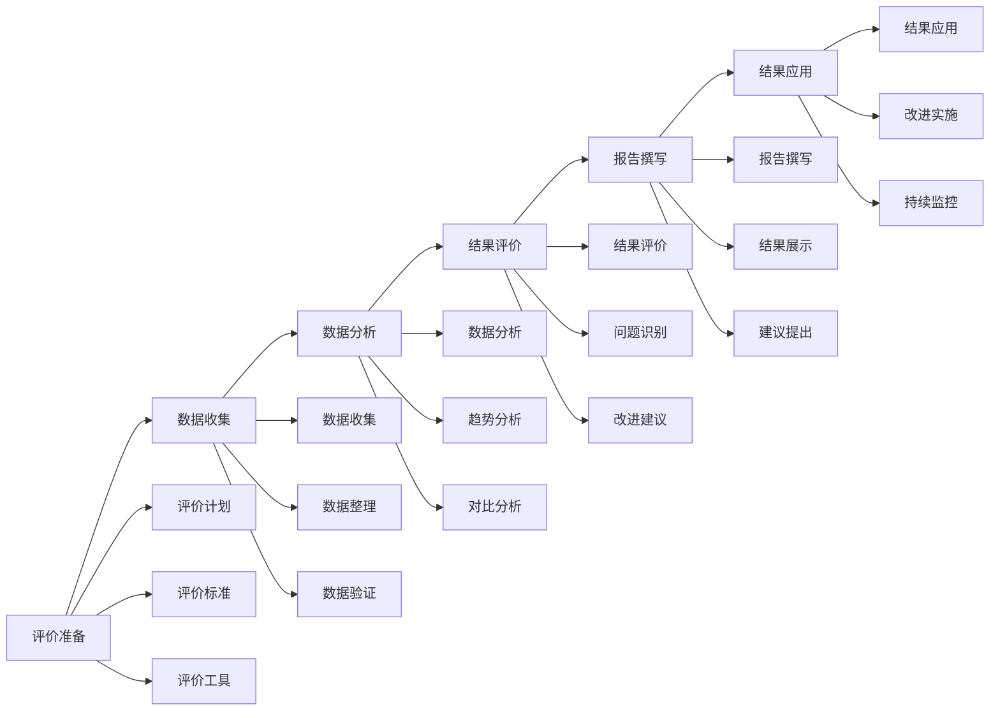
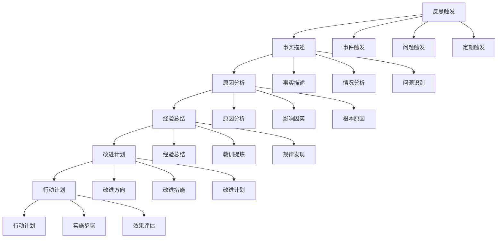
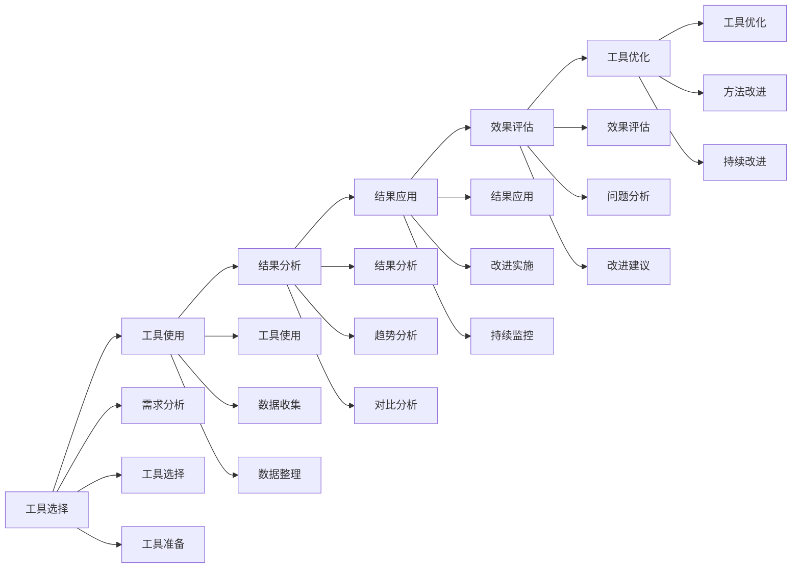

# 自我认知与评估

## 🎯 核心概念

### 自我认知定义
**自我认知**是指个体对自己的能力、性格、价值观、动机、行为模式等方面的认识和理解，是领导力发展的基础。

### 自我评估定义
**自我评估**是指个体运用科学的方法和工具，对自己的能力、表现、发展潜力等进行客观、准确的分析和评价的过程。

### 核心特征
- **客观性**：客观认识自己
- **全面性**：全面了解自己
- **准确性**：准确评估自己
- **发展性**：持续发展自己

## 📚 自我认知理论框架

### 自我认知模型

### 自我认知层次
| 认知层次 | 具体内容 | 认知重点 | 认知方法 |
|----------|----------|----------|----------|
| **表层认知** | 外在表现、行为模式 | 行为观察 | 行为分析 |
| **中层认知** | 性格特质、能力水平 | 特质分析 | 特质评估 |
| **深层认知** | 价值观、动机、信念 | 价值分析 | 价值探索 |
| **核心认知** | 自我概念、身份认同 | 概念分析 | 概念探索 |

## 🔍 自我了解

### 能力认知
#### 能力维度
| 能力维度 | 具体内容 | 认知方法 | 认知重点 |
|----------|----------|----------|----------|
| **专业技能** | 专业能力、技术能力 | 技能测试 | 技能水平 |
| **管理技能** | 管理能力、领导能力 | 管理评估 | 管理水平 |
| **沟通技能** | 沟通能力、表达能力 | 沟通评估 | 沟通效果 |
| **学习技能** | 学习能力、适应能力 | 学习评估 | 学习效果 |

#### 能力认知工具
| 工具类型 | 具体工具 | 使用场景 | 认知效果 |
|----------|----------|----------|----------|
| **能力测试** | 标准化能力测试 | 能力评估 | 评估客观 |
| **360度评估** | 全方位能力评估 | 全面评估 | 评估全面 |
| **行为观察** | 行为模式观察 | 行为分析 | 分析深入 |
| **绩效分析** | 工作绩效分析 | 绩效评估 | 评估准确 |

### 性格认知
#### 性格维度
| 性格维度 | 具体内容 | 认知方法 | 认知重点 |
|----------|----------|----------|----------|
| **外向性** | 社交能力、活跃程度 | 性格测试 | 社交水平 |
| **宜人性** | 合作能力、信任程度 | 性格测试 | 合作水平 |
| **尽责性** | 责任感、自律性 | 性格测试 | 责任水平 |
| **神经质** | 情绪稳定性、压力承受 | 性格测试 | 情绪水平 |
| **开放性** | 创新性、好奇心 | 性格测试 | 创新水平 |

#### 性格认知工具
| 工具类型 | 具体工具 | 使用场景 | 认知效果 |
|----------|----------|----------|----------|
| **MBTI** | 性格类型测试 | 性格分析 | 分析准确 |
| **大五人格** | 五大人格测试 | 人格分析 | 分析全面 |
| **DISC** | 行为风格测试 | 行为分析 | 分析深入 |
| **性格问卷** | 性格特征问卷 | 特征分析 | 分析详细 |

### 价值观认知
#### 价值观维度
| 价值观维度 | 具体内容 | 认知方法 | 认知重点 |
|----------|----------|----------|----------|
| **个人价值观** | 个人追求、人生目标 | 价值探索 | 价值明确 |
| **职业价值观** | 职业追求、工作目标 | 价值探索 | 价值清晰 |
| **社会价值观** | 社会责任、社会贡献 | 价值探索 | 价值认同 |
| **文化价值观** | 文化认同、文化传承 | 价值探索 | 价值传承 |

#### 价值观认知工具
| 工具类型 | 具体工具 | 使用场景 | 认知效果 |
|----------|----------|----------|----------|
| **价值观测试** | 价值观评估测试 | 价值分析 | 分析准确 |
| **价值探索** | 价值探索活动 | 价值发现 | 发现深入 |
| **价值排序** | 价值重要性排序 | 价值优先级 | 优先级明确 |
| **价值冲突** | 价值冲突分析 | 冲突解决 | 冲突化解 |

## 📊 自我评价

### 评价维度
#### 能力评价
| 评价维度 | 具体内容 | 评价方法 | 评价标准 |
|----------|----------|----------|----------|
| **专业能力** | 专业技能、知识水平 | 专业测试 | 专业标准 |
| **管理能力** | 管理技能、领导能力 | 管理评估 | 管理标准 |
| **沟通能力** | 沟通技巧、表达能力 | 沟通评估 | 沟通标准 |
| **学习能力** | 学习意愿、学习效果 | 学习评估 | 学习标准 |

#### 表现评价
| 评价维度 | 具体内容 | 评价方法 | 评价标准 |
|----------|----------|----------|----------|
| **工作表现** | 工作质量、工作效率 | 绩效评估 | 绩效标准 |
| **团队表现** | 团队协作、团队贡献 | 团队评估 | 团队标准 |
| **创新表现** | 创新思维、创新实践 | 创新评估 | 创新标准 |
| **发展表现** | 能力提升、经验积累 | 发展评估 | 发展标准 |

### 评价方法
#### 评价工具
| 工具类型 | 具体工具 | 使用场景 | 评价效果 |
|----------|----------|----------|----------|
| **自评工具** | 自我评估表、能力问卷 | 自我评价 | 评价主观 |
| **他评工具** | 360度评估、同事评估 | 客观评价 | 评价客观 |
| **测试工具** | 能力测试、性格测试 | 专业评价 | 评价专业 |
| **观察工具** | 行为观察、绩效观察 | 行为评价 | 评价客观 |

#### 评价流程

## 🔄 自我反思

### 反思类型
#### 经验反思
| 反思类型 | 具体内容 | 反思方法 | 反思效果 |
|----------|----------|----------|----------|
| **成功反思** | 成功经验、成功因素 | 经验总结 | 经验积累 |
| **失败反思** | 失败教训、失败原因 | 教训总结 | 教训吸取 |
| **过程反思** | 过程分析、过程优化 | 过程总结 | 过程改进 |
| **结果反思** | 结果分析、结果评估 | 结果总结 | 结果改进 |

#### 行为反思
| 反思类型 | 具体内容 | 反思方法 | 反思效果 |
|----------|----------|----------|----------|
| **行为模式** | 行为习惯、行为模式 | 行为分析 | 行为改进 |
| **行为动机** | 行为动机、行为原因 | 动机分析 | 动机明确 |
| **行为效果** | 行为效果、行为影响 | 效果分析 | 效果评估 |
| **行为改进** | 行为改进、行为优化 | 改进分析 | 改进实施 |

### 反思方法
#### 反思工具
| 工具类型 | 具体工具 | 使用场景 | 反思效果 |
|----------|----------|----------|----------|
| **反思日记** | 日常反思记录 | 日常反思 | 反思持续 |
| **反思模型** | 结构化反思模型 | 深度反思 | 反思深入 |
| **反思讨论** | 反思交流讨论 | 集体反思 | 反思全面 |
| **反思总结** | 反思总结报告 | 正式反思 | 反思正式 |

#### 反思流程

## 📈 自我发展

### 发展策略
#### 发展维度
| 发展维度 | 具体内容 | 发展方法 | 发展效果 |
|----------|----------|----------|----------|
| **能力发展** | 专业技能、管理技能 | 技能培训 | 技能提升 |
| **性格发展** | 性格优化、性格完善 | 性格训练 | 性格改善 |
| **价值观发展** | 价值澄清、价值完善 | 价值探索 | 价值明确 |
| **行为发展** | 行为改进、行为优化 | 行为训练 | 行为改善 |

#### 发展方法
| 方法类型 | 具体方法 | 实施要点 | 实施效果 |
|----------|----------|----------|----------|
| **自我学习** | 自主学习、自我教育 | 主动性 | 学习效果 |
| **实践锻炼** | 实践锻炼、经验积累 | 实践性 | 实践能力 |
| **反思总结** | 反思总结、经验提炼 | 反思性 | 反思能力 |
| **持续改进** | 持续改进、持续优化 | 持续性 | 改进效果 |

### 发展计划
#### 计划要素
| 计划要素 | 具体内容 | 制定要点 | 实施重点 |
|----------|----------|----------|----------|
| **发展目标** | 短期目标、长期目标 | 目标明确 | 目标达成 |
| **发展路径** | 发展策略、实施步骤 | 路径清晰 | 路径执行 |
| **发展资源** | 学习资源、实践资源 | 资源充足 | 资源利用 |
| **发展时间** | 时间规划、进度控制 | 时间合理 | 时间管理 |

#### 计划制定
| 制定步骤 | 具体内容 | 实施要点 | 实施效果 |
|----------|----------|----------|----------|
| **现状分析** | 能力现状、优势劣势 | 分析客观 | 分析准确 |
| **目标设定** | 发展目标、阶段目标 | 目标明确 | 目标清晰 |
| **路径规划** | 发展路径、实施步骤 | 路径清晰 | 路径合理 |
| **资源准备** | 学习资源、实践资源 | 资源充足 | 资源有效 |
| **计划制定** | 发展计划、实施计划 | 计划完整 | 计划可行 |
| **计划实施** | 计划执行、过程监控 | 执行有效 | 执行到位 |

## 🎯 自我认知与评估工具

### 评估工具
#### 综合评估工具
| 工具类型 | 具体工具 | 使用场景 | 评估效果 |
|----------|----------|----------|----------|
| **能力评估** | 综合能力评估表 | 能力评估 | 评估全面 |
| **性格评估** | 性格特征评估表 | 性格评估 | 评估准确 |
| **价值观评估** | 价值观评估表 | 价值评估 | 评估深入 |
| **发展评估** | 发展潜力评估表 | 发展评估 | 评估前瞻 |

#### 专项评估工具
| 工具类型 | 具体工具 | 使用场景 | 评估效果 |
|----------|----------|----------|----------|
| **领导力评估** | 领导力评估量表 | 领导力评估 | 评估专业 |
| **情商评估** | 情商评估量表 | 情商评估 | 评估准确 |
| **学习风格评估** | 学习风格评估表 | 学习评估 | 评估个性 |
| **职业兴趣评估** | 职业兴趣评估表 | 兴趣评估 | 评估匹配 |

### 工具应用
#### 应用原则
| 应用原则 | 具体内容 | 实施要点 | 应用效果 |
|----------|----------|----------|----------|
| **客观性** | 客观评估、避免偏见 | 客观分析 | 评估客观 |
| **全面性** | 全面评估、多维度分析 | 全面分析 | 评估全面 |
| **准确性** | 准确评估、避免误差 | 准确分析 | 评估准确 |
| **发展性** | 发展导向、持续改进 | 发展导向 | 发展有效 |

#### 应用流程

## 🔗 相关概念链接

### 基础概念
- [[01-基础认知层/01-领导力概述|领导力概述]]
- [[01-基础认知层/02-管理者vs领导者|管理者vs领导者]]
- [[02-理论理解层/经典领导理论/01-特质理论|特质理论]]

### 理论概念
- [[02-理论理解层/现代领导理论/01-变革型领导|变革型领导]]
- [[02-理论理解层/现代领导理论/02-服务型领导|服务型领导]]

### 能力概念
- [[03-能力构建层/核心领导能力/06-情商与自我管理|情商管理]]
- [[03-能力构建层/07-能力发展路径|能力发展路径]]

### 实践概念
- [[03-个人领导力发展计划|个人发展计划]]
- [[02-学习与发展路径|学习路径]]

## 💡 学习要点总结

### 关键理解
1. **自我认知**：能力认知、性格认知、价值观认知
2. **自我评价**：能力评价、表现评价、潜力评价
3. **自我反思**：经验反思、行为反思、思维反思
4. **自我发展**：能力发展、性格发展、价值观发展

### 实践应用
1. **自我了解**：全面了解自己的能力、性格、价值观
2. **自我评价**：客观评价自己的表现和潜力
3. **自我反思**：深入反思自己的经验和行为
4. **自我发展**：持续发展自己的能力和发展

### 思考问题
1. 如何全面了解自己的能力、性格、价值观？
2. 如何客观评价自己的表现和潜力？
3. 如何深入反思自己的经验和行为？
4. 如何持续发展自己的能力和发展？

---

**下一步**：[[02-学习与发展路径|学习路径]] | [[03-导师与教练|导师教练]]
