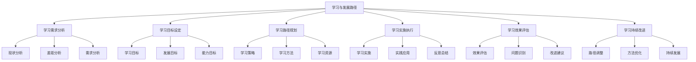
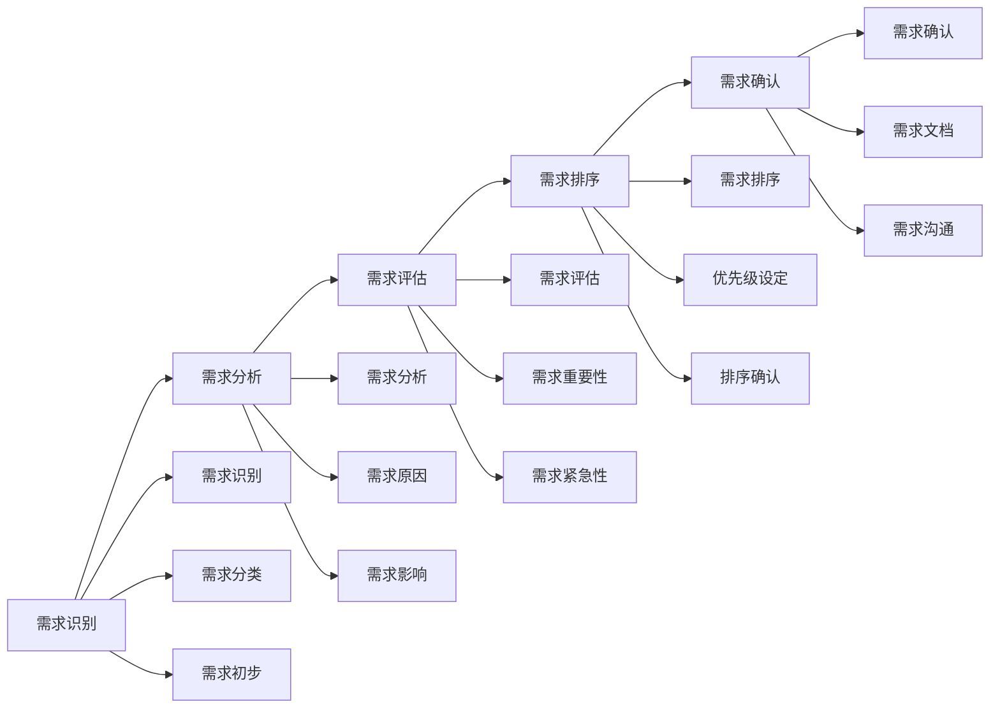
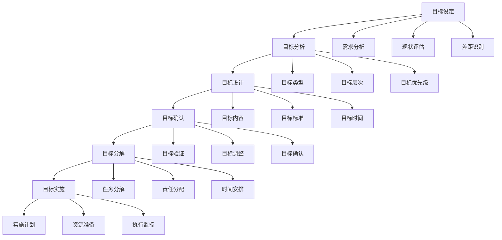
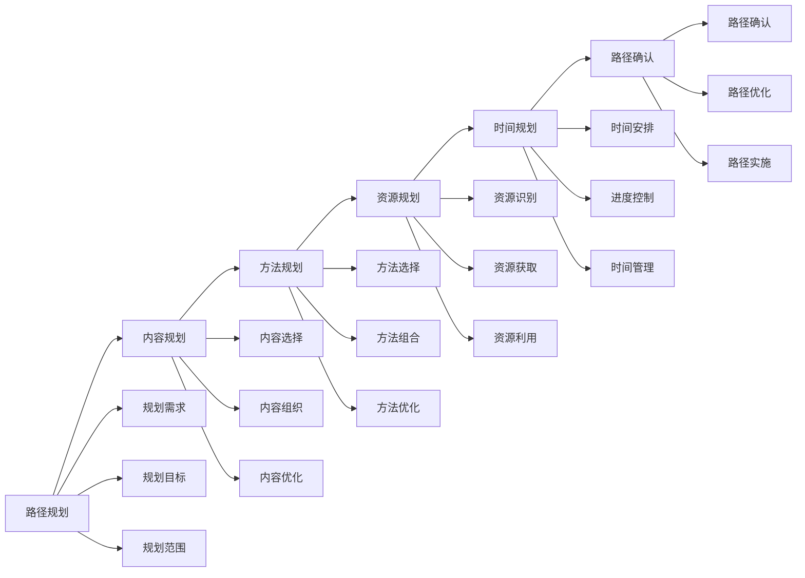
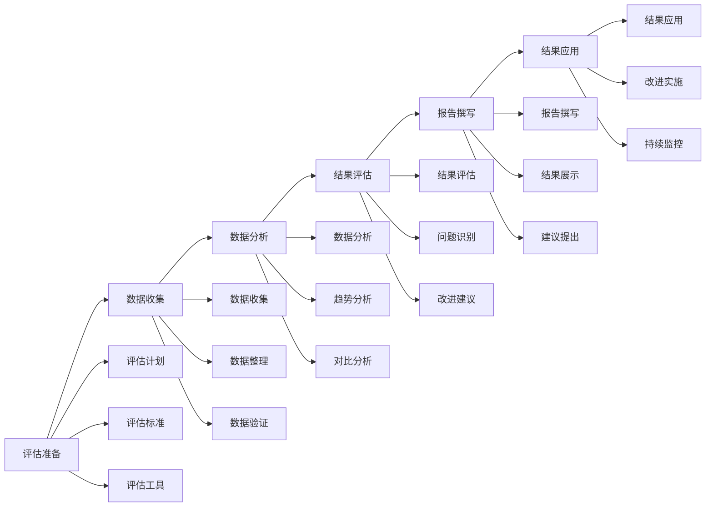
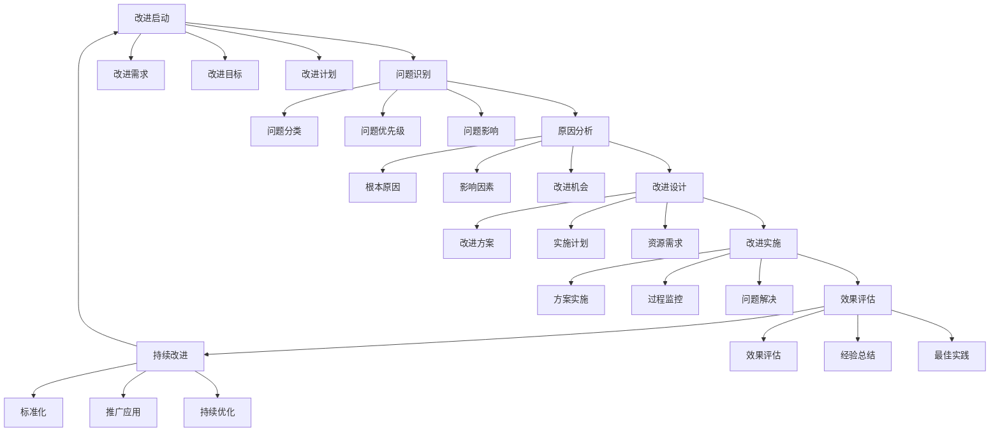

# 学习与发展路径

## 🎯 核心概念

### 学习与发展路径定义
**学习与发展路径**是指领导者根据自身现状、发展目标和组织需求，制定系统性的学习和能力发展计划，通过阶段性学习和实践，实现领导能力持续发展的过程。

### 核心特征
- **系统性**：系统规划学习发展
- **个性化**：根据个人特点定制
- **阶段性**：分阶段实施发展
- **持续性**：持续学习和提升

## 📚 学习与发展理论框架

### 学习与发展模型

### 学习与发展层次
| 发展层次 | 具体内容 | 发展重点 | 发展方法 |
|----------|----------|----------|----------|
| **基础层** | 基本技能、基础知识 | 技能学习 | 理论学习 |
| **应用层** | 技能应用、实践能力 | 实践应用 | 实践锻炼 |
| **整合层** | 技能整合、综合能力 | 综合应用 | 综合实践 |
| **创新层** | 创新能力、领导能力 | 创新发展 | 创新实践 |

## 🔍 学习需求分析

### 需求分析维度
#### 个人需求
| 需求维度 | 具体内容 | 分析方法 | 分析重点 |
|----------|----------|----------|----------|
| **能力需求** | 能力提升、技能发展 | 能力分析 | 能力差距 |
| **知识需求** | 知识更新、知识扩展 | 知识分析 | 知识差距 |
| **经验需求** | 经验积累、实践锻炼 | 经验分析 | 经验差距 |
| **发展需求** | 职业发展、个人发展 | 发展分析 | 发展需求 |

#### 组织需求
| 需求维度 | 具体内容 | 分析方法 | 分析重点 |
|----------|----------|----------|----------|
| **岗位需求** | 岗位要求、职责要求 | 岗位分析 | 岗位匹配 |
| **业务需求** | 业务发展、业务创新 | 业务分析 | 业务支持 |
| **战略需求** | 战略实施、战略支持 | 战略分析 | 战略支持 |
| **文化需求** | 文化适应、文化发展 | 文化分析 | 文化匹配 |

### 需求分析方法
#### 分析方法
| 方法类型 | 具体方法 | 使用场景 | 分析效果 |
|----------|----------|----------|----------|
| **差距分析** | 现状与目标差距 | 需求识别 | 差距明确 |
| **SWOT分析** | 优势劣势机会威胁 | 需求分析 | 分析全面 |
| **需求调研** | 需求调查、需求访谈 | 需求了解 | 需求准确 |
| **趋势分析** | 发展趋势、变化趋势 | 需求预测 | 需求前瞻 |

#### 分析流程

## 🎯 学习目标设定

### 目标类型
#### 按时间分类
| 目标类型 | 时间框架 | 具体内容 | 设定要点 |
|----------|----------|----------|----------|
| **短期目标** | 3-6个月 | 具体技能、immediate improvement | 可达成性 |
| **中期目标** | 6-18个月 | 能力提升、career development | 挑战性 |
| **长期目标** | 18个月以上 | 职业发展、leadership growth | 激励性 |

#### 按内容分类
| 目标类型 | 具体内容 | 设定方法 | 评估标准 |
|----------|----------|----------|----------|
| **知识目标** | 专业知识、管理知识 | 知识分析 | 知识水平 |
| **技能目标** | 专业技能、领导技能 | 技能分析 | 技能水平 |
| **能力目标** | 综合能力、领导能力 | 能力分析 | 能力水平 |
| **经验目标** | 实践经验、领导经验 | 经验分析 | 经验丰富度 |

### 目标设定原则
#### SMART原则
| 原则要素 | 具体内容 | 设定要求 | 评估标准 |
|----------|----------|----------|----------|
| **S-Specific** | 具体明确 | 目标具体 | 明确性 |
| **M-Measurable** | 可衡量 | 目标可测 | 可测性 |
| **A-Achievable** | 可实现 | 目标可达 | 可达性 |
| **R-Relevant** | 相关性 | 目标相关 | 相关性 |
| **T-Time-bound** | 时限性 | 目标有时限 | 时限性 |

#### 目标设定流程

## 📊 学习路径规划

### 路径类型
#### 发展路径
| 路径类型 | 具体内容 | 适用场景 | 路径特点 |
|----------|----------|----------|----------|
| **渐进式路径** | 逐步提升、稳步发展 | 基础薄弱 | 循序渐进 |
| **突破式路径** | 重点突破、快速提升 | 关键能力 | 集中资源 |
| **平衡式路径** | 全面发展、平衡提升 | 综合发展 | 平衡发展 |
| **个性化路径** | 个性定制、特色发展 | 特殊需求 | 个性发展 |

#### 学习路径
| 路径类型 | 具体内容 | 适用场景 | 学习效果 |
|----------|----------|----------|----------|
| **理论路径** | 理论学习、知识学习 | 基础建设 | 知识水平 |
| **实践路径** | 实践学习、经验学习 | 能力提升 | 实践能力 |
| **混合路径** | 理论实践结合 | 综合发展 | 综合能力 |
| **创新路径** | 创新学习、探索学习 | 创新发展 | 创新能力 |

### 路径规划方法
#### 规划要素
| 规划要素 | 具体内容 | 规划要点 | 实施重点 |
|----------|----------|----------|----------|
| **学习内容** | 知识内容、技能内容 | 内容选择 | 内容学习 |
| **学习方法** | 学习方法、学习策略 | 方法选择 | 方法应用 |
| **学习资源** | 学习资源、实践资源 | 资源准备 | 资源利用 |
| **学习时间** | 时间规划、进度控制 | 时间安排 | 时间管理 |

#### 规划流程

## 🚀 学习实施执行

### 学习方法
#### 学习类型
| 学习类型 | 具体内容 | 适用场景 | 学习效果 |
|----------|----------|----------|----------|
| **自主学习** | 自我学习、自我管理 | 基础学习 | 学习自主 |
| **指导学习** | 导师指导、专家指导 | 专业学习 | 学习专业 |
| **团队学习** | 团队协作、集体学习 | 团队学习 | 学习协作 |
| **项目学习** | 项目实践、任务学习 | 实践学习 | 学习实践 |

#### 学习方法
| 方法类型 | 具体方法 | 实施要点 | 实施效果 |
|----------|----------|----------|----------|
| **阅读学习** | 书籍阅读、资料阅读 | 阅读质量 | 知识获取 |
| **听课学习** | 课程学习、培训学习 | 听课质量 | 知识理解 |
| **实践学习** | 实践锻炼、经验积累 | 实践质量 | 能力提升 |
| **反思学习** | 经验反思、总结提升 | 反思质量 | 反思能力 |

### 学习资源
#### 资源类型
| 资源类型 | 具体内容 | 获取方法 | 利用要点 |
|----------|----------|----------|----------|
| **学习材料** | 书籍、资料、课程 | 材料获取 | 材料利用 |
| **学习工具** | 工具、软件、平台 | 工具获取 | 工具利用 |
| **学习环境** | 环境、氛围、条件 | 环境营造 | 环境利用 |
| **学习支持** | 导师、同伴、专家 | 支持获取 | 支持利用 |

#### 资源管理
| 管理要素 | 具体内容 | 管理要点 | 管理效果 |
|----------|----------|----------|----------|
| **资源识别** | 资源识别、资源分类 | 识别准确 | 资源明确 |
| **资源获取** | 资源获取、资源采购 | 获取及时 | 资源充足 |
| **资源利用** | 资源利用、资源优化 | 利用有效 | 资源有效 |
| **资源维护** | 资源维护、资源更新 | 维护及时 | 资源持续 |

### 学习监控
#### 监控维度
| 监控维度 | 具体内容 | 监控方法 | 监控标准 |
|----------|----------|----------|----------|
| **进度监控** | 学习进度、时间进度 | 进度跟踪 | 时间标准 |
| **质量监控** | 学习质量、内容质量 | 质量评估 | 质量标准 |
| **效果监控** | 学习效果、能力效果 | 效果评估 | 效果标准 |
| **资源监控** | 资源利用、资源效率 | 资源分析 | 效率标准 |

#### 监控工具
| 工具类型 | 具体工具 | 使用场景 | 使用要点 |
|----------|----------|----------|----------|
| **进度工具** | 进度表、甘特图 | 进度管理 | 及时更新 |
| **质量工具** | 质量检查表、评估表 | 质量管理 | 定期检查 |
| **效果工具** | 效果评估表、反馈表 | 效果管理 | 客观评估 |
| **资源工具** | 资源使用表、效率表 | 资源管理 | 合理利用 |

## 📈 学习效果评估

### 评估维度
| 评估维度 | 具体内容 | 评估方法 | 权重 |
|----------|----------|----------|------|
| **知识掌握** | 知识水平、知识应用 | 知识测试 | 30% |
| **技能提升** | 技能水平、技能应用 | 技能评估 | 30% |
| **能力发展** | 能力水平、能力应用 | 能力评估 | 25% |
| **经验积累** | 经验丰富度、经验应用 | 经验评估 | 15% |

### 评估方法
#### 评估工具
| 工具类型 | 具体工具 | 使用场景 | 评估标准 |
|----------|----------|----------|----------|
| **测试工具** | 知识测试、技能测试 | 客观评估 | 准确性 |
| **评估工具** | 能力评估、绩效评估 | 综合评估 | 全面性 |
| **观察工具** | 行为观察、表现观察 | 行为评估 | 客观性 |
| **反馈工具** | 反馈收集、反馈分析 | 反馈评估 | 及时性 |

#### 评估流程

## 🔄 学习持续改进

### 改进策略
#### 策略类型
| 策略类型 | 具体内容 | 实施方法 | 预期效果 |
|----------|----------|----------|----------|
| **路径调整** | 调整学习路径 | 路径优化 | 路径优化 |
| **方法改进** | 改进学习方法 | 方法优化 | 方法效果 |
| **资源优化** | 优化学习资源 | 资源调整 | 资源效率 |
| **目标调整** | 调整学习目标 | 目标修正 | 目标达成 |

#### 改进流程

## 🎯 学习与发展路径模板

### 路径模板
#### 个人学习发展路径表
| 路径要素 | 具体内容 | 填写要求 | 评估标准 |
|----------|----------|----------|----------|
| **基本信息** | 姓名、职位、时间 | 信息完整 | 完整性 |
| **现状分析** | 能力现状、学习现状 | 分析客观 | 客观性 |
| **学习目标** | 短期、中期、长期目标 | 目标明确 | 明确性 |
| **学习路径** | 学习策略、实施步骤 | 路径清晰 | 清晰性 |
| **学习资源** | 学习材料、学习工具 | 资源充足 | 充足性 |
| **时间安排** | 时间规划、进度控制 | 安排合理 | 合理性 |
| **评估标准** | 评估指标、评估方法 | 标准明确 | 明确性 |

#### 路径制定步骤
| 制定步骤 | 具体内容 | 实施要点 | 实施效果 |
|----------|----------|----------|----------|
| **需求分析** | 分析学习需求 | 需求明确 | 需求清晰 |
| **现状评估** | 评估当前水平 | 评估客观 | 评估准确 |
| **目标设定** | 设定学习目标 | 目标明确 | 目标清晰 |
| **路径规划** | 规划学习路径 | 路径清晰 | 路径合理 |
| **资源准备** | 准备学习资源 | 资源充足 | 资源有效 |
| **计划制定** | 制定学习计划 | 计划完整 | 计划可行 |
| **计划实施** | 实施学习计划 | 实施有效 | 实施到位 |

## 🔗 相关概念链接

### 基础概念
- [[01-基础认知层/01-领导力概述|领导力概述]]
- [[01-基础认知层/04-现代领导力挑战|现代挑战]]
- [[02-理论理解层/现代领导理论/01-变革型领导|变革型领导]]

### 理论概念
- [[02-理论理解层/现代领导理论/02-服务型领导|服务型领导]]
- [[02-理论理解层/现代领导理论/03-分布式领导|分布式领导]]

### 能力概念
- [[03-能力构建层/核心领导能力/01-战略思维|战略思维]]
- [[03-能力构建层/核心领导能力/02-决策能力|决策能力]]
- [[03-能力构建层/核心领导能力/03-沟通协调|沟通协调]]

### 实践概念
- [[03-个人领导力发展计划|个人发展计划]]
- [[01-自我认知与评估|自我认知]]

## 💡 学习要点总结

### 关键理解
1. **学习路径**：需求分析、目标设定、路径规划、实施执行
2. **需求分析**：个人需求、组织需求、差距分析
3. **目标设定**：SMART原则、目标分解、目标确认
4. **路径规划**：学习策略、学习方法、学习资源

### 实践应用
1. **需求分析**：全面分析学习需求
2. **目标设定**：设定明确的学习目标
3. **路径规划**：制定个性化学习路径
4. **实施执行**：有效执行学习计划

### 思考问题
1. 如何全面分析学习需求？
2. 如何设定明确的学习目标？
3. 如何制定个性化学习路径？
4. 如何有效执行学习计划？

---

**下一步**：[[03-导师与教练|导师教练]] | [[持续改进/01-实践反思|实践反思]]
