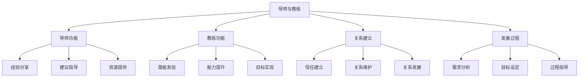
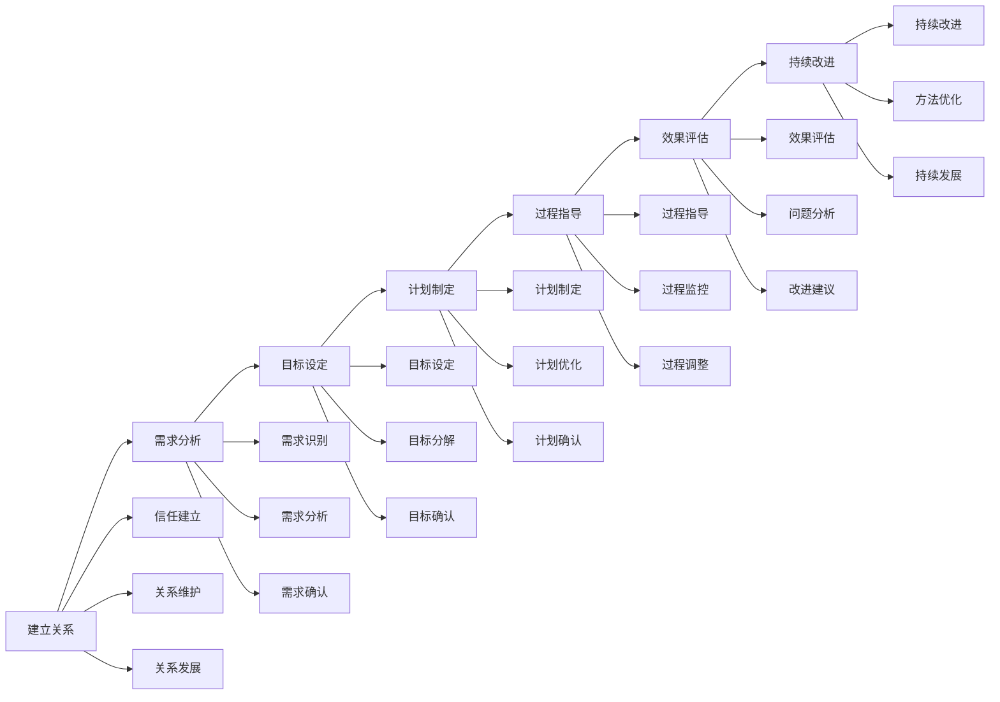
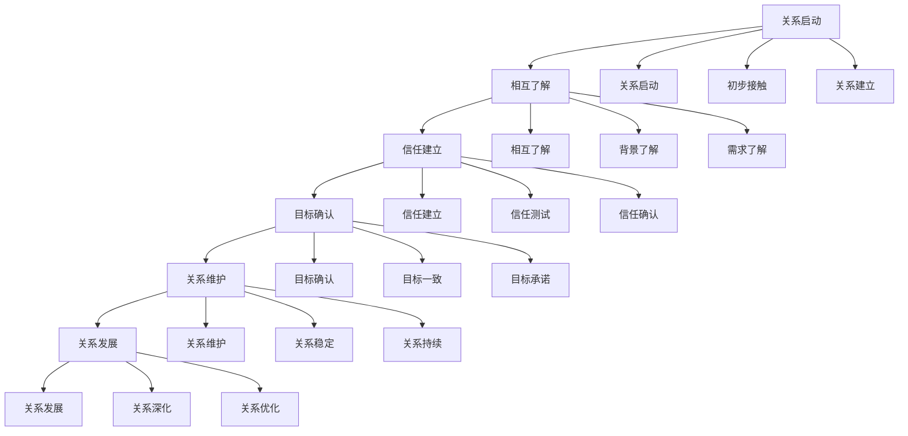
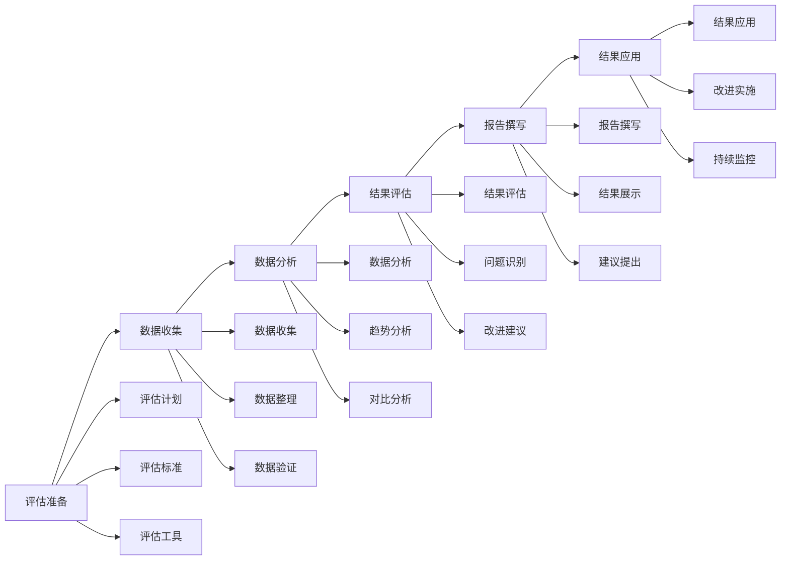
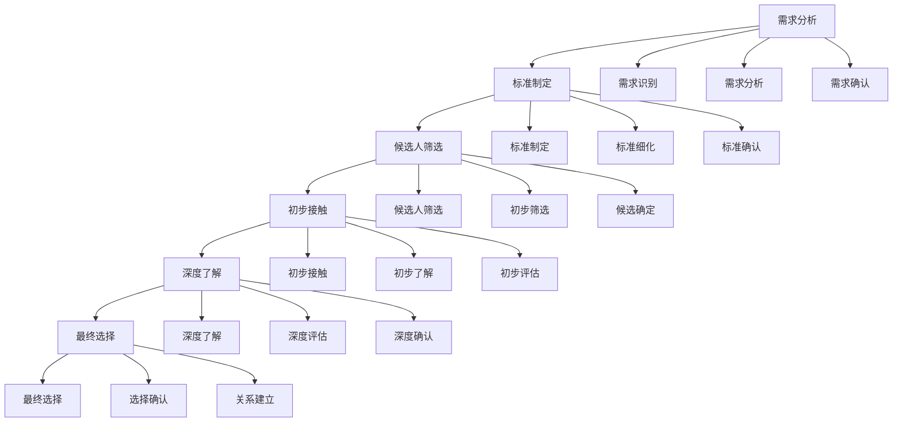

# 导师与教练

## 🎯 核心概念

### 导师定义
**导师**是指具有丰富经验和专业知识的人，通过指导、建议和支持，帮助他人实现个人和职业发展的专业人士。

### 教练定义
**教练**是指运用专业方法和技巧，通过提问、引导和反馈，帮助他人发现潜能、提升能力和实现目标的专业人士。

### 核心特征
- **专业性**：具备专业知识和技能
- **指导性**：提供指导和建议
- **支持性**：提供支持和帮助
- **发展性**：促进个人发展

## 📚 导师与教练理论框架

### 导师与教练模型

### 导师与教练区别
| 维度 | 导师 | 教练 | 区别要点 |
|------|------|------|----------|
| **角色定位** | 经验分享者、建议提供者 | 潜能开发者、能力提升者 | 角色不同 |
| **指导方式** | 直接建议、经验分享 | 提问引导、自我发现 | 方式不同 |
| **关系性质** | 长期关系、深度关系 | 短期关系、专业关系 | 关系不同 |
| **发展重点** | 职业发展、经验传承 | 能力提升、目标实现 | 重点不同 |

## 🔍 导师功能

### 导师角色
#### 角色类型
| 角色类型 | 具体内容 | 角色特点 | 适用场景 |
|----------|----------|----------|----------|
| **经验导师** | 经验分享、知识传授 | 经验丰富 | 经验传承 |
| **职业导师** | 职业指导、发展建议 | 职业成功 | 职业发展 |
| **技能导师** | 技能指导、技术传授 | 技能专业 | 技能提升 |
| **人生导师** | 人生指导、价值引导 | 人生智慧 | 人生发展 |

#### 角色职责
| 职责类型 | 具体内容 | 职责要求 | 职责效果 |
|----------|----------|----------|----------|
| **指导职责** | 提供指导、建议 | 指导专业 | 指导有效 |
| **支持职责** | 提供支持、帮助 | 支持及时 | 支持有效 |
| **资源职责** | 提供资源、机会 | 资源丰富 | 资源有效 |
| **发展职责** | 促进发展、成长 | 发展导向 | 发展有效 |

### 导师方法
#### 指导方法
| 方法类型 | 具体内容 | 实施要点 | 实施效果 |
|----------|----------|----------|----------|
| **经验分享** | 分享经验、传授知识 | 经验丰富 | 知识传递 |
| **建议指导** | 提供建议、给出指导 | 建议专业 | 指导有效 |
| **案例分析** | 分析案例、总结经验 | 案例丰富 | 经验积累 |
| **实践指导** | 实践指导、现场指导 | 实践性强 | 实践能力 |

#### 支持方法
| 方法类型 | 具体内容 | 实施要点 | 实施效果 |
|----------|----------|----------|----------|
| **情感支持** | 情感支持、心理支持 | 支持及时 | 情感稳定 |
| **资源支持** | 资源提供、机会提供 | 资源丰富 | 机会增加 |
| **网络支持** | 人脉网络、关系网络 | 网络广泛 | 关系建立 |
| **发展支持** | 发展机会、成长机会 | 机会多样 | 发展加速 |

## 🎯 教练功能

### 教练角色
#### 角色类型
| 角色类型 | 具体内容 | 角色特点 | 适用场景 |
|----------|----------|----------|----------|
| **能力教练** | 能力提升、技能发展 | 能力专业 | 能力发展 |
| **绩效教练** | 绩效提升、目标实现 | 绩效导向 | 绩效改善 |
| **领导力教练** | 领导力发展、领导能力 | 领导专业 | 领导发展 |
| **生活教练** | 生活平衡、生活质量 | 生活智慧 | 生活改善 |

#### 角色职责
| 职责类型 | 具体内容 | 职责要求 | 职责效果 |
|----------|----------|----------|----------|
| **发现职责** | 发现潜能、识别优势 | 发现敏锐 | 潜能开发 |
| **提升职责** | 提升能力、改善表现 | 提升专业 | 能力提升 |
| **引导职责** | 引导思考、启发智慧 | 引导专业 | 思维启发 |
| **实现职责** | 实现目标、达成结果 | 实现导向 | 目标达成 |

### 教练方法
#### 教练技巧
| 技巧类型 | 具体内容 | 实施要点 | 实施效果 |
|----------|----------|----------|----------|
| **提问技巧** | 有效提问、启发思考 | 问题精准 | 思考深入 |
| **倾听技巧** | 深度倾听、理解对方 | 倾听专注 | 理解准确 |
| **反馈技巧** | 及时反馈、建设性反馈 | 反馈及时 | 反馈有效 |
| **引导技巧** | 引导思考、启发智慧 | 引导专业 | 思维启发 |

#### 教练流程

## 📊 关系建立

### 关系类型
#### 导师关系
| 关系类型 | 具体内容 | 关系特点 | 关系效果 |
|----------|----------|----------|----------|
| **正式关系** | 正式导师、正式指导 | 关系正式 | 指导正式 |
| **非正式关系** | 非正式导师、非正式指导 | 关系灵活 | 指导灵活 |
| **长期关系** | 长期导师、长期指导 | 关系持久 | 指导持续 |
| **短期关系** | 短期导师、短期指导 | 关系临时 | 指导集中 |

#### 教练关系
| 关系类型 | 具体内容 | 关系特点 | 关系效果 |
|----------|----------|----------|----------|
| **专业关系** | 专业教练、专业指导 | 关系专业 | 指导专业 |
| **合作关系** | 合作教练、合作指导 | 关系平等 | 指导合作 |
| **支持关系** | 支持教练、支持指导 | 关系支持 | 指导支持 |
| **发展关系** | 发展教练、发展指导 | 关系发展 | 指导发展 |

### 关系建立
#### 建立要素
| 建立要素 | 具体内容 | 建立要点 | 建立效果 |
|----------|----------|----------|----------|
| **信任建立** | 相互信任、信任关系 | 信任基础 | 关系稳定 |
| **沟通建立** | 有效沟通、沟通机制 | 沟通顺畅 | 关系和谐 |
| **目标建立** | 共同目标、目标一致 | 目标明确 | 关系导向 |
| **期望建立** | 期望管理、期望一致 | 期望合理 | 关系满意 |

#### 建立流程

## 🚀 发展过程

### 发展阶段
#### 导师发展
| 发展阶段 | 具体内容 | 发展重点 | 发展方法 |
|----------|----------|----------|----------|
| **建立阶段** | 关系建立、信任建立 | 关系建立 | 关系建设 |
| **指导阶段** | 经验分享、建议指导 | 经验传递 | 经验分享 |
| **支持阶段** | 资源支持、机会提供 | 支持提供 | 支持实施 |
| **发展阶段** | 促进发展、持续成长 | 发展促进 | 发展推动 |

#### 教练发展
| 发展阶段 | 具体内容 | 发展重点 | 发展方法 |
|----------|----------|----------|----------|
| **发现阶段** | 潜能发现、优势识别 | 潜能开发 | 潜能发现 |
| **提升阶段** | 能力提升、技能发展 | 能力提升 | 能力发展 |
| **实现阶段** | 目标实现、结果达成 | 目标实现 | 目标达成 |
| **持续阶段** | 持续发展、持续改进 | 持续发展 | 持续改进 |

### 发展方法
#### 导师方法
| 方法类型 | 具体内容 | 实施要点 | 实施效果 |
|----------|----------|----------|----------|
| **经验传授** | 经验分享、知识传授 | 经验丰富 | 知识传递 |
| **建议指导** | 建议提供、指导实施 | 建议专业 | 指导有效 |
| **资源提供** | 资源提供、机会提供 | 资源丰富 | 机会增加 |
| **关系建立** | 人脉建立、关系网络 | 关系广泛 | 网络建立 |

#### 教练方法
| 方法类型 | 具体内容 | 实施要点 | 实施效果 |
|----------|----------|----------|----------|
| **提问引导** | 有效提问、引导思考 | 问题精准 | 思考深入 |
| **反馈指导** | 及时反馈、建设性反馈 | 反馈及时 | 反馈有效 |
| **目标导向** | 目标设定、目标实现 | 目标明确 | 目标达成 |
| **持续改进** | 持续改进、持续发展 | 改进持续 | 发展持续 |

## 📈 效果评估

### 评估维度
| 评估维度 | 具体内容 | 评估方法 | 权重 |
|----------|----------|----------|------|
| **关系质量** | 关系满意度、关系稳定性 | 关系评估 | 25% |
| **指导效果** | 指导质量、指导效果 | 指导评估 | 30% |
| **发展效果** | 能力提升、目标达成 | 发展评估 | 30% |
| **满意度** | 整体满意度、推荐意愿 | 满意度调查 | 15% |

### 评估方法
#### 评估工具
| 工具类型 | 具体工具 | 使用场景 | 评估效果 |
|----------|----------|----------|----------|
| **关系评估** | 关系质量评估表 | 关系评估 | 评估客观 |
| **指导评估** | 指导效果评估表 | 指导评估 | 评估准确 |
| **发展评估** | 发展效果评估表 | 发展评估 | 评估全面 |
| **满意度调查** | 满意度调查问卷 | 满意度评估 | 评估及时 |

#### 评估流程

## 🎯 导师与教练选择

### 选择标准
#### 导师选择
| 选择标准 | 具体内容 | 选择要点 | 选择效果 |
|----------|----------|----------|----------|
| **经验丰富** | 工作经验、领导经验 | 经验丰富 | 指导有效 |
| **专业能力** | 专业水平、技术能力 | 能力专业 | 指导专业 |
| **人格魅力** | 人格魅力、领导魅力 | 魅力吸引 | 关系和谐 |
| **关系网络** | 人脉网络、关系网络 | 网络广泛 | 资源丰富 |

#### 教练选择
| 选择标准 | 具体内容 | 选择要点 | 选择效果 |
|----------|----------|----------|----------|
| **专业认证** | 教练认证、专业资质 | 认证专业 | 指导专业 |
| **教练经验** | 教练经验、指导经验 | 经验丰富 | 指导有效 |
| **教练风格** | 教练风格、指导风格 | 风格匹配 | 关系和谐 |
| **成功案例** | 成功案例、指导成果 | 案例丰富 | 效果可信 |

### 选择方法
#### 选择流程

## 🔗 相关概念链接

### 基础概念
- [[01-基础认知层/01-领导力概述|领导力概述]]
- [[01-基础认知层/02-管理者vs领导者|管理者vs领导者]]
- [[02-理论理解层/现代领导理论/02-服务型领导|服务型领导]]

### 理论概念
- [[02-理论理解层/现代领导理论/01-变革型领导|变革型领导]]
- [[02-理论理解层/现代领导理论/03-分布式领导|分布式领导]]

### 能力概念
- [[03-能力构建层/核心领导能力/03-沟通协调|沟通协调]]
- [[03-能力构建层/核心领导能力/04-团队建设|团队建设]]

### 实践概念
- [[01-自我认知与评估|自我认知]]
- [[02-学习与发展路径|学习路径]]

## 💡 学习要点总结

### 关键理解
1. **导师功能**：经验分享、建议指导、资源提供、发展促进
2. **教练功能**：潜能发现、能力提升、目标实现、持续改进
3. **关系建立**：信任建立、沟通建立、目标建立、期望建立
4. **发展过程**：建立阶段、指导阶段、支持阶段、发展阶段

### 实践应用
1. **导师选择**：根据需求选择合适的导师
2. **教练选择**：根据目标选择合适的教练
3. **关系建立**：建立良好的导师/教练关系
4. **发展过程**：有效利用导师/教练促进发展

### 思考问题
1. 如何选择合适的导师？
2. 如何选择合适的教练？
3. 如何建立良好的导师/教练关系？
4. 如何有效利用导师/教练促进发展？

---

**下一步**：[[持续改进/01-实践反思|实践反思]] | [[持续改进/02-持续改进|持续改进]]
