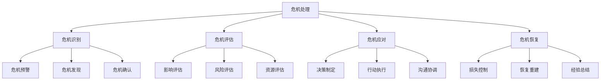

# 危机处理案例

## 🎯 核心概念

### 危机处理定义
**危机处理**是指在企业面临突发事件、重大风险或紧急情况时，领导者通过有效的决策、沟通和行动，迅速控制局面、减少损失、恢复正常的领导过程。

### 核心特征
- **紧迫性**：时间紧迫，需要快速响应
- **不确定性**：情况复杂，信息不完整
- **高风险性**：后果严重，影响重大
- **复杂性**：涉及多方，关系复杂

## 📚 危机处理理论框架

### 危机处理模型

### 危机类型
| 危机类型 | 具体内容 | 危机特点 | 处理重点 |
|----------|----------|----------|----------|
| **财务危机** | 资金链断裂、财务造假 | 资金问题 | 资金管理 |
| **产品危机** | 质量问题、安全事故 | 产品问题 | 质量管理 |
| **声誉危机** | 品牌受损、负面舆论 | 声誉问题 | 声誉管理 |
| **运营危机** | 供应链中断、系统故障 | 运营问题 | 运营管理 |

## 🔍 财务危机处理案例

### 案例背景
#### 危机概况
| 危机要素 | 具体内容 | 危机表现 | 影响分析 |
|----------|----------|----------|----------|
| **危机类型** | 财务危机 | 资金链断裂 | 资金问题 |
| **危机规模** | 大型企业 | 影响重大 | 影响广泛 |
| **危机时间** | 短期危机 | 时间紧迫 | 时间压力 |
| **危机后果** | 经营困难 | 后果严重 | 后果重大 |

#### 危机原因
| 原因类型 | 具体内容 | 原因分析 | 责任归属 |
|----------|----------|----------|----------|
| **外部原因** | 市场变化、政策调整 | 外部环境 | 外部因素 |
| **内部原因** | 管理失误、决策错误 | 内部问题 | 内部因素 |
| **直接原因** | 资金链断裂、财务造假 | 直接问题 | 直接因素 |
| **根本原因** | 战略失误、管理缺陷 | 根本问题 | 根本因素 |

### 危机处理过程
#### 第一阶段：危机识别
| 处理要素 | 具体内容 | 处理方式 | 处理效果 |
|----------|----------|----------|----------|
| **危机预警** | 预警信号、预警机制 | 预警系统 | 预警有效 |
| **危机发现** | 危机发现、危机确认 | 发现机制 | 发现及时 |
| **危机评估** | 影响评估、风险评估 | 评估方法 | 评估准确 |
| **危机通报** | 内部通报、外部通报 | 通报机制 | 通报及时 |

#### 第二阶段：危机应对
| 处理要素 | 具体内容 | 处理方式 | 处理效果 |
|----------|----------|----------|----------|
| **决策制定** | 决策制定、决策执行 | 决策机制 | 决策有效 |
| **行动执行** | 行动执行、行动监控 | 执行机制 | 执行到位 |
| **沟通协调** | 内部沟通、外部沟通 | 沟通机制 | 沟通有效 |
| **资源调配** | 资源调配、资源优化 | 调配机制 | 调配合理 |

#### 第三阶段：危机恢复
| 处理要素 | 具体内容 | 处理方式 | 处理效果 |
|----------|----------|----------|----------|
| **损失控制** | 损失控制、损失减少 | 控制措施 | 控制有效 |
| **恢复重建** | 恢复重建、重建计划 | 重建措施 | 重建成功 |
| **经验总结** | 经验总结、教训吸取 | 总结机制 | 总结深刻 |
| **预防措施** | 预防措施、预防机制 | 预防机制 | 预防有效 |

### 危机处理效果
#### 处理结果
| 结果维度 | 具体内容 | 结果表现 | 效果评价 |
|----------|----------|----------|----------|
| **损失控制** | 损失最小化 | 损失控制 | 效果良好 |
| **恢复速度** | 快速恢复 | 恢复迅速 | 效果良好 |
| **声誉恢复** | 声誉重建 | 声誉恢复 | 效果良好 |
| **预防效果** | 预防机制 | 预防有效 | 效果良好 |

#### 经验教训
| 经验类型 | 具体内容 | 经验总结 | 应用价值 |
|----------|----------|----------|----------|
| **预警经验** | 预警机制、预警系统 | 预警重要 | 预警价值 |
| **应对经验** | 应对策略、应对方法 | 应对有效 | 应对价值 |
| **沟通经验** | 沟通策略、沟通方法 | 沟通重要 | 沟通价值 |
| **恢复经验** | 恢复策略、恢复方法 | 恢复有效 | 恢复价值 |

## 🚀 产品危机处理案例

### 案例背景
#### 危机概况
| 危机要素 | 具体内容 | 危机表现 | 影响分析 |
|----------|----------|----------|----------|
| **危机类型** | 产品危机 | 质量问题 | 产品问题 |
| **危机规模** | 大型企业 | 影响重大 | 影响广泛 |
| **危机时间** | 中期危机 | 时间较长 | 时间压力 |
| **危机后果** | 品牌受损 | 后果严重 | 后果重大 |

#### 危机原因
| 原因类型 | 具体内容 | 原因分析 | 责任归属 |
|----------|----------|----------|----------|
| **外部原因** | 市场变化、竞争加剧 | 外部环境 | 外部因素 |
| **内部原因** | 质量控制、管理失误 | 内部问题 | 内部因素 |
| **直接原因** | 产品质量、安全问题 | 直接问题 | 直接因素 |
| **根本原因** | 质量体系、管理缺陷 | 根本问题 | 根本因素 |

### 危机处理过程
#### 第一阶段：危机识别
| 处理要素 | 具体内容 | 处理方式 | 处理效果 |
|----------|----------|----------|----------|
| **危机预警** | 预警信号、预警机制 | 预警系统 | 预警有效 |
| **危机发现** | 危机发现、危机确认 | 发现机制 | 发现及时 |
| **危机评估** | 影响评估、风险评估 | 评估方法 | 评估准确 |
| **危机通报** | 内部通报、外部通报 | 通报机制 | 通报及时 |

#### 第二阶段：危机应对
| 处理要素 | 具体内容 | 处理方式 | 处理效果 |
|----------|----------|----------|----------|
| **决策制定** | 决策制定、决策执行 | 决策机制 | 决策有效 |
| **行动执行** | 行动执行、行动监控 | 执行机制 | 执行到位 |
| **沟通协调** | 内部沟通、外部沟通 | 沟通机制 | 沟通有效 |
| **资源调配** | 资源调配、资源优化 | 调配机制 | 调配合理 |

#### 第三阶段：危机恢复
| 处理要素 | 具体内容 | 处理方式 | 处理效果 |
|----------|----------|----------|----------|
| **损失控制** | 损失控制、损失减少 | 控制措施 | 控制有效 |
| **恢复重建** | 恢复重建、重建计划 | 重建措施 | 重建成功 |
| **经验总结** | 经验总结、教训吸取 | 总结机制 | 总结深刻 |
| **预防措施** | 预防措施、预防机制 | 预防机制 | 预防有效 |

### 危机处理效果
#### 处理结果
| 结果维度 | 具体内容 | 结果表现 | 效果评价 |
|----------|----------|----------|----------|
| **损失控制** | 损失最小化 | 损失控制 | 效果良好 |
| **恢复速度** | 快速恢复 | 恢复迅速 | 效果良好 |
| **声誉恢复** | 声誉重建 | 声誉恢复 | 效果良好 |
| **预防效果** | 预防机制 | 预防有效 | 效果良好 |

#### 经验教训
| 经验类型 | 具体内容 | 经验总结 | 应用价值 |
|----------|----------|----------|----------|
| **预警经验** | 预警机制、预警系统 | 预警重要 | 预警价值 |
| **应对经验** | 应对策略、应对方法 | 应对有效 | 应对价值 |
| **沟通经验** | 沟通策略、沟通方法 | 沟通重要 | 沟通价值 |
| **恢复经验** | 恢复策略、恢复方法 | 恢复有效 | 恢复价值 |

## 📊 声誉危机处理案例

### 案例背景
#### 危机概况
| 危机要素 | 具体内容 | 危机表现 | 影响分析 |
|----------|----------|----------|----------|
| **危机类型** | 声誉危机 | 品牌受损 | 声誉问题 |
| **危机规模** | 大型企业 | 影响重大 | 影响广泛 |
| **危机时间** | 短期危机 | 时间紧迫 | 时间压力 |
| **危机后果** | 声誉受损 | 后果严重 | 后果重大 |

#### 危机原因
| 原因类型 | 具体内容 | 原因分析 | 责任归属 |
|----------|----------|----------|----------|
| **外部原因** | 媒体曝光、舆论压力 | 外部环境 | 外部因素 |
| **内部原因** | 管理失误、决策错误 | 内部问题 | 内部因素 |
| **直接原因** | 负面事件、负面舆论 | 直接问题 | 直接因素 |
| **根本原因** | 管理缺陷、文化问题 | 根本问题 | 根本因素 |

### 危机处理过程
#### 第一阶段：危机识别
| 处理要素 | 具体内容 | 处理方式 | 处理效果 |
|----------|----------|----------|----------|
| **危机预警** | 预警信号、预警机制 | 预警系统 | 预警有效 |
| **危机发现** | 危机发现、危机确认 | 发现机制 | 发现及时 |
| **危机评估** | 影响评估、风险评估 | 评估方法 | 评估准确 |
| **危机通报** | 内部通报、外部通报 | 通报机制 | 通报及时 |

#### 第二阶段：危机应对
| 处理要素 | 具体内容 | 处理方式 | 处理效果 |
|----------|----------|----------|----------|
| **决策制定** | 决策制定、决策执行 | 决策机制 | 决策有效 |
| **行动执行** | 行动执行、行动监控 | 执行机制 | 执行到位 |
| **沟通协调** | 内部沟通、外部沟通 | 沟通机制 | 沟通有效 |
| **资源调配** | 资源调配、资源优化 | 调配机制 | 调配合理 |

#### 第三阶段：危机恢复
| 处理要素 | 具体内容 | 处理方式 | 处理效果 |
|----------|----------|----------|----------|
| **损失控制** | 损失控制、损失减少 | 控制措施 | 控制有效 |
| **恢复重建** | 恢复重建、重建计划 | 重建措施 | 重建成功 |
| **经验总结** | 经验总结、教训吸取 | 总结机制 | 总结深刻 |
| **预防措施** | 预防措施、预防机制 | 预防机制 | 预防有效 |

### 危机处理效果
#### 处理结果
| 结果维度 | 具体内容 | 结果表现 | 效果评价 |
|----------|----------|----------|----------|
| **损失控制** | 损失最小化 | 损失控制 | 效果良好 |
| **恢复速度** | 快速恢复 | 恢复迅速 | 效果良好 |
| **声誉恢复** | 声誉重建 | 声誉恢复 | 效果良好 |
| **预防效果** | 预防机制 | 预防有效 | 效果良好 |

#### 经验教训
| 经验类型 | 具体内容 | 经验总结 | 应用价值 |
|----------|----------|----------|----------|
| **预警经验** | 预警机制、预警系统 | 预警重要 | 预警价值 |
| **应对经验** | 应对策略、应对方法 | 应对有效 | 应对价值 |
| **沟通经验** | 沟通策略、沟通方法 | 沟通重要 | 沟通价值 |
| **恢复经验** | 恢复策略、恢复方法 | 恢复有效 | 恢复价值 |

## 🎯 危机处理对比

### 对比维度
| 对比维度 | 财务危机 | 产品危机 | 声誉危机 | 运营危机 |
|----------|----------|----------|----------|----------|
| **危机特点** | 资金问题 | 质量问题 | 声誉问题 | 运营问题 |
| **处理重点** | 资金管理 | 质量管理 | 声誉管理 | 运营管理 |
| **处理策略** | 资金策略 | 质量策略 | 声誉策略 | 运营策略 |
| **恢复重点** | 资金恢复 | 质量恢复 | 声誉恢复 | 运营恢复 |

### 对比分析
#### 共同特点
| 共同特点 | 具体内容 | 特点表现 | 影响分析 |
|----------|----------|----------|----------|
| **紧迫性** | 时间紧迫、快速响应 | 时间压力 | 时间要求 |
| **复杂性** | 情况复杂、信息不完整 | 复杂程度 | 复杂要求 |
| **高风险性** | 后果严重、影响重大 | 风险程度 | 风险要求 |
| **不确定性** | 情况不明、信息不足 | 不确定程度 | 不确定要求 |

#### 差异特点
| 差异特点 | 具体内容 | 差异表现 | 差异影响 |
|----------|----------|----------|----------|
| **处理重点** | 不同类型、不同重点 | 重点差异 | 重点影响 |
| **处理策略** | 不同策略、不同方法 | 策略差异 | 策略影响 |
| **恢复重点** | 不同恢复、不同重点 | 恢复差异 | 恢复影响 |
| **预防重点** | 不同预防、不同重点 | 预防差异 | 预防影响 |

## 🔗 相关概念链接

### 基础概念
- [[01-基础认知层/01-领导力概述|领导力概述]]
- [[01-基础认知层/04-现代领导力挑战|现代挑战]]
- [[02-理论理解层/经典领导理论/03-情境理论|情境理论]]

### 理论概念
- [[02-理论理解层/现代领导理论/01-变革型领导|变革型领导]]
- [[02-理论理解层/现代领导理论/02-服务型领导|服务型领导]]

### 能力概念
- [[03-能力构建层/核心领导能力/02-决策能力|决策能力]]
- [[03-能力构建层/核心领导能力/03-沟通协调|沟通协调]]

### 实践概念
- [[04-实践应用层/管理实践/04-危机领导|危机领导]]
- [[01-成功领导者案例|成功案例]]

## 💡 学习要点总结

### 关键理解
1. **危机特点**：危机具有紧迫性、复杂性、高风险性和不确定性
2. **处理过程**：危机处理包括识别、评估、应对和恢复四个阶段
3. **处理策略**：根据危机类型制定相应的处理策略
4. **经验教训**：从危机处理中总结经验教训

### 实践应用
1. **危机识别**：建立危机预警机制，及时发现危机
2. **危机应对**：制定危机应对策略，快速响应危机
3. **危机恢复**：实施危机恢复措施，减少损失
4. **经验总结**：总结危机处理经验，预防未来危机

### 思考问题
1. 不同类型的危机有什么特点？
2. 如何建立有效的危机预警机制？
3. 危机处理的关键成功因素是什么？
4. 如何从危机处理中总结经验教训？

---

**下一步**：[[失败案例/01-失败案例与教训|失败案例]] | [[07-工具资源层/学习资源/01-推荐书籍|推荐书籍]]
