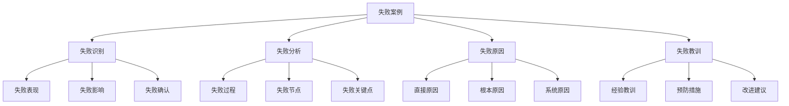

# 失败案例与教训

## 🎯 核心概念

### 失败案例定义
**失败案例**是指领导者在领导过程中，由于决策失误、管理不当、战略错误等原因，导致组织目标未能实现、绩效下降或出现重大问题的典型案例。

### 核心特征
- **目标未达成**：未能实现预期目标
- **绩效下降**：组织绩效显著下降
- **问题突出**：出现重大问题或危机
- **影响深远**：对组织产生长期负面影响

## 📚 失败案例理论框架

### 失败案例分析模型

### 失败类型
| 失败类型 | 具体内容 | 失败特点 | 失败原因 |
|----------|----------|----------|----------|
| **战略失败** | 战略错误、战略失误 | 战略问题 | 战略决策 |
| **管理失败** | 管理不当、管理失误 | 管理问题 | 管理能力 |
| **决策失败** | 决策错误、决策失误 | 决策问题 | 决策能力 |
| **执行失败** | 执行不力、执行失误 | 执行问题 | 执行能力 |

## 🔍 战略失败案例

### 案例背景
#### 失败概况
| 失败要素 | 具体内容 | 失败表现 | 影响分析 |
|----------|----------|----------|----------|
| **失败类型** | 战略失败 | 战略错误 | 战略问题 |
| **失败规模** | 大型企业 | 影响重大 | 影响广泛 |
| **失败时间** | 长期失败 | 时间较长 | 时间影响 |
| **失败后果** | 经营困难 | 后果严重 | 后果重大 |

#### 失败原因
| 原因类型 | 具体内容 | 原因分析 | 责任归属 |
|----------|----------|----------|----------|
| **外部原因** | 市场变化、竞争加剧 | 外部环境 | 外部因素 |
| **内部原因** | 战略失误、决策错误 | 内部问题 | 内部因素 |
| **直接原因** | 战略错误、执行不力 | 直接问题 | 直接因素 |
| **根本原因** | 战略思维、决策能力 | 根本问题 | 根本因素 |

### 失败分析
#### 失败过程
| 过程阶段 | 具体内容 | 失败表现 | 失败原因 |
|----------|----------|----------|----------|
| **战略制定** | 战略制定、战略规划 | 战略错误 | 战略思维 |
| **战略实施** | 战略实施、战略执行 | 执行不力 | 执行能力 |
| **战略监控** | 战略监控、战略调整 | 监控不力 | 监控能力 |
| **战略评估** | 战略评估、战略总结 | 评估不足 | 评估能力 |

#### 失败关键点
| 关键点 | 具体内容 | 关键表现 | 关键原因 |
|--------|----------|----------|----------|
| **战略思维** | 战略思维、战略视野 | 思维局限 | 思维缺陷 |
| **决策能力** | 决策能力、决策质量 | 能力不足 | 能力缺陷 |
| **执行能力** | 执行能力、执行质量 | 能力不足 | 能力缺陷 |
| **监控能力** | 监控能力、监控质量 | 能力不足 | 能力缺陷 |

### 失败教训
#### 经验教训
| 教训类型 | 具体内容 | 教训总结 | 应用价值 |
|----------|----------|----------|----------|
| **战略教训** | 战略思维、战略规划 | 战略重要 | 战略价值 |
| **决策教训** | 决策能力、决策质量 | 决策重要 | 决策价值 |
| **执行教训** | 执行能力、执行质量 | 执行重要 | 执行价值 |
| **监控教训** | 监控能力、监控质量 | 监控重要 | 监控价值 |

#### 预防措施
| 措施类型 | 具体内容 | 措施重点 | 实施要点 |
|----------|----------|----------|----------|
| **战略预防** | 战略思维、战略规划 | 战略提升 | 战略改进 |
| **决策预防** | 决策能力、决策质量 | 决策提升 | 决策改进 |
| **执行预防** | 执行能力、执行质量 | 执行提升 | 执行改进 |
| **监控预防** | 监控能力、监控质量 | 监控提升 | 监控改进 |

## 🚀 管理失败案例

### 案例背景
#### 失败概况
| 失败要素 | 具体内容 | 失败表现 | 影响分析 |
|----------|----------|----------|----------|
| **失败类型** | 管理失败 | 管理不当 | 管理问题 |
| **失败规模** | 大型企业 | 影响重大 | 影响广泛 |
| **失败时间** | 中期失败 | 时间较长 | 时间影响 |
| **失败后果** | 管理混乱 | 后果严重 | 后果重大 |

#### 失败原因
| 原因类型 | 具体内容 | 原因分析 | 责任归属 |
|----------|----------|----------|----------|
| **外部原因** | 市场变化、竞争加剧 | 外部环境 | 外部因素 |
| **内部原因** | 管理失误、制度缺陷 | 内部问题 | 内部因素 |
| **直接原因** | 管理不当、执行不力 | 直接问题 | 直接因素 |
| **根本原因** | 管理能力、制度体系 | 根本问题 | 根本因素 |

### 失败分析
#### 失败过程
| 过程阶段 | 具体内容 | 失败表现 | 失败原因 |
|----------|----------|----------|----------|
| **管理规划** | 管理规划、管理设计 | 规划错误 | 规划能力 |
| **管理实施** | 管理实施、管理执行 | 实施不力 | 实施能力 |
| **管理监控** | 管理监控、管理调整 | 监控不力 | 监控能力 |
| **管理评估** | 管理评估、管理总结 | 评估不足 | 评估能力 |

#### 失败关键点
| 关键点 | 具体内容 | 关键表现 | 关键原因 |
|--------|----------|----------|----------|
| **管理能力** | 管理能力、管理水平 | 能力不足 | 能力缺陷 |
| **制度体系** | 制度体系、制度设计 | 体系缺陷 | 体系问题 |
| **执行能力** | 执行能力、执行质量 | 能力不足 | 能力缺陷 |
| **监控能力** | 监控能力、监控质量 | 能力不足 | 能力缺陷 |

### 失败教训
#### 经验教训
| 教训类型 | 具体内容 | 教训总结 | 应用价值 |
|----------|----------|----------|----------|
| **管理教训** | 管理能力、管理水平 | 管理重要 | 管理价值 |
| **制度教训** | 制度体系、制度设计 | 制度重要 | 制度价值 |
| **执行教训** | 执行能力、执行质量 | 执行重要 | 执行价值 |
| **监控教训** | 监控能力、监控质量 | 监控重要 | 监控价值 |

#### 预防措施
| 措施类型 | 具体内容 | 措施重点 | 实施要点 |
|----------|----------|----------|----------|
| **管理预防** | 管理能力、管理水平 | 管理提升 | 管理改进 |
| **制度预防** | 制度体系、制度设计 | 制度完善 | 制度改进 |
| **执行预防** | 执行能力、执行质量 | 执行提升 | 执行改进 |
| **监控预防** | 监控能力、监控质量 | 监控提升 | 监控改进 |

## 📊 决策失败案例

### 案例背景
#### 失败概况
| 失败要素 | 具体内容 | 失败表现 | 影响分析 |
|----------|----------|----------|----------|
| **失败类型** | 决策失败 | 决策错误 | 决策问题 |
| **失败规模** | 大型企业 | 影响重大 | 影响广泛 |
| **失败时间** | 短期失败 | 时间较短 | 时间影响 |
| **失败后果** | 决策失误 | 后果严重 | 后果重大 |

#### 失败原因
| 原因类型 | 具体内容 | 原因分析 | 责任归属 |
|----------|----------|----------|----------|
| **外部原因** | 市场变化、竞争加剧 | 外部环境 | 外部因素 |
| **内部原因** | 决策失误、信息不足 | 内部问题 | 内部因素 |
| **直接原因** | 决策错误、执行不力 | 直接问题 | 直接因素 |
| **根本原因** | 决策能力、决策体系 | 根本问题 | 根本因素 |

### 失败分析
#### 失败过程
| 过程阶段 | 具体内容 | 失败表现 | 失败原因 |
|----------|----------|----------|----------|
| **决策制定** | 决策制定、决策规划 | 决策错误 | 决策能力 |
| **决策实施** | 决策实施、决策执行 | 实施不力 | 实施能力 |
| **决策监控** | 决策监控、决策调整 | 监控不力 | 监控能力 |
| **决策评估** | 决策评估、决策总结 | 评估不足 | 评估能力 |

#### 失败关键点
| 关键点 | 具体内容 | 关键表现 | 关键原因 |
|--------|----------|----------|----------|
| **决策能力** | 决策能力、决策质量 | 能力不足 | 能力缺陷 |
| **信息收集** | 信息收集、信息分析 | 信息不足 | 信息缺陷 |
| **执行能力** | 执行能力、执行质量 | 能力不足 | 能力缺陷 |
| **监控能力** | 监控能力、监控质量 | 能力不足 | 能力缺陷 |

### 失败教训
#### 经验教训
| 教训类型 | 具体内容 | 教训总结 | 应用价值 |
|----------|----------|----------|----------|
| **决策教训** | 决策能力、决策质量 | 决策重要 | 决策价值 |
| **信息教训** | 信息收集、信息分析 | 信息重要 | 信息价值 |
| **执行教训** | 执行能力、执行质量 | 执行重要 | 执行价值 |
| **监控教训** | 监控能力、监控质量 | 监控重要 | 监控价值 |

#### 预防措施
| 措施类型 | 具体内容 | 措施重点 | 实施要点 |
|----------|----------|----------|----------|
| **决策预防** | 决策能力、决策质量 | 决策提升 | 决策改进 |
| **信息预防** | 信息收集、信息分析 | 信息完善 | 信息改进 |
| **执行预防** | 执行能力、执行质量 | 执行提升 | 执行改进 |
| **监控预防** | 监控能力、监控质量 | 监控提升 | 监控改进 |

## 🎯 执行失败案例

### 案例背景
#### 失败概况
| 失败要素 | 具体内容 | 失败表现 | 影响分析 |
|----------|----------|----------|----------|
| **失败类型** | 执行失败 | 执行不力 | 执行问题 |
| **失败规模** | 大型企业 | 影响重大 | 影响广泛 |
| **失败时间** | 中期失败 | 时间较长 | 时间影响 |
| **失败后果** | 执行失败 | 后果严重 | 后果重大 |

#### 失败原因
| 原因类型 | 具体内容 | 原因分析 | 责任归属 |
|----------|----------|----------|----------|
| **外部原因** | 市场变化、竞争加剧 | 外部环境 | 外部因素 |
| **内部原因** | 执行不力、能力不足 | 内部问题 | 内部因素 |
| **直接原因** | 执行错误、执行不力 | 直接问题 | 直接因素 |
| **根本原因** | 执行能力、执行体系 | 根本问题 | 根本因素 |

### 失败分析
#### 失败过程
| 过程阶段 | 具体内容 | 失败表现 | 失败原因 |
|----------|----------|----------|----------|
| **执行规划** | 执行规划、执行设计 | 规划错误 | 规划能力 |
| **执行实施** | 执行实施、执行执行 | 实施不力 | 实施能力 |
| **执行监控** | 执行监控、执行调整 | 监控不力 | 监控能力 |
| **执行评估** | 执行评估、执行总结 | 评估不足 | 评估能力 |

#### 失败关键点
| 关键点 | 具体内容 | 关键表现 | 关键原因 |
|--------|----------|----------|----------|
| **执行能力** | 执行能力、执行质量 | 能力不足 | 能力缺陷 |
| **执行体系** | 执行体系、执行设计 | 体系缺陷 | 体系问题 |
| **监控能力** | 监控能力、监控质量 | 能力不足 | 能力缺陷 |
| **评估能力** | 评估能力、评估质量 | 能力不足 | 能力缺陷 |

### 失败教训
#### 经验教训
| 教训类型 | 具体内容 | 教训总结 | 应用价值 |
|----------|----------|----------|----------|
| **执行教训** | 执行能力、执行质量 | 执行重要 | 执行价值 |
| **体系教训** | 执行体系、执行设计 | 体系重要 | 体系价值 |
| **监控教训** | 监控能力、监控质量 | 监控重要 | 监控价值 |
| **评估教训** | 评估能力、评估质量 | 评估重要 | 评估价值 |

#### 预防措施
| 措施类型 | 具体内容 | 措施重点 | 实施要点 |
|----------|----------|----------|----------|
| **执行预防** | 执行能力、执行质量 | 执行提升 | 执行改进 |
| **体系预防** | 执行体系、执行设计 | 体系完善 | 体系改进 |
| **监控预防** | 监控能力、监控质量 | 监控提升 | 监控改进 |
| **评估预防** | 评估能力、评估质量 | 评估提升 | 评估改进 |

## 📈 失败案例对比

### 对比维度
| 对比维度 | 战略失败 | 管理失败 | 决策失败 | 执行失败 |
|----------|----------|----------|----------|----------|
| **失败特点** | 战略问题 | 管理问题 | 决策问题 | 执行问题 |
| **失败原因** | 战略决策 | 管理能力 | 决策能力 | 执行能力 |
| **失败影响** | 战略影响 | 管理影响 | 决策影响 | 执行影响 |
| **恢复难度** | 战略恢复 | 管理恢复 | 决策恢复 | 执行恢复 |

### 对比分析
#### 共同特点
| 共同特点 | 具体内容 | 特点表现 | 影响分析 |
|----------|----------|----------|----------|
| **目标未达成** | 目标失败、目标未实现 | 目标问题 | 目标影响 |
| **绩效下降** | 绩效下降、绩效恶化 | 绩效问题 | 绩效影响 |
| **问题突出** | 问题严重、问题明显 | 问题程度 | 问题影响 |
| **影响深远** | 影响长期、影响重大 | 影响程度 | 影响范围 |

#### 差异特点
| 差异特点 | 具体内容 | 差异表现 | 差异影响 |
|----------|----------|----------|----------|
| **失败类型** | 不同类型、不同特点 | 类型差异 | 类型影响 |
| **失败原因** | 不同原因、不同因素 | 原因差异 | 原因影响 |
| **失败影响** | 不同影响、不同范围 | 影响差异 | 影响程度 |
| **恢复难度** | 不同难度、不同要求 | 难度差异 | 难度影响 |

## 🔗 相关概念链接

### 基础概念
- [[01-基础认知层/01-领导力概述|领导力概述]]
- [[01-基础认知层/04-现代领导力挑战|现代挑战]]
- [[02-理论理解层/经典领导理论/03-情境理论|情境理论]]

### 理论概念
- [[02-理论理解层/现代领导理论/01-变革型领导|变革型领导]]
- [[02-理论理解层/现代领导理论/02-服务型领导|服务型领导]]

### 能力概念
- [[03-能力构建层/核心领导能力/01-战略思维|战略思维]]
- [[03-能力构建层/核心领导能力/02-决策能力|决策能力]]

### 实践概念
- [[02-危机处理案例|危机处理案例]]
- [[01-成功领导者案例|成功案例]]

## 💡 学习要点总结

### 关键理解
1. **失败特点**：失败具有目标未达成、绩效下降、问题突出和影响深远的特点
2. **失败原因**：失败原因包括外部原因、内部原因、直接原因和根本原因
3. **失败分析**：通过分析失败过程和关键点，找出失败原因
4. **失败教训**：从失败中总结经验教训，制定预防措施

### 实践应用
1. **失败识别**：及时发现和识别失败迹象
2. **失败分析**：深入分析失败原因和过程
3. **失败教训**：总结失败经验教训
4. **预防措施**：制定预防措施，避免类似失败

### 思考问题
1. 不同类型的失败有什么特点？
2. 如何分析失败的原因和过程？
3. 从失败中能学到什么经验教训？
4. 如何制定有效的预防措施？

---

**下一步**：[[02-危机处理案例|危机处理案例]] | [[07-工具资源层/学习资源/01-推荐书籍|推荐书籍]]
