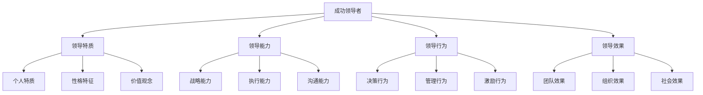
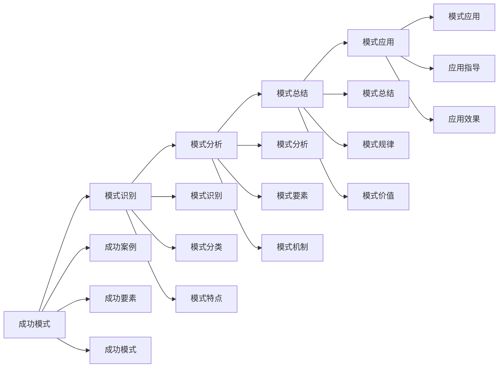

# 成功领导者案例

## 🎯 核心概念

### 成功领导者定义
**成功领导者**是指在领导实践中取得显著成就，能够有效带领团队实现目标，并在组织发展中发挥重要作用的领导者。

### 成功特征
- **目标导向**：明确目标并有效实现
- **团队建设**：建设高效团队
- **创新驱动**：推动创新发展
- **持续发展**：实现持续发展

## 📚 成功领导者分析框架

### 成功领导者模型

### 成功要素
| 成功要素 | 具体内容 | 重要性 | 影响程度 |
|----------|----------|--------|----------|
| **个人特质** | 性格、价值观、动机 | 高 | 基础性 |
| **领导能力** | 战略、执行、沟通 | 高 | 核心性 |
| **团队建设** | 团队组建、团队管理 | 中 | 关键性 |
| **环境适应** | 环境适应、变化应对 | 中 | 重要性 |

## 🔍 经典成功案例

### 杰克·韦尔奇（通用电气）
#### 领导背景
| 背景要素 | 具体内容 | 背景特点 | 影响分析 |
|----------|----------|----------|----------|
| **公司背景** | 通用电气，多元化企业 | 规模庞大 | 管理复杂 |
| **时代背景** | 20世纪80-90年代 | 变革时代 | 变革需求 |
| **行业背景** | 制造业、服务业 | 竞争激烈 | 创新需求 |
| **个人背景** | 工程师出身，内部晋升 | 技术背景 | 管理挑战 |

#### 领导特质
| 特质维度 | 具体内容 | 特质表现 | 特质影响 |
|----------|----------|----------|----------|
| **战略思维** | 前瞻思维、系统思维 | 战略清晰 | 战略成功 |
| **变革能力** | 变革推动、变革管理 | 变革有效 | 变革成功 |
| **执行力** | 执行坚决、执行有效 | 执行到位 | 执行成功 |
| **沟通能力** | 沟通有效、激励有力 | 沟通顺畅 | 团队凝聚 |

#### 领导行为
| 行为类型 | 具体内容 | 行为特点 | 行为效果 |
|----------|----------|----------|----------|
| **战略行为** | 战略制定、战略实施 | 战略明确 | 战略成功 |
| **变革行为** | 变革推动、变革管理 | 变革有效 | 变革成功 |
| **管理行为** | 管理优化、管理创新 | 管理有效 | 管理成功 |
| **激励行为** | 激励员工、激发潜能 | 激励有效 | 员工积极 |

#### 领导效果
| 效果维度 | 具体内容 | 效果表现 | 效果影响 |
|----------|----------|----------|----------|
| **财务效果** | 收入增长、利润提升 | 财务改善 | 股东满意 |
| **市场效果** | 市场份额、品牌价值 | 市场领先 | 竞争优势 |
| **组织效果** | 组织效率、组织文化 | 组织优化 | 组织发展 |
| **社会效果** | 社会影响、行业影响 | 社会认可 | 行业地位 |

### 史蒂夫·乔布斯（苹果公司）
#### 领导背景
| 背景要素 | 具体内容 | 背景特点 | 影响分析 |
|----------|----------|----------|----------|
| **公司背景** | 苹果公司，科技企业 | 创新导向 | 创新需求 |
| **时代背景** | 21世纪初，数字化时代 | 技术变革 | 创新机遇 |
| **行业背景** | 科技行业、消费电子 | 竞争激烈 | 创新竞争 |
| **个人背景** | 技术背景，创业经历 | 创新思维 | 创新领导 |

#### 领导特质
| 特质维度 | 具体内容 | 特质表现 | 特质影响 |
|----------|----------|----------|----------|
| **创新思维** | 创新思维、设计思维 | 创新突出 | 产品创新 |
| **完美主义** | 追求完美、精益求精 | 质量卓越 | 产品品质 |
| **愿景领导** | 愿景清晰、愿景传达 | 愿景明确 | 团队认同 |
| **执行力** | 执行坚决、执行有效 | 执行到位 | 目标达成 |

#### 领导行为
| 行为类型 | 具体内容 | 行为特点 | 行为效果 |
|----------|----------|----------|----------|
| **创新行为** | 产品创新、技术创新 | 创新突出 | 产品领先 |
| **设计行为** | 产品设计、用户体验 | 设计卓越 | 用户满意 |
| **营销行为** | 品牌营销、市场推广 | 营销有效 | 品牌价值 |
| **团队行为** | 团队建设、人才管理 | 团队高效 | 人才聚集 |

#### 领导效果
| 效果维度 | 具体内容 | 效果表现 | 效果影响 |
|----------|----------|----------|----------|
| **产品效果** | 产品创新、产品品质 | 产品卓越 | 市场领先 |
| **品牌效果** | 品牌价值、品牌影响 | 品牌强大 | 品牌地位 |
| **市场效果** | 市场份额、市场地位 | 市场领先 | 竞争优势 |
| **行业效果** | 行业影响、行业变革 | 行业引领 | 行业地位 |

## 📊 现代成功案例

### 埃隆·马斯克（特斯拉、SpaceX）
#### 领导背景
| 背景要素 | 具体内容 | 背景特点 | 影响分析 |
|----------|----------|----------|----------|
| **公司背景** | 特斯拉、SpaceX，创新企业 | 技术前沿 | 创新挑战 |
| **时代背景** | 21世纪，科技时代 | 技术发展 | 创新机遇 |
| **行业背景** | 新能源汽车、航天 | 技术密集 | 技术竞争 |
| **个人背景** | 技术背景，创业经历 | 技术思维 | 创新领导 |

#### 领导特质
| 特质维度 | 具体内容 | 特质表现 | 特质影响 |
|----------|----------|----------|----------|
| **愿景领导** | 宏大愿景、未来导向 | 愿景宏大 | 团队激励 |
| **创新思维** | 技术创新、模式创新 | 创新突出 | 技术领先 |
| **冒险精神** | 敢于冒险、勇于挑战 | 冒险精神 | 突破传统 |
| **执行力** | 执行坚决、执行有效 | 执行到位 | 目标达成 |

#### 领导行为
| 行为类型 | 具体内容 | 行为特点 | 行为效果 |
|----------|----------|----------|----------|
| **创新行为** | 技术创新、产品创新 | 创新突出 | 技术领先 |
| **冒险行为** | 大胆决策、勇于尝试 | 冒险精神 | 突破创新 |
| **团队行为** | 团队建设、人才吸引 | 团队高效 | 人才聚集 |
| **营销行为** | 品牌营销、市场推广 | 营销有效 | 品牌价值 |

#### 领导效果
| 效果维度 | 具体内容 | 效果表现 | 效果影响 |
|----------|----------|----------|----------|
| **技术效果** | 技术创新、技术突破 | 技术领先 | 技术地位 |
| **市场效果** | 市场开拓、市场地位 | 市场领先 | 竞争优势 |
| **行业效果** | 行业变革、行业影响 | 行业引领 | 行业地位 |
| **社会效果** | 社会影响、社会变革 | 社会认可 | 社会地位 |

### 马云（阿里巴巴）
#### 领导背景
| 背景要素 | 具体内容 | 背景特点 | 影响分析 |
|----------|----------|----------|----------|
| **公司背景** | 阿里巴巴，电商企业 | 商业模式 | 商业创新 |
| **时代背景** | 21世纪初，互联网时代 | 技术变革 | 商业机遇 |
| **行业背景** | 电子商务、互联网 | 竞争激烈 | 创新竞争 |
| **个人背景** | 教师背景，创业经历 | 教育思维 | 商业领导 |

#### 领导特质
| 特质维度 | 具体内容 | 特质表现 | 特质影响 |
|----------|----------|----------|----------|
| **商业思维** | 商业模式、商业创新 | 商业敏锐 | 商业成功 |
| **团队建设** | 团队建设、人才管理 | 团队高效 | 人才聚集 |
| **愿景领导** | 愿景清晰、愿景传达 | 愿景明确 | 团队认同 |
| **执行力** | 执行坚决、执行有效 | 执行到位 | 目标达成 |

#### 领导行为
| 行为类型 | 具体内容 | 行为特点 | 行为效果 |
|----------|----------|----------|----------|
| **创新行为** | 商业模式创新、技术创新 | 创新突出 | 商业领先 |
| **团队行为** | 团队建设、人才管理 | 团队高效 | 人才聚集 |
| **营销行为** | 品牌营销、市场推广 | 营销有效 | 品牌价值 |
| **社会行为** | 社会责任、社会贡献 | 社会担当 | 社会认可 |

#### 领导效果
| 效果维度 | 具体内容 | 效果表现 | 效果影响 |
|----------|----------|----------|----------|
| **商业效果** | 商业模式、商业成功 | 商业领先 | 商业地位 |
| **市场效果** | 市场开拓、市场地位 | 市场领先 | 竞争优势 |
| **行业效果** | 行业变革、行业影响 | 行业引领 | 行业地位 |
| **社会效果** | 社会影响、社会贡献 | 社会认可 | 社会地位 |

## 🎯 成功因素分析

### 共同成功因素
#### 个人因素
| 个人因素 | 具体内容 | 重要性 | 影响程度 |
|----------|----------|--------|----------|
| **愿景领导** | 清晰愿景、愿景传达 | 高 | 核心性 |
| **创新思维** | 创新思维、创新实践 | 高 | 关键性 |
| **执行力** | 执行坚决、执行有效 | 高 | 重要性 |
| **团队建设** | 团队建设、人才管理 | 中 | 关键性 |

#### 环境因素
| 环境因素 | 具体内容 | 重要性 | 影响程度 |
|----------|----------|--------|----------|
| **时代机遇** | 时代背景、历史机遇 | 高 | 基础性 |
| **行业环境** | 行业特点、竞争环境 | 中 | 重要性 |
| **技术环境** | 技术发展、技术变革 | 中 | 重要性 |
| **社会环境** | 社会环境、文化环境 | 低 | 影响性 |

### 成功模式
#### 成功模式类型
| 模式类型 | 具体内容 | 模式特点 | 适用场景 |
|----------|----------|----------|----------|
| **变革模式** | 推动变革、管理变革 | 变革导向 | 变革需求 |
| **创新模式** | 推动创新、管理创新 | 创新导向 | 创新需求 |
| **团队模式** | 团队建设、团队管理 | 团队导向 | 团队需求 |
| **愿景模式** | 愿景领导、愿景实现 | 愿景导向 | 愿景需求 |

#### 成功模式分析

## 📈 成功启示

### 领导启示
#### 个人启示
| 启示类型 | 具体内容 | 启示要点 | 应用价值 |
|----------|----------|----------|----------|
| **愿景启示** | 愿景重要性、愿景建设 | 愿景明确 | 团队激励 |
| **创新启示** | 创新重要性、创新实践 | 创新突出 | 竞争优势 |
| **执行启示** | 执行重要性、执行有效 | 执行到位 | 目标达成 |
| **团队启示** | 团队重要性、团队建设 | 团队高效 | 组织发展 |

#### 管理启示
| 启示类型 | 具体内容 | 启示要点 | 应用价值 |
|----------|----------|----------|----------|
| **战略启示** | 战略重要性、战略管理 | 战略清晰 | 发展方向 |
| **变革启示** | 变革重要性、变革管理 | 变革有效 | 组织适应 |
| **文化启示** | 文化重要性、文化建设 | 文化强大 | 组织凝聚 |
| **人才启示** | 人才重要性、人才管理 | 人才聚集 | 组织能力 |

### 实践启示
#### 实践要点
| 实践要点 | 具体内容 | 实践方法 | 实践效果 |
|----------|----------|----------|----------|
| **愿景建设** | 愿景制定、愿景传达 | 愿景管理 | 团队激励 |
| **创新推动** | 创新思维、创新实践 | 创新管理 | 竞争优势 |
| **团队建设** | 团队组建、团队管理 | 团队管理 | 组织发展 |
| **执行管理** | 执行计划、执行监控 | 执行管理 | 目标达成 |

#### 实践方法
| 方法类型 | 具体内容 | 实施要点 | 实施效果 |
|----------|----------|----------|----------|
| **案例学习** | 案例研究、案例应用 | 学习深入 | 知识积累 |
| **实践应用** | 实践应用、实践验证 | 应用有效 | 能力提升 |
| **持续改进** | 持续改进、持续发展 | 改进持续 | 持续发展 |
| **经验总结** | 经验总结、经验分享 | 总结系统 | 经验积累 |

## 🔗 相关概念链接

### 基础概念
- [[01-基础认知层/01-领导力概述|领导力概述]]
- [[01-基础认知层/02-管理者vs领导者|管理者vs领导者]]
- [[02-理论理解层/经典领导理论/01-特质理论|特质理论]]

### 理论概念
- [[02-理论理解层/现代领导理论/01-变革型领导|变革型领导]]
- [[02-理论理解层/现代领导理论/02-服务型领导|服务型领导]]

### 能力概念
- [[03-能力构建层/核心领导能力/01-战略思维|战略思维]]
- [[03-能力构建层/核心领导能力/02-决策能力|决策能力]]

### 实践概念
- [[02-行业特色领导|行业特色领导]]
- [[失败案例/01-失败案例与教训|失败案例]]

## 💡 学习要点总结

### 关键理解
1. **成功领导者**：个人特质、领导能力、领导行为、领导效果
2. **成功因素**：个人因素、环境因素、成功模式
3. **成功启示**：领导启示、管理启示、实践启示
4. **案例分析**：案例研究、案例应用、案例总结

### 实践应用
1. **案例学习**：深入研究成功案例
2. **成功因素**：分析成功的关键因素
3. **成功启示**：从成功案例中学习启示
4. **实践应用**：将成功经验应用到实践中

### 思考问题
1. 成功领导者的共同特征是什么？
2. 成功的关键因素有哪些？
3. 如何从成功案例中学习？
4. 如何将成功经验应用到实践中？

---

**下一步**：[[02-行业特色领导|行业特色领导]] | [[失败案例/01-失败案例与教训|失败案例]]
