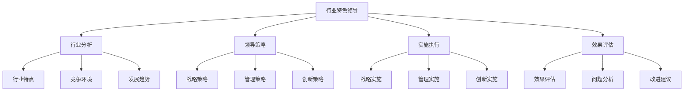

# 行业特色领导

## 🎯 核心概念

### 行业特色领导定义
**行业特色领导**是指在不同行业中，根据行业特点、发展规律和竞争环境，采用具有行业特色的领导方式和策略，实现行业领先地位的领导过程。

### 核心特征
- **行业适应性**：适应行业特点
- **专业性**：具备行业专业知识
- **创新性**：推动行业创新
- **竞争性**：在竞争中领先

## 📚 行业特色领导理论框架

### 行业特色领导模型

### 行业分类
| 行业类型 | 具体内容 | 行业特点 | 领导重点 |
|----------|----------|----------|----------|
| **制造业** | 传统制造、高端制造 | 技术密集 | 技术创新 |
| **服务业** | 传统服务、现代服务 | 服务导向 | 服务质量 |
| **科技业** | 信息技术、生物技术 | 创新密集 | 创新管理 |
| **金融业** | 银行、保险、证券 | 风险管控 | 风险管理 |

## 🔍 制造业领导

### 制造业特点
#### 行业特征
| 特征维度 | 具体内容 | 特征表现 | 领导影响 |
|----------|----------|----------|----------|
| **技术特征** | 技术密集、技术更新 | 技术先进 | 技术领导 |
| **质量特征** | 质量要求、质量管控 | 质量严格 | 质量领导 |
| **效率特征** | 效率要求、效率提升 | 效率优先 | 效率领导 |
| **成本特征** | 成本控制、成本优化 | 成本敏感 | 成本领导 |

#### 竞争环境
| 环境要素 | 具体内容 | 环境特点 | 竞争策略 |
|----------|----------|----------|----------|
| **技术竞争** | 技术创新、技术领先 | 技术竞争 | 技术战略 |
| **质量竞争** | 质量提升、质量领先 | 质量竞争 | 质量战略 |
| **成本竞争** | 成本降低、成本领先 | 成本竞争 | 成本战略 |
| **服务竞争** | 服务提升、服务领先 | 服务竞争 | 服务战略 |

### 制造业领导策略
#### 战略策略
| 策略类型 | 具体内容 | 策略重点 | 实施要点 |
|----------|----------|----------|----------|
| **技术战略** | 技术创新、技术领先 | 技术发展 | 技术投入 |
| **质量战略** | 质量提升、质量领先 | 质量保证 | 质量管控 |
| **效率战略** | 效率提升、效率领先 | 效率优化 | 流程优化 |
| **成本战略** | 成本控制、成本领先 | 成本管理 | 成本优化 |

#### 管理策略
| 策略类型 | 具体内容 | 策略重点 | 实施要点 |
|----------|----------|----------|----------|
| **生产管理** | 生产计划、生产控制 | 生产优化 | 生产管理 |
| **质量管理** | 质量管控、质量改进 | 质量保证 | 质量管理 |
| **供应链管理** | 供应链优化、供应链管理 | 供应链效率 | 供应链管理 |
| **人才管理** | 人才培养、人才激励 | 人才发展 | 人才管理 |

### 制造业领导案例
#### 丰田生产方式
| 案例要素 | 具体内容 | 案例特点 | 成功因素 |
|----------|----------|----------|----------|
| **领导理念** | 精益生产、持续改进 | 理念先进 | 理念引领 |
| **管理方法** | 丰田生产方式、精益管理 | 方法有效 | 方法创新 |
| **实施效果** | 效率提升、质量改善 | 效果显著 | 效果突出 |
| **行业影响** | 行业引领、行业变革 | 影响深远 | 影响广泛 |

## 🚀 科技业领导

### 科技业特点
#### 行业特征
| 特征维度 | 具体内容 | 特征表现 | 领导影响 |
|----------|----------|----------|----------|
| **创新特征** | 创新密集、创新快速 | 创新突出 | 创新领导 |
| **技术特征** | 技术先进、技术更新 | 技术领先 | 技术领导 |
| **人才特征** | 人才密集、人才竞争 | 人才重要 | 人才领导 |
| **市场特征** | 市场变化、市场机遇 | 市场敏感 | 市场领导 |

#### 竞争环境
| 环境要素 | 具体内容 | 环境特点 | 竞争策略 |
|----------|----------|----------|----------|
| **创新竞争** | 创新速度、创新能力 | 创新竞争 | 创新战略 |
| **技术竞争** | 技术领先、技术突破 | 技术竞争 | 技术战略 |
| **人才竞争** | 人才争夺、人才激励 | 人才竞争 | 人才战略 |
| **市场竞争** | 市场开拓、市场占有 | 市场竞争 | 市场战略 |

### 科技业领导策略
#### 创新策略
| 策略类型 | 具体内容 | 策略重点 | 实施要点 |
|----------|----------|----------|----------|
| **技术创新** | 技术创新、技术突破 | 技术发展 | 技术投入 |
| **产品创新** | 产品创新、产品开发 | 产品领先 | 产品开发 |
| **模式创新** | 商业模式、运营模式 | 模式创新 | 模式探索 |
| **管理创新** | 管理创新、管理优化 | 管理提升 | 管理改进 |

#### 人才策略
| 策略类型 | 具体内容 | 策略重点 | 实施要点 |
|----------|----------|----------|----------|
| **人才吸引** | 人才招聘、人才引进 | 人才聚集 | 人才吸引 |
| **人才培养** | 人才培养、人才发展 | 人才提升 | 人才培养 |
| **人才激励** | 人才激励、人才保留 | 人才稳定 | 人才激励 |
| **人才管理** | 人才管理、人才优化 | 人才效率 | 人才管理 |

### 科技业领导案例
#### 谷歌创新文化
| 案例要素 | 具体内容 | 案例特点 | 成功因素 |
|----------|----------|----------|----------|
| **领导理念** | 创新文化、开放文化 | 理念先进 | 理念引领 |
| **管理方法** | 20%时间、扁平化管理 | 方法创新 | 方法有效 |
| **实施效果** | 创新成果、产品成功 | 效果显著 | 效果突出 |
| **行业影响** | 行业引领、行业变革 | 影响深远 | 影响广泛 |

## 📊 金融业领导

### 金融业特点
#### 行业特征
| 特征维度 | 具体内容 | 特征表现 | 领导影响 |
|----------|----------|----------|----------|
| **风险特征** | 风险密集、风险管控 | 风险重要 | 风险领导 |
| **监管特征** | 监管严格、合规要求 | 合规重要 | 合规领导 |
| **服务特征** | 服务导向、客户至上 | 服务重要 | 服务领导 |
| **创新特征** | 金融创新、科技应用 | 创新重要 | 创新领导 |

#### 竞争环境
| 环境要素 | 具体内容 | 环境特点 | 竞争策略 |
|----------|----------|----------|----------|
| **风险竞争** | 风险管控、风险领先 | 风险竞争 | 风险战略 |
| **服务竞争** | 服务质量、服务创新 | 服务竞争 | 服务战略 |
| **技术竞争** | 技术应用、技术领先 | 技术竞争 | 技术战略 |
| **合规竞争** | 合规管理、合规领先 | 合规竞争 | 合规战略 |

### 金融业领导策略
#### 风险策略
| 策略类型 | 具体内容 | 策略重点 | 实施要点 |
|----------|----------|----------|----------|
| **风险识别** | 风险识别、风险评估 | 风险发现 | 风险识别 |
| **风险控制** | 风险控制、风险防范 | 风险管控 | 风险控制 |
| **风险管理** | 风险管理、风险优化 | 风险优化 | 风险管理 |
| **风险文化** | 风险文化、风险意识 | 风险文化 | 文化建设 |

#### 服务策略
| 策略类型 | 具体内容 | 策略重点 | 实施要点 |
|----------|----------|----------|----------|
| **客户服务** | 客户服务、客户满意 | 客户导向 | 客户管理 |
| **服务创新** | 服务创新、服务优化 | 服务提升 | 服务创新 |
| **服务质量** | 服务质量、服务标准 | 质量保证 | 质量管理 |
| **服务文化** | 服务文化、服务意识 | 服务文化 | 文化建设 |

### 金融业领导案例
#### 招商银行服务创新
| 案例要素 | 具体内容 | 案例特点 | 成功因素 |
|----------|----------|----------|----------|
| **领导理念** | 服务创新、客户至上 | 理念先进 | 理念引领 |
| **管理方法** | 服务创新、技术应用 | 方法创新 | 方法有效 |
| **实施效果** | 服务提升、客户满意 | 效果显著 | 效果突出 |
| **行业影响** | 行业引领、行业变革 | 影响深远 | 影响广泛 |

## 🎯 服务业领导

### 服务业特点
#### 行业特征
| 特征维度 | 具体内容 | 特征表现 | 领导影响 |
|----------|----------|----------|----------|
| **服务特征** | 服务导向、客户至上 | 服务重要 | 服务领导 |
| **人员特征** | 人员密集、人员重要 | 人员重要 | 人员领导 |
| **质量特征** | 服务质量、服务标准 | 质量重要 | 质量领导 |
| **创新特征** | 服务创新、模式创新 | 创新重要 | 创新领导 |

#### 竞争环境
| 环境要素 | 具体内容 | 环境特点 | 竞争策略 |
|----------|----------|----------|----------|
| **服务竞争** | 服务质量、服务创新 | 服务竞争 | 服务战略 |
| **人员竞争** | 人员素质、人员服务 | 人员竞争 | 人员战略 |
| **质量竞争** | 质量提升、质量领先 | 质量竞争 | 质量战略 |
| **创新竞争** | 服务创新、模式创新 | 创新竞争 | 创新战略 |

### 服务业领导策略
#### 服务策略
| 策略类型 | 具体内容 | 策略重点 | 实施要点 |
|----------|----------|----------|----------|
| **客户服务** | 客户服务、客户满意 | 客户导向 | 客户管理 |
| **服务创新** | 服务创新、服务优化 | 服务提升 | 服务创新 |
| **服务质量** | 服务质量、服务标准 | 质量保证 | 质量管理 |
| **服务文化** | 服务文化、服务意识 | 服务文化 | 文化建设 |

#### 人员策略
| 策略类型 | 具体内容 | 策略重点 | 实施要点 |
|----------|----------|----------|----------|
| **人员招聘** | 人员招聘、人员选拔 | 人员质量 | 人员招聘 |
| **人员培训** | 人员培训、人员发展 | 人员提升 | 人员培训 |
| **人员激励** | 人员激励、人员保留 | 人员稳定 | 人员激励 |
| **人员管理** | 人员管理、人员优化 | 人员效率 | 人员管理 |

### 服务业领导案例
#### 海底捞服务文化
| 案例要素 | 具体内容 | 案例特点 | 成功因素 |
|----------|----------|----------|----------|
| **领导理念** | 服务文化、员工第一 | 理念先进 | 理念引领 |
| **管理方法** | 服务创新、员工激励 | 方法创新 | 方法有效 |
| **实施效果** | 服务提升、客户满意 | 效果显著 | 效果突出 |
| **行业影响** | 行业引领、行业变革 | 影响深远 | 影响广泛 |

## 📈 行业领导对比

### 对比维度
| 对比维度 | 制造业 | 科技业 | 金融业 | 服务业 |
|----------|--------|--------|--------|--------|
| **领导重点** | 技术创新 | 创新管理 | 风险管理 | 服务管理 |
| **竞争策略** | 技术领先 | 创新领先 | 风险领先 | 服务领先 |
| **管理重点** | 生产管理 | 人才管理 | 合规管理 | 人员管理 |
| **文化特色** | 质量文化 | 创新文化 | 风险文化 | 服务文化 |

### 对比分析
#### 共同特点
| 共同特点 | 具体内容 | 特点表现 | 影响分析 |
|----------|----------|----------|----------|
| **创新导向** | 创新思维、创新实践 | 创新突出 | 竞争优势 |
| **人才重要** | 人才聚集、人才发展 | 人才重要 | 组织能力 |
| **质量要求** | 质量提升、质量保证 | 质量严格 | 质量保证 |
| **客户导向** | 客户服务、客户满意 | 客户重要 | 市场地位 |

#### 差异特点
| 差异特点 | 具体内容 | 差异表现 | 差异影响 |
|----------|----------|----------|----------|
| **技术重点** | 技术密集、技术领先 | 技术差异 | 技术优势 |
| **风险重点** | 风险管控、风险防范 | 风险差异 | 风险优势 |
| **服务重点** | 服务导向、服务创新 | 服务差异 | 服务优势 |
| **创新重点** | 创新密集、创新快速 | 创新差异 | 创新优势 |

## 🔗 相关概念链接

### 基础概念
- [[01-基础认知层/01-领导力概述|领导力概述]]
- [[01-基础认知层/04-现代领导力挑战|现代挑战]]
- [[02-理论理解层/经典领导理论/03-情境理论|情境理论]]

### 理论概念
- [[02-理论理解层/现代领导理论/01-变革型领导|变革型领导]]
- [[02-理论理解层/现代领导理论/02-服务型领导|服务型领导]]

### 能力概念
- [[03-能力构建层/核心领导能力/01-战略思维|战略思维]]
- [[03-能力构建层/核心领导能力/05-变革管理|变革管理]]

### 实践概念
- [[01-成功领导者案例|成功案例]]
- [[失败案例/01-失败案例与教训|失败案例]]

## 💡 学习要点总结

### 关键理解
1. **行业特色**：不同行业有不同的特点和领导要求
2. **领导策略**：根据行业特点制定相应的领导策略
3. **竞争环境**：分析行业竞争环境，制定竞争策略
4. **成功案例**：学习行业成功案例，总结经验

### 实践应用
1. **行业分析**：深入分析行业特点和竞争环境
2. **策略制定**：根据行业特点制定领导策略
3. **案例学习**：学习行业成功案例
4. **实践应用**：将行业特色领导应用到实践中

### 思考问题
1. 不同行业的特点是什么？
2. 如何根据行业特点制定领导策略？
3. 行业成功案例的共同特点是什么？
4. 如何将行业特色领导应用到实践中？

---

**下一步**：[[失败案例/01-失败案例与教训|失败案例]] | [[02-危机处理案例|危机处理案例]]
