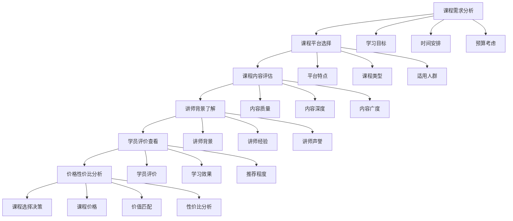

# 在线课程

## 🎯 核心概念

### 在线课程定义
**在线课程**是指通过互联网平台提供的领导力学习课程，包括视频课程、直播课程、互动课程等多种形式，具有灵活性强、覆盖面广、互动性好的特点。

### 核心特征
- **灵活性**：时间灵活，地点自由
- **互动性**：师生互动，学员交流
- **实用性**：理论结合实践，可操作性强
- **系统性**：内容完整，体系清晰

## 📚 在线课程分类

### 按平台分类
| 平台类型 | 具体内容 | 平台特点 | 适用人群 |
|----------|----------|----------|----------|
| **综合平台** | 网易云课堂、腾讯课堂 | 课程丰富 | 广泛人群 |
| **专业平台** | 得到、混沌大学 | 专业性强 | 专业人士 |
| **国际平台** | Coursera、edX | 国际视野 | 高端人群 |
| **企业平台** | 企业大学、内训平台 | 企业定制 | 企业员工 |

### 按形式分类
| 课程形式 | 具体内容 | 形式特点 | 学习效果 |
|----------|----------|----------|----------|
| **视频课程** | 录播课程、视频教学 | 可重复观看 | 学习效果好 |
| **直播课程** | 实时直播、在线互动 | 互动性强 | 互动效果好 |
| **互动课程** | 在线讨论、案例分析 | 参与度高 | 参与效果好 |
| **混合课程** | 多种形式结合 | 形式多样 | 综合效果好 |

## 🔍 综合平台课程

### 网易云课堂
| 课程名称 | 讲师 | 课程时长 | 核心内容 | 推荐理由 |
|----------|------|----------|----------|----------|
| **《领导力基础》** | 张教授 | 20小时 | 领导力理论、基础概念 | 基础扎实，理论深厚 |
| **《团队管理实战》** | 李老师 | 15小时 | 团队建设、团队管理 | 实战性强，方法实用 |
| **《战略思维训练》** | 王教授 | 18小时 | 战略思维、战略决策 | 思维训练，能力提升 |
| **《沟通协调技巧》** | 刘老师 | 12小时 | 沟通技巧、协调方法 | 技巧实用，效果显著 |

### 腾讯课堂
| 课程名称 | 讲师 | 课程时长 | 核心内容 | 推荐理由 |
|----------|------|----------|----------|----------|
| **《现代领导力》** | 陈教授 | 25小时 | 现代领导理论、实践应用 | 理论前沿，实践结合 |
| **《变革管理》** | 赵老师 | 16小时 | 变革管理、变革领导 | 变革管理，方法有效 |
| **《情商管理》** | 孙老师 | 14小时 | 情商理论、情商管理 | 情商管理，实用性强 |
| **《项目管理领导》** | 周老师 | 20小时 | 项目管理、项目领导 | 项目管理，系统性强 |

## 🚀 专业平台课程

### 得到APP
| 课程名称 | 讲师 | 课程时长 | 核心内容 | 推荐理由 |
|----------|------|----------|----------|----------|
| **《领导力30讲》** | 刘润 | 30讲 | 领导力理论、实践方法 | 内容精炼，方法实用 |
| **《团队管理课》** | 宁向东 | 25讲 | 团队管理、团队建设 | 管理经典，理论深厚 |
| **《战略思维课》** | 曾鸣 | 20讲 | 战略思维、战略决策 | 战略思维，视野开阔 |
| **《沟通表达课》** | 脱不花 | 18讲 | 沟通技巧、表达方法 | 沟通技巧，效果显著 |

### 混沌大学
| 课程名称 | 讲师 | 课程时长 | 核心内容 | 推荐理由 |
|----------|------|----------|----------|----------|
| **《创新领导力》** | 李善友 | 24小时 | 创新理论、创新领导 | 创新理论，思维突破 |
| **《商业模式创新》** | 魏炜 | 20小时 | 商业模式、商业创新 | 商业模式，创新思维 |
| **《组织变革》** | 陈春花 | 22小时 | 组织变革、变革管理 | 组织变革，管理前沿 |
| **《数字化领导》** | 王坚 | 18小时 | 数字化、科技领导 | 数字化领导，时代特色 |

## 📊 国际平台课程

### Coursera
| 课程名称 | 大学/机构 | 课程时长 | 核心内容 | 推荐理由 |
|----------|------------|----------|----------|----------|
| **《领导力基础》** | 宾夕法尼亚大学 | 6周 | 领导力理论、基础概念 | 国际视野，理论深厚 |
| **《团队管理》** | 密歇根大学 | 5周 | 团队管理、团队建设 | 管理经典，方法有效 |
| **《战略思维》** | 哈佛商学院 | 8周 | 战略思维、战略决策 | 战略思维，视野开阔 |
| **《变革管理》** | 斯坦福大学 | 7周 | 变革管理、变革领导 | 变革管理，前沿理论 |

### edX
| 课程名称 | 大学/机构 | 课程时长 | 核心内容 | 推荐理由 |
|----------|------------|----------|----------|----------|
| **《现代领导力》** | MIT | 6周 | 现代领导理论、实践应用 | 理论前沿，实践结合 |
| **《组织行为学》** | 哈佛大学 | 8周 | 组织行为、组织管理 | 组织理论，系统性强 |
| **《创新管理》** | 加州大学 | 7周 | 创新管理、创新领导 | 创新管理，方法创新 |
| **《数字化领导》** | 卡内基梅隆大学 | 6周 | 数字化、科技领导 | 数字化领导，时代特色 |

## 🎯 企业平台课程

### 企业大学
| 课程名称 | 企业 | 课程时长 | 核心内容 | 推荐理由 |
|----------|------|----------|----------|----------|
| **《华为领导力》** | 华为 | 40小时 | 华为领导力、管理实践 | 企业实践，方法有效 |
| **《阿里巴巴管理》** | 阿里巴巴 | 35小时 | 阿里管理、企业文化 | 企业文化，管理创新 |
| **《腾讯产品领导》** | 腾讯 | 30小时 | 产品领导、产品管理 | 产品管理，创新思维 |
| **《字节跳动组织》** | 字节跳动 | 25小时 | 组织管理、组织创新 | 组织创新，管理前沿 |

### 内训平台
| 课程名称 | 机构 | 课程时长 | 核心内容 | 推荐理由 |
|----------|------|----------|----------|----------|
| **《中欧领导力》** | 中欧商学院 | 45小时 | 领导力理论、实践应用 | 商学院经典，理论深厚 |
| **《长江管理》** | 长江商学院 | 40小时 | 管理理论、管理实践 | 管理经典，方法有效 |
| **《清华领导力》** | 清华大学 | 35小时 | 领导力理论、实践方法 | 学术权威，理论前沿 |
| **《北大管理》** | 北京大学 | 30小时 | 管理理论、管理实践 | 管理理论，系统性强 |

## 📈 课程选择建议

### 选择标准
| 选择维度 | 具体内容 | 评估标准 | 权重 |
|----------|----------|----------|------|
| **课程质量** | 内容质量、讲师水平 | 专业权威 | 30% |
| **实用性** | 实践应用、可操作性 | 实用性强 | 25% |
| **系统性** | 内容完整、体系清晰 | 系统性强 | 20% |
| **互动性** | 师生互动、学员交流 | 互动性好 | 15% |
| **性价比** | 价格合理、价值匹配 | 性价比高 | 10% |

### 选择流程

### 学习建议
| 学习阶段 | 推荐课程 | 学习重点 | 学习目标 |
|----------|----------|----------|----------|
| **入门阶段** | 基础理论课程 | 理论基础 | 建立概念 |
| **进阶阶段** | 实践应用课程 | 实践应用 | 掌握方法 |
| **提升阶段** | 专业深度课程 | 专业提升 | 能力发展 |
| **拓展阶段** | 国际前沿课程 | 视野拓展 | 思维突破 |

## 🔗 相关概念链接

### 基础概念
- [[01-基础认知层/01-领导力概述|领导力概述]]
- [[01-基础认知层/04-现代领导力挑战|现代挑战]]
- [[02-理论理解层/经典领导理论/01-特质理论|特质理论]]

### 理论概念
- [[02-理论理解层/现代领导理论/01-变革型领导|变革型领导]]
- [[02-理论理解层/现代领导理论/02-服务型领导|服务型领导]]

### 能力概念
- [[03-能力构建层/核心领导能力/01-战略思维|战略思维]]
- [[03-能力构建层/核心领导能力/06-情商与自我管理|情商管理]]

### 实践概念
- [[04-实践应用层/管理实践/01-团队管理|团队管理]]
- [[04-实践应用层/管理实践/05-变革管理|变革管理]]

## 💡 学习要点总结

### 关键理解
1. **课程分类**：按照平台、形式、内容等维度分类
2. **选择标准**：课程质量、实用性、系统性、互动性、性价比
3. **选择流程**：需求分析、平台选择、内容评估、讲师了解、评价查看、价格分析、决策选择
4. **学习建议**：分阶段学习，从基础到进阶，从理论到实践

### 实践应用
1. **需求分析**：明确学习目标和需求
2. **课程选择**：根据选择标准选择合适的课程
3. **学习计划**：制定学习计划和学习目标
4. **学习实践**：按照学习建议进行学习

### 思考问题
1. 如何选择适合自己的在线课程？
2. 如何制定有效的学习计划？
3. 如何提高在线学习的效果？
4. 如何将在线学习收获应用到实践中？

---

**下一步**：[[03-专业组织|专业组织]] | [[实用模板/01-会议管理模板|会议管理模板]]
