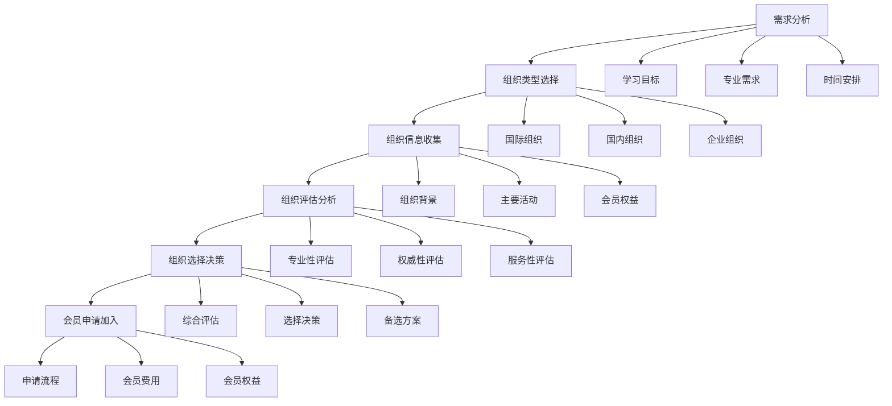

# 专业组织

## 🎯 核心概念

### 专业组织定义
**专业组织**是指专注于领导力研究、培训、认证和推广的专业机构，为领导力学习者提供专业支持、交流平台和发展机会。

### 核心特征
- **专业性**：专业权威，理论深厚
- **权威性**：行业认可，标准制定
- **服务性**：服务导向，价值创造
- **发展性**：持续发展，与时俱进

## 📚 专业组织分类

### 按地域分类
| 组织类型 | 具体内容 | 组织特点 | 服务范围 |
|----------|----------|----------|----------|
| **国际组织** | ILA、AMLE、AOM | 国际视野 | 全球范围 |
| **国内组织** | 中国领导力学会、中国管理学会 | 本土特色 | 国内范围 |
| **地区组织** | 地方领导力协会、地方管理学会 | 地区特色 | 地区范围 |
| **企业组织** | 企业领导力中心、企业大学 | 企业特色 | 企业内部 |

### 按功能分类
| 组织类型 | 具体内容 | 组织特点 | 主要功能 |
|----------|----------|----------|----------|
| **研究组织** | 学术研究、理论发展 | 理论导向 | 理论研究 |
| **培训组织** | 专业培训、能力提升 | 实践导向 | 能力培训 |
| **认证组织** | 专业认证、标准制定 | 标准导向 | 标准认证 |
| **交流组织** | 学术交流、经验分享 | 交流导向 | 经验交流 |

## 🔍 国际专业组织

### 国际领导力协会 (ILA)
| 组织要素 | 具体内容 | 组织特点 | 服务价值 |
|----------|----------|----------|----------|
| **成立时间** | 1999年 | 历史悠久 | 经验丰富 |
| **组织性质** | 国际性专业组织 | 国际视野 | 全球影响 |
| **主要功能** | 领导力研究、培训、认证 | 功能全面 | 服务全面 |
| **会员规模** | 全球会员 | 规模庞大 | 影响广泛 |
| **核心服务** | 学术会议、专业期刊、培训认证 | 服务专业 | 价值突出 |

#### 主要活动
| 活动类型 | 具体内容 | 活动特点 | 参与价值 |
|----------|----------|----------|----------|
| **学术会议** | 年度会议、专题研讨会 | 学术前沿 | 理论提升 |
| **专业期刊** | Leadership Quarterly、Leadership Review | 学术权威 | 理论发展 |
| **培训认证** | 领导力认证、专业培训 | 专业权威 | 能力提升 |
| **网络平台** | 在线社区、资源分享 | 交流便利 | 经验分享 |

### 美国管理学会 (AOM)
| 组织要素 | 具体内容 | 组织特点 | 服务价值 |
|----------|----------|----------|----------|
| **成立时间** | 1936年 | 历史最久 | 经验最丰富 |
| **组织性质** | 国际性管理组织 | 管理权威 | 全球影响 |
| **主要功能** | 管理研究、教育、实践 | 功能全面 | 服务全面 |
| **会员规模** | 全球会员 | 规模最大 | 影响最广 |
| **核心服务** | 学术会议、专业期刊、教育培训 | 服务专业 | 价值突出 |

#### 主要活动
| 活动类型 | 具体内容 | 活动特点 | 参与价值 |
|----------|----------|----------|----------|
| **学术会议** | 年度会议、专题研讨会 | 学术前沿 | 理论提升 |
| **专业期刊** | Academy of Management Review、Journal | 学术权威 | 理论发展 |
| **教育培训** | 管理教育、专业培训 | 教育权威 | 能力提升 |
| **网络平台** | 在线社区、资源分享 | 交流便利 | 经验分享 |

## 🚀 国内专业组织

### 中国领导力学会
| 组织要素 | 具体内容 | 组织特点 | 服务价值 |
|----------|----------|----------|----------|
| **成立时间** | 2010年 | 相对较新 | 发展迅速 |
| **组织性质** | 全国性专业组织 | 本土特色 | 国内影响 |
| **主要功能** | 领导力研究、培训、推广 | 功能全面 | 服务全面 |
| **会员规模** | 全国会员 | 规模较大 | 影响广泛 |
| **核心服务** | 学术会议、专业培训、认证服务 | 服务专业 | 价值突出 |

#### 主要活动
| 活动类型 | 具体内容 | 活动特点 | 参与价值 |
|----------|----------|----------|----------|
| **学术会议** | 年度会议、专题研讨会 | 学术前沿 | 理论提升 |
| **专业培训** | 领导力培训、能力提升 | 培训专业 | 能力提升 |
| **认证服务** | 领导力认证、专业认证 | 认证权威 | 标准认证 |
| **网络平台** | 在线社区、资源分享 | 交流便利 | 经验分享 |

### 中国管理学会
| 组织要素 | 具体内容 | 组织特点 | 服务价值 |
|----------|----------|----------|----------|
| **成立时间** | 1980年 | 历史较长 | 经验丰富 |
| **组织性质** | 全国性管理组织 | 管理权威 | 国内影响 |
| **主要功能** | 管理研究、教育、实践 | 功能全面 | 服务全面 |
| **会员规模** | 全国会员 | 规模最大 | 影响最广 |
| **核心服务** | 学术会议、专业期刊、教育培训 | 服务专业 | 价值突出 |

#### 主要活动
| 活动类型 | 具体内容 | 活动特点 | 参与价值 |
|----------|----------|----------|----------|
| **学术会议** | 年度会议、专题研讨会 | 学术前沿 | 理论提升 |
| **专业期刊** | 管理世界、管理科学 | 学术权威 | 理论发展 |
| **教育培训** | 管理教育、专业培训 | 教育权威 | 能力提升 |
| **网络平台** | 在线社区、资源分享 | 交流便利 | 经验分享 |

## 📊 企业专业组织

### 企业领导力中心
| 组织要素 | 具体内容 | 组织特点 | 服务价值 |
|----------|----------|----------|----------|
| **成立时间** | 企业自建 | 时间灵活 | 适应性强 |
| **组织性质** | 企业内部组织 | 企业特色 | 内部影响 |
| **主要功能** | 领导力培训、能力提升 | 功能专业 | 服务专业 |
| **会员规模** | 企业员工 | 规模适中 | 影响集中 |
| **核心服务** | 内部培训、能力评估、发展计划 | 服务专业 | 价值突出 |

#### 主要活动
| 活动类型 | 具体内容 | 活动特点 | 参与价值 |
|----------|----------|----------|----------|
| **内部培训** | 领导力培训、管理培训 | 培训专业 | 能力提升 |
| **能力评估** | 领导力评估、能力测评 | 评估专业 | 能力诊断 |
| **发展计划** | 个人发展、职业规划 | 计划专业 | 发展指导 |
| **经验分享** | 内部交流、经验分享 | 交流便利 | 经验学习 |

### 企业大学
| 组织要素 | 具体内容 | 组织特点 | 服务价值 |
|----------|----------|----------|----------|
| **成立时间** | 企业自建 | 时间灵活 | 适应性强 |
| **组织性质** | 企业内部教育组织 | 教育特色 | 内部影响 |
| **主要功能** | 员工教育、能力提升 | 功能专业 | 服务专业 |
| **会员规模** | 企业员工 | 规模较大 | 影响广泛 |
| **核心服务** | 教育培训、能力认证、发展支持 | 服务专业 | 价值突出 |

#### 主要活动
| 活动类型 | 具体内容 | 活动特点 | 参与价值 |
|----------|----------|----------|----------|
| **教育培训** | 领导力教育、管理教育 | 教育专业 | 能力提升 |
| **能力认证** | 领导力认证、专业认证 | 认证专业 | 标准认证 |
| **发展支持** | 职业发展、能力发展 | 支持专业 | 发展指导 |
| **经验分享** | 内部交流、经验分享 | 交流便利 | 经验学习 |

## 🎯 组织选择建议

### 选择标准
| 选择维度 | 具体内容 | 评估标准 | 权重 |
|----------|----------|----------|------|
| **专业性** | 专业权威、理论深厚 | 专业水平 | 30% |
| **权威性** | 行业认可、标准制定 | 权威程度 | 25% |
| **服务性** | 服务导向、价值创造 | 服务质量 | 20% |
| **发展性** | 持续发展、与时俱进 | 发展潜力 | 15% |
| **便利性** | 参与便利、交流便利 | 便利程度 | 10% |

### 选择流程

### 参与建议
| 参与阶段 | 推荐组织 | 参与重点 | 参与目标 |
|----------|----------|----------|----------|
| **入门阶段** | 国内组织、企业组织 | 基础学习 | 建立概念 |
| **进阶阶段** | 专业组织、培训组织 | 能力提升 | 掌握方法 |
| **提升阶段** | 国际组织、研究组织 | 理论提升 | 能力发展 |
| **拓展阶段** | 交流组织、认证组织 | 视野拓展 | 思维突破 |

## 📈 组织价值分析

### 价值维度
| 价值维度 | 具体内容 | 价值表现 | 价值评估 |
|----------|----------|----------|----------|
| **学习价值** | 知识学习、能力提升 | 学习效果 | 价值显著 |
| **交流价值** | 经验交流、人脉建立 | 交流效果 | 价值突出 |
| **认证价值** | 专业认证、标准认可 | 认证效果 | 价值重要 |
| **发展价值** | 职业发展、能力发展 | 发展效果 | 价值长远 |

### 价值实现
| 实现方式 | 具体内容 | 实现方法 | 实现效果 |
|----------|----------|----------|----------|
| **主动参与** | 积极参与、主动学习 | 主动学习 | 效果显著 |
| **持续学习** | 持续学习、不断进步 | 持续学习 | 效果突出 |
| **实践应用** | 理论实践、学以致用 | 实践应用 | 效果重要 |
| **经验分享** | 经验分享、知识传播 | 经验分享 | 效果长远 |

## 🔗 相关概念链接

### 基础概念
- [[01-基础认知层/01-领导力概述|领导力概述]]
- [[01-基础认知层/04-现代领导力挑战|现代挑战]]
- [[02-理论理解层/经典领导理论/01-特质理论|特质理论]]

### 理论概念
- [[02-理论理解层/现代领导理论/01-变革型领导|变革型领导]]
- [[02-理论理解层/现代领导理论/02-服务型领导|服务型领导]]

### 能力概念
- [[03-能力构建层/核心领导能力/01-战略思维|战略思维]]
- [[03-能力构建层/核心领导能力/06-情商与自我管理|情商管理]]

### 实践概念
- [[04-实践应用层/管理实践/01-团队管理|团队管理]]
- [[04-实践应用层/管理实践/05-变革管理|变革管理]]

## 💡 学习要点总结

### 关键理解
1. **组织分类**：按照地域、功能等维度分类
2. **选择标准**：专业性、权威性、服务性、发展性、便利性
3. **选择流程**：需求分析、类型选择、信息收集、评估分析、选择决策、申请加入
4. **参与建议**：分阶段参与，从入门到进阶，从理论到实践

### 实践应用
1. **需求分析**：明确学习目标和专业需求
2. **组织选择**：根据选择标准选择合适的组织
3. **积极参与**：主动参与组织活动，持续学习
4. **价值实现**：通过参与实现学习、交流、认证、发展价值

### 思考问题
1. 如何选择适合自己的专业组织？
2. 如何制定有效的参与计划？
3. 如何提高组织参与的效果？
4. 如何将组织参与收获应用到实践中？

---

**下一步**：[[实用模板/01-会议管理模板|会议管理模板]] | [[评估工具/01-领导力评估量表|领导力评估量表]]
