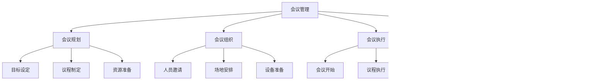

# 会议管理模板

## 🎯 核心概念

### 会议管理定义
**会议管理**是指通过系统化的方法，对会议的全过程进行规划、组织、执行和控制，确保会议目标达成、效率提升和质量保证的管理过程。

### 核心特征
- **目标导向**：明确会议目标，确保目标达成
- **过程管理**：全过程管理，确保质量
- **效率优先**：提高会议效率，减少时间浪费
- **持续改进**：不断优化，持续提升

## 📚 会议管理理论框架

### 会议管理模型

### 会议类型
| 会议类型 | 具体内容 | 会议特点 | 管理重点 |
|----------|----------|----------|----------|
| **决策会议** | 重大决策、战略决策 | 决策重要 | 决策质量 |
| **讨论会议** | 问题讨论、方案讨论 | 讨论深入 | 讨论效果 |
| **汇报会议** | 工作汇报、进度汇报 | 信息传递 | 信息准确 |
| **培训会议** | 知识培训、技能培训 | 学习导向 | 学习效果 |

## 🔍 会议规划模板

### 会议目标设定模板
| 目标要素 | 具体内容 | 设定要求 | 评估标准 |
|----------|----------|----------|----------|
| **总体目标** | 会议总体目标 | 明确具体 | 目标达成 |
| **具体目标** | 会议具体目标 | 可量化 | 目标实现 |
| **成功标准** | 成功标准定义 | 明确标准 | 标准达成 |
| **预期成果** | 预期成果描述 | 成果明确 | 成果实现 |

### 会议议程制定模板
| 议程要素 | 具体内容 | 时间安排 | 负责人 |
|----------|----------|----------|--------|
| **开场致辞** | 会议开场、目标说明 | 5分钟 | 主持人 |
| **主题讨论** | 主要议题讨论 | 30分钟 | 相关参与人 |
| **问题解答** | 问题解答、疑问澄清 | 15分钟 | 专家/负责人 |
| **总结发言** | 会议总结、下一步安排 | 10分钟 | 主持人 |

### 会议资源准备模板
| 资源类型 | 具体内容 | 准备要求 | 检查标准 |
|----------|----------|----------|----------|
| **人员资源** | 参会人员、专家顾问 | 人员到位 | 人员齐全 |
| **场地资源** | 会议室、设备设施 | 场地合适 | 设施完备 |
| **资料资源** | 会议资料、背景材料 | 资料完整 | 资料准确 |
| **技术资源** | 投影设备、网络连接 | 技术保障 | 技术稳定 |

## 🚀 会议组织模板

### 人员邀请模板
| 邀请要素 | 具体内容 | 邀请要求 | 确认标准 |
|----------|----------|----------|----------|
| **邀请对象** | 参会人员名单 | 人员合适 | 人员确认 |
| **邀请方式** | 邮件邀请、电话邀请 | 方式合适 | 邀请成功 |
| **邀请内容** | 会议信息、参会要求 | 信息完整 | 信息准确 |
| **确认回复** | 参会确认、时间确认 | 确认及时 | 确认到位 |

### 场地安排模板
| 场地要素 | 具体内容 | 安排要求 | 检查标准 |
|----------|----------|----------|----------|
| **场地选择** | 会议室、会议厅 | 场地合适 | 场地确认 |
| **座位安排** | 座位布局、座位分配 | 布局合理 | 座位确认 |
| **环境布置** | 环境氛围、布置要求 | 环境适宜 | 布置完成 |
| **设备检查** | 设备测试、功能检查 | 设备正常 | 设备确认 |

### 设备准备模板
| 设备类型 | 具体内容 | 准备要求 | 测试标准 |
|----------|----------|----------|----------|
| **投影设备** | 投影仪、屏幕 | 设备正常 | 投影清晰 |
| **音响设备** | 音响系统、麦克风 | 音质清晰 | 音响正常 |
| **网络设备** | 网络连接、WiFi | 网络稳定 | 网络通畅 |
| **其他设备** | 白板、笔、纸 | 设备齐全 | 设备可用 |

## 📊 会议执行模板

### 会议开始模板
| 开始要素 | 具体内容 | 执行要求 | 检查标准 |
|----------|----------|----------|----------|
| **人员到位** | 参会人员、工作人员 | 人员到齐 | 人员确认 |
| **设备启动** | 设备开启、功能测试 | 设备正常 | 设备确认 |
| **环境检查** | 环境检查、氛围营造 | 环境适宜 | 环境确认 |
| **开场致辞** | 会议开场、目标说明 | 致辞清晰 | 目标明确 |

### 议程执行模板
| 执行要素 | 具体内容 | 执行要求 | 监控标准 |
|----------|----------|----------|----------|
| **时间控制** | 时间管理、进度控制 | 时间合理 | 进度正常 |
| **内容质量** | 内容质量、讨论深度 | 质量保证 | 讨论有效 |
| **参与度** | 参与度、互动性 | 参与积极 | 互动良好 |
| **记录完整** | 会议记录、要点记录 | 记录完整 | 记录准确 |

### 会议结束模板
| 结束要素 | 具体内容 | 执行要求 | 检查标准 |
|----------|----------|----------|----------|
| **总结发言** | 会议总结、要点回顾 | 总结清晰 | 要点明确 |
| **下一步安排** | 后续安排、行动计划 | 安排明确 | 计划可行 |
| **问题解答** | 问题解答、疑问澄清 | 解答清楚 | 疑问解决 |
| **会议结束** | 会议结束、感谢致辞 | 结束自然 | 感谢到位 |

## 🎯 会议控制模板

### 过程监控模板
| 监控要素 | 具体内容 | 监控要求 | 监控标准 |
|----------|----------|----------|----------|
| **时间监控** | 时间进度、时间控制 | 时间合理 | 进度正常 |
| **质量监控** | 内容质量、讨论质量 | 质量保证 | 质量达标 |
| **参与监控** | 参与度、互动性 | 参与积极 | 互动良好 |
| **效果监控** | 会议效果、目标达成 | 效果良好 | 目标达成 |

### 效果评估模板
| 评估维度 | 具体内容 | 评估要求 | 评估标准 |
|----------|----------|----------|----------|
| **目标达成** | 目标达成度、成果实现 | 目标达成 | 成果实现 |
| **效率评估** | 会议效率、时间利用 | 效率高 | 时间合理 |
| **质量评估** | 内容质量、讨论质量 | 质量好 | 讨论有效 |
| **满意度** | 参会满意度、组织满意度 | 满意度高 | 满意度达标 |

### 改进建议模板
| 改进要素 | 具体内容 | 改进要求 | 改进标准 |
|----------|----------|----------|----------|
| **问题识别** | 问题识别、问题分析 | 问题明确 | 分析准确 |
| **改进措施** | 改进措施、改进方案 | 措施可行 | 方案合理 |
| **实施计划** | 实施计划、时间安排 | 计划明确 | 时间合理 |
| **效果跟踪** | 效果跟踪、改进效果 | 跟踪及时 | 效果显著 |

## 📈 会议管理工具

### 会议规划工具
| 工具类型 | 具体内容 | 工具特点 | 使用场景 |
|----------|----------|----------|----------|
| **目标设定工具** | SMART目标、目标分解 | 目标明确 | 目标设定 |
| **议程制定工具** | 议程模板、时间安排 | 议程清晰 | 议程制定 |
| **资源规划工具** | 资源清单、资源分配 | 资源明确 | 资源规划 |
| **风险评估工具** | 风险识别、风险控制 | 风险可控 | 风险管控 |

### 会议执行工具
| 工具类型 | 具体内容 | 工具特点 | 使用场景 |
|----------|----------|----------|----------|
| **时间管理工具** | 时间控制、进度管理 | 时间合理 | 时间管理 |
| **内容管理工具** | 内容控制、质量保证 | 内容质量 | 内容管理 |
| **参与管理工具** | 参与度管理、互动管理 | 参与积极 | 参与管理 |
| **记录管理工具** | 会议记录、要点记录 | 记录完整 | 记录管理 |

### 会议评估工具
| 工具类型 | 具体内容 | 工具特点 | 使用场景 |
|----------|----------|----------|----------|
| **效果评估工具** | 效果评估、成果评估 | 评估准确 | 效果评估 |
| **满意度调查工具** | 满意度调查、反馈收集 | 反馈及时 | 满意度调查 |
| **改进分析工具** | 问题分析、改进建议 | 分析深入 | 改进分析 |
| **持续改进工具** | 改进计划、改进实施 | 改进持续 | 持续改进 |

## 🔗 相关概念链接

### 基础概念
- [[01-基础认知层/01-领导力概述|领导力概述]]
- [[01-基础认知层/04-现代领导力挑战|现代挑战]]
- [[02-理论理解层/经典领导理论/03-情境理论|情境理论]]

### 理论概念
- [[02-理论理解层/现代领导理论/01-变革型领导|变革型领导]]
- [[02-理论理解层/现代领导理论/02-服务型领导|服务型领导]]

### 能力概念
- [[03-能力构建层/核心领导能力/03-沟通协调|沟通协调]]
- [[03-能力构建层/核心领导能力/04-团队建设|团队建设]]

### 实践概念
- [[04-实践应用层/管理实践/01-团队管理|团队管理]]
- [[04-实践应用层/管理实践/03-绩效管理|绩效管理]]

## 💡 学习要点总结

### 关键理解
1. **管理模型**：会议管理包括规划、组织、执行和控制四个阶段
2. **管理重点**：目标导向、过程管理、效率优先、持续改进
3. **管理工具**：规划工具、执行工具、评估工具等
4. **管理效果**：通过系统化管理提高会议效率和质量

### 实践应用
1. **会议规划**：制定会议目标、议程和资源准备
2. **会议组织**：邀请人员、安排场地、准备设备
3. **会议执行**：控制时间、保证质量、记录要点
4. **会议控制**：监控过程、评估效果、持续改进

### 思考问题
1. 如何制定有效的会议目标和议程？
2. 如何提高会议的执行效率和质量？
3. 如何评估会议效果并持续改进？
4. 如何运用会议管理工具提升管理水平？

---

**下一步**：[[02-团队建设模板|团队建设模板]] | [[03-决策分析模板|决策分析模板]]
