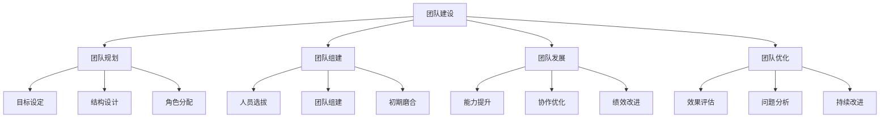

# 团队建设模板

## 🎯 核心概念

### 团队建设定义
**团队建设**是指通过系统化的方法，对团队进行规划、组建、发展和优化，提高团队凝聚力、协作能力和整体绩效的管理过程。

### 核心特征
- **目标导向**：明确团队目标，确保目标达成
- **能力建设**：提升团队能力，增强竞争力
- **协作优化**：优化团队协作，提高效率
- **持续发展**：不断改进，持续提升

## 📚 团队建设理论框架

### 团队建设模型

### 团队类型
| 团队类型 | 具体内容 | 团队特点 | 建设重点 |
|----------|----------|----------|----------|
| **项目团队** | 项目执行、任务完成 | 目标明确 | 目标管理 |
| **职能团队** | 职能管理、专业服务 | 专业性强 | 专业能力 |
| **跨部门团队** | 跨部门协作、资源整合 | 协作重要 | 协作能力 |
| **虚拟团队** | 远程协作、在线沟通 | 沟通重要 | 沟通能力 |

## 🔍 团队规划模板

### 团队目标设定模板
| 目标要素 | 具体内容 | 设定要求 | 评估标准 |
|----------|----------|----------|----------|
| **总体目标** | 团队总体目标 | 明确具体 | 目标达成 |
| **具体目标** | 团队具体目标 | 可量化 | 目标实现 |
| **成功标准** | 成功标准定义 | 明确标准 | 标准达成 |
| **预期成果** | 预期成果描述 | 成果明确 | 成果实现 |

### 团队结构设计模板
| 结构要素 | 具体内容 | 设计要求 | 设计标准 |
|----------|----------|----------|----------|
| **团队规模** | 团队人数、人员配置 | 规模合适 | 规模合理 |
| **组织架构** | 组织架构、层级关系 | 架构清晰 | 关系明确 |
| **职责分工** | 职责分工、工作分配 | 分工明确 | 分配合理 |
| **协作机制** | 协作机制、沟通机制 | 机制完善 | 机制有效 |

### 角色分配模板
| 角色类型 | 具体内容 | 角色要求 | 分配标准 |
|----------|----------|----------|----------|
| **团队领导** | 团队负责人、决策者 | 领导能力 | 能力匹配 |
| **核心成员** | 核心团队成员、骨干 | 专业能力 | 能力匹配 |
| **支持成员** | 支持团队成员、辅助 | 支持能力 | 能力匹配 |
| **外部顾问** | 外部专家、顾问 | 专业权威 | 权威匹配 |

## 🚀 团队组建模板

### 人员选拔模板
| 选拔要素 | 具体内容 | 选拔要求 | 选拔标准 |
|----------|----------|----------|----------|
| **能力要求** | 专业能力、综合能力 | 能力匹配 | 能力达标 |
| **经验要求** | 工作经验、项目经验 | 经验丰富 | 经验匹配 |
| **性格要求** | 性格特点、团队适应性 | 性格合适 | 适应性好 |
| **动机要求** | 工作动机、团队认同 | 动机明确 | 认同度高 |

### 团队组建模板
| 组建要素 | 具体内容 | 组建要求 | 组建标准 |
|----------|----------|----------|----------|
| **人员到位** | 人员到位、角色确认 | 人员齐全 | 角色明确 |
| **目标共识** | 目标共识、价值观统一 | 共识达成 | 价值观一致 |
| **规则建立** | 团队规则、工作规范 | 规则明确 | 规范完善 |
| **氛围营造** | 团队氛围、文化氛围 | 氛围良好 | 文化积极 |

### 初期磨合模板
| 磨合要素 | 具体内容 | 磨合要求 | 磨合标准 |
|----------|----------|----------|----------|
| **沟通磨合** | 沟通方式、沟通习惯 | 沟通顺畅 | 习惯一致 |
| **协作磨合** | 协作方式、协作习惯 | 协作顺畅 | 习惯一致 |
| **冲突处理** | 冲突处理、问题解决 | 处理及时 | 解决有效 |
| **信任建立** | 信任建立、关系建立 | 信任建立 | 关系良好 |

## 📊 团队发展模板

### 能力提升模板
| 提升要素 | 具体内容 | 提升要求 | 提升标准 |
|----------|----------|----------|----------|
| **个人能力** | 个人技能、专业能力 | 能力提升 | 技能增强 |
| **团队能力** | 团队协作、团队效能 | 能力提升 | 效能增强 |
| **领导能力** | 领导技能、管理能力 | 能力提升 | 技能增强 |
| **创新能力** | 创新思维、创新能力 | 能力提升 | 思维增强 |

### 协作优化模板
| 优化要素 | 具体内容 | 优化要求 | 优化标准 |
|----------|----------|----------|----------|
| **沟通优化** | 沟通效率、沟通质量 | 效率提升 | 质量改善 |
| **流程优化** | 工作流程、协作流程 | 流程优化 | 效率提升 |
| **工具优化** | 协作工具、沟通工具 | 工具优化 | 效率提升 |
| **文化优化** | 团队文化、协作文化 | 文化优化 | 氛围改善 |

### 绩效改进模板
| 改进要素 | 具体内容 | 改进要求 | 改进标准 |
|----------|----------|----------|----------|
| **目标改进** | 目标设定、目标达成 | 目标优化 | 达成提升 |
| **过程改进** | 工作过程、协作过程 | 过程优化 | 效率提升 |
| **结果改进** | 工作结果、团队成果 | 结果优化 | 成果提升 |
| **持续改进** | 改进机制、改进文化 | 改进持续 | 文化建立 |

## 🎯 团队优化模板

### 效果评估模板
| 评估维度 | 具体内容 | 评估要求 | 评估标准 |
|----------|----------|----------|----------|
| **目标达成** | 目标达成度、成果实现 | 目标达成 | 成果实现 |
| **团队效能** | 团队效能、协作效率 | 效能提升 | 效率改善 |
| **成员满意度** | 成员满意度、团队认同 | 满意度高 | 认同度高 |
| **外部评价** | 外部评价、客户满意度 | 评价良好 | 满意度高 |

### 问题分析模板
| 分析要素 | 具体内容 | 分析要求 | 分析标准 |
|----------|----------|----------|----------|
| **问题识别** | 问题识别、问题分析 | 问题明确 | 分析准确 |
| **原因分析** | 原因分析、根因分析 | 原因明确 | 分析深入 |
| **影响评估** | 影响评估、后果分析 | 影响明确 | 后果清楚 |
| **优先级排序** | 优先级排序、重要性排序 | 优先级明确 | 重要性清楚 |

### 持续改进模板
| 改进要素 | 具体内容 | 改进要求 | 改进标准 |
|----------|----------|----------|----------|
| **改进措施** | 改进措施、改进方案 | 措施可行 | 方案合理 |
| **实施计划** | 实施计划、时间安排 | 计划明确 | 时间合理 |
| **效果跟踪** | 效果跟踪、改进效果 | 跟踪及时 | 效果显著 |
| **经验总结** | 经验总结、最佳实践 | 总结深刻 | 实践有效 |

## 📈 团队建设工具

### 团队规划工具
| 工具类型 | 具体内容 | 工具特点 | 使用场景 |
|----------|----------|----------|----------|
| **目标设定工具** | SMART目标、目标分解 | 目标明确 | 目标设定 |
| **结构设计工具** | 组织架构图、职责矩阵 | 结构清晰 | 结构设计 |
| **角色分配工具** | 角色矩阵、能力匹配 | 角色明确 | 角色分配 |
| **资源规划工具** | 资源清单、资源分配 | 资源明确 | 资源规划 |

### 团队组建工具
| 工具类型 | 具体内容 | 工具特点 | 使用场景 |
|----------|----------|----------|----------|
| **人员选拔工具** | 能力评估、性格测试 | 评估准确 | 人员选拔 |
| **团队组建工具** | 团队组建、角色确认 | 组建有效 | 团队组建 |
| **磨合管理工具** | 磨合管理、冲突处理 | 管理有效 | 磨合管理 |
| **信任建立工具** | 信任建立、关系建立 | 建立有效 | 信任建立 |

### 团队发展工具
| 工具类型 | 具体内容 | 工具特点 | 使用场景 |
|----------|----------|----------|----------|
| **能力提升工具** | 培训计划、能力评估 | 提升有效 | 能力提升 |
| **协作优化工具** | 协作优化、流程改进 | 优化有效 | 协作优化 |
| **绩效改进工具** | 绩效管理、改进计划 | 改进有效 | 绩效改进 |
| **持续改进工具** | 改进机制、改进文化 | 改进持续 | 持续改进 |

## 🔗 相关概念链接

### 基础概念
- [[01-基础认知层/01-领导力概述|领导力概述]]
- [[01-基础认知层/04-现代领导力挑战|现代挑战]]
- [[02-理论理解层/经典领导理论/03-情境理论|情境理论]]

### 理论概念
- [[02-理论理解层/现代领导理论/01-变革型领导|变革型领导]]
- [[02-理论理解层/现代领导理论/02-服务型领导|服务型领导]]

### 能力概念
- [[03-能力构建层/核心领导能力/04-团队建设|团队建设]]
- [[03-能力构建层/核心领导能力/03-沟通协调|沟通协调]]

### 实践概念
- [[04-实践应用层/管理实践/01-团队管理|团队管理]]
- [[04-实践应用层/管理实践/03-绩效管理|绩效管理]]

## 💡 学习要点总结

### 关键理解
1. **建设模型**：团队建设包括规划、组建、发展和优化四个阶段
2. **建设重点**：目标导向、能力建设、协作优化、持续发展
3. **建设工具**：规划工具、组建工具、发展工具等
4. **建设效果**：通过系统化建设提高团队凝聚力和协作能力

### 实践应用
1. **团队规划**：制定团队目标、结构和角色分配
2. **团队组建**：选拔人员、组建团队、初期磨合
3. **团队发展**：提升能力、优化协作、改进绩效
4. **团队优化**：评估效果、分析问题、持续改进

### 思考问题
1. 如何制定有效的团队目标和结构？
2. 如何提高团队组建的效率和质量？
3. 如何促进团队发展和能力提升？
4. 如何运用团队建设工具提升管理水平？

---

**下一步**：[[03-决策分析模板|决策分析模板]] | [[评估工具/01-领导力评估量表|领导力评估量表]]
