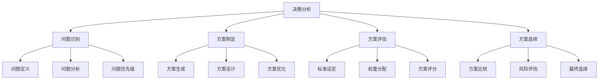

# 决策分析模板

## 🎯 核心概念

### 决策分析定义
**决策分析**是指通过系统化的方法，对决策问题进行识别、分析、评估和选择，确保决策质量、降低决策风险、提高决策效果的分析过程。

### 核心特征
- **系统性**：系统分析，全面考虑
- **科学性**：科学方法，数据支撑
- **客观性**：客观分析，减少偏见
- **实用性**：实用导向，可操作性强

## 📚 决策分析理论框架

### 决策分析模型

### 决策类型
| 决策类型 | 具体内容 | 决策特点 | 分析重点 |
|----------|----------|----------|----------|
| **战略决策** | 战略选择、发展方向 | 影响深远 | 长期影响 |
| **战术决策** | 战术选择、实施方法 | 影响中期 | 中期影响 |
| **操作决策** | 操作选择、执行细节 | 影响短期 | 短期影响 |
| **危机决策** | 危机处理、应急决策 | 时间紧迫 | 快速响应 |

## 🔍 问题识别模板

### 问题定义模板
| 定义要素 | 具体内容 | 定义要求 | 定义标准 |
|----------|----------|----------|----------|
| **问题描述** | 问题现象、问题表现 | 描述清晰 | 现象明确 |
| **问题范围** | 问题范围、影响范围 | 范围明确 | 影响清楚 |
| **问题性质** | 问题性质、问题类型 | 性质明确 | 类型清楚 |
| **问题紧迫性** | 问题紧迫性、时间要求 | 紧迫性明确 | 时间清楚 |

### 问题分析模板
| 分析要素 | 具体内容 | 分析要求 | 分析标准 |
|----------|----------|----------|----------|
| **原因分析** | 问题原因、根本原因 | 原因明确 | 分析深入 |
| **影响分析** | 问题影响、后果分析 | 影响明确 | 后果清楚 |
| **关联分析** | 问题关联、系统分析 | 关联明确 | 系统清楚 |
| **趋势分析** | 问题趋势、发展预测 | 趋势明确 | 预测准确 |

### 问题优先级模板
| 优先级要素 | 具体内容 | 优先级要求 | 优先级标准 |
|------------|----------|------------|------------|
| **重要性** | 问题重要性、影响程度 | 重要性明确 | 影响清楚 |
| **紧迫性** | 问题紧迫性、时间要求 | 紧迫性明确 | 时间清楚 |
| **可行性** | 问题可行性、解决难度 | 可行性明确 | 难度清楚 |
| **资源需求** | 资源需求、成本分析 | 需求明确 | 成本清楚 |

## 🚀 方案制定模板

### 方案生成模板
| 生成要素 | 具体内容 | 生成要求 | 生成标准 |
|----------|----------|----------|----------|
| **方案类型** | 方案类型、方案分类 | 类型明确 | 分类清楚 |
| **方案数量** | 方案数量、备选方案 | 数量充足 | 备选丰富 |
| **方案创新** | 方案创新、创新程度 | 创新突出 | 程度明显 |
| **方案可行性** | 方案可行性、实施难度 | 可行性高 | 难度适中 |

### 方案设计模板
| 设计要素 | 具体内容 | 设计要求 | 设计标准 |
|----------|----------|----------|----------|
| **目标设定** | 方案目标、预期成果 | 目标明确 | 成果清楚 |
| **实施步骤** | 实施步骤、执行计划 | 步骤清晰 | 计划可行 |
| **资源需求** | 资源需求、成本预算 | 需求明确 | 预算合理 |
| **时间安排** | 时间安排、进度计划 | 安排合理 | 计划可行 |

### 方案优化模板
| 优化要素 | 具体内容 | 优化要求 | 优化标准 |
|----------|----------|----------|----------|
| **方案改进** | 方案改进、优化建议 | 改进有效 | 建议可行 |
| **风险控制** | 风险控制、风险防范 | 控制有效 | 防范到位 |
| **效果提升** | 效果提升、效率改善 | 提升明显 | 改善显著 |
| **成本优化** | 成本优化、资源节约 | 优化有效 | 节约明显 |

## 📊 方案评估模板

### 标准设定模板
| 标准要素 | 具体内容 | 设定要求 | 设定标准 |
|----------|----------|----------|----------|
| **评估维度** | 评估维度、评估指标 | 维度全面 | 指标明确 |
| **评估标准** | 评估标准、评分标准 | 标准明确 | 评分清楚 |
| **评估方法** | 评估方法、评估工具 | 方法科学 | 工具有效 |
| **评估流程** | 评估流程、评估步骤 | 流程清晰 | 步骤明确 |

### 权重分配模板
| 权重要素 | 具体内容 | 分配要求 | 分配标准 |
|----------|----------|----------|----------|
| **权重设定** | 权重设定、权重分配 | 权重合理 | 分配科学 |
| **权重依据** | 权重依据、分配理由 | 依据充分 | 理由合理 |
| **权重调整** | 权重调整、动态调整 | 调整及时 | 动态合理 |
| **权重验证** | 权重验证、权重检查 | 验证有效 | 检查到位 |

### 方案评分模板
| 评分要素 | 具体内容 | 评分要求 | 评分标准 |
|----------|----------|----------|----------|
| **评分方法** | 评分方法、评分工具 | 方法科学 | 工具有效 |
| **评分标准** | 评分标准、评分规则 | 标准明确 | 规则清楚 |
| **评分过程** | 评分过程、评分步骤 | 过程规范 | 步骤明确 |
| **评分结果** | 评分结果、结果分析 | 结果准确 | 分析深入 |

## 🎯 方案选择模板

### 方案比较模板
| 比较要素 | 具体内容 | 比较要求 | 比较标准 |
|----------|----------|----------|----------|
| **比较维度** | 比较维度、比较指标 | 维度全面 | 指标明确 |
| **比较方法** | 比较方法、比较工具 | 方法科学 | 工具有效 |
| **比较结果** | 比较结果、结果分析 | 结果准确 | 分析深入 |
| **比较结论** | 比较结论、结论总结 | 结论明确 | 总结清楚 |

### 风险评估模板
| 评估要素 | 具体内容 | 评估要求 | 评估标准 |
|----------|----------|----------|----------|
| **风险识别** | 风险识别、风险分析 | 识别全面 | 分析深入 |
| **风险概率** | 风险概率、发生可能性 | 概率准确 | 可能性清楚 |
| **风险影响** | 风险影响、后果分析 | 影响明确 | 后果清楚 |
| **风险控制** | 风险控制、控制措施 | 控制有效 | 措施可行 |

### 最终选择模板
| 选择要素 | 具体内容 | 选择要求 | 选择标准 |
|----------|----------|----------|----------|
| **选择标准** | 选择标准、选择依据 | 标准明确 | 依据充分 |
| **选择过程** | 选择过程、选择步骤 | 过程规范 | 步骤明确 |
| **选择结果** | 选择结果、结果确认 | 结果明确 | 确认到位 |
| **选择理由** | 选择理由、理由说明 | 理由充分 | 说明清楚 |

## 📈 决策分析工具

### 问题识别工具
| 工具类型 | 具体内容 | 工具特点 | 使用场景 |
|----------|----------|----------|----------|
| **问题定义工具** | 问题描述、问题分析 | 定义清晰 | 问题识别 |
| **原因分析工具** | 鱼骨图、5W1H | 分析深入 | 原因分析 |
| **影响分析工具** | 影响矩阵、影响评估 | 影响明确 | 影响分析 |
| **优先级工具** | 优先级矩阵、重要性排序 | 优先级明确 | 优先级排序 |

### 方案制定工具
| 工具类型 | 具体内容 | 工具特点 | 使用场景 |
|----------|----------|----------|----------|
| **方案生成工具** | 头脑风暴、思维导图 | 生成丰富 | 方案生成 |
| **方案设计工具** | 方案设计、实施计划 | 设计合理 | 方案设计 |
| **方案优化工具** | 方案优化、改进建议 | 优化有效 | 方案优化 |
| **可行性分析工具** | 可行性分析、风险评估 | 分析准确 | 可行性分析 |

### 方案评估工具
| 工具类型 | 具体内容 | 工具特点 | 使用场景 |
|----------|----------|----------|----------|
| **评估标准工具** | 评估标准、评分标准 | 标准明确 | 标准设定 |
| **权重分配工具** | 权重分配、权重设定 | 分配科学 | 权重分配 |
| **方案评分工具** | 方案评分、评分方法 | 评分准确 | 方案评分 |
| **比较分析工具** | 比较分析、对比分析 | 比较科学 | 方案比较 |

## 🔗 相关概念链接

### 基础概念
- [[01-基础认知层/01-领导力概述|领导力概述]]
- [[01-基础认知层/04-现代领导力挑战|现代挑战]]
- [[02-理论理解层/经典领导理论/03-情境理论|情境理论]]

### 理论概念
- [[02-理论理解层/现代领导理论/01-变革型领导|变革型领导]]
- [[02-理论理解层/现代领导理论/02-服务型领导|服务型领导]]

### 能力概念
- [[03-能力构建层/核心领导能力/02-决策能力|决策能力]]
- [[03-能力构建层/核心领导能力/01-战略思维|战略思维]]

### 实践概念
- [[04-实践应用层/管理实践/02-组织文化建设|组织文化建设]]
- [[04-实践应用层/管理实践/03-绩效管理|绩效管理]]

## 💡 学习要点总结

### 关键理解
1. **分析模型**：决策分析包括问题识别、方案制定、方案评估和方案选择四个阶段
2. **分析重点**：系统性、科学性、客观性、实用性
3. **分析工具**：问题识别工具、方案制定工具、方案评估工具等
4. **分析效果**：通过系统化分析提高决策质量和降低决策风险

### 实践应用
1. **问题识别**：定义问题、分析问题、确定优先级
2. **方案制定**：生成方案、设计方案、优化方案
3. **方案评估**：设定标准、分配权重、评分比较
4. **方案选择**：比较分析、风险评估、最终选择

### 思考问题
1. 如何有效识别和分析决策问题？
2. 如何制定高质量的决策方案？
3. 如何科学评估和比较方案？
4. 如何运用决策分析工具提升决策质量？

---

**下一步**：[[评估工具/01-领导力评估量表|领导力评估量表]] | [[评估工具/02-360度反馈工具|360度反馈工具]]
