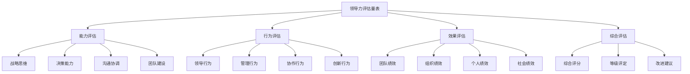
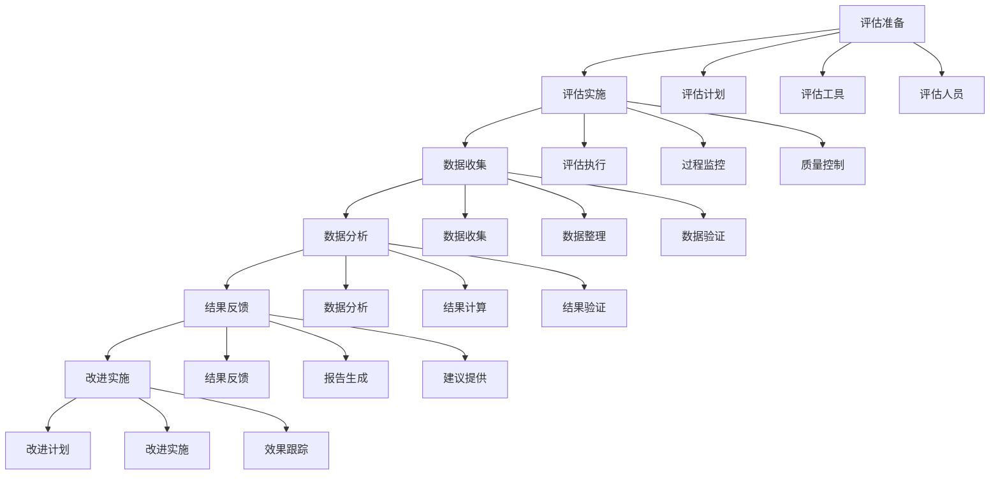

# 领导力评估量表

## 🎯 核心概念

### 领导力评估量表定义
**领导力评估量表**是指通过标准化的测量工具，对领导者的领导能力、领导行为、领导效果进行科学评估和量化的专业工具。

### 核心特征
- **标准化**：标准统一，结果可比
- **科学性**：科学方法，数据支撑
- **客观性**：客观评估，减少偏见
- **实用性**：实用导向，可操作性强

## 📚 评估量表理论框架

### 评估量表模型

### 评估维度
| 评估维度 | 具体内容 | 评估重点 | 评估标准 |
|----------|----------|----------|----------|
| **能力维度** | 领导能力、管理能力 | 能力水平 | 能力标准 |
| **行为维度** | 领导行为、管理行为 | 行为表现 | 行为标准 |
| **效果维度** | 领导效果、管理效果 | 效果表现 | 效果标准 |
| **发展维度** | 发展潜力、成长空间 | 发展潜力 | 发展标准 |

## 🔍 能力评估量表

### 战略思维评估量表
| 评估指标 | 具体内容 | 评分标准 | 权重 |
|----------|----------|----------|------|
| **战略视野** | 全局思维、长远眼光 | 1-5分 | 25% |
| **战略分析** | 分析能力、判断能力 | 1-5分 | 25% |
| **战略规划** | 规划能力、设计能力 | 1-5分 | 25% |
| **战略执行** | 执行能力、实施能力 | 1-5分 | 25% |

#### 评分标准
| 分数 | 等级 | 标准描述 | 表现特征 |
|------|------|----------|----------|
| **5分** | 优秀 | 战略思维突出 | 视野开阔，分析深入 |
| **4分** | 良好 | 战略思维较好 | 视野较好，分析较好 |
| **3分** | 一般 | 战略思维一般 | 视野一般，分析一般 |
| **2分** | 较差 | 战略思维较差 | 视野较窄，分析较浅 |
| **1分** | 很差 | 战略思维很差 | 视野很窄，分析很浅 |

### 决策能力评估量表
| 评估指标 | 具体内容 | 评分标准 | 权重 |
|----------|----------|----------|------|
| **信息收集** | 信息收集、信息分析 | 1-5分 | 20% |
| **方案制定** | 方案制定、方案设计 | 1-5分 | 20% |
| **方案评估** | 方案评估、方案比较 | 1-5分 | 20% |
| **方案选择** | 方案选择、决策执行 | 1-5分 | 20% |
| **决策效果** | 决策效果、结果评估 | 1-5分 | 20% |

#### 评分标准
| 分数 | 等级 | 标准描述 | 表现特征 |
|------|------|----------|----------|
| **5分** | 优秀 | 决策能力突出 | 决策科学，效果显著 |
| **4分** | 良好 | 决策能力较好 | 决策较好，效果较好 |
| **3分** | 一般 | 决策能力一般 | 决策一般，效果一般 |
| **2分** | 较差 | 决策能力较差 | 决策较差，效果较差 |
| **1分** | 很差 | 决策能力很差 | 决策很差，效果很差 |

### 沟通协调评估量表
| 评估指标 | 具体内容 | 评分标准 | 权重 |
|----------|----------|----------|------|
| **沟通技巧** | 沟通技巧、表达能力 | 1-5分 | 25% |
| **倾听能力** | 倾听能力、理解能力 | 1-5分 | 25% |
| **协调能力** | 协调能力、整合能力 | 1-5分 | 25% |
| **冲突处理** | 冲突处理、问题解决 | 1-5分 | 25% |

#### 评分标准
| 分数 | 等级 | 标准描述 | 表现特征 |
|------|------|----------|----------|
| **5分** | 优秀 | 沟通协调突出 | 沟通顺畅，协调有效 |
| **4分** | 良好 | 沟通协调较好 | 沟通较好，协调较好 |
| **3分** | 一般 | 沟通协调一般 | 沟通一般，协调一般 |
| **2分** | 较差 | 沟通协调较差 | 沟通较差，协调较差 |
| **1分** | 很差 | 沟通协调很差 | 沟通很差，协调很差 |

### 团队建设评估量表
| 评估指标 | 具体内容 | 评分标准 | 权重 |
|----------|----------|----------|------|
| **团队组建** | 团队组建、人员选拔 | 1-5分 | 25% |
| **团队发展** | 团队发展、能力提升 | 1-5分 | 25% |
| **团队激励** | 团队激励、动机激发 | 1-5分 | 25% |
| **团队绩效** | 团队绩效、成果达成 | 1-5分 | 25% |

#### 评分标准
| 分数 | 等级 | 标准描述 | 表现特征 |
|------|------|----------|----------|
| **5分** | 优秀 | 团队建设突出 | 团队高效，绩效显著 |
| **4分** | 良好 | 团队建设较好 | 团队较好，绩效较好 |
| **3分** | 一般 | 团队建设一般 | 团队一般，绩效一般 |
| **2分** | 较差 | 团队建设较差 | 团队较差，绩效较差 |
| **1分** | 很差 | 团队建设很差 | 团队很差，绩效很差 |

## 🚀 行为评估量表

### 领导行为评估量表
| 评估指标 | 具体内容 | 评分标准 | 权重 |
|----------|----------|----------|------|
| **愿景领导** | 愿景设定、愿景传达 | 1-5分 | 25% |
| **变革领导** | 变革推动、变革管理 | 1-5分 | 25% |
| **服务领导** | 服务他人、支持他人 | 1-5分 | 25% |
| **道德领导** | 道德行为、价值观引领 | 1-5分 | 25% |

#### 评分标准
| 分数 | 等级 | 标准描述 | 表现特征 |
|------|------|----------|----------|
| **5分** | 优秀 | 领导行为突出 | 行为典范，影响深远 |
| **4分** | 良好 | 领导行为较好 | 行为较好，影响较好 |
| **3分** | 一般 | 领导行为一般 | 行为一般，影响一般 |
| **2分** | 较差 | 领导行为较差 | 行为较差，影响较差 |
| **1分** | 很差 | 领导行为很差 | 行为很差，影响很差 |

### 管理行为评估量表
| 评估指标 | 具体内容 | 评分标准 | 权重 |
|----------|----------|----------|------|
| **计划管理** | 计划制定、计划执行 | 1-5分 | 25% |
| **组织管理** | 组织设计、组织协调 | 1-5分 | 25% |
| **控制管理** | 过程控制、结果控制 | 1-5分 | 25% |
| **激励管理** | 激励设计、激励实施 | 1-5分 | 25% |

#### 评分标准
| 分数 | 等级 | 标准描述 | 表现特征 |
|------|------|----------|----------|
| **5分** | 优秀 | 管理行为突出 | 管理有效，效果显著 |
| **4分** | 良好 | 管理行为较好 | 管理较好，效果较好 |
| **3分** | 一般 | 管理行为一般 | 管理一般，效果一般 |
| **2分** | 较差 | 管理行为较差 | 管理较差，效果较差 |
| **1分** | 很差 | 管理行为很差 | 管理很差，效果很差 |

## 📊 效果评估量表

### 团队绩效评估量表
| 评估指标 | 具体内容 | 评分标准 | 权重 |
|----------|----------|----------|------|
| **目标达成** | 目标达成度、成果实现 | 1-5分 | 30% |
| **效率提升** | 效率提升、时间节约 | 1-5分 | 25% |
| **质量改善** | 质量改善、标准提升 | 1-5分 | 25% |
| **创新成果** | 创新成果、创新效果 | 1-5分 | 20% |

#### 评分标准
| 分数 | 等级 | 标准描述 | 表现特征 |
|------|------|----------|----------|
| **5分** | 优秀 | 团队绩效突出 | 绩效显著，成果丰硕 |
| **4分** | 良好 | 团队绩效较好 | 绩效较好，成果较好 |
| **3分** | 一般 | 团队绩效一般 | 绩效一般，成果一般 |
| **2分** | 较差 | 团队绩效较差 | 绩效较差，成果较差 |
| **1分** | 很差 | 团队绩效很差 | 绩效很差，成果很差 |

### 组织绩效评估量表
| 评估指标 | 具体内容 | 评分标准 | 权重 |
|----------|----------|----------|------|
| **财务绩效** | 财务指标、盈利能力 | 1-5分 | 30% |
| **市场绩效** | 市场地位、客户满意 | 1-5分 | 25% |
| **运营绩效** | 运营效率、流程优化 | 1-5分 | 25% |
| **创新绩效** | 创新能力、创新成果 | 1-5分 | 20% |

#### 评分标准
| 分数 | 等级 | 标准描述 | 表现特征 |
|------|------|----------|----------|
| **5分** | 优秀 | 组织绩效突出 | 绩效显著，成果丰硕 |
| **4分** | 良好 | 组织绩效较好 | 绩效较好，成果较好 |
| **3分** | 一般 | 组织绩效一般 | 绩效一般，成果一般 |
| **2分** | 较差 | 组织绩效较差 | 绩效较差，成果较差 |
| **1分** | 很差 | 组织绩效很差 | 绩效很差，成果很差 |

## 🎯 综合评估量表

### 综合评分量表
| 评估维度 | 权重 | 得分 | 加权得分 |
|----------|------|------|----------|
| **能力评估** | 40% | ___分 | ___分 |
| **行为评估** | 30% | ___分 | ___分 |
| **效果评估** | 30% | ___分 | ___分 |
| **综合得分** | 100% | ___分 | ___分 |

### 等级评定标准
| 分数范围 | 等级 | 标准描述 | 改进建议 |
|----------|------|----------|----------|
| **4.5-5.0分** | 优秀 | 领导力突出 | 保持优势，继续发展 |
| **3.5-4.4分** | 良好 | 领导力较好 | 巩固优势，弥补不足 |
| **2.5-3.4分** | 一般 | 领导力一般 | 重点提升，全面改进 |
| **1.5-2.4分** | 较差 | 领导力较差 | 系统提升，重点突破 |
| **1.0-1.4分** | 很差 | 领导力很差 | 全面改进，基础重建 |

### 改进建议模板
| 改进维度 | 具体建议 | 改进重点 | 实施计划 |
|----------|----------|----------|----------|
| **能力提升** | 能力提升建议 | 重点能力 | 提升计划 |
| **行为改进** | 行为改进建议 | 重点行为 | 改进计划 |
| **效果改善** | 效果改善建议 | 重点效果 | 改善计划 |
| **发展建议** | 发展建议 | 发展方向 | 发展计划 |

## 📈 评估量表应用

### 评估流程

### 应用场景
| 应用场景 | 具体内容 | 应用目的 | 应用效果 |
|----------|----------|----------|----------|
| **人才选拔** | 领导力评估、人才选拔 | 选拔合适人才 | 选拔效果提升 |
| **培训发展** | 能力评估、培训计划 | 制定培训计划 | 培训效果提升 |
| **绩效管理** | 绩效评估、绩效改进 | 改进绩效管理 | 绩效效果提升 |
| **职业发展** | 发展评估、职业规划 | 制定职业规划 | 发展效果提升 |

## 🔗 相关概念链接

### 基础概念
- [[01-基础认知层/01-领导力概述|领导力概述]]
- [[01-基础认知层/04-现代领导力挑战|现代挑战]]
- [[02-理论理解层/经典领导理论/01-特质理论|特质理论]]

### 理论概念
- [[02-理论理解层/现代领导理论/01-变革型领导|变革型领导]]
- [[02-理论理解层/现代领导理论/02-服务型领导|服务型领导]]

### 能力概念
- [[03-能力构建层/核心领导能力/01-战略思维|战略思维]]
- [[03-能力构建层/核心领导能力/02-决策能力|决策能力]]

### 实践概念
- [[03-能力构建层/08-领导力测量与评估|领导力测量与评估]]
- [[04-实践应用层/管理实践/03-绩效管理|绩效管理]]

## 💡 学习要点总结

### 关键理解
1. **评估维度**：能力、行为、效果、发展四个维度
2. **评估标准**：标准化、科学性、客观性、实用性
3. **评估工具**：能力评估、行为评估、效果评估、综合评估
4. **评估应用**：人才选拔、培训发展、绩效管理、职业发展

### 实践应用
1. **评估准备**：制定评估计划、准备评估工具、培训评估人员
2. **评估实施**：执行评估、监控过程、控制质量
3. **结果分析**：分析数据、计算结果、验证结果
4. **改进实施**：反馈结果、制定改进计划、跟踪效果

### 思考问题
1. 如何设计有效的领导力评估量表？
2. 如何确保评估的科学性和客观性？
3. 如何运用评估结果进行改进？
4. 如何提高评估的应用效果？

---

**下一步**：[[02-360度反馈工具|360度反馈工具]] | [[关键词索引|关键词索引]]
