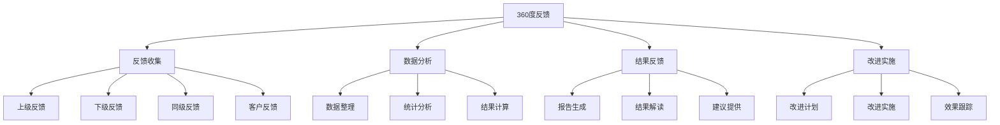
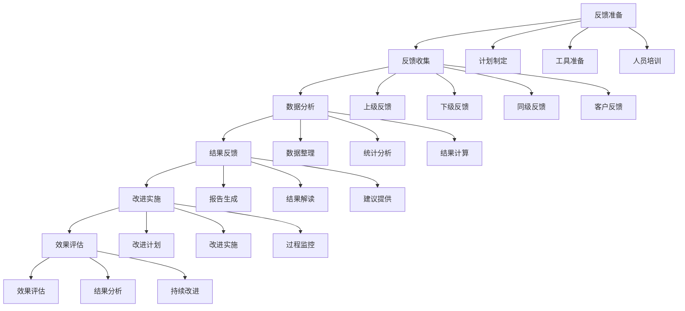

# 360度反馈工具

## 🎯 核心概念

### 360度反馈定义
**360度反馈**是指通过收集来自上级、下级、同级、客户等多个角度的反馈信息，对领导者的领导能力、领导行为、领导效果进行全面评估的反馈工具。

### 核心特征
- **多角度**：多个角度，全面评估
- **客观性**：客观反馈，减少偏见
- **匿名性**：匿名反馈，保护隐私
- **发展性**：发展导向，持续改进

## 📚 360度反馈理论框架

### 360度反馈模型

### 反馈来源
| 反馈来源 | 具体内容 | 反馈特点 | 反馈价值 |
|----------|----------|----------|----------|
| **上级反馈** | 直接上级、间接上级 | 权威性强 | 管理视角 |
| **下级反馈** | 直接下级、间接下级 | 体验性强 | 管理效果 |
| **同级反馈** | 同级同事、合作伙伴 | 平等性强 | 协作视角 |
| **客户反馈** | 内部客户、外部客户 | 客观性强 | 服务效果 |

## 🔍 反馈收集工具

### 上级反馈工具
| 评估维度 | 具体内容 | 评估标准 | 权重 |
|----------|----------|----------|------|
| **战略执行** | 战略理解、执行能力 | 1-5分 | 25% |
| **团队管理** | 团队建设、人员管理 | 1-5分 | 25% |
| **决策能力** | 决策质量、决策效果 | 1-5分 | 25% |
| **沟通协调** | 沟通技巧、协调能力 | 1-5分 | 25% |

#### 反馈问题示例
| 问题类型 | 具体问题 | 回答方式 | 评分标准 |
|----------|----------|----------|----------|
| **开放式问题** | 该领导者的最大优势是什么？ | 文字描述 | 描述清晰 |
| **封闭式问题** | 该领导者的决策能力如何？ | 1-5分评分 | 评分准确 |
| **行为问题** | 该领导者如何处理团队冲突？ | 行为描述 | 行为具体 |
| **效果问题** | 该领导者的管理效果如何？ | 效果描述 | 效果明确 |

### 下级反馈工具
| 评估维度 | 具体内容 | 评估标准 | 权重 |
|----------|----------|----------|------|
| **领导风格** | 领导风格、管理方式 | 1-5分 | 30% |
| **支持程度** | 支持程度、关怀程度 | 1-5分 | 25% |
| **激励效果** | 激励效果、动机激发 | 1-5分 | 25% |
| **发展支持** | 发展支持、成长帮助 | 1-5分 | 20% |

#### 反馈问题示例
| 问题类型 | 具体问题 | 回答方式 | 评分标准 |
|----------|----------|----------|----------|
| **开放式问题** | 该领导者如何支持你的工作？ | 文字描述 | 描述清晰 |
| **封闭式问题** | 该领导者的激励效果如何？ | 1-5分评分 | 评分准确 |
| **行为问题** | 该领导者如何处理你的问题？ | 行为描述 | 行为具体 |
| **效果问题** | 该领导者的管理对你的影响如何？ | 效果描述 | 效果明确 |

### 同级反馈工具
| 评估维度 | 具体内容 | 评估标准 | 权重 |
|----------|----------|----------|------|
| **协作能力** | 协作能力、团队合作 | 1-5分 | 30% |
| **沟通效果** | 沟通效果、信息传递 | 1-5分 | 25% |
| **专业能力** | 专业能力、业务水平 | 1-5分 | 25% |
| **人际关系** | 人际关系、社交能力 | 1-5分 | 20% |

#### 反馈问题示例
| 问题类型 | 具体问题 | 回答方式 | 评分标准 |
|----------|----------|----------|----------|
| **开放式问题** | 该领导者在协作中的表现如何？ | 文字描述 | 描述清晰 |
| **封闭式问题** | 该领导者的沟通效果如何？ | 1-5分评分 | 评分准确 |
| **行为问题** | 该领导者如何处理跨部门合作？ | 行为描述 | 行为具体 |
| **效果问题** | 该领导者的协作对你的工作影响如何？ | 效果描述 | 效果明确 |

### 客户反馈工具
| 评估维度 | 具体内容 | 评估标准 | 权重 |
|----------|----------|----------|------|
| **服务质量** | 服务质量、服务态度 | 1-5分 | 30% |
| **响应速度** | 响应速度、处理效率 | 1-5分 | 25% |
| **专业水平** | 专业水平、业务能力 | 1-5分 | 25% |
| **问题解决** | 问题解决、解决方案 | 1-5分 | 20% |

#### 反馈问题示例
| 问题类型 | 具体问题 | 回答方式 | 评分标准 |
|----------|----------|----------|----------|
| **开放式问题** | 该领导者在服务中的表现如何？ | 文字描述 | 描述清晰 |
| **封闭式问题** | 该领导者的服务质量如何？ | 1-5分评分 | 评分准确 |
| **行为问题** | 该领导者如何处理客户问题？ | 行为描述 | 行为具体 |
| **效果问题** | 该领导者的服务对你的影响如何？ | 效果描述 | 效果明确 |

## 🚀 数据分析工具

### 数据整理工具
| 整理要素 | 具体内容 | 整理要求 | 整理标准 |
|----------|----------|----------|----------|
| **数据收集** | 数据收集、数据汇总 | 收集完整 | 数据准确 |
| **数据清洗** | 数据清洗、数据验证 | 清洗彻底 | 数据可靠 |
| **数据分类** | 数据分类、数据归档 | 分类清晰 | 归档有序 |
| **数据存储** | 数据存储、数据保护 | 存储安全 | 保护到位 |

### 统计分析工具
| 分析要素 | 具体内容 | 分析要求 | 分析标准 |
|----------|----------|----------|----------|
| **描述统计** | 均值、标准差、分布 | 统计准确 | 描述清晰 |
| **比较分析** | 不同来源比较、不同维度比较 | 比较科学 | 分析深入 |
| **趋势分析** | 时间趋势、变化趋势 | 趋势明确 | 分析准确 |
| **相关性分析** | 相关性分析、关联分析 | 分析科学 | 关联清楚 |

### 结果计算工具
| 计算要素 | 具体内容 | 计算要求 | 计算标准 |
|----------|----------|----------|----------|
| **加权计算** | 权重分配、加权平均 | 计算准确 | 权重合理 |
| **综合评分** | 综合评分、等级评定 | 评分科学 | 等级合理 |
| **差异分析** | 差异分析、差距分析 | 分析深入 | 差距清楚 |
| **排名分析** | 排名分析、排序分析 | 排名准确 | 排序合理 |

## 📊 结果反馈工具

### 报告生成工具
| 报告要素 | 具体内容 | 生成要求 | 生成标准 |
|----------|----------|----------|----------|
| **报告结构** | 报告结构、报告格式 | 结构清晰 | 格式规范 |
| **数据展示** | 数据展示、图表展示 | 展示清晰 | 图表美观 |
| **结果解读** | 结果解读、分析说明 | 解读准确 | 说明清楚 |
| **建议提供** | 改进建议、发展建议 | 建议可行 | 建议实用 |

### 结果解读工具
| 解读要素 | 具体内容 | 解读要求 | 解读标准 |
|----------|----------|----------|----------|
| **优势分析** | 优势识别、优势分析 | 优势明确 | 分析深入 |
| **不足分析** | 不足识别、不足分析 | 不足明确 | 分析深入 |
| **差异分析** | 差异识别、差异分析 | 差异明确 | 分析深入 |
| **趋势分析** | 趋势识别、趋势分析 | 趋势明确 | 分析深入 |

### 建议提供工具
| 建议要素 | 具体内容 | 建议要求 | 建议标准 |
|----------|----------|----------|----------|
| **改进建议** | 改进措施、改进方案 | 建议可行 | 方案合理 |
| **发展建议** | 发展方向、发展计划 | 建议可行 | 计划合理 |
| **培训建议** | 培训需求、培训计划 | 建议可行 | 计划合理 |
| **支持建议** | 支持需求、支持方案 | 建议可行 | 方案合理 |

## 🎯 改进实施工具

### 改进计划工具
| 计划要素 | 具体内容 | 计划要求 | 计划标准 |
|----------|----------|----------|----------|
| **目标设定** | 改进目标、发展目标 | 目标明确 | 目标可行 |
| **措施制定** | 改进措施、发展措施 | 措施可行 | 措施有效 |
| **时间安排** | 时间安排、进度计划 | 安排合理 | 计划可行 |
| **资源需求** | 资源需求、成本预算 | 需求明确 | 预算合理 |

### 改进实施工具
| 实施要素 | 具体内容 | 实施要求 | 实施标准 |
|----------|----------|----------|----------|
| **实施执行** | 实施执行、执行监控 | 执行到位 | 监控有效 |
| **过程管理** | 过程管理、质量控制 | 管理有效 | 质量保证 |
| **问题处理** | 问题处理、风险控制 | 处理及时 | 控制有效 |
| **效果评估** | 效果评估、结果评估 | 评估准确 | 结果明确 |

### 效果跟踪工具
| 跟踪要素 | 具体内容 | 跟踪要求 | 跟踪标准 |
|----------|----------|----------|----------|
| **进度跟踪** | 进度跟踪、进度监控 | 跟踪及时 | 监控有效 |
| **效果跟踪** | 效果跟踪、效果监控 | 跟踪及时 | 监控有效 |
| **问题跟踪** | 问题跟踪、问题监控 | 跟踪及时 | 监控有效 |
| **改进跟踪** | 改进跟踪、改进监控 | 跟踪及时 | 监控有效 |

## 📈 360度反馈应用

### 应用流程

### 应用场景
| 应用场景 | 具体内容 | 应用目的 | 应用效果 |
|----------|----------|----------|----------|
| **领导力发展** | 领导力评估、能力提升 | 提升领导力 | 领导力提升 |
| **绩效管理** | 绩效评估、绩效改进 | 改进绩效 | 绩效改善 |
| **团队建设** | 团队评估、团队改进 | 建设团队 | 团队提升 |
| **组织发展** | 组织评估、组织改进 | 发展组织 | 组织提升 |

## 🔗 相关概念链接

### 基础概念
- [[01-基础认知层/01-领导力概述|领导力概述]]
- [[01-基础认知层/04-现代领导力挑战|现代挑战]]
- [[02-理论理解层/经典领导理论/01-特质理论|特质理论]]

### 理论概念
- [[02-理论理解层/现代领导理论/01-变革型领导|变革型领导]]
- [[02-理论理解层/现代领导理论/02-服务型领导|服务型领导]]

### 能力概念
- [[03-能力构建层/核心领导能力/01-战略思维|战略思维]]
- [[03-能力构建层/核心领导能力/02-决策能力|决策能力]]

### 实践概念
- [[03-能力构建层/08-领导力测量与评估|领导力测量与评估]]
- [[04-实践应用层/管理实践/03-绩效管理|绩效管理]]

## 💡 学习要点总结

### 关键理解
1. **反馈来源**：上级、下级、同级、客户四个角度
2. **反馈特点**：多角度、客观性、匿名性、发展性
3. **反馈工具**：反馈收集、数据分析、结果反馈、改进实施
4. **反馈应用**：领导力发展、绩效管理、团队建设、组织发展

### 实践应用
1. **反馈准备**：制定计划、准备工具、培训人员
2. **反馈收集**：收集各角度反馈、确保数据质量
3. **数据分析**：整理数据、统计分析、计算结果
4. **改进实施**：反馈结果、制定计划、跟踪效果

### 思考问题
1. 如何设计有效的360度反馈工具？
2. 如何确保反馈的客观性和匿名性？
3. 如何运用反馈结果进行改进？
4. 如何提高360度反馈的应用效果？

---

**下一步**：[[关键词索引|关键词索引]] | [[00-总览导航/01-企业领导力知识地图|知识地图]]
