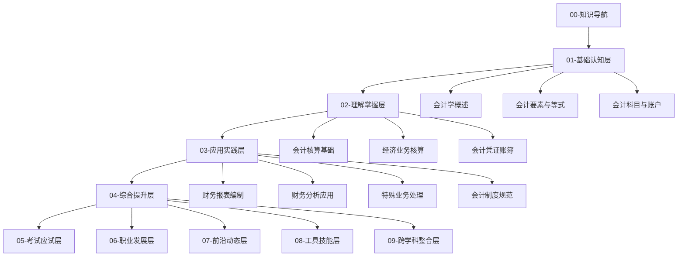

# 会计学学习路径图

## 学习路径概览

## 学习阶段规划

### 第一阶段：基础认知（1-2周）
- **目标**：建立会计学基本概念框架
- **重点**：[[01-基础认知层/会计学概述/01-会计学基本概念|会计学基本概念]]、[[01-基础认知层/会计要素与等式/01-会计要素详解|会计要素]]、[[01-基础认知层/会计科目与账户/03-借贷记账法|借贷记账法]]
- **检验**：能够解释会计等式，掌握借贷记账规则

### 第二阶段：理解掌握（2-3周）
- **目标**：理解会计核算原理和业务流程
- **重点**：[[02-理解掌握层/会计核算基础/01-权责发生制详解|权责发生制]]、[[02-理解掌握层/经济业务核算/01-资金筹集业务|经济业务核算]]、[[02-理解掌握层/会计凭证账簿/01-会计凭证体系|会计凭证]]
- **检验**：能够处理完整的经济业务循环

### 第三阶段：应用实践（3-4周）
- **目标**：掌握财务报表编制和财务分析
- **重点**：[[03-应用实践层/财务报表编制/01-资产负债表编制|财务报表编制]]、[[03-应用实践层/财务分析应用/01-财务比率分析|财务分析]]、[[03-应用实践层/特殊业务处理/01-存货计价方法|特殊业务]]
- **检验**：能够编制财务报表并进行基础分析

### 第四阶段：综合提升（2-3周）
- **目标**：整合知识，提升实务能力
- **重点**：[[04-综合提升层/案例分析/01-制造业企业案例|案例分析]]、[[04-综合提升层/实务操作/01-手工记账实务|实务操作]]、[[04-综合提升层/知识整合/01-知识点关联图|知识整合]]
- **检验**：能够独立处理复杂会计问题

## 学习建议

### 费曼学习法应用
1. **选择概念**：每次学习一个核心概念
2. **简化解释**：用简单语言解释给他人听
3. **识别盲区**：发现不理解的地方
4. **重新学习**：回到源头重新理解

### 刻意练习要点
- **专注练习**：每次练习30-45分钟
- **及时反馈**：完成练习后立即检查
- **逐步挑战**：从简单到复杂递进
- **持续改进**：记录错误并分析原因

## 学习进度跟踪

### 周计划模板
| 周次 | 学习内容 | 完成状态 | 重点难点 | 下次复习 |
|------|----------|----------|----------|----------|
| 第1周 | 基础认知层 | ⬜ | 借贷记账法 | 第2周 |
| 第2周 | 理解掌握层 | ⬜ | 权责发生制 | 第3周 |
| 第3周 | 应用实践层 | ⬜ | 财务报表 | 第4周 |
| 第4周 | 综合提升层 | ⬜ | 案例分析 | 第5周 |

## 相关链接
- [[02-知识点索引]] - 快速查找知识点
- [[03-复习检查清单]] - 阶段性复习要点
- [[04-学习目标设定]] - 具体学习目标
- [[05-学习进度跟踪]] - 详细进度记录
