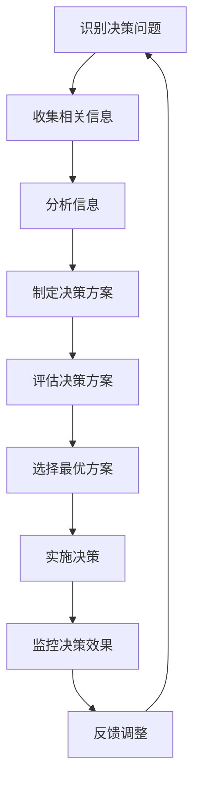

# 会计信息使用者

## 会计信息使用者的定义

### 📖 基本定义
**会计信息使用者**是指需要利用会计信息进行经济决策的各类组织和个人。

### 🔍 定义解析
- **信息需求**：需要会计信息进行决策
- **决策主体**：各类组织和个人
- **信息利用**：利用会计信息进行经济决策
- **服务对象**：会计工作的服务对象

## 会计信息使用者的分类

### 🏢 内部使用者

#### 1. 企业管理层
- **决策需求**：经营决策、投资决策、融资决策
- **信息需求**：
  - 财务状况信息
  - 经营成果信息
  - 现金流量信息
  - 成本控制信息
- **使用目的**：
  - 制定经营计划
  - 控制经营活动
  - 评价经营绩效
  - 进行战略决策

#### 2. 企业员工
- **决策需求**：职业发展、薪酬谈判、工作安排
- **信息需求**：
  - 企业盈利能力
  - 企业发展前景
  - 薪酬福利水平
  - 工作稳定性
- **使用目的**：
  - 评估职业发展前景
  - 进行薪酬谈判
  - 选择工作机会
  - 评估工作稳定性

### 🌐 外部使用者

#### 1. 投资者
- **决策需求**：投资决策、股权交易
- **信息需求**：
  - 企业盈利能力
  - 财务状况
  - 发展前景
  - 风险水平
- **使用目的**：
  - 评估投资价值
  - 决定是否投资
  - 评估投资风险
  - 进行股权交易

#### 2. 债权人
- **决策需求**：信贷决策、债务管理
- **信息需求**：
  - 偿债能力
  - 财务状况
  - 经营状况
  - 信用状况
- **使用目的**：
  - 评估信用风险
  - 决定是否放贷
  - 确定贷款利率
  - 监控债务安全

#### 3. 政府机构
- **决策需求**：宏观调控、税收征管、市场监管
- **信息需求**：
  - 税收信息
  - 统计信息
  - 监管信息
  - 政策效果
- **使用目的**：
  - 制定经济政策
  - 进行税收征管
  - 实施市场监管
  - 评估政策效果

#### 4. 供应商
- **决策需求**：商业合作、信用政策
- **信息需求**：
  - 财务状况
  - 经营状况
  - 信用状况
  - 发展前景
- **使用目的**：
  - 评估合作风险
  - 制定信用政策
  - 决定合作方式
  - 监控合作安全

#### 5. 客户
- **决策需求**：购买决策、合作决策
- **信息需求**：
  - 产品质量
  - 服务能力
  - 企业信誉
  - 发展前景
- **使用目的**：
  - 评估产品质量
  - 选择供应商
  - 评估合作风险
  - 决定购买行为

#### 6. 社会公众
- **决策需求**：就业选择、消费决策
- **信息需求**：
  - 企业形象
  - 社会责任
  - 发展前景
  - 就业机会
- **使用目的**：
  - 评估企业形象
  - 选择就业机会
  - 进行消费决策
  - 评估社会责任

## 会计信息使用者的信息需求

### 📊 信息需求层次

#### 1. 基础信息需求
- **财务状况信息**：资产负债表信息
- **经营成果信息**：利润表信息
- **现金流量信息**：现金流量表信息
- **所有者权益信息**：所有者权益变动表信息

#### 2. 分析信息需求
- **财务比率分析**：盈利能力、偿债能力、营运能力
- **趋势分析**：历史趋势、未来预测
- **比较分析**：行业比较、历史比较
- **综合分析**：综合财务分析

#### 3. 预测信息需求
- **未来预测**：收入预测、成本预测
- **风险评估**：经营风险、财务风险
- **价值评估**：企业价值、投资价值
- **决策支持**：投资决策、经营决策

### 🎯 信息质量要求

#### 1. 相关性
- **决策相关**：与决策相关
- **及时性**：信息及时提供
- **重要性**：信息重要性
- **预测价值**：具有预测价值

#### 2. 可靠性
- **真实性**：信息真实可靠
- **完整性**：信息完整全面
- **准确性**：信息准确无误
- **可验证性**：信息可验证

#### 3. 可比性
- **横向可比**：不同企业间可比
- **纵向可比**：不同期间可比
- **一致性**：会计政策一致
- **标准化**：会计标准统一

#### 4. 可理解性
- **清晰性**：信息清晰明了
- **完整性**：信息完整全面
- **相关性**：信息相关有用
- **可读性**：信息易于理解

## 会计信息使用者的决策模型

### 🔄 决策过程

### 📈 决策类型

#### 1. 投资决策
- **决策主体**：投资者
- **决策内容**：是否投资、投资多少
- **信息需求**：盈利能力、财务状况、发展前景
- **决策方法**：净现值法、内部收益率法

#### 2. 信贷决策
- **决策主体**：债权人
- **决策内容**：是否放贷、贷款条件
- **信息需求**：偿债能力、财务状况、信用状况
- **决策方法**：信用评级、风险评估

#### 3. 经营决策
- **决策主体**：企业管理层
- **决策内容**：经营策略、资源配置
- **信息需求**：经营成果、财务状况、市场信息
- **决策方法**：成本效益分析、敏感性分析

#### 4. 监管决策
- **决策主体**：政府机构
- **决策内容**：政策制定、市场监管
- **信息需求**：行业信息、企业信息、经济信息
- **决策方法**：统计分析、政策评估

## 会计信息使用者的影响

### 💼 对企业的影响

#### 1. 信息披露要求
- **强制披露**：法律法规要求的披露
- **自愿披露**：企业自愿的披露
- **及时披露**：及时的信息披露
- **完整披露**：完整的信息披露

#### 2. 会计政策选择
- **政策选择**：会计政策的选择
- **方法选择**：会计方法的选择
- **估计选择**：会计估计的选择
- **披露选择**：信息披露的选择

#### 3. 内部控制要求
- **控制环境**：内部控制环境
- **风险评估**：风险评估机制
- **控制活动**：控制活动设计
- **信息沟通**：信息沟通机制

### 🌍 对社会的影响

#### 1. 资源配置
- **资本配置**：资本的优化配置
- **资源流动**：资源的合理流动
- **效率提升**：资源配置效率提升
- **公平性**：资源配置的公平性

#### 2. 市场效率
- **信息效率**：市场信息效率
- **价格发现**：价格发现机制
- **风险分散**：风险分散机制
- **流动性**：市场流动性

#### 3. 经济发展
- **经济增长**：促进经济增长
- **就业创造**：创造就业机会
- **技术创新**：促进技术创新
- **社会进步**：推动社会进步

## 费曼学习法应用

### 🎯 学习目标
**能够识别和分析不同会计信息使用者的需求**

### 📝 学习步骤
1. **选择概念**：会计信息使用者的分类和需求
2. **简化解释**：用简单语言解释不同使用者的需求
3. **识别盲区**：发现不理解的地方
4. **重新学习**：回到源头重新理解

### 💡 记忆技巧
- **内部使用者**：管理层、员工
- **外部使用者**：投资者、债权人、政府、供应商、客户、公众
- **信息需求**：财务状况、经营成果、现金流量
- **质量要求**：相关性、可靠性、可比性、可理解性

## 刻意练习要点

### 🎯 练习重点
1. **使用者识别**：准确识别不同的会计信息使用者
2. **需求分析**：分析不同使用者的信息需求
3. **质量要求**：理解信息质量要求
4. **决策影响**：理解对决策的影响

### 📊 练习方法
1. **案例分析**：分析具体案例中的信息使用者
2. **需求分析**：分析不同使用者的信息需求
3. **质量评估**：评估信息质量
4. **决策分析**：分析决策过程

## 相关链接
- [[01-会计学基本概念]] - 会计学基本概念
- [[03-会计假设与基础]] - 会计假设与基础
- [[04-会计发展历程]] - 会计发展历程
- [[01-基础认知层/会计要素与等式/01-会计要素详解]] - 会计要素
- [[01-基础认知层/会计科目与账户/01-会计科目体系]] - 会计科目