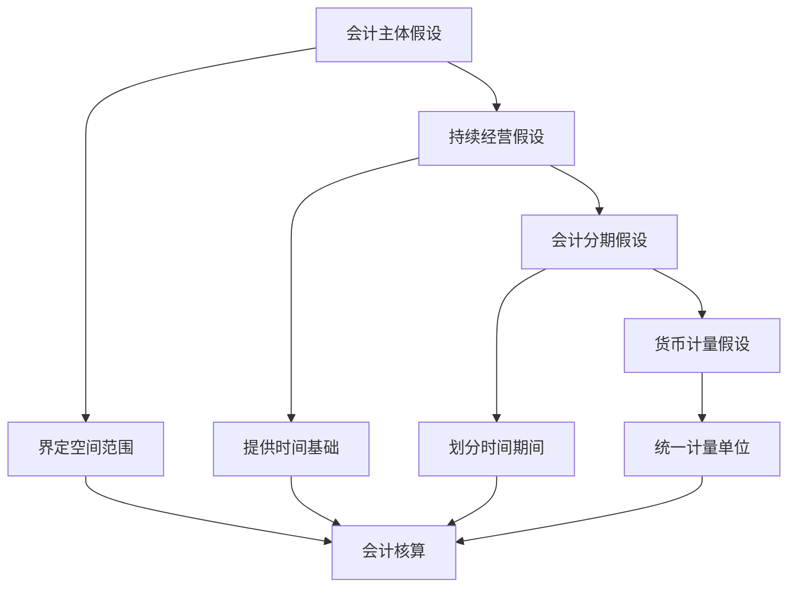

# 会计假设与基础

## 会计假设的定义

### 📖 基本定义
**会计假设**是指对会计核算所处的时间、空间环境所作的合理设定，是会计核算的基本前提。

### 🔍 定义解析
- **合理设定**：对会计核算环境的合理设定
- **基本前提**：会计核算的基本前提
- **环境设定**：时间、空间环境的设定
- **理论基础**：会计理论的基础

## 四大会计假设

### ⏰ 会计主体假设

#### 定义
**会计主体**是指会计工作为其服务的特定单位或组织，它界定了会计核算的空间范围。

#### 特征
1. **独立性**：会计主体具有独立性
2. **完整性**：会计主体具有完整性
3. **持续性**：会计主体具有持续性
4. **明确性**：会计主体具有明确性

#### 作用
- **界定范围**：界定会计核算的空间范围
- **区分界限**：区分企业与其他主体的界限
- **独立核算**：实现独立核算
- **责任明确**：明确会计责任

#### 举例
- **企业主体**：有限责任公司、股份有限公司
- **非企业主体**：政府机关、事业单位、社会团体
- **特殊主体**：合并报表主体、分部报告主体

### ⏳ 持续经营假设

#### 定义
**持续经营**是指企业在可以预见的将来，会按当前的规模和状态继续经营下去，不会停业，也不会大规模削减业务。

#### 特征
1. **可预见性**：在可预见的将来继续经营
2. **规模稳定**：按当前规模和状态经营
3. **业务连续**：不会停业或大规模削减业务
4. **时间假设**：对时间的合理假设

#### 作用
- **计价基础**：为资产计价提供基础
- **折旧计提**：为折旧计提提供依据
- **负债处理**：为负债处理提供基础
- **收益确认**：为收益确认提供依据

#### 影响
- **资产计价**：影响资产计价方法
- **负债处理**：影响负债处理方法
- **收益确认**：影响收益确认方法
- **成本分配**：影响成本分配方法

### 📅 会计分期假设

#### 定义
**会计分期**是指将一个企业持续经营的生产经营活动划分为一个个连续的、长短相同的期间。

#### 特征
1. **连续性**：期间是连续的
2. **相同性**：期间长短相同
3. **完整性**：期间是完整的
4. **可比性**：期间具有可比性

#### 作用
- **及时报告**：及时提供会计信息
- **比较分析**：便于比较分析
- **决策支持**：为决策提供支持
- **管理需要**：满足管理需要

#### 分期方式
- **年度**：会计年度（1月1日-12月31日）
- **季度**：会计季度（3个月）
- **月份**：会计月份（1个月）
- **半年度**：会计半年度（6个月）

### 💰 货币计量假设

#### 定义
**货币计量**是指会计主体在会计核算过程中采用货币作为计量单位，记录、反映会计主体的生产经营活动。

#### 特征
1. **货币单位**：以货币作为计量单位
2. **币种稳定**：币种相对稳定
3. **购买力稳定**：购买力相对稳定
4. **统一性**：计量单位统一

#### 作用
- **统一计量**：统一计量单位
- **汇总比较**：便于汇总比较
- **信息提供**：提供量化信息
- **决策支持**：为决策提供支持

#### 局限性
- **非货币信息**：无法反映非货币信息
- **购买力变化**：无法反映购买力变化
- **币值波动**：无法反映币值波动
- **质量信息**：无法反映质量信息

## 会计基础

### 🎯 权责发生制

#### 定义
**权责发生制**是指以权利和责任的发生来决定收入和费用归属期的一项原则。

#### 特征
1. **权利责任**：以权利和责任的发生为准
2. **时间匹配**：收入与费用时间匹配
3. **配比原则**：收入与费用配比
4. **准确反映**：准确反映经营成果

#### 应用
- **收入确认**：收入在实现时确认
- **费用确认**：费用在发生时确认
- **资产确认**：资产在取得时确认
- **负债确认**：负债在形成时确认

#### 举例
- **预收账款**：收到款项时确认为负债
- **预付费用**：支付款项时确认为资产
- **应收账款**：销售实现时确认为收入
- **应付费用**：费用发生时确认为负债

### 📊 收付实现制

#### 定义
**收付实现制**是指以现金收到或付出为标准，来记录收入的实现和费用的发生。

#### 特征
1. **现金收付**：以现金收付为准
2. **简单直观**：简单直观
3. **易于理解**：易于理解
4. **适用性**：适用于特定情况

#### 应用
- **小企业**：适用于小企业
- **非营利组织**：适用于非营利组织
- **政府会计**：适用于政府会计
- **个人会计**：适用于个人会计

#### 局限性
- **时间不匹配**：收入与费用时间不匹配
- **经营成果**：不能准确反映经营成果
- **财务状况**：不能准确反映财务状况
- **决策支持**：不能为决策提供支持

## 会计假设的关系

### 🔗 相互关系

### 📈 层次关系

#### 1. 基础层次
- **会计主体假设**：界定会计核算的空间范围
- **持续经营假设**：提供会计核算的时间基础

#### 2. 应用层次
- **会计分期假设**：划分会计核算的时间期间
- **货币计量假设**：统一会计核算的计量单位

#### 3. 实践层次
- **权责发生制**：确定收入和费用的确认时点
- **收付实现制**：以现金收付为确认标准

## 会计假设的实践应用

### 💼 企业实践

#### 1. 会计主体确定
- **法律主体**：确定法律主体
- **经济主体**：确定经济主体
- **报告主体**：确定报告主体
- **合并主体**：确定合并主体

#### 2. 持续经营评估
- **经营状况**：评估经营状况
- **财务状况**：评估财务状况
- **市场环境**：评估市场环境
- **发展前景**：评估发展前景

#### 3. 会计分期选择
- **年度选择**：选择会计年度
- **报告期间**：确定报告期间
- **比较期间**：确定比较期间
- **预测期间**：确定预测期间

#### 4. 货币计量应用
- **记账本位币**：确定记账本位币
- **外币折算**：处理外币折算
- **通货膨胀**：处理通货膨胀
- **币值变动**：处理币值变动

### 🌍 国际比较

#### 1. 国际会计准则
- **IAS 1**：财务报表列报
- **IAS 8**：会计政策、会计估计变更和差错
- **IAS 21**：汇率变动的影响
- **IAS 29**：恶性通货膨胀经济中的财务报告

#### 2. 美国会计准则
- **FASB**：财务会计准则委员会
- **GAAP**：公认会计原则
- **SEC**：证券交易委员会
- **PCAOB**：公众公司会计监督委员会

#### 3. 中国会计准则
- **CAS**：中国企业会计准则
- **基本准则**：企业会计准则——基本准则
- **具体准则**：企业会计准则——具体准则
- **应用指南**：企业会计准则应用指南

## 会计假设的发展趋势

### 🚀 发展趋势

#### 1. 会计主体扩展
- **虚拟企业**：虚拟企业的会计主体
- **网络经济**：网络经济的会计主体
- **共享经济**：共享经济的会计主体
- **平台经济**：平台经济的会计主体

#### 2. 持续经营挑战
- **不确定性**：经营环境的不确定性
- **快速变化**：商业模式的快速变化
- **技术冲击**：技术发展的冲击
- **市场波动**：市场环境的波动

#### 3. 会计分期创新
- **实时报告**：实时财务报告
- **连续审计**：连续审计
- **动态报告**：动态财务报告
- **预测报告**：预测财务报告

#### 4. 货币计量扩展
- **数字货币**：数字货币的计量
- **虚拟货币**：虚拟货币的计量
- **非货币信息**：非货币信息的计量
- **综合报告**：综合报告

## 费曼学习法应用

### 🎯 学习目标
**能够理解和应用四大会计假设**

### 📝 学习步骤
1. **选择概念**：四大会计假设的定义和特征
2. **简化解释**：用简单语言解释每个假设
3. **识别盲区**：发现不理解的地方
4. **重新学习**：回到源头重新理解

### 💡 记忆技巧
- **四大假设**：主体、持续经营、分期、货币计量
- **假设特征**：空间、时间、期间、计量
- **会计基础**：权责发生制、收付实现制
- **相互关系**：层次关系、应用关系

## 刻意练习要点

### 🎯 练习重点
1. **假设理解**：准确理解四大会计假设
2. **特征掌握**：掌握每个假设的特征
3. **关系分析**：分析假设之间的关系
4. **实践应用**：理解实践中的应用

### 📊 练习方法
1. **概念解释**：用自己的话解释会计假设
2. **案例分析**：分析具体案例中的假设应用
3. **关系分析**：分析假设之间的关系
4. **综合应用**：综合运用所学知识分析问题

## 相关链接
- [[01-会计学基本概念]] - 会计学基本概念
- [[02-会计信息使用者]] - 会计信息使用者
- [[04-会计发展历程]] - 会计发展历程
- [[01-基础认知层/会计要素与等式/01-会计要素详解]] - 会计要素
- [[02-理解掌握层/会计核算基础/01-权责发生制详解]] - 权责发生制