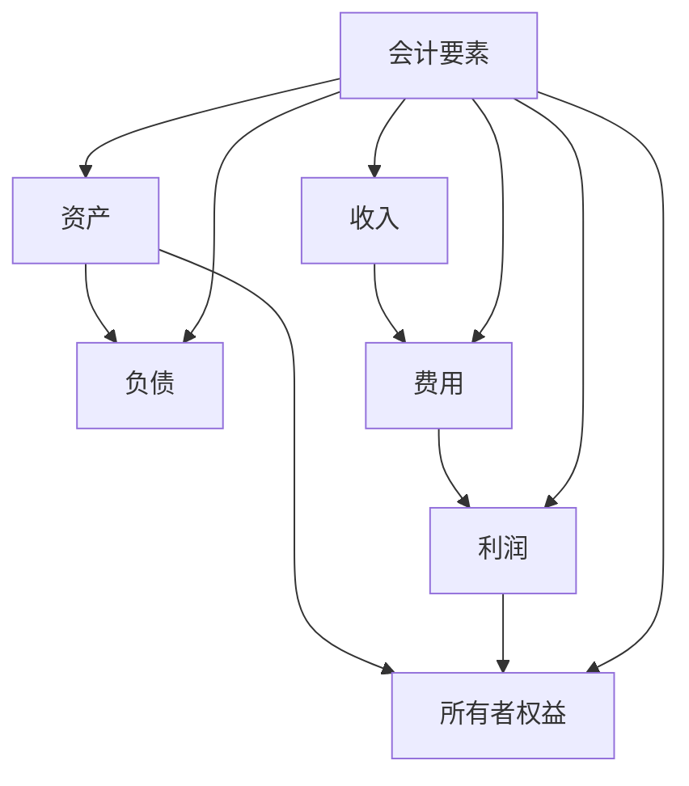

# 会计要素详解

## 会计要素的定义

### 📖 基本定义
**会计要素**是对会计对象的基本分类，是会计核算对象的具体化，是构成财务报表的基本框架。

### 🔍 定义解析
- **基本分类**：对会计对象的基本分类
- **具体化**：会计核算对象的具体化
- **基本框架**：构成财务报表的基本框架
- **核算基础**：会计核算的基础

## 六大会计要素

### 💰 资产（Assets）

#### 定义
**资产**是指企业过去的交易或事项形成的、由企业拥有或控制的、预期会给企业带来经济利益的资源。

#### 特征
1. **过去形成**：由过去的交易或事项形成
2. **企业拥有或控制**：企业拥有或控制该资源
3. **经济利益**：预期会给企业带来经济利益
4. **资源性质**：具有资源性质

#### 分类
- **流动资产**：预计在一年内变现或耗用的资产
- **非流动资产**：预计在一年以上变现或耗用的资产

#### 举例
- **流动资产**：现金、银行存款、应收账款、存货
- **非流动资产**：固定资产、无形资产、长期投资

### 💸 负债（Liabilities）

#### 定义
**负债**是指企业过去的交易或事项形成的、预期会导致经济利益流出企业的现时义务。

#### 特征
1. **过去形成**：由过去的交易或事项形成
2. **现时义务**：企业承担的现时义务
3. **经济利益流出**：预期会导致经济利益流出
4. **义务性质**：具有义务性质

#### 分类
- **流动负债**：预计在一年内偿还的负债
- **非流动负债**：预计在一年以上偿还的负债

#### 举例
- **流动负债**：短期借款、应付账款、应付工资
- **非流动负债**：长期借款、应付债券、长期应付款

### 👑 所有者权益（Owner's Equity）

#### 定义
**所有者权益**是指企业资产扣除负债后由所有者享有的剩余权益。

#### 特征
1. **剩余权益**：资产扣除负债后的剩余权益
2. **所有者享有**：由所有者享有
3. **权益性质**：具有权益性质
4. **永久性**：具有永久性

#### 构成
- **实收资本**：投资者投入的资本
- **资本公积**：资本溢价等
- **盈余公积**：从利润中提取的公积金
- **未分配利润**：尚未分配的利润

#### 举例
- **实收资本**：股本、实收资本
- **资本公积**：资本溢价、股本溢价
- **盈余公积**：法定盈余公积、任意盈余公积
- **未分配利润**：累计未分配利润

### 💵 收入（Revenue）

#### 定义
**收入**是指企业在日常活动中形成的、会导致所有者权益增加的、与所有者投入资本无关的经济利益的总流入。

#### 特征
1. **日常活动**：在日常活动中形成
2. **所有者权益增加**：会导致所有者权益增加
3. **与投入无关**：与所有者投入资本无关
4. **经济利益流入**：经济利益的总流入

#### 分类
- **主营业务收入**：企业主要业务活动产生的收入
- **其他业务收入**：企业其他业务活动产生的收入

#### 举例
- **主营业务收入**：销售商品收入、提供劳务收入
- **其他业务收入**：出租收入、技术转让收入

### 💸 费用（Expenses）

#### 定义
**费用**是指企业在日常活动中发生的、会导致所有者权益减少的、与向所有者分配利润无关的经济利益的总流出。

#### 特征
1. **日常活动**：在日常活动中发生
2. **所有者权益减少**：会导致所有者权益减少
3. **与分配无关**：与向所有者分配利润无关
4. **经济利益流出**：经济利益的总流出

#### 分类
- **营业成本**：企业销售商品、提供劳务的成本
- **期间费用**：企业发生的期间费用
- **其他费用**：企业发生的其他费用

#### 举例
- **营业成本**：销售成本、劳务成本
- **期间费用**：管理费用、销售费用、财务费用
- **其他费用**：营业外支出、资产减值损失

### 💰 利润（Profit）

#### 定义
**利润**是指企业在一定会计期间的经营成果，包括收入减去费用后的净额。

#### 特征
1. **经营成果**：企业在一定会计期间的经营成果
2. **收入减费用**：收入减去费用后的净额
3. **综合反映**：综合反映企业经营成果
4. **动态指标**：动态反映企业业绩

#### 构成
- **营业利润**：营业收入减去营业成本和期间费用
- **利润总额**：营业利润加上营业外收入减去营业外支出
- **净利润**：利润总额减去所得税费用

#### 举例
- **营业利润**：主营业务利润、其他业务利润
- **利润总额**：营业利润、营业外收支
- **净利润**：利润总额、所得税费用

## 会计要素的关系

### 🔗 基本关系

#### 1. 静态关系（资产负债表）
**资产 = 负债 + 所有者权益**

#### 2. 动态关系（利润表）
**收入 - 费用 = 利润**

#### 3. 综合关系（综合反映）
**资产 = 负债 + 所有者权益 + 利润**

### 📊 关系图解

## 会计要素的确认

### ✅ 确认条件

#### 1. 资产确认条件
- **经济利益很可能流入企业**
- **成本或价值能够可靠计量**

#### 2. 负债确认条件
- **经济利益很可能流出企业**
- **金额能够可靠计量**

#### 3. 收入确认条件
- **经济利益很可能流入企业**
- **金额能够可靠计量**
- **相关成本能够可靠计量**

#### 4. 费用确认条件
- **经济利益很可能流出企业**
- **金额能够可靠计量**

## 会计要素的计量

### 📏 计量属性

#### 1. 历史成本
- **定义**：取得或制造资产时支付的现金或现金等价物
- **优点**：客观、可靠
- **缺点**：不能反映现时价值

#### 2. 重置成本
- **定义**：按照当前市场条件重新取得相同资产所需支付的现金或现金等价物
- **优点**：反映现时价值
- **缺点**：主观性强

#### 3. 可变现净值
- **定义**：资产在正常经营过程中可实现的现金或现金等价物减去处置费用
- **优点**：反映变现能力
- **缺点**：估计成分大

#### 4. 现值
- **定义**：资产或负债未来现金流量的现值
- **优点**：考虑时间价值
- **缺点**：计算复杂

#### 5. 公允价值
- **定义**：在公平交易中熟悉情况的交易双方自愿进行资产交换或债务清偿的金额
- **优点**：反映市场价值
- **缺点**：市场不活跃时难以确定

## 费曼学习法应用

### 🎯 学习目标
**能够准确理解和区分六大会计要素**

### 📝 学习步骤
1. **选择概念**：六大会计要素的定义和特征
2. **简化解释**：用简单语言解释每个要素
3. **识别盲区**：发现不理解的地方
4. **重新学习**：回到源头重新理解

### 💡 记忆技巧
- **六大要素**：资产、负债、所有者权益、收入、费用、利润
- **要素特征**：过去形成、企业控制、经济利益
- **要素关系**：资产=负债+所有者权益，收入-费用=利润

## 刻意练习要点

### 🎯 练习重点
1. **要素识别**：准确识别不同的会计要素
2. **特征掌握**：掌握每个要素的特征
3. **关系理解**：理解要素之间的关系
4. **确认计量**：理解要素的确认和计量

### 📊 练习方法
1. **要素分类**：将经济业务分类到不同要素
2. **特征分析**：分析每个要素的特征
3. **关系分析**：分析要素之间的关系
4. **综合应用**：综合运用所学知识分析问题

## 相关链接
- [[02-会计等式原理]] - 会计等式原理
- [[03-要素关系图解]] - 要素关系图解
- [[04-等式应用实例]] - 等式应用实例
- [[01-基础认知层/会计学概述/01-会计学基本概念]] - 会计学基本概念
- [[01-基础认知层/会计科目与账户/01-会计科目体系]] - 会计科目体系
