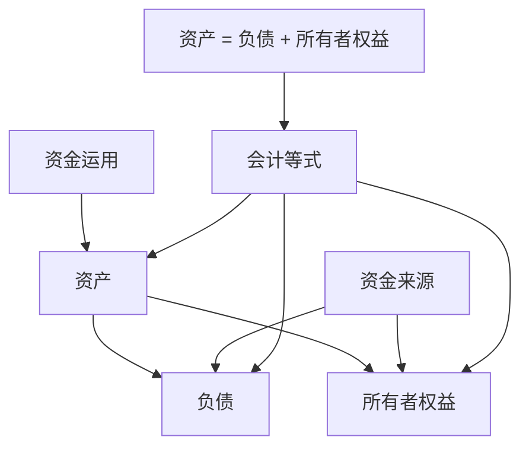
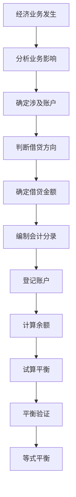

# 会计等式原理

## 会计等式的定义

### 📖 基本定义
**会计等式**是反映会计要素之间数量关系的数学表达式，是复式记账的理论基础。

### 🔍 定义解析
- **数量关系**：反映会计要素之间的数量关系
- **数学表达式**：用数学公式表示
- **理论基础**：复式记账的理论基础
- **平衡关系**：体现平衡关系

### 🎯 等式作用
1. **理论基础**：为复式记账提供理论基础
2. **平衡验证**：验证记账的正确性
3. **报表编制**：为报表编制提供依据
4. **分析工具**：作为财务分析的工具

## 基本会计等式

### ⚖️ 静态等式
**资产 = 负债 + 所有者权益**

### 🔍 等式解析

#### 1. 等式含义
- **资产**：企业拥有的资源
- **负债**：企业承担的债务
- **所有者权益**：所有者对企业资产的要求权
- **平衡关系**：资产总额等于负债和所有者权益总额

#### 2. 等式特点
- **恒等性**：等式永远成立
- **平衡性**：左右两边始终平衡
- **完整性**：完整反映企业财务状况
- **基础性**：是其他等式的基础

#### 3. 等式意义
- **产权关系**：反映企业的产权关系
- **资金来源**：反映企业的资金来源
- **资金运用**：反映企业的资金运用
- **财务状况**：反映企业的财务状况

### 📊 等式图解



## 扩展会计等式

### 🔄 动态等式
**资产 = 负债 + 所有者权益 + 收入 - 费用**

### 🔍 等式解析

#### 1. 等式含义
- **收入**：企业获得的收入
- **费用**：企业发生的费用
- **利润**：收入减去费用的差额
- **综合反映**：综合反映企业财务状况

#### 2. 等式变化
- **收入增加**：所有者权益增加
- **费用增加**：所有者权益减少
- **利润形成**：所有者权益增加
- **亏损形成**：所有者权益减少

#### 3. 等式意义
- **经营成果**：反映企业经营成果
- **财务状况**：反映企业财务状况
- **综合信息**：提供综合会计信息
- **决策支持**：为决策提供支持

### 📈 等式演变

#### 1. 基本等式
```
资产 = 负债 + 所有者权益
```

#### 2. 引入收入费用
```
资产 = 负债 + 所有者权益 + 收入 - 费用
```

#### 3. 利润等式
```
资产 = 负债 + 所有者权益 + 利润
```

#### 4. 综合等式
```
资产 = 负债 + 所有者权益 + (收入 - 费用)
```

## 会计等式的平衡原理

### ⚖️ 平衡原理

#### 1. 基本原理
- **恒等性**：等式永远成立
- **平衡性**：左右两边始终平衡
- **不变性**：经济业务不会破坏平衡
- **验证性**：可以验证记账正确性

#### 2. 平衡机制
- **双重记录**：每笔业务都要双重记录
- **方向相反**：借贷方向相反
- **金额相等**：借贷金额相等
- **相互抵消**：相互抵消保持平衡

#### 3. 平衡验证
- **试算平衡**：通过试算平衡验证
- **余额平衡**：通过余额平衡验证
- **发生额平衡**：通过发生额平衡验证
- **综合平衡**：通过综合平衡验证

### 🔄 平衡过程



## 经济业务对会计等式的影响

### 📊 影响类型

#### 1. 资产内部变化
- **业务类型**：资产项目之间的增减变化
- **等式影响**：等式总额不变
- **举例**：用银行存款购买原材料
- **分录**：
  ```
  借：原材料
  贷：银行存款
  ```

#### 2. 负债内部变化
- **业务类型**：负债项目之间的增减变化
- **等式影响**：等式总额不变
- **举例**：用短期借款偿还应付账款
- **分录**：
  ```
  借：应付账款
  贷：短期借款
  ```

#### 3. 所有者权益内部变化
- **业务类型**：所有者权益项目之间的增减变化
- **等式影响**：等式总额不变
- **举例**：用盈余公积转增资本
- **分录**：
  ```
  借：盈余公积
  贷：实收资本
  ```

#### 4. 资产和负债同增
- **业务类型**：资产和负债同时增加
- **等式影响**：等式总额增加
- **举例**：向银行借款
- **分录**：
  ```
  借：银行存款
  贷：短期借款
  ```

#### 5. 资产和负债同减
- **业务类型**：资产和负债同时减少
- **等式影响**：等式总额减少
- **举例**：用银行存款偿还借款
- **分录**：
  ```
  借：短期借款
  贷：银行存款
  ```

#### 6. 资产和所有者权益同增
- **业务类型**：资产和所有者权益同时增加
- **等式影响**：等式总额增加
- **举例**：投资者投入资本
- **分录**：
  ```
  借：银行存款
  贷：实收资本
  ```

#### 7. 资产和所有者权益同减
- **业务类型**：资产和所有者权益同时减少
- **等式影响**：等式总额减少
- **举例**：向投资者分配利润
- **分录**：
  ```
  借：利润分配
  贷：银行存款
  ```

#### 8. 负债增加，所有者权益减少
- **业务类型**：负债增加，所有者权益减少
- **等式影响**：等式总额不变
- **举例**：宣告分配现金股利
- **分录**：
  ```
  借：利润分配
  贷：应付股利
  ```

#### 9. 负债减少，所有者权益增加
- **业务类型**：负债减少，所有者权益增加
- **等式影响**：等式总额不变
- **举例**：将应付账款转为资本
- **分录**：
  ```
  借：应付账款
  贷：实收资本
  ```

### 📈 影响分析表

| 业务类型 | 资产 | 负债 | 所有者权益 | 等式总额 | 平衡性 |
|----------|------|------|------------|----------|--------|
| 资产内部变化 | +- | 0 | 0 | 不变 | 保持 |
| 负债内部变化 | 0 | +- | 0 | 不变 | 保持 |
| 所有者权益内部变化 | 0 | 0 | +- | 不变 | 保持 |
| 资产和负债同增 | + | + | 0 | 增加 | 保持 |
| 资产和负债同减 | - | - | 0 | 减少 | 保持 |
| 资产和所有者权益同增 | + | 0 | + | 增加 | 保持 |
| 资产和所有者权益同减 | - | 0 | - | 减少 | 保持 |
| 负债增加，所有者权益减少 | 0 | + | - | 不变 | 保持 |
| 负债减少，所有者权益增加 | 0 | - | + | 不变 | 保持 |

## 会计等式的应用

### 📋 在复式记账中的应用

#### 1. 理论基础
- **记账依据**：为复式记账提供理论依据
- **平衡验证**：验证记账的正确性
- **账户设置**：指导账户的设置
- **分录编制**：指导分录的编制

#### 2. 实际应用
- **业务分析**：分析经济业务的影响
- **账户确定**：确定涉及的账户
- **方向判断**：判断借贷方向
- **金额确定**：确定借贷金额

### 📊 在财务报表中的应用

#### 1. 资产负债表
- **编制依据**：以会计等式为编制依据
- **结构设计**：按照等式结构设计
- **平衡验证**：验证报表的平衡性
- **信息提供**：提供财务状况信息

#### 2. 利润表
- **编制依据**：以扩展等式为编制依据
- **结构设计**：按照等式结构设计
- **信息提供**：提供经营成果信息
- **综合分析**：进行综合分析

### 🔍 在财务分析中的应用

#### 1. 结构分析
- **资产结构**：分析资产结构
- **负债结构**：分析负债结构
- **权益结构**：分析权益结构
- **综合结构**：分析综合结构

#### 2. 比率分析
- **资产负债率**：负债/资产
- **权益比率**：所有者权益/资产
- **流动比率**：流动资产/流动负债
- **速动比率**：速动资产/流动负债

## 会计等式的局限性

### ⚠️ 主要局限性

#### 1. 历史成本局限
- **成本基础**：以历史成本为基础
- **价值偏离**：可能与现时价值偏离
- **通货膨胀**：通货膨胀影响
- **资产重估**：资产重估问题

#### 2. 货币计量局限
- **货币单位**：以货币为计量单位
- **购买力变化**：购买力变化影响
- **币值波动**：币值波动影响
- **非货币信息**：无法反映非货币信息

#### 3. 静态反映局限
- **时点反映**：反映特定时点的状况
- **动态变化**：无法反映动态变化
- **趋势分析**：趋势分析有限
- **预测能力**：预测能力有限

#### 4. 主观判断局限
- **估计成分**：包含估计成分
- **主观判断**：需要主观判断
- **政策选择**：会计政策选择影响
- **方法选择**：会计方法选择影响

## 费曼学习法应用

### 🎯 学习目标
**能够理解和应用会计等式原理**

### 📝 学习步骤
1. **选择概念**：会计等式的定义、内容和应用
2. **简化解释**：用简单语言解释会计等式
3. **识别盲区**：发现不理解的地方
4. **重新学习**：回到源头重新理解

### 💡 记忆技巧
- **基本等式**：资产 = 负债 + 所有者权益
- **扩展等式**：资产 = 负债 + 所有者权益 + 收入 - 费用
- **平衡原理**：等式永远平衡
- **九种变化**：九种经济业务类型

## 刻意练习要点

### 🎯 练习重点
1. **等式理解**：理解会计等式的含义
2. **平衡原理**：掌握平衡原理
3. **业务影响**：分析经济业务对等式的影响
4. **实际应用**：在实际中应用会计等式

### 📊 练习方法
1. **等式练习**：练习会计等式的应用
2. **业务分析练习**：分析经济业务对等式的影响
3. **平衡验证练习**：验证等式的平衡性
4. **综合应用练习**：综合应用会计等式

## 相关链接
- [[01-会计要素详解]] - 会计要素详解
- [[03-要素关系图解]] - 要素关系图解
- [[04-等式应用实例]] - 等式应用实例
- [[01-基础认知层/会计科目与账户/03-借贷记账法]] - 借贷记账法
- [[02-理解掌握层/会计核算基础/03-试算平衡方法]] - 试算平衡方法