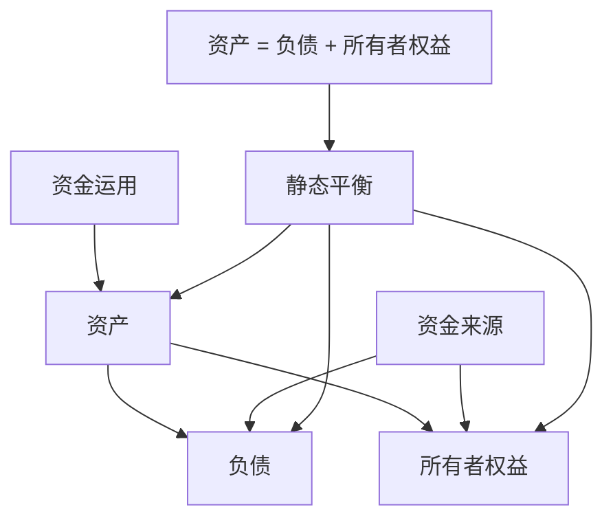
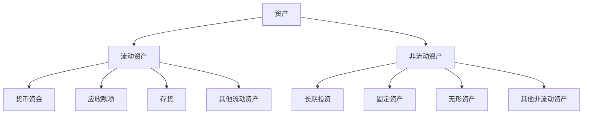
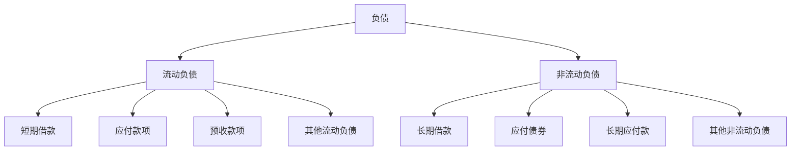
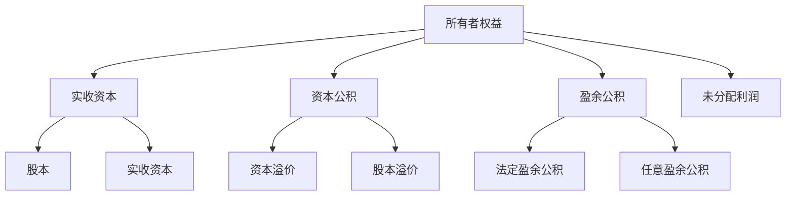
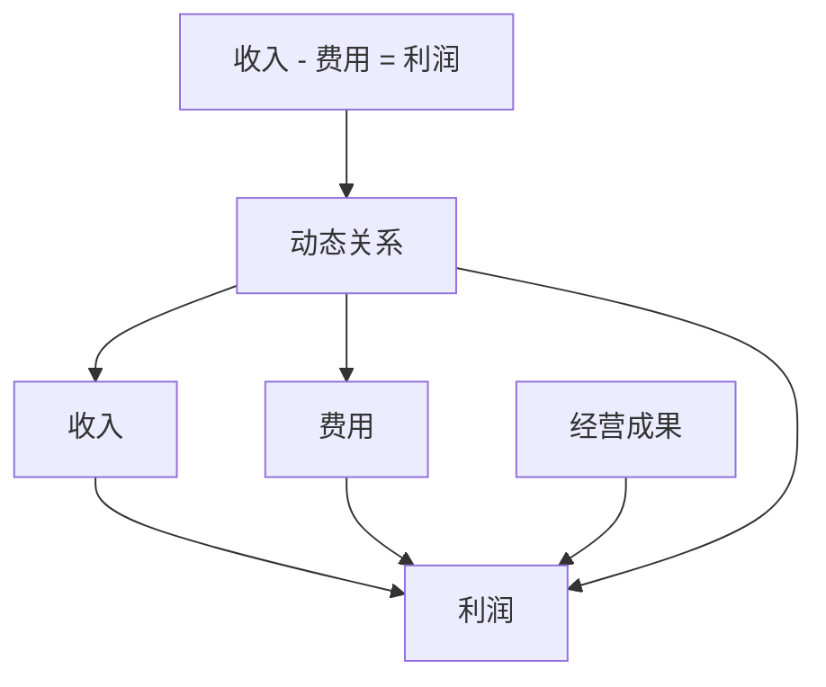
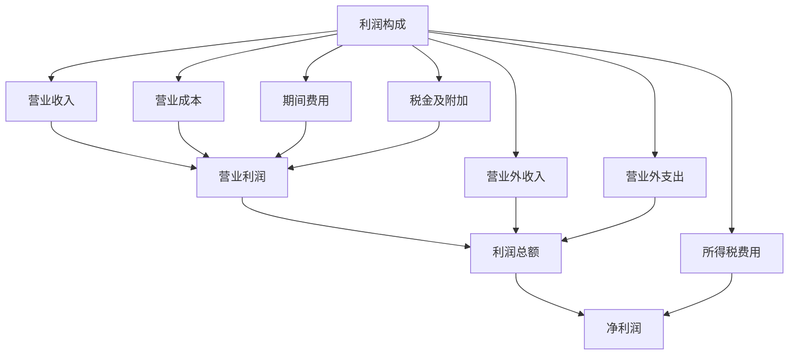
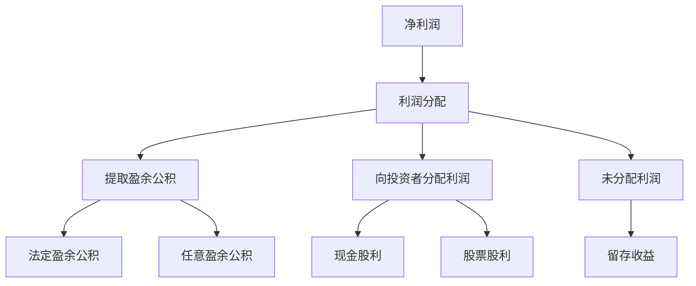
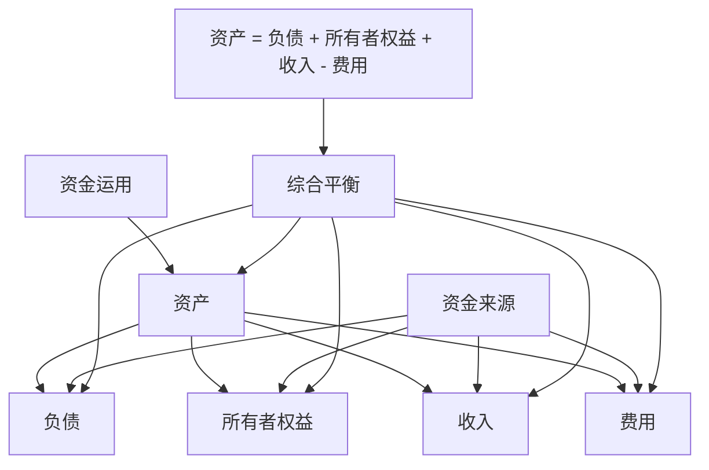
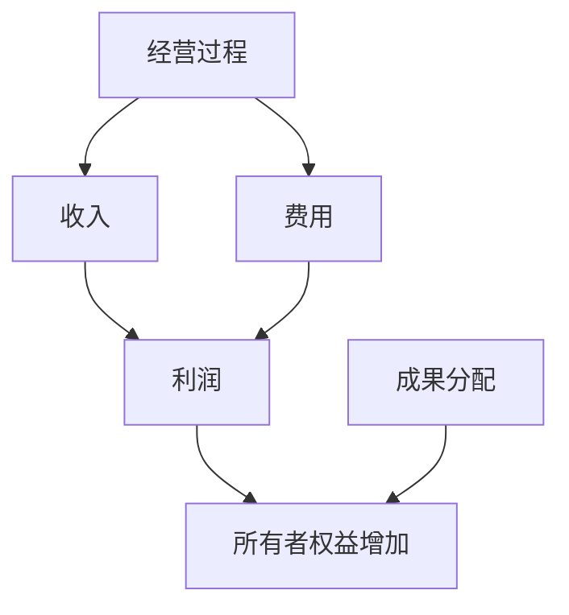
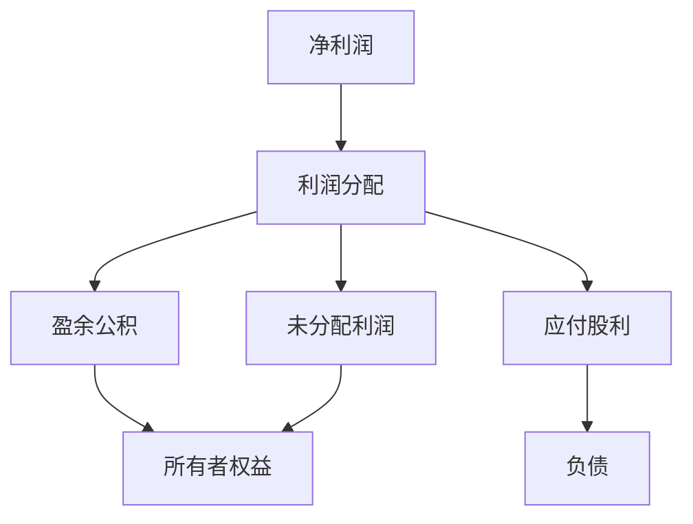

# 要素关系图解

## 会计要素关系概述

### 📖 基本概念
**会计要素关系**是指六大会计要素之间存在的内在联系和相互影响关系，是理解会计理论的基础。

### 🔍 关系特点
- **内在联系**：要素之间存在内在联系
- **相互影响**：要素之间相互影响
- **动态变化**：关系动态变化
- **系统整体**：构成系统整体

### 🎯 关系作用
1. **理论指导**：为会计理论提供指导
2. **实务应用**：指导会计实务应用
3. **分析工具**：作为财务分析工具
4. **决策支持**：为决策提供支持

## 静态要素关系

### ⚖️ 资产负债表要素关系

#### 基本关系
**资产 = 负债 + 所有者权益**

#### 关系图解

#### 关系解析
- **资产**：企业拥有的资源
- **负债**：企业承担的债务
- **所有者权益**：所有者对企业资产的要求权
- **平衡关系**：资产总额等于负债和所有者权益总额

### 📊 要素构成关系

#### 资产构成

#### 负债构成

#### 所有者权益构成

## 动态要素关系

### 🔄 利润表要素关系

#### 基本关系
**收入 - 费用 = 利润**

#### 关系图解

#### 关系解析
- **收入**：企业获得的收入
- **费用**：企业发生的费用
- **利润**：收入减去费用的差额
- **经营成果**：反映企业经营成果

### 📈 利润构成关系

#### 利润层次

#### 利润分配关系

## 综合要素关系

### 🌐 综合等式关系

#### 扩展等式
**资产 = 负债 + 所有者权益 + 收入 - 费用**

#### 关系图解

#### 关系解析
- **综合反映**：综合反映企业财务状况
- **动态平衡**：保持动态平衡
- **完整信息**：提供完整会计信息
- **决策支持**：为决策提供支持

### 🔄 要素转换关系

#### 收入费用转换

#### 利润分配转换

## 要素关系的影响因素

### 🌟 内部影响因素

#### 1. 经营决策
- **投资决策**：影响资产结构
- **融资决策**：影响负债结构
- **经营决策**：影响收入费用
- **分配决策**：影响利润分配

#### 2. 管理活动
- **成本控制**：影响费用水平
- **收入管理**：影响收入水平
- **资产管理**：影响资产效率
- **负债管理**：影响负债结构

#### 3. 会计政策
- **确认政策**：影响要素确认
- **计量政策**：影响要素计量
- **报告政策**：影响要素报告
- **披露政策**：影响要素披露

### 🌍 外部影响因素

#### 1. 经济环境
- **经济周期**：影响企业经营
- **市场环境**：影响收入费用
- **政策环境**：影响要素关系
- **技术环境**：影响要素结构

#### 2. 行业特点
- **行业性质**：影响要素结构
- **行业周期**：影响要素变化
- **行业竞争**：影响要素关系
- **行业规范**：影响要素处理

#### 3. 法律法规
- **会计准则**：规范要素处理
- **税法规定**：影响要素计量
- **监管要求**：影响要素披露
- **国际准则**：影响要素处理

## 要素关系的分析方法

### 📊 静态分析方法

#### 1. 结构分析
- **资产结构**：分析资产构成
- **负债结构**：分析负债构成
- **权益结构**：分析权益构成
- **综合结构**：分析综合结构

#### 2. 比率分析
- **资产负债率**：负债/资产
- **权益比率**：所有者权益/资产
- **流动比率**：流动资产/流动负债
- **速动比率**：速动资产/流动负债

#### 3. 比较分析
- **历史比较**：与历史数据比较
- **行业比较**：与行业数据比较
- **标杆比较**：与标杆企业比较
- **目标比较**：与目标数据比较

### 📈 动态分析方法

#### 1. 趋势分析
- **收入趋势**：分析收入变化趋势
- **费用趋势**：分析费用变化趋势
- **利润趋势**：分析利润变化趋势
- **综合趋势**：分析综合变化趋势

#### 2. 变动分析
- **绝对变动**：分析绝对变动
- **相对变动**：分析相对变动
- **结构变动**：分析结构变动
- **综合变动**：分析综合变动

#### 3. 因素分析
- **收入因素**：分析收入影响因素
- **费用因素**：分析费用影响因素
- **利润因素**：分析利润影响因素
- **综合因素**：分析综合影响因素

## 要素关系的实际应用

### 💼 在企业中的应用

#### 1. 财务管理
- **资金管理**：管理资金结构
- **成本控制**：控制成本费用
- **利润管理**：管理利润水平
- **风险管理**：管理财务风险

#### 2. 经营决策
- **投资决策**：支持投资决策
- **融资决策**：支持融资决策
- **经营决策**：支持经营决策
- **分配决策**：支持分配决策

#### 3. 绩效评价
- **财务绩效**：评价财务绩效
- **经营绩效**：评价经营绩效
- **管理绩效**：评价管理绩效
- **综合绩效**：评价综合绩效

### 🌐 在分析中的应用

#### 1. 财务分析
- **结构分析**：进行结构分析
- **比率分析**：进行比率分析
- **趋势分析**：进行趋势分析
- **综合分析**：进行综合分析

#### 2. 投资分析
- **价值分析**：进行价值分析
- **风险分析**：进行风险分析
- **收益分析**：进行收益分析
- **综合分析**：进行综合分析

#### 3. 信用分析
- **偿债能力**：分析偿债能力
- **盈利能力**：分析盈利能力
- **营运能力**：分析营运能力
- **发展能力**：分析发展能力

## 费曼学习法应用

### 🎯 学习目标
**能够理解和分析会计要素关系**

### 📝 学习步骤
1. **选择概念**：会计要素关系的定义、内容和应用
2. **简化解释**：用简单语言解释要素关系
3. **识别盲区**：发现不理解的地方
4. **重新学习**：回到源头重新理解

### 💡 记忆技巧
- **静态关系**：资产 = 负债 + 所有者权益
- **动态关系**：收入 - 费用 = 利润
- **综合关系**：资产 = 负债 + 所有者权益 + 收入 - 费用
- **分析方法**：结构分析、比率分析、趋势分析

## 刻意练习要点

### 🎯 练习重点
1. **关系理解**：理解会计要素关系
2. **图解分析**：分析要素关系图解
3. **影响因素**：分析影响要素关系的因素
4. **实际应用**：在实际中应用要素关系

### 📊 练习方法
1. **关系练习**：练习会计要素关系的应用
2. **图解练习**：绘制要素关系图解
3. **分析练习**：分析要素关系的影响因素
4. **应用练习**：在实际中应用要素关系

## 相关链接
- [[01-会计要素详解]] - 会计要素详解
- [[02-会计等式原理]] - 会计等式原理
- [[04-等式应用实例]] - 等式应用实例
- [[01-基础认知层/会计科目与账户/03-借贷记账法]] - 借贷记账法
- [[03-应用实践层/财务分析应用/01-财务比率分析]] - 财务比率分析