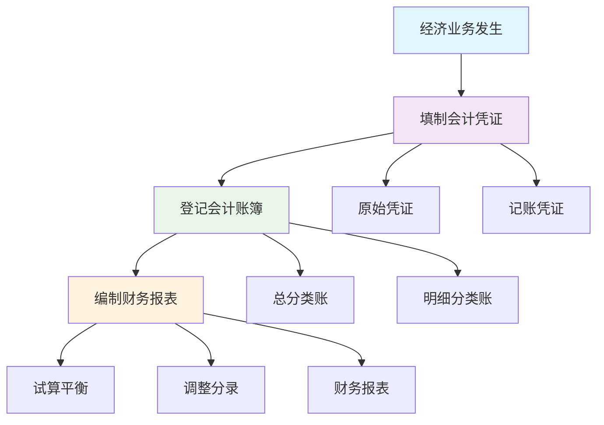

# 会计核算程序

## 会计核算程序概述

### 📖 基本定义
**会计核算程序**是指从经济业务发生到编制财务报表的整个会计核算过程，包括凭证、账簿、报表三个基本环节。

### 🔍 程序特点
- **连续性**：各个环节紧密相连
- **系统性**：形成完整的核算体系
- **规范性**：遵循统一的核算规范
- **准确性**：确保核算结果的准确性

## 会计核算程序的基本步骤

### 🔄 基本步骤

#### 1. 经济业务发生
- **业务识别**：识别经济业务
- **业务分析**：分析业务性质
- **业务确认**：确认业务内容

#### 2. 填制会计凭证
- **原始凭证**：取得原始凭证
- **记账凭证**：填制记账凭证
- **凭证审核**：审核凭证内容

#### 3. 登记会计账簿
- **总账登记**：登记总分类账
- **明细账登记**：登记明细分类账
- **平行登记**：总账和明细账平行登记

#### 4. 编制财务报表
- **试算平衡**：进行试算平衡
- **调整分录**：编制调整分录
- **报表编制**：编制财务报表

### 📊 核算程序图解



## 会计核算程序的类型

### 📋 程序类型

#### 1. 记账凭证核算程序
**特点**：
- 直接根据记账凭证登记总账
- 程序简单，易于理解
- 适用于小型企业

**步骤**：
1. 根据原始凭证填制记账凭证
2. 根据记账凭证登记总账
3. 根据记账凭证登记明细账
4. 根据总账和明细账编制财务报表

#### 2. 科目汇总表核算程序
**特点**：
- 先编制科目汇总表，再登记总账
- 减少登记总账的工作量
- 适用于中型企业

**步骤**：
1. 根据原始凭证填制记账凭证
2. 根据记账凭证编制科目汇总表
3. 根据科目汇总表登记总账
4. 根据记账凭证登记明细账
5. 根据总账和明细账编制财务报表

#### 3. 汇总记账凭证核算程序
**特点**：
- 先编制汇总记账凭证，再登记总账
- 减少登记总账的工作量
- 适用于大型企业

**步骤**：
1. 根据原始凭证填制记账凭证
2. 根据记账凭证编制汇总记账凭证
3. 根据汇总记账凭证登记总账
4. 根据记账凭证登记明细账
5. 根据总账和明细账编制财务报表

#### 4. 多栏式日记账核算程序
**特点**：
- 使用多栏式日记账
- 减少登记总账的工作量
- 适用于中型企业

**步骤**：
1. 根据原始凭证填制记账凭证
2. 根据记账凭证登记多栏式日记账
3. 根据多栏式日记账登记总账
4. 根据记账凭证登记明细账
5. 根据总账和明细账编制财务报表

### 📊 程序类型对比表

| 程序类型 | 特点 | 适用企业 | 优点 | 缺点 |
|----------|------|----------|------|------|
| 记账凭证 | 直接登记总账 | 小型企业 | 简单易行 | 工作量大 |
| 科目汇总表 | 先汇总后登记 | 中型企业 | 减少工作量 | 程序复杂 |
| 汇总记账凭证 | 先汇总后登记 | 大型企业 | 减少工作量 | 程序复杂 |
| 多栏式日记账 | 使用多栏式账 | 中型企业 | 减少工作量 | 程序复杂 |

## 会计核算程序的具体操作

### 🔧 具体操作

#### 1. 记账凭证核算程序操作

**第一步：填制记账凭证**
```
收到投资款存入银行：
借：银行存款    100,000
贷：实收资本    100,000
```

**第二步：登记总账**
- 在银行存款总账借方登记100,000
- 在实收资本总账贷方登记100,000

**第三步：登记明细账**
- 在银行存款明细账借方登记100,000
- 在实收资本明细账贷方登记100,000

**第四步：编制财务报表**
- 根据总账余额编制资产负债表
- 根据总账发生额编制利润表

#### 2. 科目汇总表核算程序操作

**第一步：填制记账凭证**
```
借：银行存款    100,000
贷：实收资本    100,000
```

**第二步：编制科目汇总表**
| 科目名称 | 借方发生额 | 贷方发生额 |
|----------|------------|------------|
| 银行存款 | 100,000 | 0 |
| 实收资本 | 0 | 100,000 |
| 合计 | 100,000 | 100,000 |

**第三步：登记总账**
- 根据科目汇总表登记总账

**第四步：登记明细账**
- 根据记账凭证登记明细账

**第五步：编制财务报表**
- 根据总账和明细账编制财务报表

## 会计核算程序的内部控制

### 🛡️ 内部控制要点

#### 1. 凭证控制
- **原始凭证**：确保原始凭证真实、完整
- **记账凭证**：确保记账凭证准确、规范
- **凭证审核**：建立凭证审核制度

#### 2. 账簿控制
- **账簿设置**：合理设置账簿
- **账簿登记**：规范登记账簿
- **账簿核对**：定期核对账簿

#### 3. 报表控制
- **报表编制**：规范编制报表
- **报表审核**：建立报表审核制度
- **报表披露**：及时披露报表

### 📋 内部控制措施

#### 1. 岗位分离
- **制证与审核**：制证与审核分离
- **记账与审核**：记账与审核分离
- **出纳与会计**：出纳与会计分离

#### 2. 授权审批
- **业务授权**：建立业务授权制度
- **金额审批**：建立金额审批制度
- **特殊审批**：建立特殊审批制度

#### 3. 监督检查
- **定期检查**：定期检查核算程序
- **专项检查**：进行专项检查
- **外部审计**：接受外部审计

## 会计核算程序的优化

### 🚀 优化方向

#### 1. 信息化优化
- **会计软件**：使用会计软件
- **自动化处理**：实现自动化处理
- **数据共享**：实现数据共享

#### 2. 流程优化
- **简化程序**：简化核算程序
- **提高效率**：提高核算效率
- **降低成本**：降低核算成本

#### 3. 质量优化
- **提高准确性**：提高核算准确性
- **加强控制**：加强内部控制
- **完善制度**：完善核算制度

### 📊 优化效果

#### 1. 效率提升
- **处理速度**：提高处理速度
- **工作质量**：提高工作质量
- **成本节约**：节约核算成本

#### 2. 质量改善
- **准确性**：提高核算准确性
- **完整性**：提高核算完整性
- **及时性**：提高核算及时性

#### 3. 管理改进
- **内部控制**：加强内部控制
- **风险管理**：加强风险管理
- **决策支持**：提供决策支持

## 费曼学习法应用

### 🎯 学习目标
**能够准确理解和运用会计核算程序**

### 📝 学习步骤
1. **选择概念**：会计核算程序的定义、类型和操作
2. **简化解释**：用简单语言解释会计核算程序
3. **识别盲区**：发现不理解的地方
4. **重新学习**：回到源头重新理解

### 💡 记忆技巧
- **基本步骤**：业务→凭证→账簿→报表
- **程序类型**：记账凭证、科目汇总表、汇总记账凭证、多栏式日记账
- **控制要点**：凭证控制、账簿控制、报表控制

## 刻意练习要点

### 🎯 练习重点
1. **程序理解**：理解各种核算程序的特点
2. **操作掌握**：掌握核算程序的操作方法
3. **内部控制**：掌握内部控制要点
4. **程序优化**：了解程序优化方向

### 📊 练习方法
1. **程序对比**：对比不同核算程序
2. **操作练习**：练习核算程序操作
3. **控制练习**：练习内部控制
4. **优化练习**：练习程序优化

## 相关链接
- [[02-会计循环过程]] - 会计循环过程
- [[03-试算平衡方法]] - 试算平衡方法
- [[04-期末调整处理]] - 期末调整处理
- [[01-基础认知层/会计科目与账户/01-会计科目体系]] - 会计科目体系
- [[01-基础认知层/会计科目与账户/02-账户结构分析]] - 账户结构分析
