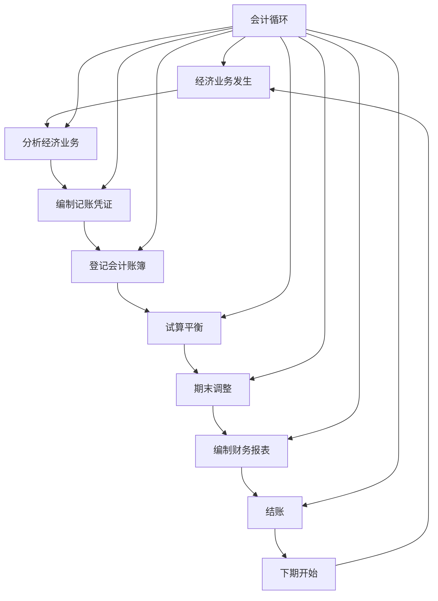

# 会计循环过程

## 会计循环概述

### 📖 基本定义
**会计循环**是指企业在一个会计期间内，从经济业务发生到编制财务报表的完整会计核算过程。

### 🔍 循环特点
- **周期性**：每个会计期间重复进行
- **连续性**：循环过程连续不断
- **完整性**：包含完整的核算过程
- **系统性**：系统性的核算过程

### 🎯 循环作用
1. **规范流程**：规范会计核算流程
2. **保证质量**：保证会计信息质量
3. **提高效率**：提高会计核算效率
4. **便于管理**：便于会计管理

## 会计循环的基本步骤

### 🔄 循环步骤

#### 1. 分析经济业务
- **业务识别**：识别经济业务
- **业务分析**：分析业务性质
- **影响分析**：分析对会计要素的影响
- **账户确定**：确定涉及的账户

#### 2. 编制记账凭证
- **凭证编制**：编制记账凭证
- **分录编制**：编制会计分录
- **审核检查**：审核检查凭证
- **凭证传递**：传递记账凭证

#### 3. 登记会计账簿
- **账簿登记**：登记会计账簿
- **明细登记**：登记明细账
- **总账登记**：登记总账
- **核对检查**：核对检查账簿

#### 4. 试算平衡
- **试算编制**：编制试算平衡表
- **平衡检查**：检查借贷平衡
- **错误查找**：查找记账错误
- **错误纠正**：纠正记账错误

#### 5. 期末调整
- **调整事项**：识别调整事项
- **调整分录**：编制调整分录
- **调整登记**：登记调整分录
- **调整验证**：验证调整正确性

#### 6. 编制财务报表
- **报表编制**：编制财务报表
- **报表审核**：审核财务报表
- **报表分析**：分析财务报表
- **报表报送**：报送财务报表

#### 7. 结账
- **账户结账**：结清各账户
- **损益结转**：结转损益类账户
- **余额结转**：结转账户余额
- **下期准备**：为下期做准备

### 📊 循环流程图



## 会计循环的详细过程

### 📝 第一步：分析经济业务

#### 1. 业务识别
- **原始凭证**：取得原始凭证
- **业务性质**：确定业务性质
- **业务金额**：确定业务金额
- **业务时间**：确定业务时间

#### 2. 业务分析
- **影响分析**：分析对会计要素的影响
- **账户确定**：确定涉及的账户
- **方向判断**：判断借贷方向
- **金额确定**：确定借贷金额

#### 3. 分析实例
**业务描述**：企业销售商品一批，售价100万元，成本60万元，货款尚未收到。

**分析过程**：
- 涉及账户：应收账款、主营业务收入、主营业务成本、库存商品
- 借贷方向：借应收账款，贷主营业务收入；借主营业务成本，贷库存商品
- 借贷金额：应收账款100万，主营业务收入100万，主营业务成本60万，库存商品60万

### 📋 第二步：编制记账凭证

#### 1. 凭证编制
- **凭证选择**：选择记账凭证
- **分录编制**：编制会计分录
- **摘要填写**：填写业务摘要
- **金额填写**：填写借贷金额

#### 2. 凭证审核
- **内容审核**：审核凭证内容
- **分录审核**：审核会计分录
- **金额审核**：审核借贷金额
- **签字盖章**：签字盖章确认

#### 3. 编制实例
**记账凭证**
```
记账凭证
日期：2024年1月15日    凭证号：记-001

摘要：销售商品
┌─────────────────────────────────────┐
│ 会计科目    │ 借方金额 │ 贷方金额 │
├─────────────────────────────────────┤
│ 应收账款    │ 1,000,000│          │
│ 主营业务收入 │          │ 1,000,000│
│ 主营业务成本 │ 600,000  │          │
│ 库存商品    │          │ 600,000  │
├─────────────────────────────────────┤
│ 合计        │ 1,600,000│ 1,600,000│
└─────────────────────────────────────┘

制单：张三    审核：李四    记账：王五
```

### 📚 第三步：登记会计账簿

#### 1. 明细账登记
- **明细账选择**：选择明细账
- **逐笔登记**：逐笔登记经济业务
- **余额计算**：计算账户余额
- **核对检查**：核对检查登记

#### 2. 总账登记
- **总账选择**：选择总账
- **汇总登记**：汇总登记经济业务
- **余额计算**：计算账户余额
- **核对检查**：核对检查登记

#### 3. 登记实例
**应收账款明细账**
```
应收账款明细账
账户：应收账款

日期    凭证号    摘要        借方金额    贷方金额    余额
1月15日  记-001   销售商品    1,000,000             1,000,000
```

**主营业务收入明细账**
```
主营业务收入明细账
账户：主营业务收入

日期    凭证号    摘要        借方金额    贷方金额    余额
1月15日  记-001   销售商品               1,000,000   1,000,000
```

### ⚖️ 第四步：试算平衡

#### 1. 试算编制
- **账户汇总**：汇总各账户发生额
- **余额计算**：计算各账户余额
- **试算编制**：编制试算平衡表
- **平衡检查**：检查借贷平衡

#### 2. 试算平衡表
```
试算平衡表
2024年1月31日

账户名称        期初余额    本期发生额    期末余额
                借方  贷方  借方    贷方  借方  贷方
库存现金        10,000      5,000        15,000
银行存款        100,000     200,000      300,000
应收账款                1,000,000      1,000,000
库存商品        50,000      600,000      450,000
固定资产        200,000                 200,000
短期借款                50,000         50,000
应付账款        30,000                 30,000
实收资本                100,000        100,000
主营业务收入            1,000,000      1,000,000
主营业务成本            600,000        600,000
管理费用        20,000                 20,000
合计           410,000 410,000 2,485,000 2,485,000 2,585,000 2,585,000
```

### 🔧 第五步：期末调整

#### 1. 调整事项
- **应计收入**：已实现但未收到的收入
- **应计费用**：已发生但未支付的费用
- **预付费用**：已支付但未发生的费用
- **预收收入**：已收到但未实现的收入

#### 2. 调整分录
**应计收入调整**
```
借：应收账款    50,000
贷：主营业务收入 50,000
```

**应计费用调整**
```
借：管理费用    10,000
贷：应付账款    10,000
```

**预付费用调整**
```
借：管理费用    5,000
贷：预付账款    5,000
```

**预收收入调整**
```
借：预收账款    20,000
贷：主营业务收入 20,000
```

### 📊 第六步：编制财务报表

#### 1. 资产负债表
```
资产负债表
2024年1月31日

资产                    金额        负债和所有者权益    金额
流动资产：                          流动负债：
货币资金              315,000      短期借款            50,000
应收账款            1,050,000      应付账款            40,000
存货                  450,000      预收账款            30,000
流动资产合计        1,815,000      流动负债合计       120,000
非流动资产：                        所有者权益：
固定资产              200,000      实收资本           100,000
非流动资产合计        200,000      未分配利润       1,795,000
资产总计            2,015,000      负债和所有者权益总计 2,015,000
```

#### 2. 利润表
```
利润表
2024年1月

项目                    金额
营业收入              1,070,000
减：营业成本            600,000
营业利润                470,000
减：管理费用             35,000
利润总额                435,000
减：所得税费用           108,750
净利润                  326,250
```

### 🔚 第七步：结账

#### 1. 损益结转
**收入结转**
```
借：主营业务收入 1,070,000
贷：本年利润    1,070,000
```

**费用结转**
```
借：本年利润    635,000
贷：主营业务成本 600,000
贷：管理费用     35,000
```

#### 2. 余额结转
**本年利润结转**
```
借：本年利润    435,000
贷：利润分配    435,000
```

## 会计循环的时间安排

### 📅 循环时间

#### 1. 日常处理
- **业务发生**：经济业务发生时
- **凭证编制**：业务发生后及时编制
- **账簿登记**：凭证编制后及时登记
- **日常核对**：定期进行核对

#### 2. 期末处理
- **试算平衡**：月末进行试算平衡
- **期末调整**：月末进行期末调整
- **报表编制**：月末编制财务报表
- **结账处理**：月末进行结账

#### 3. 年度处理
- **年度调整**：年末进行年度调整
- **年度报表**：年末编制年度报表
- **年度结账**：年末进行年度结账
- **下年准备**：为下年做准备

### ⏰ 时间安排表

| 时间 | 处理内容 | 负责人员 | 完成时间 |
|------|----------|----------|----------|
| 日常 | 凭证编制 | 会计人员 | 业务发生后1日内 |
| 日常 | 账簿登记 | 会计人员 | 凭证编制后1日内 |
| 月末 | 试算平衡 | 会计人员 | 月末前3日 |
| 月末 | 期末调整 | 会计主管 | 月末前2日 |
| 月末 | 报表编制 | 会计主管 | 月末前1日 |
| 月末 | 结账处理 | 会计主管 | 月末当日 |
| 年末 | 年度处理 | 财务经理 | 年末前1周 |

## 会计循环的质量控制

### 🔍 质量控制

#### 1. 事前控制
- **制度建立**：建立会计制度
- **人员培训**：培训会计人员
- **流程设计**：设计会计流程
- **标准制定**：制定会计标准

#### 2. 事中控制
- **凭证审核**：审核记账凭证
- **账簿核对**：核对会计账簿
- **试算平衡**：进行试算平衡
- **调整检查**：检查调整事项

#### 3. 事后控制
- **报表审核**：审核财务报表
- **分析检查**：分析检查报表
- **审计监督**：接受审计监督
- **持续改进**：持续改进流程

### 📊 质量指标

#### 1. 准确性指标
- **记账准确率**：记账准确率
- **计算准确率**：计算准确率
- **报表准确率**：报表准确率
- **综合准确率**：综合准确率

#### 2. 及时性指标
- **凭证及时率**：凭证编制及时率
- **登记及时率**：账簿登记及时率
- **报表及时率**：报表编制及时率
- **综合及时率**：综合及时率

#### 3. 完整性指标
- **业务完整率**：业务处理完整率
- **信息完整率**：信息提供完整率
- **手续完整率**：手续办理完整率
- **综合完整率**：综合完整率

## 费曼学习法应用

### 🎯 学习目标
**能够理解和应用会计循环过程**

### 📝 学习步骤
1. **选择概念**：会计循环的定义、步骤和应用
2. **简化解释**：用简单语言解释会计循环
3. **识别盲区**：发现不理解的地方
4. **重新学习**：回到源头重新理解

### 💡 记忆技巧
- **七个步骤**：分析业务、编制凭证、登记账簿、试算平衡、期末调整、编制报表、结账
- **循环特点**：周期性、连续性、完整性、系统性
- **时间安排**：日常处理、期末处理、年度处理
- **质量控制**：事前控制、事中控制、事后控制

## 刻意练习要点

### 🎯 练习重点
1. **循环理解**：理解会计循环过程
2. **步骤掌握**：掌握会计循环步骤
3. **实例分析**：分析会计循环实例
4. **质量控制**：掌握质量控制方法

### 📊 练习方法
1. **循环练习**：练习会计循环过程
2. **步骤练习**：练习会计循环步骤
3. **实例练习**：分析会计循环实例
4. **质量练习**：练习质量控制方法

## 相关链接
- [[01-权责发生制详解]] - 权责发生制详解
- [[03-试算平衡方法]] - 试算平衡方法
- [[04-期末调整处理]] - 期末调整处理
- [[01-基础认知层/会计科目与账户/03-借贷记账法]] - 借贷记账法
- [[03-应用实践层/财务报表编制/01-资产负债表编制]] - 资产负债表编制