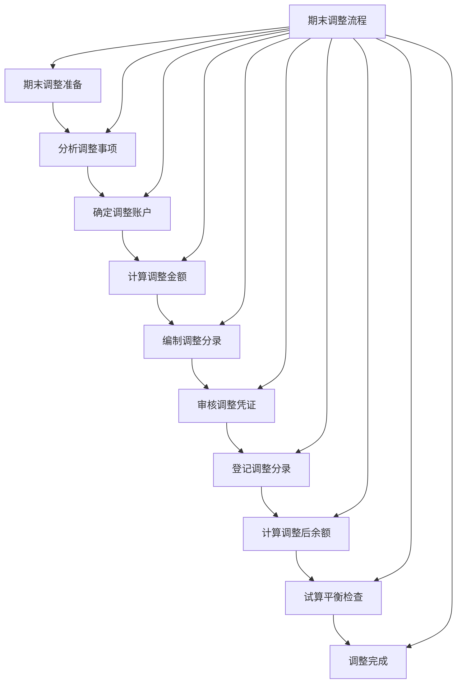

# 期末调整处理

## 期末调整概述

### 📖 基本定义
**期末调整**是指在会计期末，为了正确反映企业的财务状况和经营成果，对某些账户进行的调整处理。

### 🔍 调整原因
- **权责发生制**：按照权责发生制原则
- **配比原则**：按照配比原则
- **准确反映**：准确反映财务状况
- **及时报告**：及时报告会计信息

### 🎯 调整作用
1. **准确反映**：准确反映财务状况和经营成果
2. **配比原则**：实现收入与费用的配比
3. **权责发生**：按照权责发生制处理
4. **信息质量**：提高会计信息质量

## 期末调整的类型

### 📊 调整类型分类

#### 1. 按调整性质分类
- **应计项目**：应计收入和应计费用
- **递延项目**：预付费用和预收收入
- **估计项目**：坏账准备和折旧费用
- **其他项目**：其他需要调整的项目

#### 2. 按调整时间分类
- **月度调整**：每月进行的调整
- **季度调整**：每季度进行的调整
- **年度调整**：每年进行的调整
- **特殊调整**：特殊情况下的调整

#### 3. 按调整内容分类
- **收入调整**：对收入项目的调整
- **费用调整**：对费用项目的调整
- **资产调整**：对资产项目的调整
- **负债调整**：对负债项目的调整

### 🔄 调整类型详解

#### 1. 应计项目调整
**应计收入**：已实现但尚未收到的收入
**应计费用**：已发生但尚未支付的费用

#### 2. 递延项目调整
**预付费用**：已支付但尚未发生的费用
**预收收入**：已收到但尚未实现的收入

#### 3. 估计项目调整
**坏账准备**：估计可能发生的坏账损失
**折旧费用**：固定资产的折旧费用

## 应计项目调整

### 💵 应计收入调整

#### 1. 调整原理
- **收入实现**：收入已经实现
- **尚未收到**：但尚未收到款项
- **权责发生**：按照权责发生制确认
- **准确反映**：准确反映收入状况

#### 2. 调整方法
```
借：应收账款（或其他应收款）
贷：主营业务收入（或其他业务收入）
```

#### 3. 调整实例
**实例1：应收利息收入**
企业持有债券投资，年利率6%，每月应计利息收入5,000元。

**调整分录**：
```
借：应收利息    5,000
贷：投资收益    5,000
```

**实例2：应收租金收入**
企业出租房屋，每月租金收入10,000元，尚未收到。

**调整分录**：
```
借：其他应收款  10,000
贷：其他业务收入 10,000
```

### 💸 应计费用调整

#### 1. 调整原理
- **费用发生**：费用已经发生
- **尚未支付**：但尚未支付款项
- **权责发生**：按照权责发生制确认
- **准确反映**：准确反映费用状况

#### 2. 调整方法
```
借：管理费用（或销售费用、财务费用）
贷：应付账款（或其他应付款）
```

#### 3. 调整实例
**实例1：应付工资费用**
企业员工工资每月50,000元，尚未支付。

**调整分录**：
```
借：管理费用    50,000
贷：应付职工薪酬 50,000
```

**实例2：应付利息费用**
企业向银行借款100万元，年利率6%，每月应计利息费用5,000元。

**调整分录**：
```
借：财务费用    5,000
贷：应付利息    5,000
```

## 递延项目调整

### 📅 预付费用调整

#### 1. 调整原理
- **费用预付**：费用已经预付
- **尚未发生**：但尚未发生或未完全发生
- **受益期间**：按受益期间摊销
- **准确反映**：准确反映费用状况

#### 2. 调整方法
```
借：管理费用（或销售费用、财务费用）
贷：预付账款（或长期待摊费用）
```

#### 3. 调整实例
**实例1：预付保险费**
企业预付全年保险费12,000元，每月应摊销1,000元。

**调整分录**：
```
借：管理费用    1,000
贷：预付账款    1,000
```

**实例2：预付租金**
企业预付全年租金60,000元，每月应摊销5,000元。

**调整分录**：
```
借：管理费用    5,000
贷：预付账款    5,000
```

### 💰 预收收入调整

#### 1. 调整原理
- **收入预收**：收入已经预收
- **尚未实现**：但尚未实现或未完全实现
- **实现期间**：按实现期间确认
- **准确反映**：准确反映收入状况

#### 2. 调整方法
```
借：预收账款
贷：主营业务收入（或其他业务收入）
```

#### 3. 调整实例
**实例1：预收服务费**
企业预收全年服务费120,000元，每月应确认收入10,000元。

**调整分录**：
```
借：预收账款    10,000
贷：其他业务收入 10,000
```

**实例2：预收租金**
企业预收全年租金240,000元，每月应确认收入20,000元。

**调整分录**：
```
借：预收账款    20,000
贷：其他业务收入 20,000
```

## 估计项目调整

### 📉 坏账准备调整

#### 1. 调整原理
- **坏账风险**：应收账款存在坏账风险
- **谨慎原则**：按照谨慎原则处理
- **估计计提**：估计可能发生的坏账损失
- **准确反映**：准确反映资产状况

#### 2. 调整方法
```
借：资产减值损失
贷：坏账准备
```

#### 3. 调整实例
**实例：计提坏账准备**
企业应收账款余额100万元，按5%计提坏账准备。

**调整分录**：
```
借：资产减值损失 5,000
贷：坏账准备    5,000
```

### 🏢 折旧费用调整

#### 1. 调整原理
- **资产消耗**：固定资产在使用中消耗
- **价值减少**：资产价值逐渐减少
- **期间分摊**：按使用期间分摊
- **准确反映**：准确反映资产状况

#### 2. 调整方法
```
借：管理费用（或制造费用、销售费用）
贷：累计折旧
```

#### 3. 调整实例
**实例：计提折旧费用**
企业固定资产原值100万元，预计使用10年，每月应计提折旧8,333元。

**调整分录**：
```
借：管理费用    8,333
贷：累计折旧    8,333
```

## 期末调整的完整流程

### 🔄 调整流程

#### 1. 调整准备
- **业务分析**：分析需要调整的业务
- **账户确定**：确定涉及的账户
- **金额计算**：计算调整金额
- **分录准备**：准备调整分录

#### 2. 调整实施
- **分录编制**：编制调整分录
- **凭证审核**：审核调整凭证
- **账簿登记**：登记调整分录
- **余额计算**：计算调整后余额

#### 3. 调整验证
- **试算平衡**：进行试算平衡
- **逻辑检查**：检查调整逻辑
- **数据核对**：核对调整数据
- **报表检查**：检查报表数据

### 📊 调整流程表



## 期末调整的实例

### 🏢 完整调整实例

#### 企业基本情况
- **企业名称**：ABC公司
- **会计期间**：2024年1月
- **调整事项**：多项调整事项

#### 调整事项
1. **应计收入**：应收利息收入5,000元
2. **应计费用**：应付工资费用50,000元
3. **预付费用**：预付保险费摊销1,000元
4. **预收收入**：预收服务费确认10,000元
5. **坏账准备**：计提坏账准备5,000元
6. **折旧费用**：计提折旧费用8,333元

#### 调整分录
```
调整分录1：应收利息收入
借：应收利息    5,000
贷：投资收益    5,000

调整分录2：应付工资费用
借：管理费用    50,000
贷：应付职工薪酬 50,000

调整分录3：预付保险费摊销
借：管理费用    1,000
贷：预付账款    1,000

调整分录4：预收服务费确认
借：预收账款    10,000
贷：其他业务收入 10,000

调整分录5：计提坏账准备
借：资产减值损失 5,000
贷：坏账准备    5,000

调整分录6：计提折旧费用
借：管理费用    8,333
贷：累计折旧    8,333
```

#### 调整后试算平衡表
```
调整后试算平衡表
2024年1月31日

账户名称        调整前余额    调整金额        调整后余额
                借方  贷方  借方    贷方  借方  贷方
库存现金        12,000      0       0       12,000
银行存款        150,000     0       0       150,000
应收账款        150,000     0       0       150,000
坏账准备                0       5,000     5,000
预付账款        10,000      1,000   0       9,000
其他应收款      0           5,000   0       5,000
固定资产        250,000     0       0       250,000
累计折旧                0       8,333     8,333
短期借款                50,000 0       0       50,000
应付账款                50,000 0       0       50,000
预收账款        20,000      10,000  0       10,000
应付职工薪酬            0       50,000     50,000
实收资本                100,000 0       0       100,000
主营业务收入            100,000 0       0       100,000
其他业务收入            0       10,000     10,000
投资收益        0           0       5,000     5,000
主营业务成本    60,000      0       0       60,000
管理费用        20,000      59,333  0       79,333
资产减值损失    0           5,000   0       5,000
合计           602,000 220,000 79,333  79,333 681,333 220,000
```

## 期末调整的注意事项

### ⚠️ 注意事项

#### 1. 调整时机
- **调整时间**：在会计期末进行
- **调整顺序**：按照一定顺序进行
- **调整频率**：根据需要确定调整频率
- **调整范围**：确定调整范围

#### 2. 调整原则
- **权责发生制**：按照权责发生制原则
- **配比原则**：按照配比原则
- **谨慎原则**：按照谨慎原则
- **重要性原则**：按照重要性原则

#### 3. 调整方法
- **方法选择**：选择适当的调整方法
- **金额确定**：准确确定调整金额
- **账户使用**：正确使用调整账户
- **分录编制**：正确编制调整分录

#### 4. 调整检查
- **逻辑检查**：检查调整逻辑
- **数据检查**：检查调整数据
- **平衡检查**：检查借贷平衡
- **完整性检查**：检查调整完整性

### 🔧 常见问题

#### 1. 调整遗漏
- **问题表现**：遗漏某些调整事项
- **问题原因**：对调整事项认识不足
- **解决方法**：建立调整清单
- **预防措施**：加强培训学习

#### 2. 调整错误
- **问题表现**：调整分录错误
- **问题原因**：对调整原理理解错误
- **解决方法**：重新编制调整分录
- **预防措施**：加强理论学习

#### 3. 调整重复
- **问题表现**：重复进行同一调整
- **问题原因**：调整记录不完整
- **解决方法**：检查调整记录
- **预防措施**：建立调整记录

#### 4. 调整不及时
- **问题表现**：调整不及时进行
- **问题原因**：时间安排不当
- **解决方法**：合理安排时间
- **预防措施**：建立时间安排

## 费曼学习法应用

### 🎯 学习目标
**能够理解和应用期末调整处理**

### 📝 学习步骤
1. **选择概念**：期末调整的定义、类型和方法
2. **简化解释**：用简单语言解释期末调整
3. **识别盲区**：发现不理解的地方
4. **重新学习**：回到源头重新理解

### 💡 记忆技巧
- **调整类型**：应计项目、递延项目、估计项目
- **调整原理**：权责发生制、配比原则
- **调整方法**：借费用贷负债、借资产贷收入
- **调整流程**：准备、实施、验证

## 刻意练习要点

### 🎯 练习重点
1. **类型理解**：理解期末调整类型
2. **方法掌握**：掌握期末调整方法
3. **实例分析**：分析期末调整实例
4. **流程应用**：应用期末调整流程

### 📊 练习方法
1. **类型练习**：练习期末调整类型
2. **方法练习**：练习期末调整方法
3. **实例练习**：分析期末调整实例
4. **流程练习**：练习期末调整流程

## 相关链接
- [[01-权责发生制详解]] - 权责发生制详解
- [[02-会计循环过程]] - 会计循环过程
- [[03-试算平衡方法]] - 试算平衡方法
- [[01-基础认知层/会计学概述/03-会计假设与基础]] - 会计假设与基础
- [[03-应用实践层/特殊业务处理/03-坏账准备计提]] - 坏账准备计提