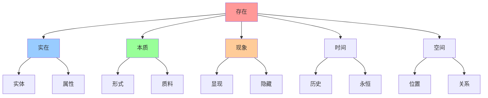
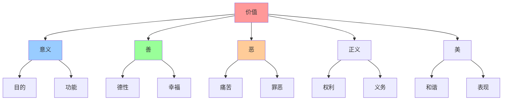

# 概念关联网络图

## 🎯 网络图说明

本网络图展示哲学概念之间的**关联关系**，为INTJ学习者提供概念间的逻辑连接，便于理解哲学知识的整体结构。

## 🕸️ 核心概念网络

### 存在论概念网络

### 认识论概念网络

### 价值论概念网络

## 🔗 概念关系类型

### 层次关系
| 关系类型 | 含义 | 示例 |
|----------|------|------|
| **包含关系** | 上位概念包含下位概念 | 存在 → 实在 → 实体 |
| **并列关系** | 同层次概念并列 | 善 ↔ 恶 |
| **对立关系** | 概念相互对立 | 自由 ↔ 必然 |

### 逻辑关系
| 关系类型 | 含义 | 示例 |
|----------|------|------|
| **因果关系** | 原因与结果 | 原因 → 结果 |
| **条件关系** | 条件与结果 | 条件 → 结果 |
| **目的关系** | 手段与目的 | 手段 → 目的 |

### 历史关系
| 关系类型 | 含义 | 示例 |
|----------|------|------|
| **发展关系** | 概念的历史发展 | 古代 → 近代 → 现代 |
| **影响关系** | 概念间的相互影响 | 柏拉图 → 亚里士多德 |
| **继承关系** | 概念的继承发展 | 苏格拉底 → 柏拉图 |

## 📊 概念关联矩阵

### 存在论概念关联
| 概念 | 存在 | 实在 | 本质 | 现象 | 实体 | 属性 |
|------|------|------|------|------|------|------|
| **存在** | - | 强 | 强 | 强 | 中 | 中 |
| **实在** | 强 | - | 强 | 中 | 强 | 中 |
| **本质** | 强 | 强 | - | 强 | 中 | 中 |
| **现象** | 强 | 中 | 强 | - | 中 | 中 |
| **实体** | 中 | 强 | 中 | 中 | - | 强 |
| **属性** | 中 | 中 | 中 | 中 | 强 | - |

### 认识论概念关联
| 概念 | 知识 | 真理 | 信念 | 证明 | 经验 | 理性 |
|------|------|------|------|------|------|------|
| **知识** | - | 强 | 强 | 强 | 强 | 强 |
| **真理** | 强 | - | 强 | 强 | 中 | 强 |
| **信念** | 强 | 强 | - | 强 | 强 | 中 |
| **证明** | 强 | 强 | 强 | - | 中 | 强 |
| **经验** | 强 | 中 | 强 | 中 | - | 中 |
| **理性** | 强 | 强 | 中 | 强 | 中 | - |

### 价值论概念关联
| 概念 | 价值 | 意义 | 善 | 恶 | 正义 | 美 |
|------|------|------|----|----|------|----|
| **价值** | - | 强 | 强 | 强 | 强 | 强 |
| **意义** | 强 | - | 中 | 中 | 中 | 中 |
| **善** | 强 | 中 | - | 强 | 强 | 中 |
| **恶** | 强 | 中 | 强 | - | 中 | 中 |
| **正义** | 强 | 中 | 强 | 中 | - | 中 |
| **美** | 强 | 中 | 中 | 中 | 中 | - |

## 🎯 概念学习路径

### 基础路径
1. **核心概念**：存在、知识、价值
2. **相关概念**：实在、真理、意义
3. **关系理解**：概念间的联系

### 进阶路径
1. **概念网络**：理解概念网络结构
2. **关系分析**：分析概念间的关系
3. **系统把握**：形成概念体系

### 高级路径
1. **动态关系**：理解概念的历史发展
2. **批判思考**：对概念关系进行批判
3. **原创思考**：形成新的概念关系

## 🔗 概念关联应用

### 学习应用
1. **概念地图**：绘制概念关系图
2. **关联记忆**：通过关联记忆概念
3. **系统理解**：理解概念体系结构

### 思维应用
1. **概念分析**：分析概念间的关系
2. **逻辑推理**：基于概念关系推理
3. **问题解决**：运用概念关系解决问题

### 创新应用
1. **概念创新**：创造新的概念关系
2. **理论构建**：基于概念关系构建理论
3. **实践应用**：将概念关系应用于实践

## 📊 网络图使用指南

### 阅读方法
1. **整体把握**：先看整体结构
2. **局部深入**：深入理解局部关系
3. **动态理解**：理解概念的发展变化

### 学习方法
1. **概念学习**：学习单个概念
2. **关系学习**：学习概念间的关系
3. **系统学习**：学习整个概念体系

### 应用方法
1. **问题分析**：用概念关系分析问题
2. **理论构建**：用概念关系构建理论
3. **实践指导**：用概念关系指导实践

## 🔗 相关链接

### 核心文件
- [[00-哲学知识体系总览]] - 体系总览
- [[raw/哲学/00-导航索引/01-学习路径指南]] - 学习路径
- [[02-概念索引表]] - 概念索引
- [[03-哲学家索引表]] - 哲学家索引
- [[04-理论体系索引]] - 理论索引
- [[05-问题导向索引]] - 问题索引
- [[06-关键词标签系统]] - 标签系统

### 概念学习
- [[01-存在与实在]] - 存在论概念
- [[02-真理与知识]] - 认识论概念
- [[03-价值与意义]] - 价值论概念
- [[04-自由与必然]] - 自由论概念

## 🏷️ 标签
#导航索引 #概念网络 #概念关系 #概念关联 #概念学习 #概念应用

---
*最后更新：2024年10月5日*
*学习进度：概念网络完成*

