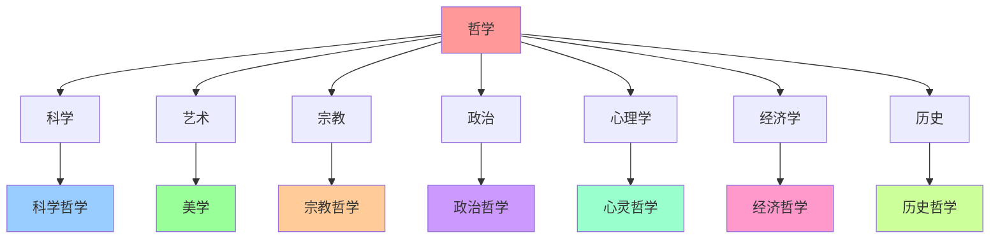

# 哲学与其他学科的关系

## 📋 基本关系

### 哲学的地位
- **基础学科**：哲学是其他学科的基础
- **指导学科**：哲学为其他学科提供指导
- **反思学科**：哲学对其他学科进行反思
- **整合学科**：哲学整合不同学科知识

### 学科关系类型
- **基础关系**：哲学为其他学科提供基础
- **应用关系**：哲学应用于其他学科
- **互动关系**：哲学与其他学科相互影响
- **整合关系**：哲学整合不同学科

## 🔬 哲学与科学

### 历史关系
- **古代**：哲学包含科学，科学是哲学的一部分
- **近代**：科学从哲学中分离出来
- **现代**：哲学与科学相互影响
- **当代**：哲学与科学深度融合

### 关系特点
- **基础与指导**：哲学为科学提供基础
- **方法与反思**：哲学反思科学方法
- **问题与解答**：哲学提出科学问题
- **整合与创新**：哲学整合科学知识

### 具体领域
- **科学哲学**：研究科学的本质和方法
- **物理学哲学**：研究物理学的哲学问题
- **生物学哲学**：研究生物学的哲学问题
- **心理学哲学**：研究心理学的哲学问题

## 🎨 哲学与艺术

### 关系特点
- **美学基础**：哲学为艺术提供美学基础
- **艺术反思**：哲学反思艺术的本质
- **创作指导**：哲学指导艺术创作
- **价值判断**：哲学进行艺术价值判断

### 具体领域
- **美学**：研究美的本质和艺术
- **艺术哲学**：研究艺术的哲学问题
- **文学哲学**：研究文学的哲学问题
- **音乐哲学**：研究音乐的哲学问题

### 相互影响
- **哲学影响艺术**：哲学思想影响艺术创作
- **艺术影响哲学**：艺术作品影响哲学思考
- **共同发展**：哲学与艺术共同发展
- **文化传承**：共同传承人类文化

## ⛪ 哲学与宗教

### 关系特点
- **理性与信仰**：哲学用理性，宗教用信仰
- **问题重叠**：都关注终极问题
- **方法不同**：哲学用逻辑，宗教用启示
- **目标相似**：都寻求真理和意义

### 历史关系
- **古代**：哲学与宗教相互融合
- **中世纪**：哲学服务于宗教
- **近代**：哲学与宗教分离
- **现代**：哲学与宗教对话

### 具体领域
- **宗教哲学**：研究宗教的哲学问题
- **神学**：研究神的本质和属性
- **宗教伦理学**：研究宗教道德
- **宗教认识论**：研究宗教知识

## 🏛️ 哲学与政治

### 关系特点
- **理论基础**：哲学为政治提供理论基础
- **价值指导**：哲学为政治提供价值指导
- **制度设计**：哲学指导政治制度设计
- **政策制定**：哲学影响政策制定

### 具体领域
- **政治哲学**：研究政治的哲学问题
- **政治理论**：研究政治理论
- **政治伦理学**：研究政治道德
- **政治认识论**：研究政治知识

### 相互影响
- **哲学影响政治**：哲学思想影响政治实践
- **政治影响哲学**：政治实践影响哲学思考
- **共同发展**：哲学与政治共同发展
- **社会进步**：共同促进社会进步

## 🧠 哲学与心理学

### 关系特点
- **心灵哲学**：哲学研究心灵的本质
- **意识问题**：哲学研究意识问题
- **自我问题**：哲学研究自我问题
- **认知问题**：哲学研究认知问题

### 具体领域
- **心灵哲学**：研究心灵的哲学问题
- **意识哲学**：研究意识的哲学问题
- **认知哲学**：研究认知的哲学问题
- **情感哲学**：研究情感的哲学问题

### 相互影响
- **哲学影响心理学**：哲学思想影响心理学理论
- **心理学影响哲学**：心理学发现影响哲学思考
- **共同发展**：哲学与心理学共同发展
- **人类理解**：共同理解人类心灵

## 💰 哲学与经济学

### 关系特点
- **价值理论**：哲学为经济学提供价值理论
- **方法论**：哲学为经济学提供方法论
- **伦理基础**：哲学为经济学提供伦理基础
- **社会批判**：哲学对经济学进行社会批判

### 具体领域
- **经济哲学**：研究经济的哲学问题
- **经济伦理学**：研究经济道德
- **经济认识论**：研究经济知识
- **经济方法论**：研究经济方法

### 相互影响
- **哲学影响经济学**：哲学思想影响经济学理论
- **经济学影响哲学**：经济学发现影响哲学思考
- **共同发展**：哲学与经济学共同发展
- **社会理解**：共同理解社会经济

## 🌍 哲学与历史

### 关系特点
- **历史哲学**：哲学研究历史的本质
- **历史方法**：哲学为历史提供方法
- **历史意义**：哲学研究历史的意义
- **历史批判**：哲学对历史进行批判

### 具体领域
- **历史哲学**：研究历史的哲学问题
- **历史认识论**：研究历史知识
- **历史方法论**：研究历史方法
- **历史伦理学**：研究历史道德

### 相互影响
- **哲学影响历史**：哲学思想影响历史研究
- **历史影响哲学**：历史发现影响哲学思考
- **共同发展**：哲学与历史共同发展
- **文化传承**：共同传承人类文化

## 🔗 跨学科整合

### 整合方法
- **概念整合**：整合不同学科的概念
- **方法整合**：整合不同学科的方法
- **理论整合**：整合不同学科的理论
- **问题整合**：整合不同学科的问题

### 整合领域
- **科学哲学**：整合科学与哲学
- **艺术哲学**：整合艺术与哲学
- **宗教哲学**：整合宗教与哲学
- **政治哲学**：整合政治与哲学

### 整合意义
- **知识统一**：统一不同学科知识
- **方法创新**：创新研究方法
- **问题解决**：解决复杂问题
- **理论发展**：发展新理论

## 📊 学科关系图

## 🎯 学习建议

### 跨学科学习
- **基础学习**：先学好哲学基础
- **学科了解**：了解其他学科
- **关系理解**：理解学科间的关系
- **整合应用**：进行跨学科整合

### 学习方法
- **比较学习**：比较不同学科
- **整合学习**：整合不同学科知识
- **应用学习**：将哲学应用于其他学科
- **创新学习**：进行跨学科创新

## 🔗 相关概念

### 哲学分支
- [[科学哲学]] - 科学与哲学
- [[美学]] - 艺术与哲学
- [[宗教哲学]] - 宗教与哲学
- [[政治哲学]] - 政治与哲学

### 跨学科
- [[跨学科研究]] - 跨学科研究
- [[学科整合]] - 学科整合
- [[知识统一]] - 知识统一
- [[方法创新]] - 方法创新

## 🎯 学习要点

### 理解要点
1. 哲学与其他学科有密切关系
2. 哲学为其他学科提供基础
3. 哲学与其他学科相互影响
4. 哲学可以整合不同学科

### 思考问题
1. 哲学如何影响其他学科？
2. 其他学科如何影响哲学？
3. 如何进行跨学科学习？
4. 跨学科整合有什么意义？

## 🏷️ 标签
#认识层 #哲学导论 #学科关系 #跨学科 #科学哲学 #美学

---
*最后更新：2024年10月5日*
*学习进度：哲学与其他学科关系完成*

