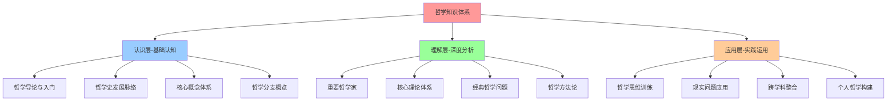
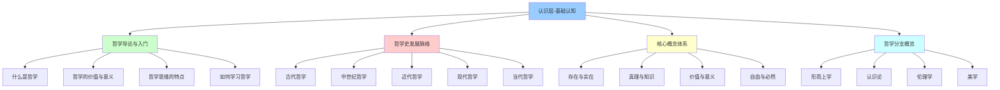
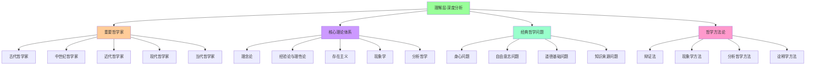
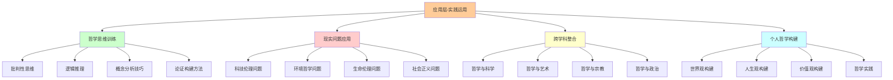
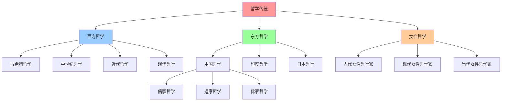
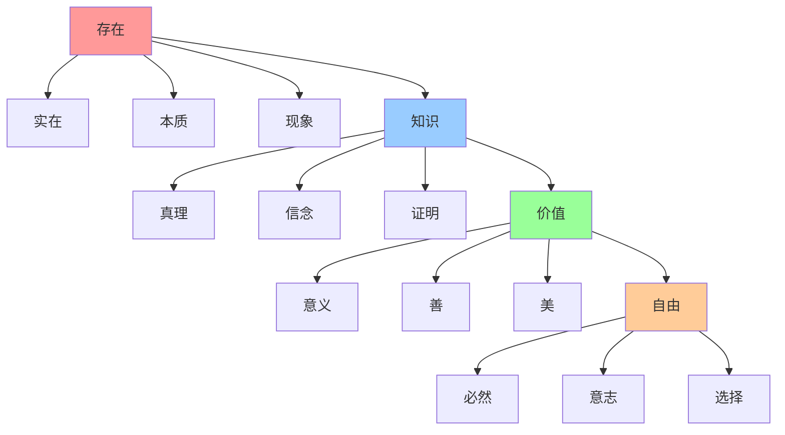
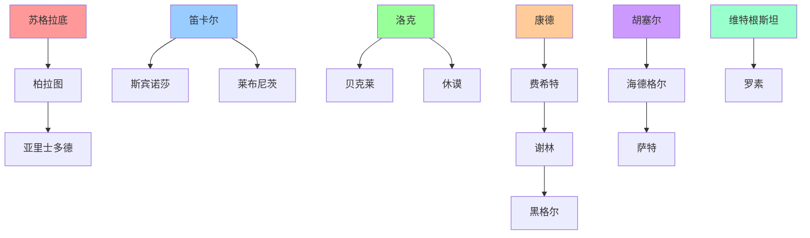
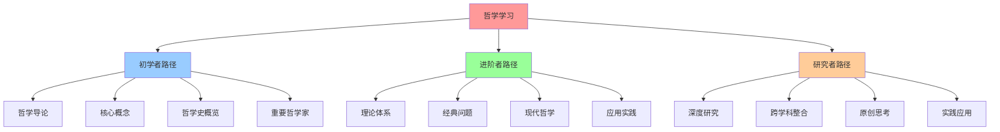
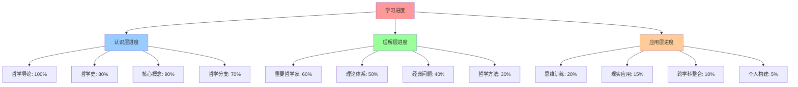

# 哲学体系总览图

## 🎯 图谱说明

本图谱展示哲学知识体系的**整体结构**和**内在关系**，为INTJ学习者提供系统化的哲学知识导航。

## 🏗️ 哲学知识体系结构

### 三层金字塔结构

## 🧠 认识层结构图

### 基础认知体系

## 🔍 理解层结构图

### 深度分析体系

## 🚀 应用层结构图

### 实践运用体系

## 🌐 跨文化哲学结构图

### 东西方哲学对比

## 🔗 概念关系网络图

### 核心概念关系

## 📊 哲学家关系网络图

### 重要哲学家关系

## 🎯 学习路径图

### 学习路径规划

## 📈 学习进度追踪图

### 学习进度可视化

## 🔗 相关链接

### 核心文件
- [[00-哲学知识体系总览]] - 体系总览
- [[raw/哲学/00-导航索引/01-学习路径指南]] - 学习路径
- [[02-概念索引表]] - 概念索引
- [[03-哲学家索引表]] - 哲学家索引

### 学习工具
- [[01-思维导图]] - 思维导图
- [[02-学习模板]] - 学习模板
- [[03-复习卡片]] - 复习卡片
- [[04-练习题库]] - 练习题库

## 🎯 使用说明

### 图谱使用方法
1. **整体把握**：先看整体结构
2. **局部深入**：深入理解局部关系
3. **动态理解**：理解概念的发展变化
4. **实践应用**：将图谱应用于学习

### 学习建议
1. **循序渐进**：按照图谱顺序学习
2. **建立链接**：为概念建立关联
3. **定期复习**：使用图谱复习
4. **实践应用**：将知识应用于实践

## 🏷️ 标签
#学习工具 #知识图谱 #哲学体系 #学习路径 #概念关系 #哲学家关系

---
*最后更新：2024年10月5日*
*学习进度：哲学体系总览图完成*

