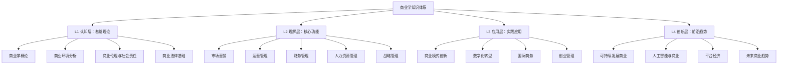

# 商业学知识全景图

## 🎯 学习目标
构建商业学知识体系的全局认知，理解各模块间的逻辑关系，形成系统性商业思维框架。

## 📊 知识体系架构



## 🔄 学习路径设计

### 阶段一：基础建立（L1认知层）
**目标**：建立商业学基础认知框架
- [[01-商业学概论]] → 理解商业本质
- [[02-商业环境分析]] → 掌握环境分析工具
- [[03-商业伦理与社会责任]] → 建立商业伦理观
- [[04-商业法律基础]] → 了解法律边界

### 阶段二：核心掌握（L2理解层）
**目标**：掌握商业核心功能模块
- [[01-市场营销]] → 价值创造与传递
- [[02-运营管理]] → 效率与质量优化
- [[03-财务管理]] → 资源配置与价值评估
- [[04-人力资源管理]] → 人才管理与激励
- [[05-战略管理]] → 战略思维与规划

### 阶段三：应用实践（L3应用层）
**目标**：将理论转化为实践能力
- [[01-商业模式创新]] → 创新思维应用
- [[02-数字化转型]] → 技术驱动变革
- [[03-国际商务]] → 全球化视野
- [[04-创业管理]] → 创业实践技能

### 阶段四：前沿探索（L4创新层）
**目标**：把握未来商业趋势
- [[01-可持续发展商业]] → ESG与绿色商业
- [[02-人工智能与商业]] → AI商业应用
- [[03-平台经济]] → 平台商业模式
- [[04-未来商业趋势]] → 前瞻性思维

## 🧠 认知层次递进

| 层次 | 认知目标 | 学习方式 | 输出成果 |
|------|----------|----------|----------|
| **L1 认知** | 理解概念 | 理论学习 | 知识框架 |
| **L2 理解** | 掌握原理 | 案例分析 | 分析能力 |
| **L3 应用** | 实践技能 | 项目实践 | 解决问题 |
| **L4 创新** | 前瞻思维 | 趋势研究 | 创新方案 |

## 🔗 知识点关联网络

### 核心关联链
```
基础理论 → 核心功能 → 应用实践 → 前沿趋势
    ↓         ↓         ↓         ↓
  认知建立   原理掌握   技能应用   创新思维
```

### 跨领域整合点
- **战略-营销-运营**：价值链整合
- **财务-人力-运营**：资源配置优化
- **伦理-法律-战略**：合规经营框架
- **创新-技术-商业**：数字化转型

## 💡 学习建议

### 费曼学习法应用
1. **选择概念**：每次专注一个核心概念
2. **简化解释**：用简单语言解释复杂概念
3. **识别盲点**：发现理解不足的地方
4. **重新学习**：针对盲点深入学习

### 刻意练习要点
- **明确目标**：每个模块设定具体学习目标
- **专注练习**：集中精力攻克难点
- **及时反馈**：通过案例分析验证理解
- **持续改进**：不断优化学习方法

## 🎯 学习成果检验

### 认知检验
- [ ] 能够解释商业学的核心概念
- [ ] 理解各模块间的逻辑关系
- [ ] 掌握知识体系的整体架构

### 理解检验
- [ ] 能够分析商业案例
- [ ] 运用理论工具解决问题
- [ ] 识别商业机会与风险

### 应用检验
- [ ] 制定商业策略方案
- [ ] 设计商业模式
- [ ] 实施商业项目

---
**下一步**：[[商业学/00-知识地图/02-学习路径指南]] - 详细学习计划